# 01 — Linux Fundamentals

**Saswata Das — 24BCS10248**

All four tasks below were executed for real. Because the host machine is macOS (which has
no `useradd`, no `adduser` and no `journalctl`), every command was run inside genuine
Linux containers:

| Task | Environment | Why |
|---|---|---|
| 1 — links | `ubuntu:22.04` | needs Linux inode/`ln` semantics |
| 2 — users | `ubuntu:22.04` | `adduser` is Debian/Ubuntu-only |
| 3 — journalctl | custom **systemd + journald** image ([`lab/Dockerfile.systemd`](lab/Dockerfile.systemd)) | a plain container has no PID 1 systemd, so there is no journal to read |
| 4 — cheat sheet | `ubuntu:22.04` | standard GNU coreutils |

Raw logs live in [`outputs/`](outputs/), the scripts that produced them in [`scripts/`](scripts/),
and the screenshots in [`screenshots/`](screenshots/).

Reproduce everything with:

```bash
./run-all.sh
```

---

## Task 1 — Soft Link vs Hard Link

### The one-paragraph answer

A **hard link** is a second *name* pointing at the exact same **inode** (the on-disk
object that actually holds the file's data and metadata). The file's *link count* goes up.
Deleting one name does not touch the data — the kernel frees the data only when the link
count reaches **0**.

A **soft link** (symbolic link / symlink) is a tiny separate file, with its **own inode**,
whose contents are just a **path string**. It is a signpost. If the thing it points at
disappears, the signpost still exists but now points at nothing — a *dangling* link.

### Comparison table

| | Hard link (`ln f l`) | Soft link (`ln -s f l`) |
|---|---|---|
| Own inode? | ❌ shares the target's inode | ✅ has its own inode |
| `ls -l` type char | `-` (ordinary file) | `l` (link), shows `-> target` |
| Affects link count | ✅ increments it | ❌ target's count unchanged |
| Survives deleting the original | ✅ **yes**, data stays alive | ❌ **no**, becomes dangling |
| Can cross filesystems / partitions | ❌ no | ✅ yes |
| Can point at a directory | ❌ no (forbidden) | ✅ yes |
| Can point at something that doesn't exist yet | ❌ no | ✅ yes |
| Size | same as target | length of the path string |
| Extra lookup at access time | none | one extra resolution hop |

### Commands

```bash
ln  original.txt hardlink.txt      # hard link
ln -s original.txt softlink.txt    # soft link
ls -li                             # -i shows the inode number
stat original.txt                  # inode + link count
readlink softlink.txt              # what does the symlink point to?
find . -xtype l                    # find broken symlinks
rm softlink.txt                    # deletes the LINK, not the target
unlink hardlink.txt                # removes one name
```

### Proof — actual run

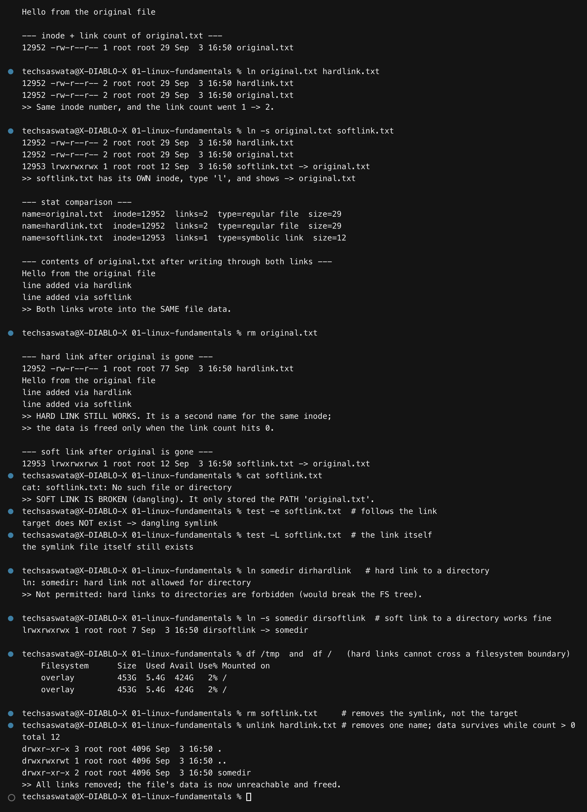

Read the three things that prove the whole concept:

1. **Step 2–3** — `hardlink.txt` and `original.txt` share inode `12952` and the link count
   reads `2`. `softlink.txt` has its own inode `12953`, type `l`, size 12 (= `len("original.txt")`).
2. **Step 5** — after `rm original.txt`, `cat hardlink.txt` still prints the full contents,
   while `cat softlink.txt` fails with `No such file or directory`. Note `test -L` still
   succeeds: the symlink *file* exists, its *target* does not.
3. **Step 6** — `ln somedir dirhardlink` is rejected with
   `hard link not allowed for directory`, but `ln -s somedir dirsoftlink` works.

### Interview answers

> **"What's the difference between a soft link and a hard link?"**
> A hard link is another directory entry pointing to the same inode, so it's indistinguishable
> from the original and the data survives until every hard link is removed. A symlink is a
> separate file containing a path; it can cross filesystems and point at directories, but it
> breaks if the target moves or is deleted.

> **"Why can't you hard-link a directory?"**
> It would let you create cycles in the directory tree. Tools that walk the filesystem
> (`find`, `rm -r`, backups) would loop forever, and `..` would become ambiguous. Only the
> kernel creates directory hard links, for `.` and `..`.

> **"Why can't a hard link cross filesystems?"**
> Inode numbers are only unique *within* one filesystem. A directory entry on filesystem B
> cannot reference an inode number that means something entirely different on filesystem A.

> **"You deleted the file but disk space wasn't freed — why?"**
> Either another hard link still exists (link count > 0), or a running process still holds
> the file open. Check with `ls -li` and `lsof | grep deleted`.

---

## Task 2 — `adduser` vs `useradd`

### The difference

`useradd` is a **low-level binary** from the `shadow`/`passwd` package. It exists on every
Linux distribution and does the bare minimum: it appends a line to `/etc/passwd`. That's it.
No home directory, no password, no interactive prompts.

`adduser` is a **high-level Perl script**, shipped only on **Debian/Ubuntu**, that *wraps*
`useradd` and does all the things you actually want: creates the home directory, copies
`/etc/skel`, sets `/bin/bash`, creates a matching personal group, and prompts you for the
password and user details.

> One line to remember: **`useradd` is the engine, `adduser` is the friendly car built around it.**

### Which is preferred on Ubuntu, and why

**`adduser` is preferred for interactive/human use on Ubuntu**, because it follows Debian
policy and produces a *complete, immediately usable* account in one step. With bare
`useradd` you would have to manually run `mkdir /home/x && cp -r /etc/skel/. /home/x &&
chown x:x /home/x && chsh -s /bin/bash x && passwd x` to get the same result — five extra
chances to get it wrong.

**`useradd` is preferred in scripts, Dockerfiles and Ansible**, precisely because it is
non-interactive, POSIX-ish and portable across distros (`adduser` does not exist on
RHEL/CentOS/Alpine in the same form).

### Comparison table

| | `useradd` | `adduser` |
|---|---|---|
| Type | compiled binary (`shadow-utils`) | Perl script wrapping `useradd` |
| Available on | all Linux distros | Debian / Ubuntu only |
| Interactive | ❌ never prompts | ✅ prompts for password + GECOS |
| Creates home dir | ❌ not unless `-m` | ✅ automatically |
| Copies `/etc/skel` | ❌ not unless `-m` | ✅ automatically |
| Default shell | `/bin/sh` (from `/etc/default/useradd`) | `/bin/bash` |
| Sets a password | ❌ account left locked | ✅ asks for one |
| Creates personal group | depends on config | ✅ always |
| Best for | scripts, Dockerfiles, automation | humans on Ubuntu |
| Removal counterpart | `userdel` | `deluser` |

### The recommended command (used to create the required test user)

```bash
sudo adduser testuser
```

### Proof — actual run

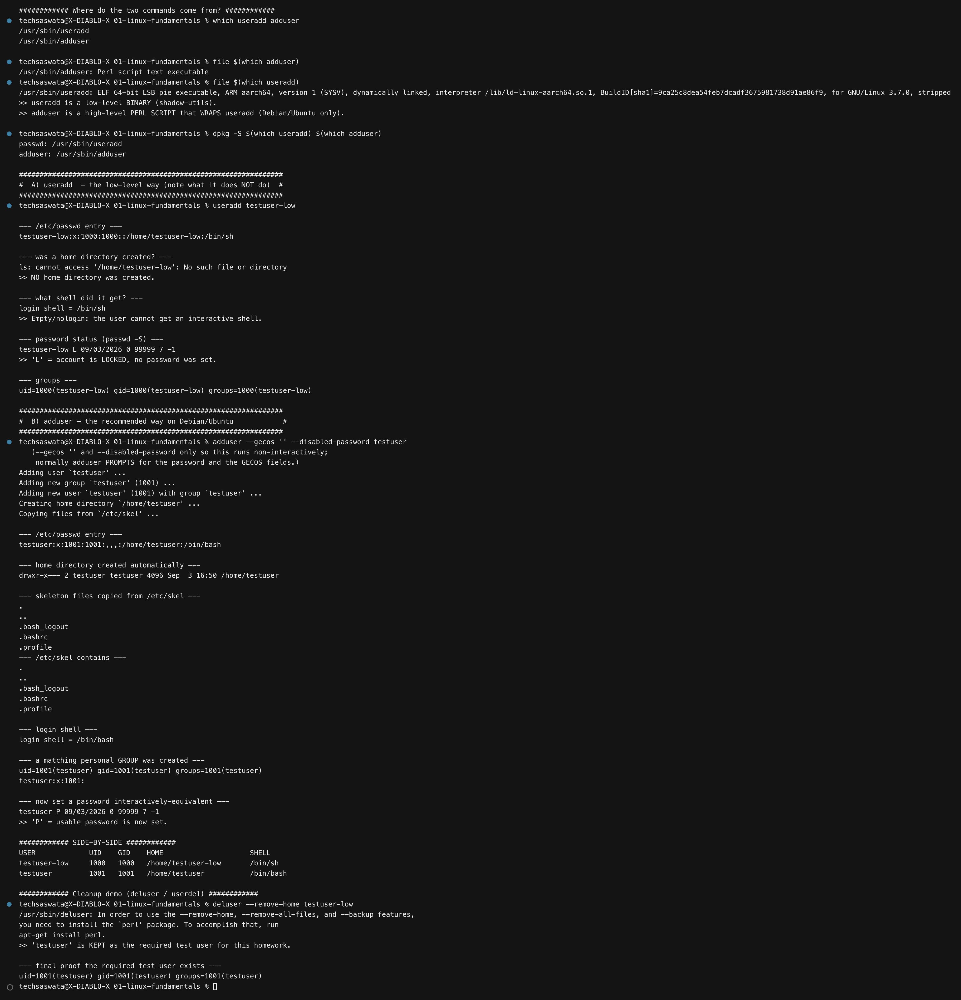

What the output proves, top to bottom:

- `file` shows `/usr/sbin/adduser: Perl script text executable` vs
  `/usr/sbin/useradd: ELF 64-bit LSB pie executable` — and `dpkg -S` shows they come from
  **different packages** (`adduser` vs `passwd`). This is the concrete proof that one wraps the other.
- **`useradd testuser-low`** → `/home/testuser-low` **does not exist**, shell is `/bin/sh`,
  and `passwd -S` reports **`L`** = locked, no password. The account is unusable as-is.
- **`adduser testuser`** → prints `Creating home directory` / `Copying files from /etc/skel`,
  gets `/bin/bash`, a personal group `testuser`, and `.bashrc`/`.profile`/`.bash_logout`
  copied in. After `chpasswd`, `passwd -S` reports **`P`** = usable password.

The side-by-side block at the bottom is the whole lesson in five lines:

```
USER             UID    GID    HOME                     SHELL
testuser-low     1000   1000   /home/testuser-low       /bin/sh      <- home doesn't actually exist
testuser         1001   1001   /home/testuser           /bin/bash    <- fully set up
```

> Note: the demo passes `--gecos "" --disabled-password` **only** so the script can run
> unattended in CI. Run plainly as `sudo adduser testuser`, it interactively asks for the
> password and the full name / room / phone fields.

### Making `useradd` behave like `adduser`

```bash
sudo useradd -m -s /bin/bash -U testuser   # -m = make home, -s = shell, -U = personal group
sudo passwd testuser                       # then set the password separately
```

---

## Task 3 — `journalctl`

### What it is for

`systemd-journald` is systemd's logging daemon. It captures messages from the **kernel**,
from **initrd**, from the **stdout/stderr of every systemd service**, and from the syslog
socket, and writes them into a **structured, indexed, binary** journal (under
`/run/log/journal` if volatile, `/var/log/journal` if persistent).

Because the journal is binary you cannot `cat` it — **`journalctl` is the query tool** for
that journal. In exchange for not being plain text you get things plain-text logs can't do:
filter by unit, by priority, by boot, by time range, by PID/UID, with structured metadata
fields, all indexed.

### The commands that matter

| Command | What it does |
|---|---|
| `journalctl` | everything, oldest first |
| `journalctl -n 20` | last 20 entries |
| `journalctl -f` | **follow live** (like `tail -f`) — the everyday debugging command |
| `journalctl -u nginx` | **logs for one service** |
| `journalctl -u nginx -f` | follow one service live |
| `journalctl -u nginx --since today` | one service, time-bounded |
| `journalctl -k` | kernel messages only (`dmesg` equivalent) |
| `journalctl -b` | current boot only |
| `journalctl -b -1` | *previous* boot — how you debug a crash/reboot |
| `journalctl --list-boots` | list recorded boots |
| `journalctl -p err` | priority `err` and worse |
| `journalctl -xeu nginx` | the "why did it fail" combo: `-x` explanations, `-e` jump to end, `-u` unit |
| `journalctl -o json-pretty` | structured output for machines |
| `journalctl --disk-usage` | how much disk the journal uses |
| `journalctl --vacuum-time=7d` | delete entries older than 7 days |

Priority levels: `0 emerg, 1 alert, 2 crit, 3 err, 4 warning, 5 notice, 6 info, 7 debug`.

### Proof — actual run

**journald is running and the journal is on disk:**

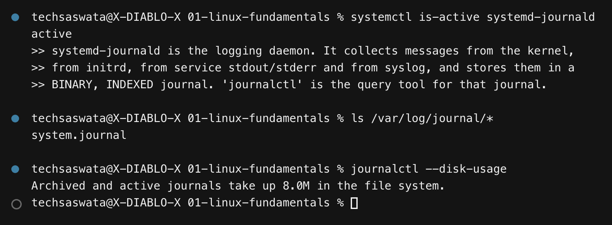

**All logs, and the most recent N:**

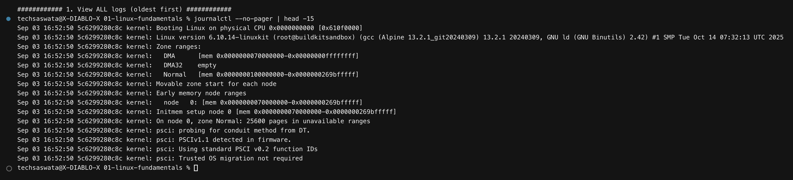
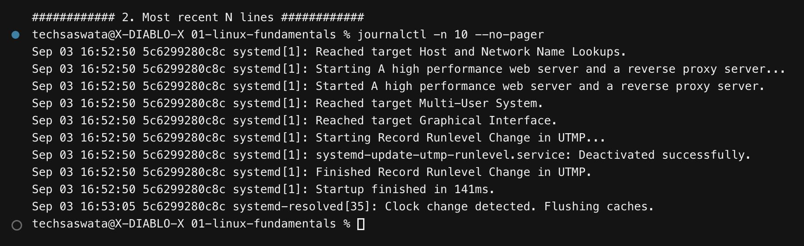

**Kernel ring buffer via `-k`:**

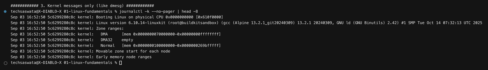

### ⭐ Checking logs for a specific service — the required exercise

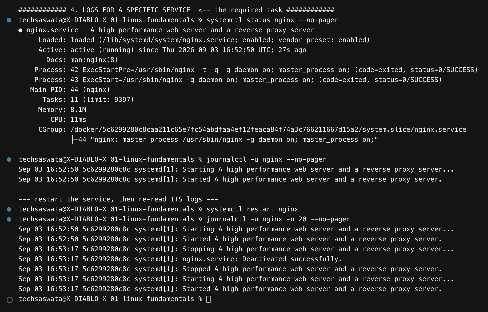

**Filtering by priority and by time:**

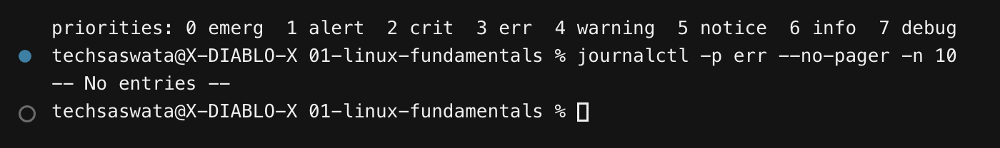
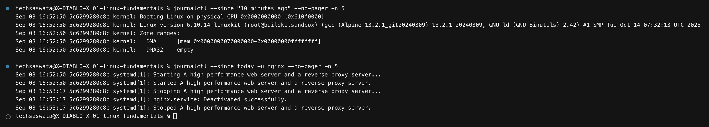

### ⭐ Diagnosing a real failure from the journal

This is what `journalctl` is actually *for*. I deliberately wrote an invalid nginx config,
restarted the service, and let the journal explain the failure:

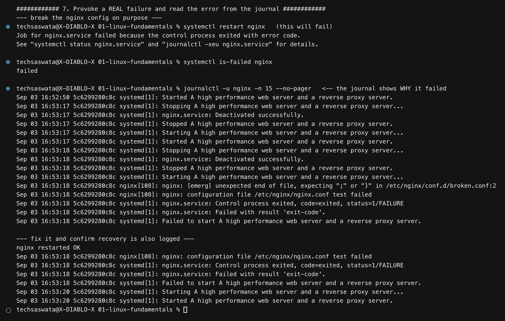

`systemctl` only says *"Job for nginx.service failed"* — useless on its own. The journal
gives the actual root cause:

```
nginx[108]: nginx: [emerg] unexpected end of file, expecting ";" or "}" in /etc/nginx/conf.d/broken.conf:2
nginx[108]: nginx: configuration file /etc/nginx/nginx.conf test failed
systemd[1]: nginx.service: Control process exited, code=exited, status=1/FAILURE
systemd[1]: nginx.service: Failed with result 'exit-code'.
```

Removing the bad file and restarting produces a clean `Started ...` line — the recovery is
logged too.

**Output formats and boot/retention management:**

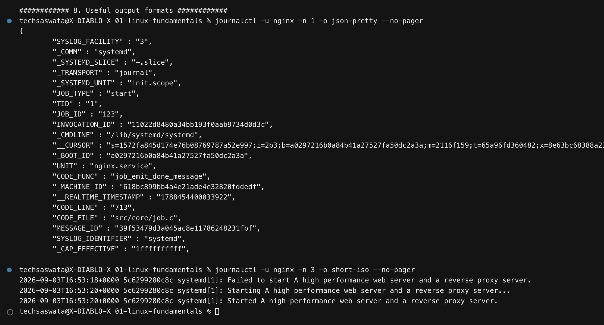
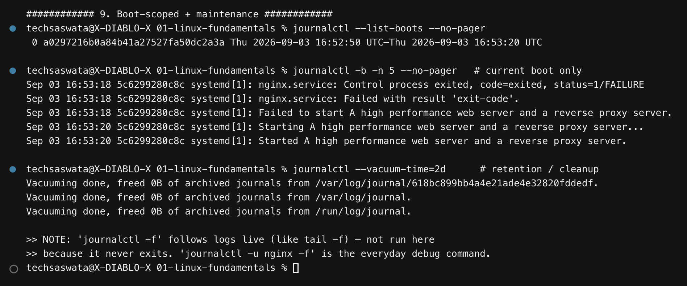

### Interview answers

> **"A service won't start. Walk me through it."**
> `systemctl status <svc>` for the summary, then `journalctl -xeu <svc>` for the actual
> error lines, then `journalctl -u <svc> --since "10 min ago"` to see the surrounding
> context. `-x` adds systemd's explanatory text, `-e` jumps to the newest entries.

> **"Why binary logs instead of `/var/log/*.log`?"**
> Indexing and structure. Every entry carries metadata fields (`_SYSTEMD_UNIT`, `_PID`,
> `PRIORITY`, `_BOOT_ID`), so filtering by unit or boot is a fast indexed lookup rather
> than a `grep` over gigabytes. Journald also rate-limits and auto-rotates.

> **"Logs vanish after reboot. Why?"**
> The journal is volatile by default (`/run/log/journal`, i.e. tmpfs). Make it persistent
> with `sudo mkdir -p /var/log/journal && sudo systemd-tmpfiles --create --prefix
> /var/log/journal && sudo systemctl restart systemd-journald`, or set
> `Storage=persistent` in `/etc/systemd/journald.conf`.

---

## Task 4 — Linux Command Cheat Sheet

Every command below was actually executed — see [`outputs/task4-cheatsheet.txt`](outputs/task4-cheatsheet.txt)
for the full 470-line log.

### 1. Navigation & orientation
`pwd` `ls` `cd` `whoami` `id` `hostname` `uname -a` `uptime` `date`

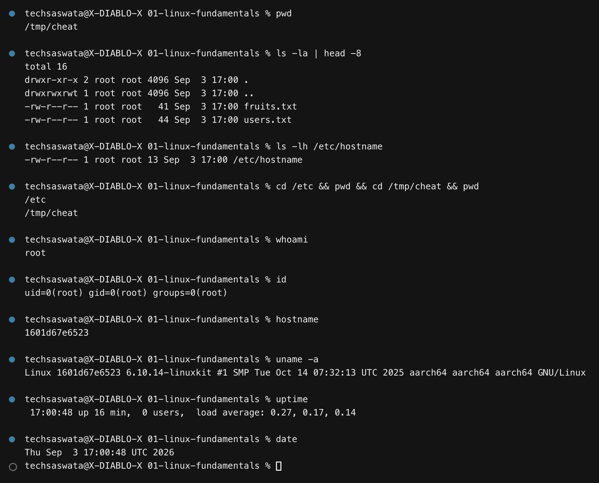

### 2. Files & directories
`mkdir -p` `touch` `cp` `mv` `rm` `rm -rf` `find` `tree`

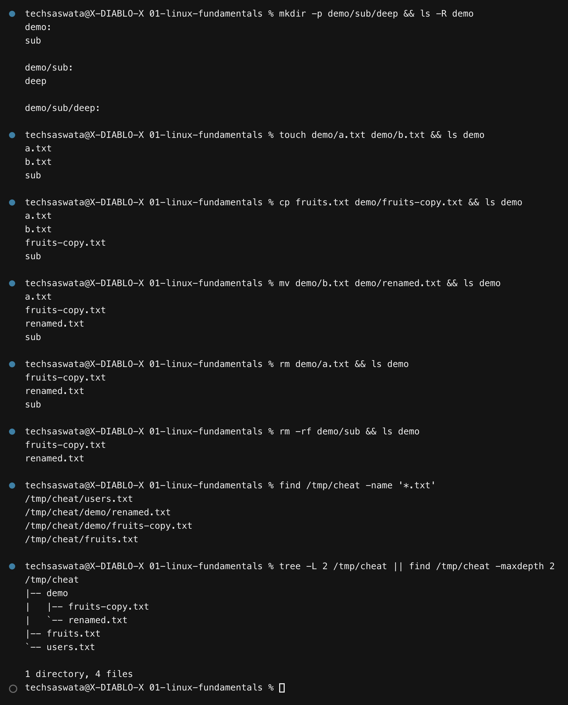

### 3. Viewing file content
`cat` `head` `tail` `wc` `nl` `less` `more`

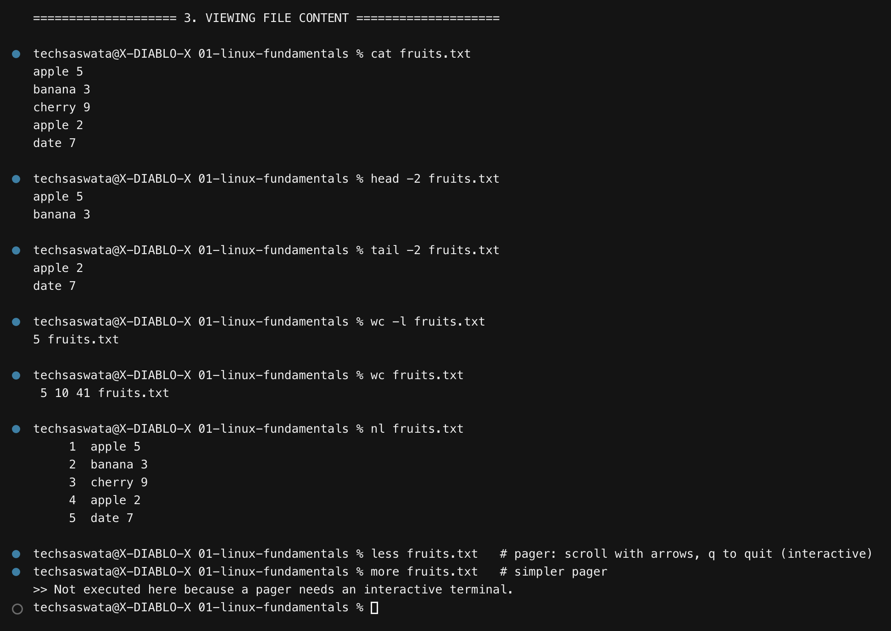

### 4. Searching
`grep` (`-n` line numbers, `-c` count, `-i` ignore case, `-v` invert, `-E` regex), `find`

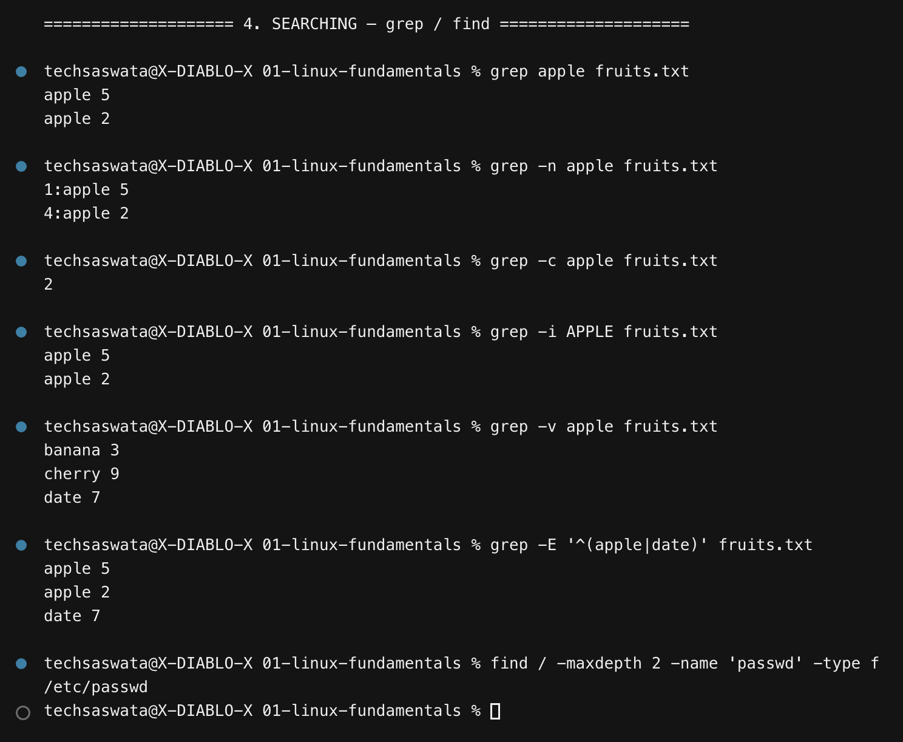

### 5. Text processing
`awk` `sed` `sort` `uniq` `cut` `tr`

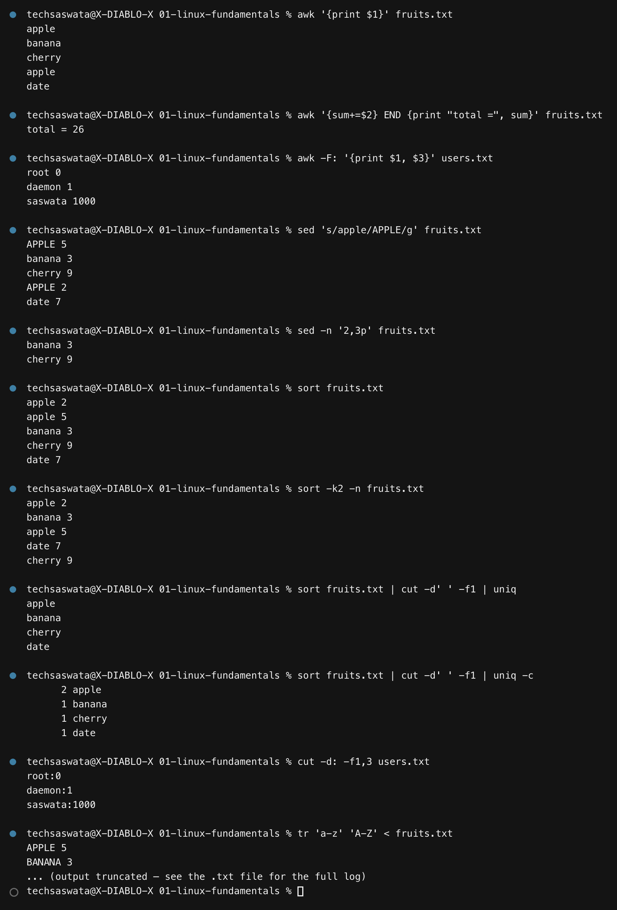

Worth noting from the output: `awk '{sum+=$2} END {print "total =", sum}'` correctly
totals column 2 to `26`, and `sort | cut | uniq -c` produces the classic frequency count.

### 6. Permissions & ownership
`chmod` (numeric and symbolic) `chown` `umask`

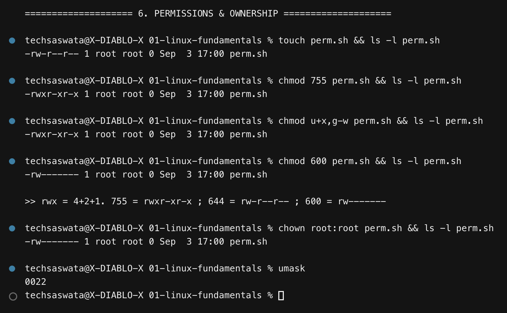

Permission arithmetic: `r=4, w=2, x=1`, one digit each for **user / group / other**.
`755` = `rwxr-xr-x` (scripts), `644` = `rw-r--r--` (normal files), `600` = `rw-------` (secrets/keys).

### 7. Process management
`ps aux` `ps -ef` `ps -eo` `pgrep` `pkill` `jobs` `kill` `kill -9`

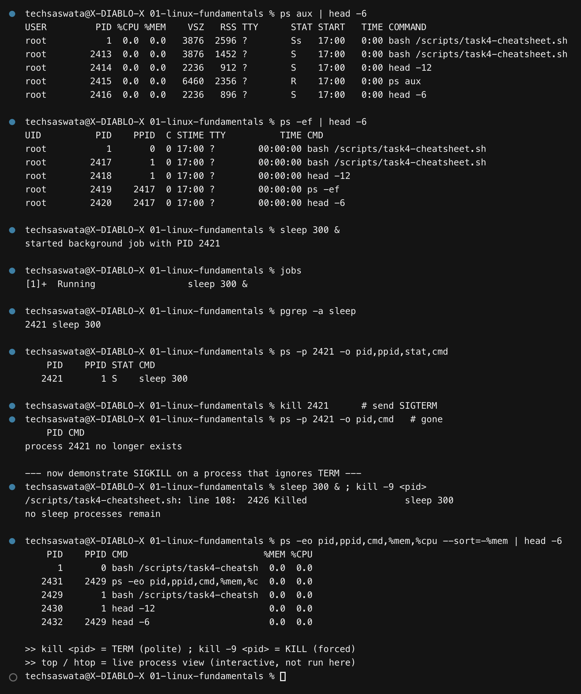

The output shows a real process lifecycle: `sleep 300 &` backgrounded → visible in `jobs`,
`pgrep` and `ps -p` → `kill` (SIGTERM) → confirmed gone → then a second process force-killed
with `kill -9` (SIGKILL). **SIGTERM asks politely and can be trapped; SIGKILL cannot be
caught, blocked or ignored.**

### 8. Disk & memory
`df -h` `du -sh` `du --max-depth` `free -h` `/proc/meminfo` `nproc`

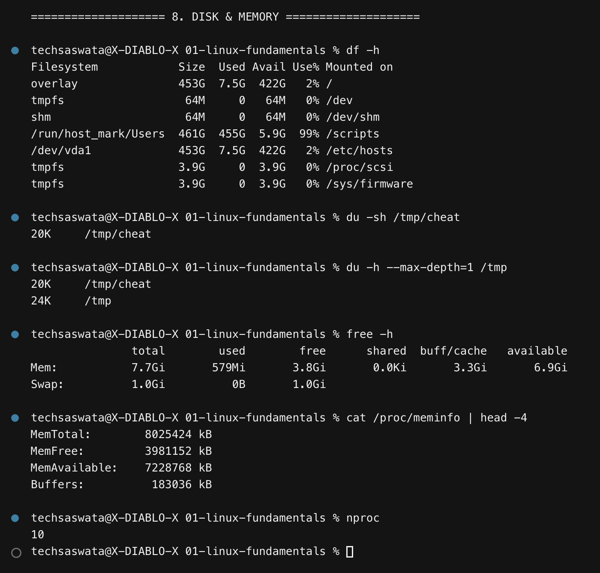

`df` = free space **per filesystem**; `du` = space **used by a path**. The classic
"disk full" hunt is `du -h --max-depth=1 / | sort -h`.

### 9. Archives & compression
`tar -czf` `tar -tzf` `tar -xzf` `gzip` `gunzip`

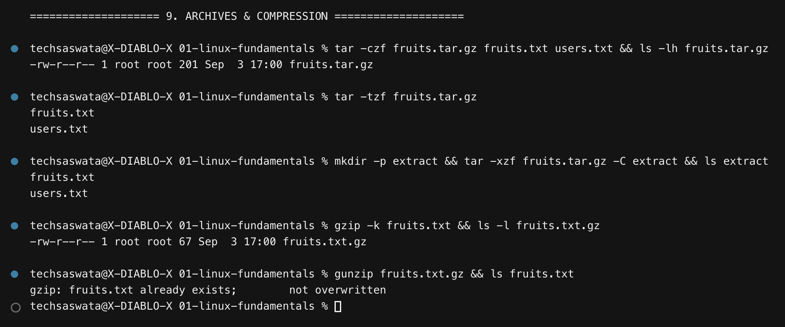

Mnemonic: **c**reate, **t**able-of-contents, e**x**tract — always with `-z` for gzip and `-f` for the filename.

### 10. Redirection & pipes
`>` `>>` `2>` `2>&1` `|` `tee`

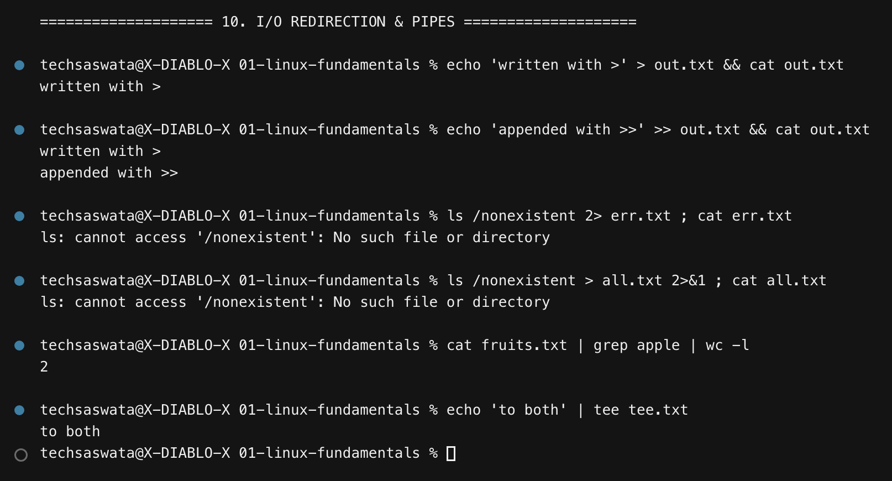

`>` overwrites, `>>` appends, `2>` captures **stderr only**, `> file 2>&1` captures **both**
streams (order matters), `|` feeds stdout into the next command, `tee` writes to a file
*and* passes the data on.

### 11. Environment & variables
`echo $HOME` `echo $PATH` `export` `env` `which` `type`

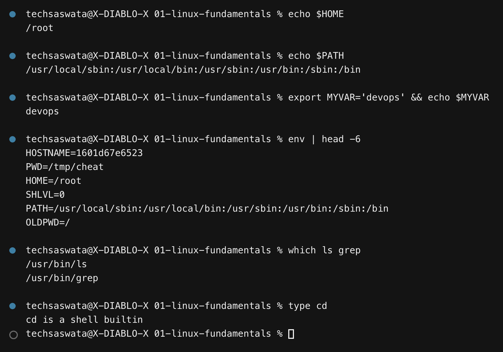

### 12. Users, groups & sudo
`getent` `/etc/passwd` `/etc/group` `groups` `sudo` `su`

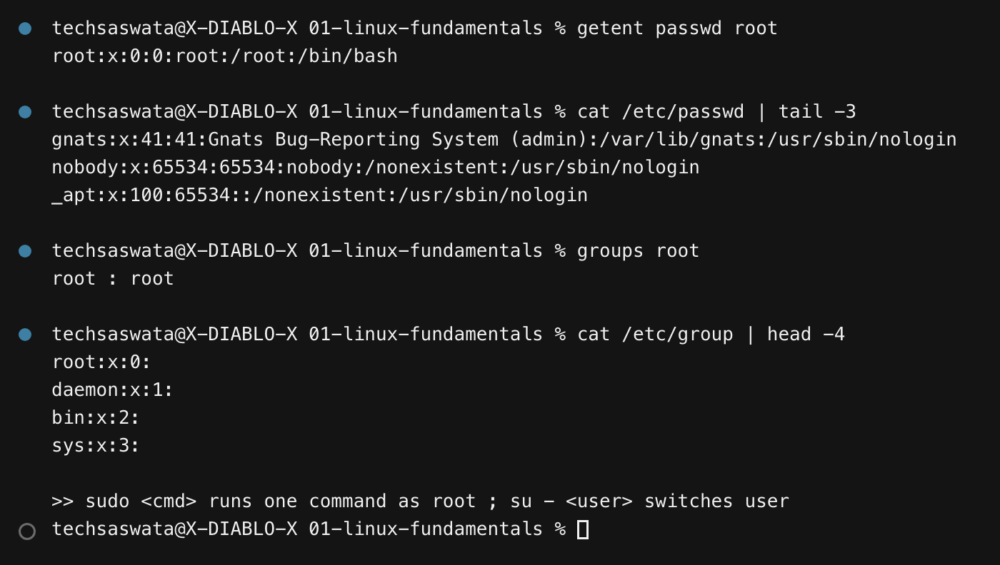

### 13. Networking basics
`hostname -I` `ip -brief addr` `/etc/hosts` — full treatment in [`../03-networking`](../03-networking)

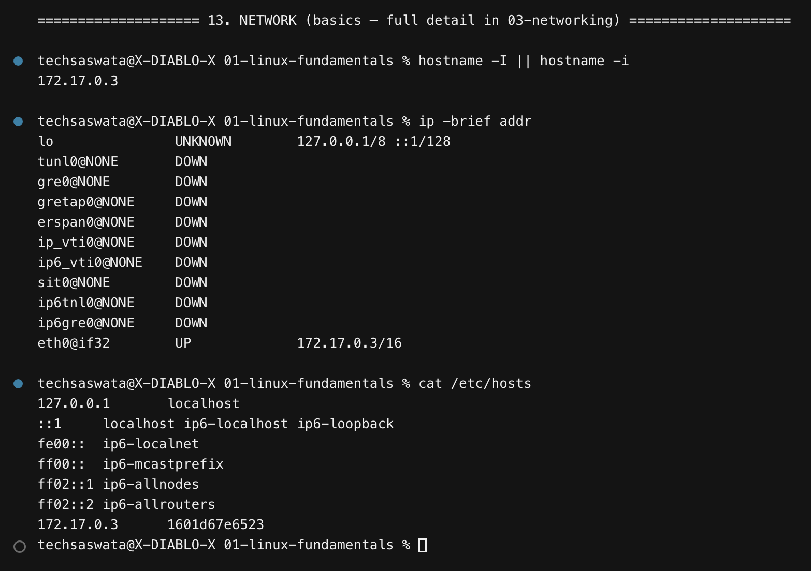

### 14. Package management
`apt update` `apt install` `apt-cache policy` `dpkg -l`

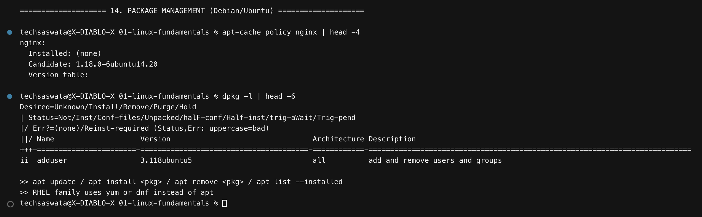

Debian/Ubuntu use `apt`/`dpkg`; RHEL/CentOS/Fedora use `dnf`/`yum`/`rpm`; Alpine uses `apk`.

### 15. Getting help
`man` `--help` `whatis`

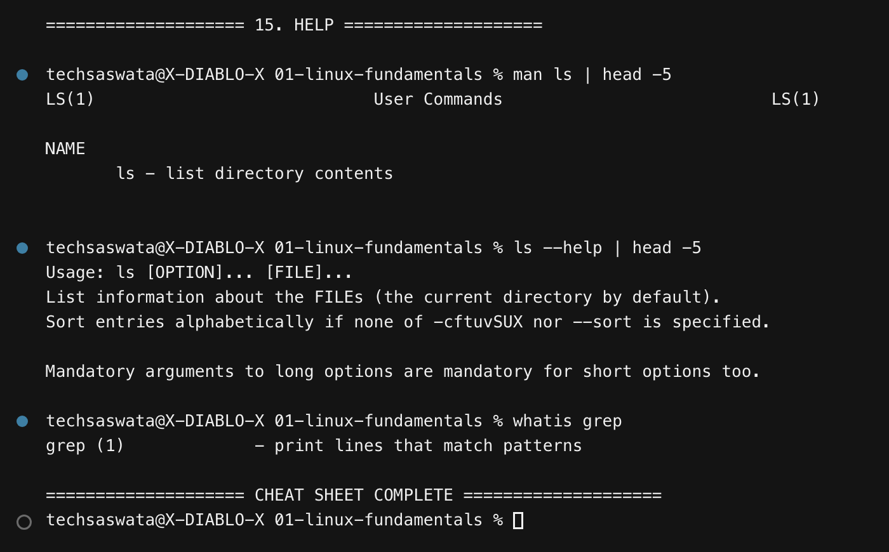

---

## Files in this folder

```
01-linux-fundamentals/
├── README.md                      <- this file
├── run-all.sh                     <- reproduces everything
├── lab/Dockerfile.systemd         <- systemd+journald image for Task 3
├── scripts/
│   ├── task1-links.sh
│   ├── task2-users.sh
│   ├── task3-journalctl.sh
│   └── task4-cheatsheet.sh
├── outputs/                       <- raw captured logs (.txt)
└── screenshots/                   <- 27 PNGs embedded above
```
