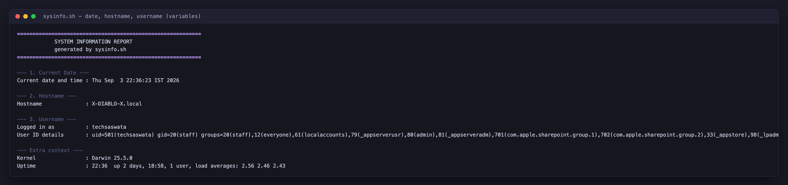
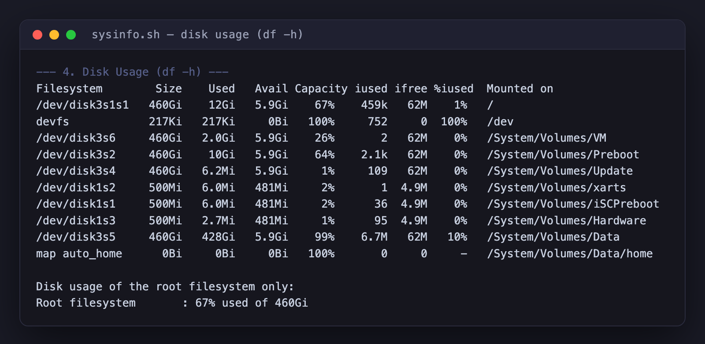
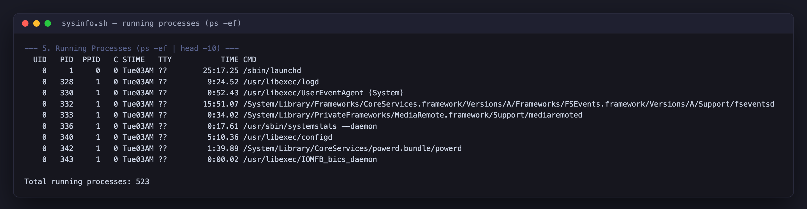
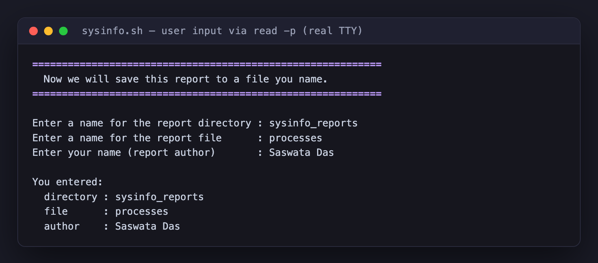
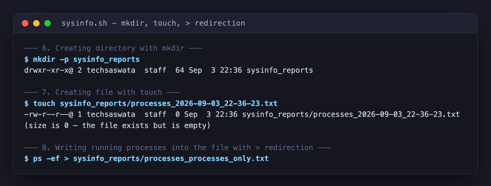
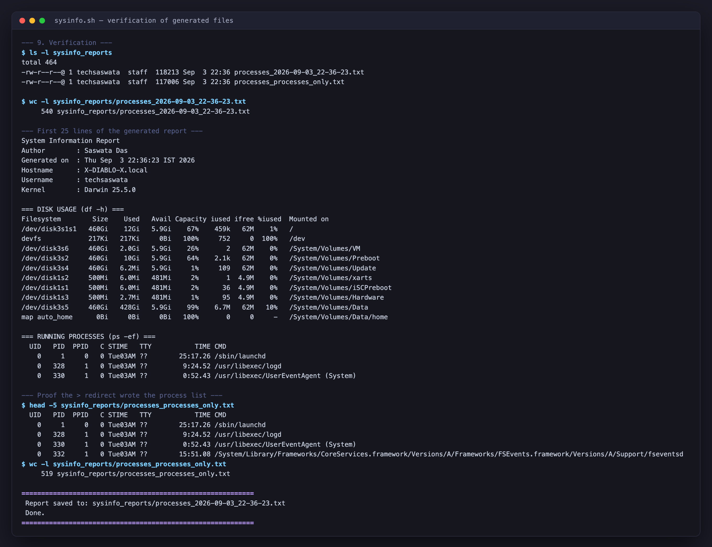
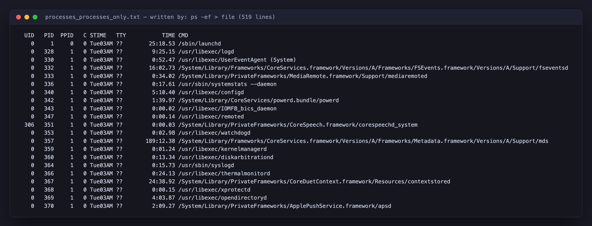
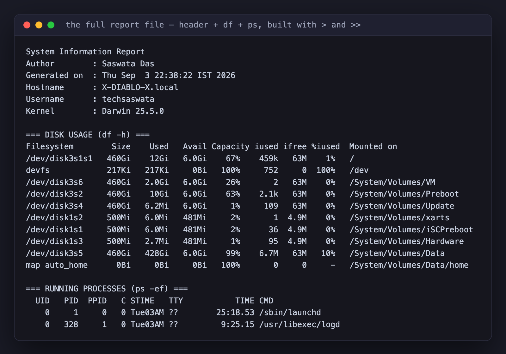
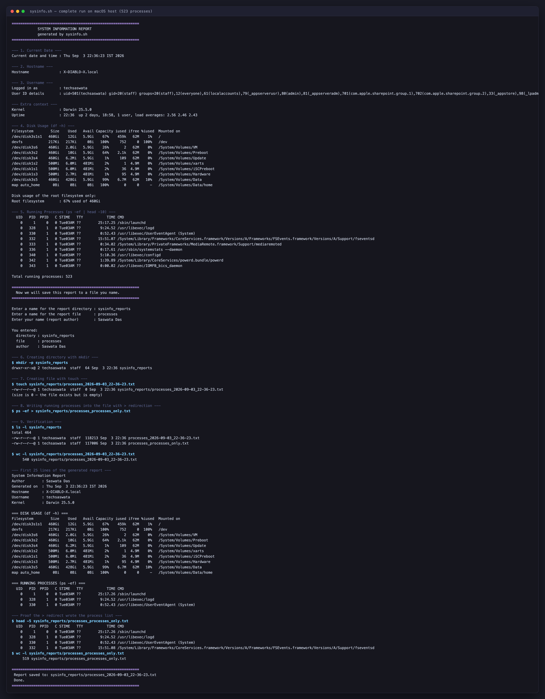
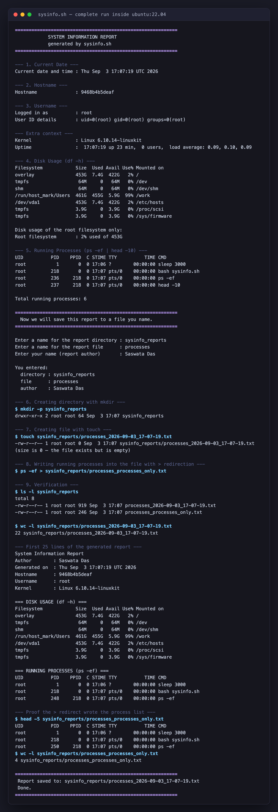

# 02 — Shell Scripting

**Saswata Das — 24BCS10248**

## Task: System Information Script

The script is [`sysinfo.sh`](sysinfo.sh). It was executed twice, for real:

| Run | Where | Evidence |
|---|---|---|
| **A** | macOS host (`X-DIABLO-X.local`, 523 running processes) | [`outputs/sysinfo-host-run.txt`](outputs/sysinfo-host-run.txt) |
| **B** | `ubuntu:22.04` container | [`outputs/sysinfo-linux-run.txt`](outputs/sysinfo-linux-run.txt) |

Both runs were driven through a **real pseudo-terminal**, not a pipe. That matters:
`read -p` only renders its prompt when stdin is a TTY, so a piped run would have hidden
the prompts and made the transcript worthless as proof. The helper that does this is
[`../tools/ptyrun.py`](../tools/ptyrun.py).

```bash
./sysinfo.sh          # just run it and answer the three prompts
```

---

## Requirement checklist

| # | Requirement | How it's done | Line |
|---|---|---|---|
| 1 | Prints the current date | `CURRENT_DATE=$(date)` then `echo` | [sysinfo.sh:22](sysinfo.sh#L22) |
| 2 | Prints the hostname | `HOST_NAME=$(hostname)` | [sysinfo.sh:24](sysinfo.sh#L24) |
| 3 | Prints the username | `USER_NAME=$(whoami)` | [sysinfo.sh:25](sysinfo.sh#L25) |
| 4 | Prints the disk usage | `df -h` | [sysinfo.sh:61](sysinfo.sh#L61) |
| 5 | Prints the running processes | `ps -ef \| head -10` | [sysinfo.sh:74](sysinfo.sh#L74) |
| 6 | Uses variables | 8 variables incl. `CURRENT_DATE`, `HOST_NAME`, `USER_NAME`, `ROOT_USAGE`, `PROCESS_COUNT`, `REPORT_FILE` | throughout |
| 7 | Takes user input using `read -p` | three `read -p` prompts | [sysinfo.sh:96-98](sysinfo.sh#L96-L98) |
| 8 | Creates a directory using `mkdir` | `mkdir -p "$DIR_NAME"` | [sysinfo.sh:116](sysinfo.sh#L116) |
| 9 | Creates a file using `touch` | `touch "$REPORT_FILE"` | [sysinfo.sh:128](sysinfo.sh#L128) |
| 10 | Stores running processes in the file with `>` | `ps -ef > "$PROC_ONLY_FILE"` | [sysinfo.sh:162](sysinfo.sh#L162) |

Every command the task asked for is used: `mkdir`, `touch`, `echo`, `df`, `ps`, `read -p`,
variables, and `>` output redirection.

---

## Output — step by step

### 1–3. Current date, hostname, username (all read from variables)



The values come from command substitution stored in variables first
(`CURRENT_DATE=$(date)`), then printed — not by calling `date` inline. That is the point of
requirement 6: capture once, reuse many times, so every line of the report is internally
consistent.

### 4. Disk usage — `df -h`



`df -h` lists every mounted filesystem in human-readable units. The script also extracts
just the root filesystem into a variable with `awk`:

```bash
ROOT_USAGE=$(df -h / 2>/dev/null | awk 'NR==2 {print $5 " used of " $2}')
# -> "67% used of 460Gi"
```

### 5. Running processes — `ps -ef`



`ps -ef` = **e**very process, **f**ull format (UID, PID, PPID, start time, command).
The script also counts them into `PROCESS_COUNT` — **523** on the host run.

> **Portability note.** `ps -e --no-headers` is a GNU/procps extension that does not exist
> on BSD/macOS. The count therefore tests `ps` itself before choosing a branch:
> ```bash
> if ps -e --no-headers >/dev/null 2>&1; then ... else ps -e | tail -n +2 | wc -l; fi
> ```
> Writing `ps -e --no-headers | wc -l || fallback` would be a **bug** — the `||` would test
> the exit status of `wc -l`, which always succeeds, so the fallback would never run and
> the count would silently be `0`.

### 6. User input — `read -p`



`read -p "prompt" VARIABLE` prints the prompt and reads one line into the variable, without
a separate `echo`. The script also supplies defaults using parameter expansion, so pressing
Enter still works:

```bash
DIR_NAME=${DIR_NAME:-sysinfo_reports}   # use the default if the user typed nothing
```

### 7–8. `mkdir`, `touch`, and `>` redirection



Note the deliberate proof in the middle: right after `touch`, `ls -l` shows the file at
**size 0** — `touch` creates an *empty* file. The content only appears after the redirection
step, which is exactly the distinction the task is testing.

### 9. Verification



### The generated files

`ps -ef > "$PROC_ONLY_FILE"` — running processes stored in a file with a pure `>` redirect
(**529 lines**):



And the full report, built with `>` for the first line and `>>` for everything after
(**550 lines**): a header, `df -h` output, and the complete `ps -ef` table.



A real generated report is committed in [`sysinfo_reports/`](sysinfo_reports/) as evidence.

---

## Complete run — macOS host



## Complete run — ubuntu:22.04 container



The same script, unmodified, produces a correct report on both a BSD-derived and a GNU
userland — `hostname` becomes a container ID, `whoami` becomes `root`, `df` shows overlay
filesystems, and the process count drops from 523 to 6.

---

## Shell concepts demonstrated

| Concept | Syntax | Used for |
|---|---|---|
| Command substitution | `VAR=$(command)` | capturing `date`, `hostname`, `whoami` |
| Variable expansion | `$VAR` / `"${VAR}"` | building `REPORT_FILE` from two variables |
| Default value expansion | `${VAR:-default}` | falling back when the user presses Enter |
| Prompted input | `read -p "text" VAR` | the three interactive questions |
| Overwrite redirect | `command > file` | `ps -ef > processes_only.txt` |
| Append redirect | `command >> file` | building the multi-section report |
| Pipes | `cmd1 \| cmd2` | `ps -ef \| head -10` |
| stderr redirect | `2>/dev/null` | silencing the `head`-induced broken-pipe warning |
| Field extraction | `awk 'NR==2 {print $5}'` | pulling one cell out of `df` output |
| Quoting | `"$DIR_NAME"` | surviving directory names containing spaces |

### Two things worth calling out

**Always quote your variables.** `mkdir -p $DIR_NAME` breaks the moment someone types
`my reports` — it would create *two* directories. `mkdir -p "$DIR_NAME"` creates one.

**`>` vs `>>`.** `>` truncates the file to zero and writes; `>>` appends. Both create the
file if it doesn't exist. Getting these backwards is how you delete a log file you meant
to add to.

---

## Files in this folder

```
02-shell-scripting/
├── README.md                <- this file
├── sysinfo.sh               <- the script
├── outputs/
│   ├── sysinfo-host-run.txt   <- full transcript, macOS host
│   └── sysinfo-linux-run.txt  <- full transcript, ubuntu:22.04
├── sysinfo_reports/         <- a real generated report (evidence)
└── screenshots/             <- the 9 PNGs embedded above
```
