# 03 — Networking Fundamentals

**Saswata Das — 24BCS10248**

## What was done

Every command below was **actually executed** and the output captured. Two environments
were used, because some things are only real on a real machine:

| Environment | Raw log | Why |
|---|---|---|
| `net-lab` container (Ubuntu + all net tools, [`lab/Dockerfile`](lab/Dockerfile)) | [`outputs/networking-commands.txt`](outputs/networking-commands.txt) — 426 lines | full GNU tooling: `ip`, `ss`, `dig`, `tcpdump`, `nmap` |
| macOS host on a real LAN | [`outputs/networking-host.txt`](outputs/networking-host.txt) — 210 lines | a real default gateway, a real ARP cache, and a traceroute that isn't swallowed by Docker's NAT |

```bash
docker build -t net-lab lab/
docker run --rm --cap-add=NET_ADMIN --cap-add=NET_RAW -v "$PWD/scripts":/scripts:ro \
  net-lab bash /scripts/netcommands.sh
```

> ### 🔒 A note on redaction
> The host run captured **real MAC addresses of other people's devices** from the ARP cache
> of a shared network, plus this machine's public IP and the ISP router's hostname. Since
> this is a **public** repository, those are masked (`xx:xx:xx:xx:xx:xx`,
> `<redacted-public-ip>`, `<isp-router>`) by [`scripts/redact.py`](scripts/redact.py).
> The structure of every command's output is untouched, so nothing is lost pedagogically.
> **Publishing your ARP cache verbatim leaks your neighbours' device identifiers** — worth
> knowing before you push a networking assignment.

---

# Part 1 — Interfaces & Addressing

## `ip addr` / `ifconfig`

```bash
ip addr show          # Linux, modern
ip -brief addr show   # one line per interface, much easier to read
ifconfig              # legacy (net-tools); still the default on macOS
ip link show          # layer 2 only: MAC, MTU, up/down
```

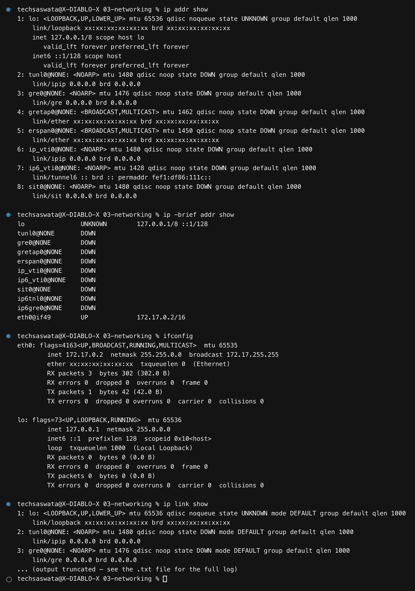

**What I understood:** an interface is one network attachment point. `lo` is the loopback
(`127.0.0.1`) which never leaves the machine; `eth0` is the real one. Each interface has a
**MAC address** (layer 2, burned in / assigned by the hypervisor) and one or more **IP
addresses** (layer 3, assigned by DHCP or statically). The `/16` in `172.17.0.2/16` is the
prefix length: it says which part of the address is the *network* and which is the *host* —
that is exactly how a machine decides "is this destination on my LAN, or do I send it to
the gateway?"

`ip` (from `iproute2`) is the modern tool; `ifconfig` (from `net-tools`) is deprecated on
Linux but still the everyday command on macOS/BSD.

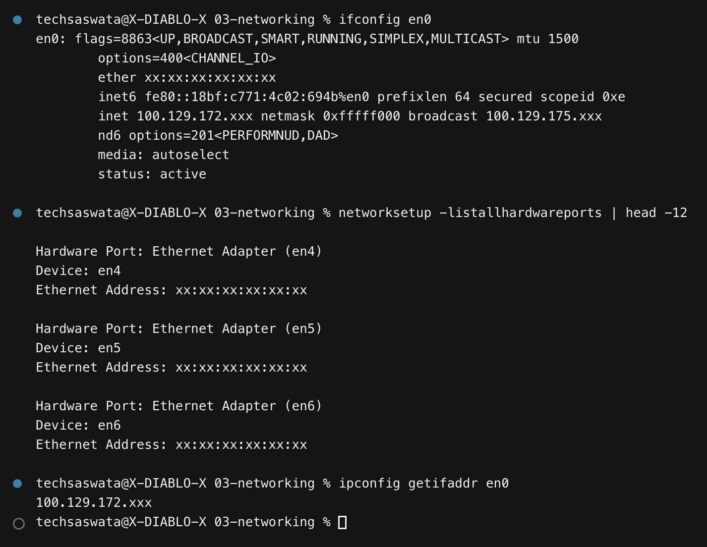

---

# Part 2 — Routing

## `ip route` / `netstat -rn` / `route`

```bash
ip route show             # Linux routing table
ip route get 8.8.8.8      # "which route would this packet actually take?"
netstat -rn -f inet       # macOS/BSD
route -n get default      # macOS: details of the default route
```

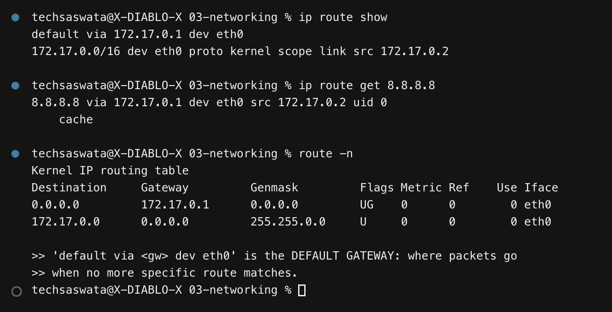
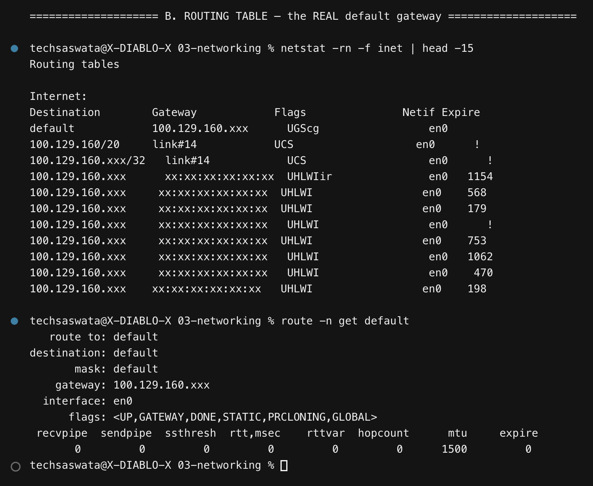

**What I understood:** the routing table is a list of rules, consulted **most-specific
first**. A packet for `172.17.0.5` matches the directly-connected `172.17.0.0/16` line and
goes straight out `eth0`. A packet for `8.8.8.8` matches nothing specific, so it falls
through to the **default route** and is handed to the **gateway**
(`100.129.160.xxx` on the host — the Wi-Fi router).

`ip route get` is the one to remember for debugging: instead of making you read the table
and simulate the lookup in your head, it tells you the answer directly.

---

## `arp` / `ip neigh`

```bash
ip neigh show   # Linux
arp -a          # macOS/BSD
```

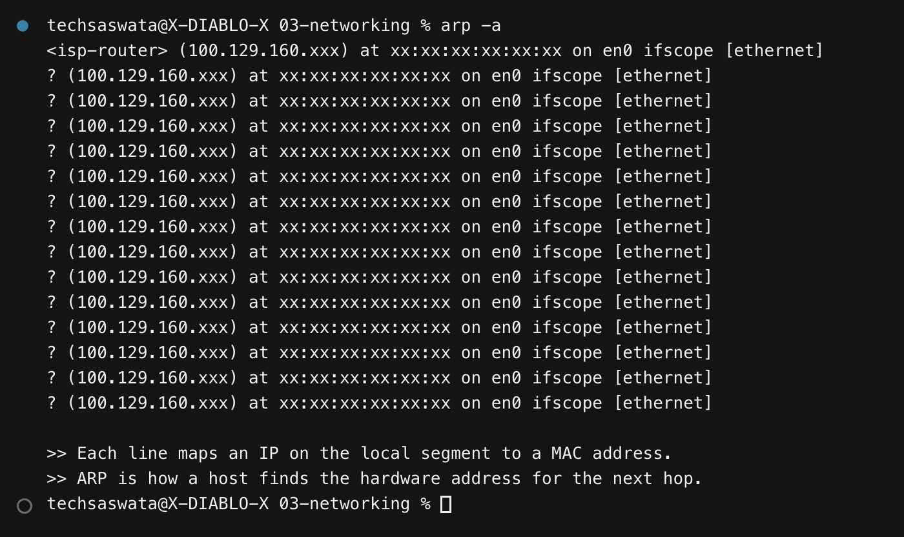
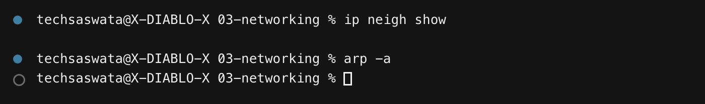

**What I understood:** IP is layer 3, but Ethernet delivers frames to **MAC addresses** at
layer 2. ARP is the bridge: "who has 100.129.160.1? tell me your MAC." The answers are
cached, and `arp -a` shows that cache. Note the ARP table only ever contains devices on
the **same local segment** — the gateway is there, but `8.8.8.8` never will be, because you
never talk to Google directly at layer 2; you talk to your router, and it forwards.

---

# Part 3 — DNS

## `dig`, `nslookup`, `host`

```bash
dig github.com                 # full, verbose answer
dig +short github.com          # just the addresses
dig +short google.com MX       # mail servers
dig +short -x 8.8.8.8          # REVERSE lookup: IP -> name
nslookup github.com
host github.com
cat /etc/resolv.conf           # which resolver is this machine using?
```

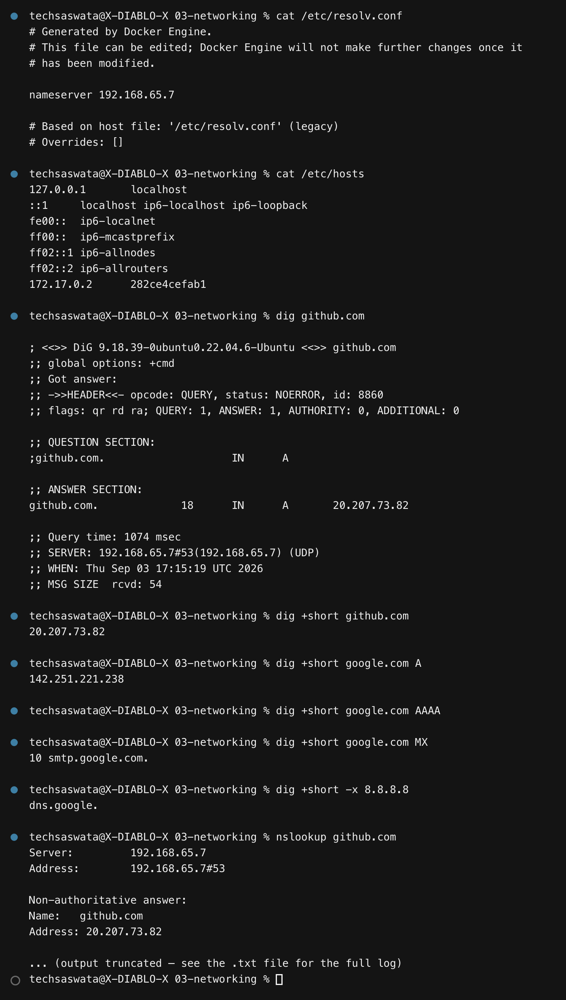
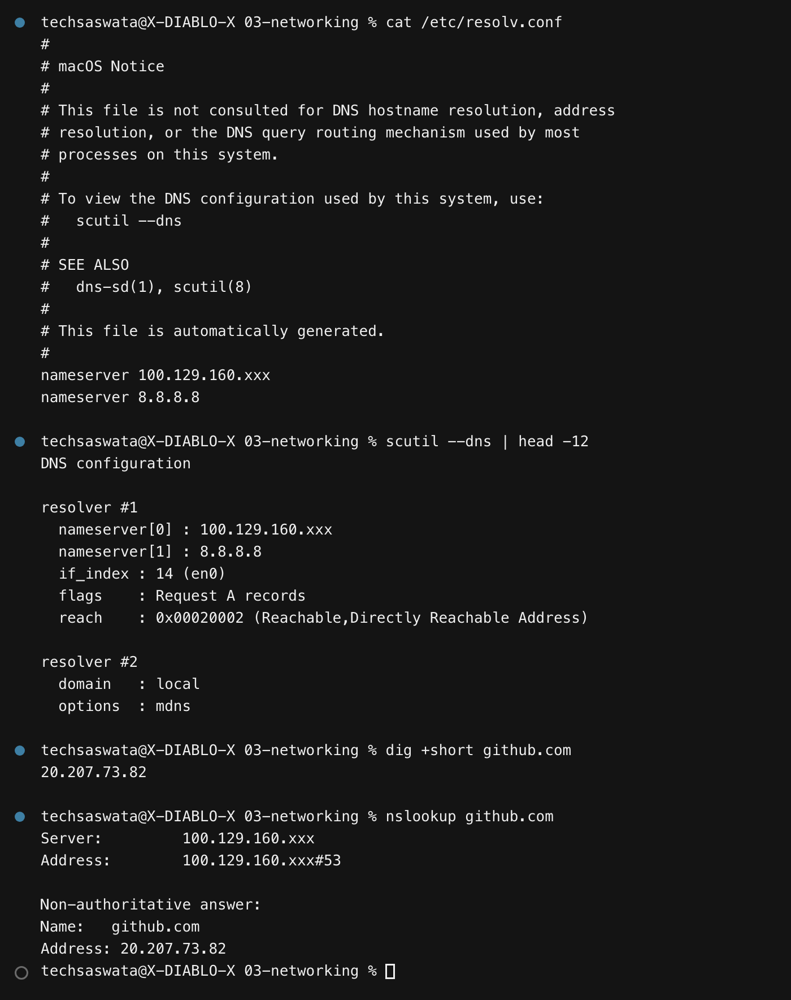

**What I understood:** DNS turns names into addresses. `dig` is the tool that shows you the
whole transaction — the QUESTION section, the ANSWER section, the record **type**
(`A` = IPv4, `AAAA` = IPv6, `MX` = mail, `CNAME` = alias, `PTR` = reverse), the **TTL**
(how long the answer may be cached), and which server answered.

The practical lesson: `/etc/resolv.conf` names the resolver. Inside a Docker container it
is `192.168.65.7` — Docker's own embedded DNS, not the host's. That single fact explains a
huge share of "it works on my machine but not in the container" bugs.

Also worth internalising: `/etc/hosts` is consulted **before** DNS. That is why
`getent hosts` can return an answer even when `dig` cannot.

---

# Part 4 — Connectivity & Path

## `ping`

```bash
ping -c 4 8.8.8.8
ping -c 4 google.com
```

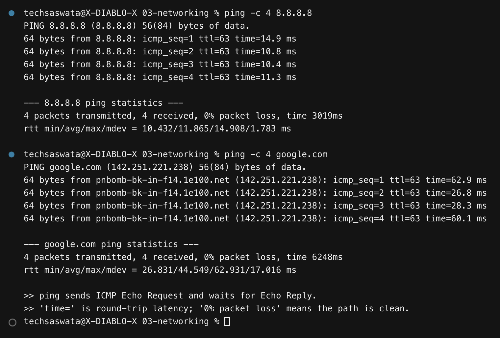
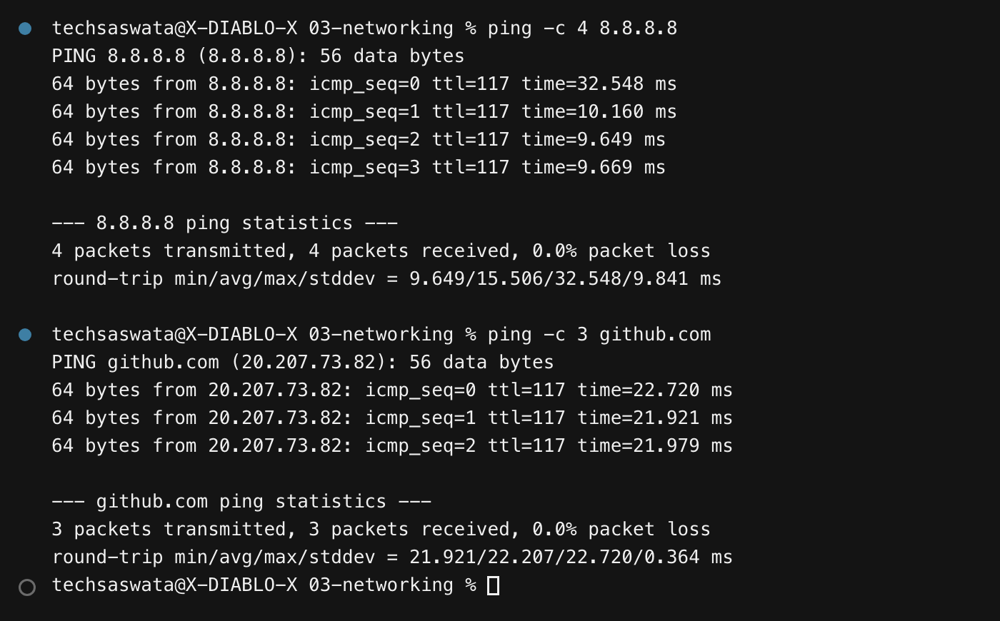

**What I understood:** `ping` sends an **ICMP Echo Request** and times the **Echo Reply**.
It answers two different questions at once:

- *Is the host reachable at all?* → `0% packet loss`
- *How far away is it, in time?* → `rtt min/avg/max/mdev = 10.4/11.8/14.9/1.7 ms`

Pinging `8.8.8.8` (an IP) and `google.com` (a name) is a **deliberate two-step diagnostic**:
if the IP pings but the name doesn't, the network is fine and your **DNS** is broken.

`ttl=63` in the reply is also informative — it started at 64 and was decremented once per
router, so the reply crossed one hop of NAT.

---

## `traceroute`

```bash
traceroute -I -m 15 google.com    # -I = use ICMP probes
```

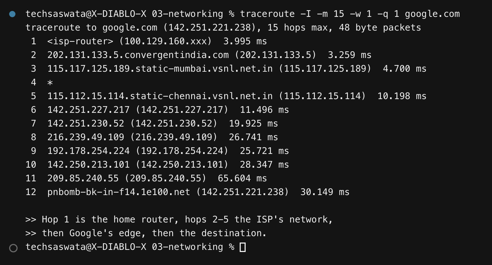

**What I understood:** traceroute exploits **TTL**. It sends a packet with TTL=1; the first
router decrements it to 0, drops it, and politely reports `time exceeded` — revealing
itself. Then TTL=2 reveals the second router, and so on. The result is the actual path.

Reading the real trace above: hop 1 is the local Wi-Fi router, hops 2–5 are the ISP's
network (`convergentindia`, then `static-mumbai.vsnl.net.in`, then
`static-chennai.vsnl.net.in`), hops 6–11 are Google's backbone, and hop 12 is the
destination. **You can literally see the traffic leave the building, cross the country, and
enter Google.**

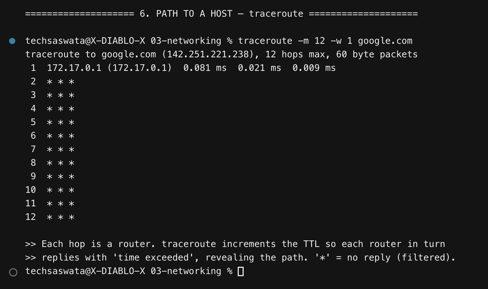

The container trace shows only hop 1 then `* * *`. That is not a failure to understand —
it is Docker Desktop's VM NAT dropping the probes. A `*` means "no reply", which happens
whenever a router is configured not to answer. This is exactly why the host run exists.

---

# Part 5 — Ports & Sockets

## `ss` / `netstat`

```bash
ss -tuln      # t=TCP u=UDP l=listening n=numeric
ss -tulnp     # ...p = which PROCESS owns the socket
ss -s         # summary statistics
netstat -tulnp
lsof -nP -iTCP -sTCP:LISTEN   # macOS equivalent
```

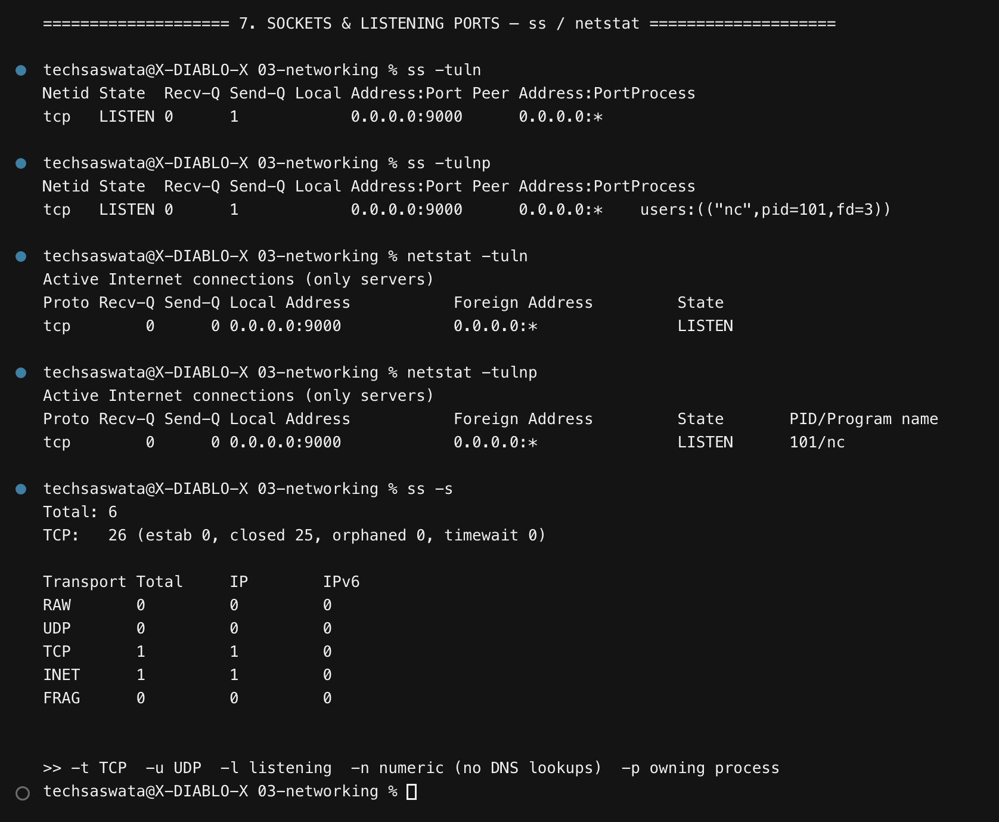
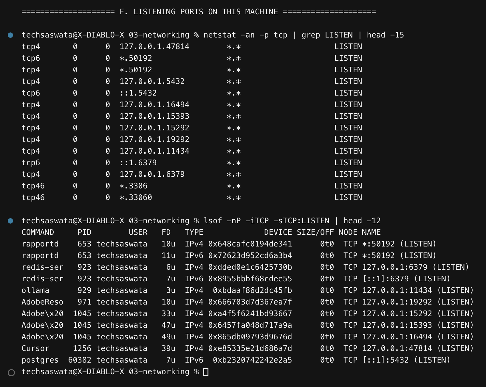

**What I understood:** a **socket** is the pair (IP, port). "Listening" means a process has
claimed a port and is waiting for connections. To make this real I started `nc -l -p 9000`
first, and you can see it appear in all four commands — with `-p` even naming the owner:
`users:(("nc",pid=101,fd=3))`.

That `-p` flag is the whole point in practice. When a deploy fails with
**"address already in use"**, `ss -tulnp | grep :8080` tells you *which process* to kill.
`ss` is the modern replacement for `netstat`; it reads netlink instead of parsing `/proc`,
so it is much faster on busy servers.

`0.0.0.0:9000` also matters: `0.0.0.0` means "all interfaces, reachable from outside",
whereas `127.0.0.1:9000` would mean "this machine only". Binding to the wrong one is a
classic container bug — a service bound to `127.0.0.1` inside a container is unreachable
from the host no matter how you publish the port.

---

## `nc` (netcat) and `telnet`

```bash
nc -zv -w 3 google.com 443    # -z scan only, -v verbose, -w timeout
nc -zv -w 3 google.com 80
nc -zv -w 2 google.com 12345  # a port that is NOT open
```

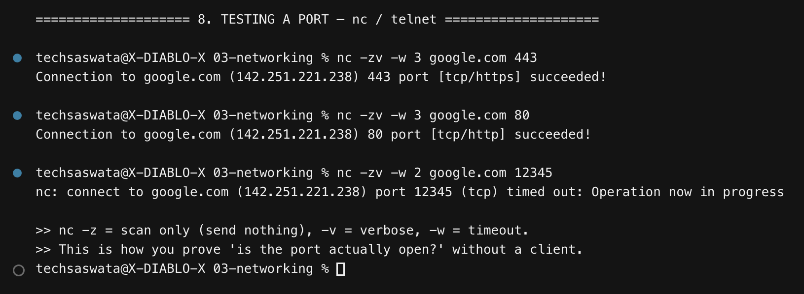

**What I understood:** this is how you prove a port is genuinely reachable *end to end*,
without needing a real client. `ping` only tests ICMP — a host can ping perfectly while the
port you care about is firewalled shut. Ports 443 and 80 report `succeeded!`; port 12345
times out. That difference is the single most useful firewall diagnostic there is.

---

# Part 6 — HTTP

## `curl` / `wget`

```bash
curl -I https://github.com            # headers only
curl -s https://api.github.com/zen
curl -s -o /dev/null -w 'dns=%{time_namelookup}s connect=%{time_connect}s ...' URL
wget -qO- URL                         # print to stdout
wget --spider -S URL                  # headers only, download nothing
```

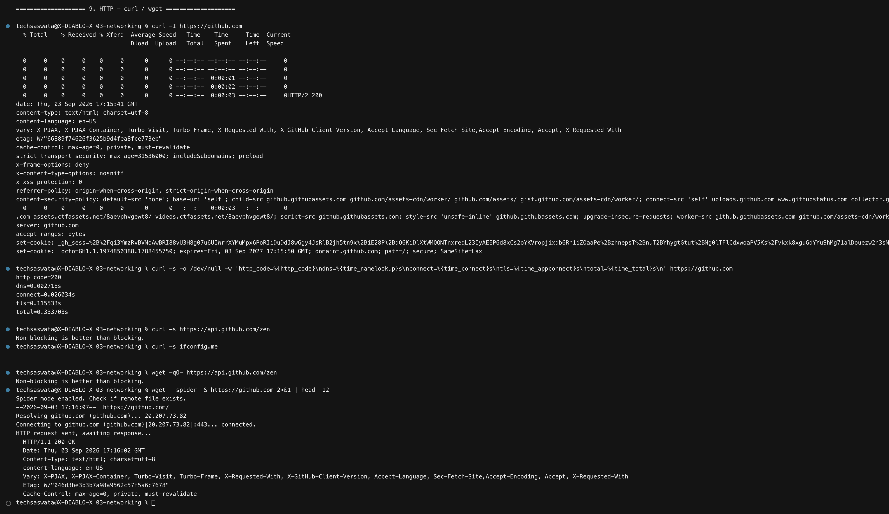
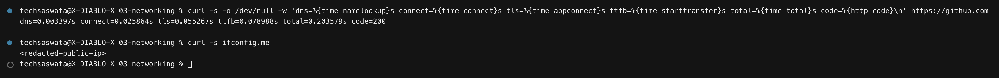

**What I understood:** `curl` speaks the protocol and prints what it gets; `wget` is built
to *download files* (and can recurse and resume). For debugging, `curl` wins.

The `-w` timing breakdown is the genuinely useful trick and worth memorising, because it
tells you **which layer is slow**:

| Field | Meaning | If it's the big number… |
|---|---|---|
| `time_namelookup` | DNS resolution | your resolver is slow |
| `time_connect` | TCP handshake | network latency / distance |
| `time_appconnect` | TLS handshake | certificate or crypto negotiation cost |
| `time_starttransfer` | first byte (TTFB) | **the server is slow**, not the network |
| `time_total` | everything | — |

`curl -I` sends a `HEAD` request: you get status line and headers with no body, which is the
fastest way to check "is this service up and what does it say about itself?"

---

# Part 7 — Deeper Inspection

## `tcpdump`

```bash
tcpdump -i any -c 5 -n icmp     # capture 5 ICMP packets, don't resolve names
tcpdump -i eth0 port 80         # only HTTP traffic
tcpdump -w capture.pcap         # save for Wireshark
```

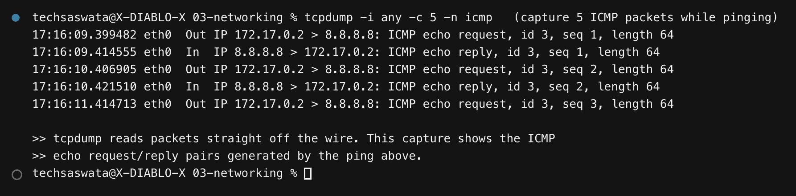

**What I understood:** tcpdump reads packets directly off the interface — it is ground
truth. In this capture I started tcpdump, then ran `ping -c 3 8.8.8.8` in parallel, and the
output shows the matching pairs:

```
Out IP 172.17.0.2 > 8.8.8.8: ICMP echo request, id 3, seq 1
In  IP 8.8.8.8 > 172.17.0.2: ICMP echo reply,   id 3, seq 1
```

Every `seq` has both a request and a reply, `Out` then `In`. That is what "0% packet loss"
looks like at the packet level. When something is broken, this is how you find out
*whether the packet ever left*, which instantly tells you if the problem is yours or theirs.
`-n` is important: without it, tcpdump does a DNS lookup per packet and floods your own
capture with DNS traffic.

---

## `nmap`

```bash
nmap -sT -p 1-1024,9001 127.0.0.1
```

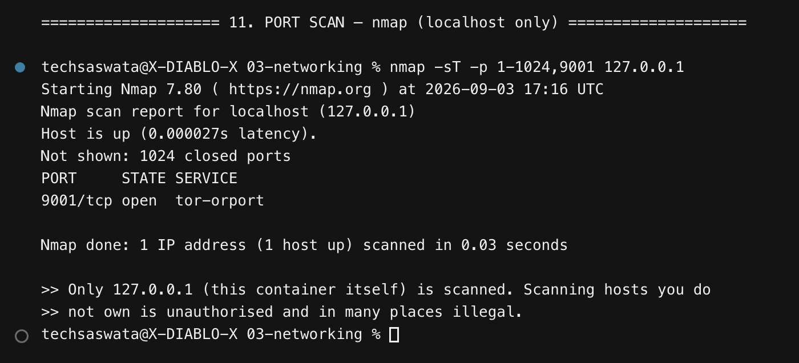

**What I understood:** nmap probes a range of ports and reports which are open. Having
opened `9001` with netcat beforehand, the scan finds exactly that one port open and 1024
closed — confirming both that the tool works and that nothing unexpected is listening.
(nmap labels 9001 `tor-orport` purely by looking the number up in `/etc/services`; the
service name is a guess from a table, not a detection.)

> ⚠️ **Only `127.0.0.1` — the container itself — was scanned.** Port-scanning hosts you do
> not own is unauthorised access in many jurisdictions. Scan your own machines only.

---

## Interface statistics, MTU, and `whois`

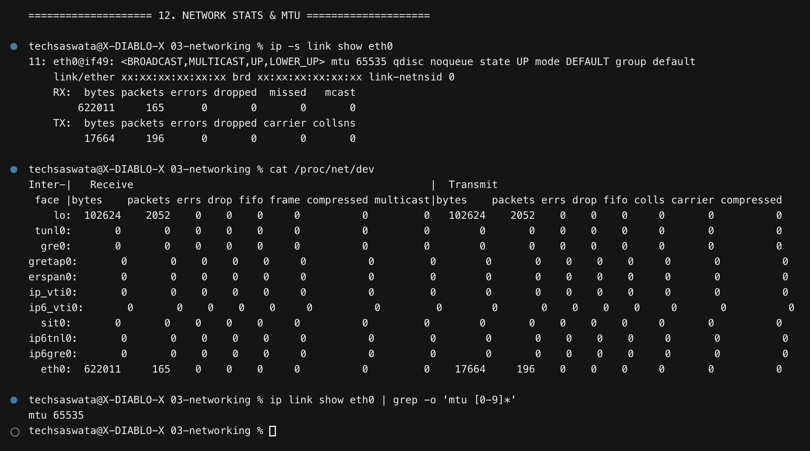
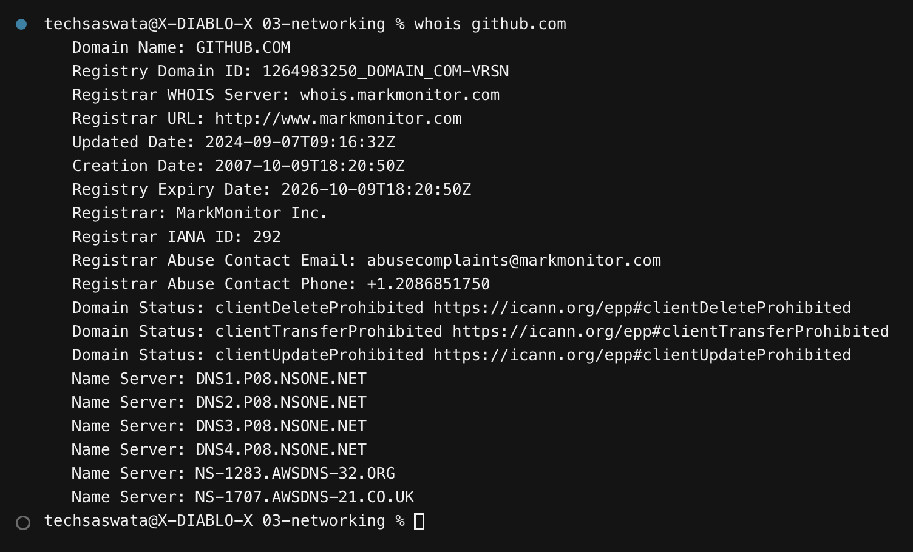

**What I understood:** `ip -s link` shows per-interface counters — RX/TX bytes, packets,
**errors** and **dropped**. Rising error/drop counters point at a physical or driver
problem rather than an application one.

**MTU** is the largest frame the link will carry. Note the captured value is **65535**, not
the 1500 you would see on physical Ethernet — this `eth0` is a virtual `veth` pair inside
Docker Desktop's VM, so there is no physical wire to constrain it. On the macOS host's real
Wi-Fi interface the MTU is 1500.

MTU matters more than it looks: VPNs and overlay networks add encapsulation headers, so if
the MTU isn't lowered to compensate, large packets get silently dropped and you see the
classic symptom of "small requests work, big ones hang."

`whois` queries registry databases for *ownership* of a domain or IP block — registrar,
creation/expiry dates, name servers. It is metadata about who runs the thing, not a network
test.

---

# Part 8 — Commands understood but not run here

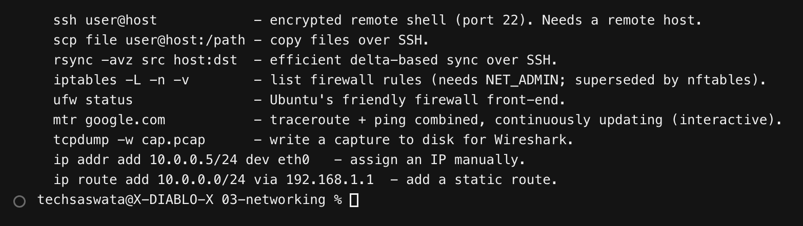

| Command | What it does | Why it isn't demonstrated |
|---|---|---|
| `ssh user@host` | encrypted remote shell over port 22 | needs a remote host to log into |
| `scp file user@host:/path` | copy files over the SSH channel | same |
| `rsync -avz src host:dst` | delta-based sync; only transfers changed blocks | same |
| `iptables -L -n -v` | list Linux firewall rules | needs `NET_ADMIN` on the host netns; superseded by `nftables` |
| `ufw status` | Ubuntu's friendly firewall front-end | wraps iptables |
| `mtr google.com` | traceroute + ping combined, continuously updating | interactive full-screen UI |

---

## Quick reference

| Question | Command |
|---|---|
| What's my IP? | `ip -brief addr` / `ifconfig` / `curl ifconfig.me` (public) |
| What's my gateway? | `ip route show default` / `route -n get default` |
| Is the host reachable? | `ping -c 4 <host>` |
| Is **DNS** broken or the network? | `ping 8.8.8.8` vs `ping google.com` |
| What does this name resolve to? | `dig +short <host>` |
| Where does traffic actually go? | `traceroute <host>` |
| Is port 8080 open **on the remote end**? | `nc -zv <host> 8080` |
| What's listening **here**, and what owns it? | `ss -tulnp` |
| Who has my port 8080? | `ss -tulnp \| grep :8080` |
| Is the web service healthy? | `curl -I <url>` |
| Is it DNS, the network, or the server that's slow? | `curl -w` timing breakdown |
| Did the packet even leave? | `tcpdump -i any -n host <ip>` |

---

## Files in this folder

```
03-networking/
├── README.md                        <- this file (the required .md with outputs + explanations)
├── lab/Dockerfile                   <- the net-lab image
├── scripts/
│   ├── netcommands.sh               <- the Linux command run
│   ├── nethost.sh                   <- the macOS host run
│   └── redact.py                    <- strips MACs / public IP before publishing
├── outputs/
│   ├── networking-commands.txt      <- 426 lines of captured output
│   └── networking-host.txt          <- 210 lines
└── screenshots/                     <- the 22 PNGs embedded above
```
