# 04 — Git / GitHub

**Saswata Das — 24BCS10248**

Both tasks were run for real in throwaway sandbox repositories. Scripts in
[`scripts/`](scripts/), full logs in [`outputs/`](outputs/).

```bash
./scripts/task1-commit-a.sh      # git commit -m vs git commit -a -m
./scripts/task2-cherry-pick.sh   # cherry-pick walkthrough
```

---

# Task 1 — `git commit -a -m` vs `git commit -m`

## The short answer

`git commit -m "msg"` commits **only what is in the staging area** (the index). If you
haven't run `git add`, it commits nothing.

`git commit -a -m "msg"` runs an implicit **`git add -u`** first: it auto-stages
**modifications and deletions of files git is already tracking**, then commits.

The trap: **`-a` does *not* stage new, untracked files.** It is `git add -u`, not
`git add -A`. This is the single most common misconception about the flag, so the demo
below is built to prove it.

## Understanding the three areas

```
  Working Directory  ──git add──▶  Staging Area (Index)  ──git commit──▶  Repository
       (your edits)                  (what's queued)                      (history)

  git commit -m      : Staging Area ───▶ Repository
  git commit -a -m   : Working Dir ──▶ Staging ──▶ Repository   (TRACKED files only)
```

## Setup

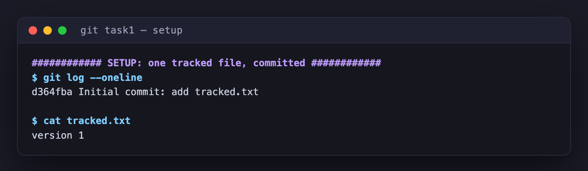

## Experiment A — `git commit -m` without staging

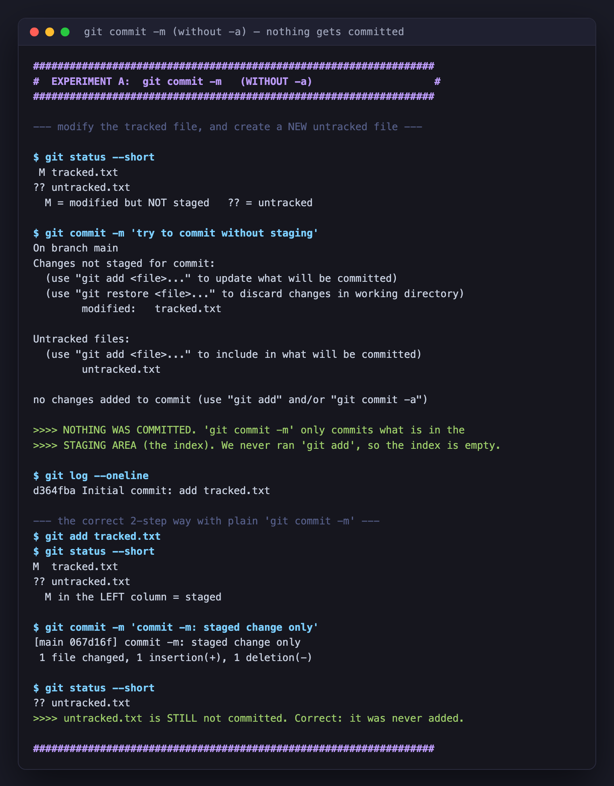

Two files are changed: `tracked.txt` is **modified** (already tracked) and `untracked.txt`
is **brand new**. `git status --short` shows them differently:

```
 M tracked.txt      <- space then M: modified in working dir, NOT staged
?? untracked.txt    <- git has never seen this file
```

Running `git commit -m` produces **no commit at all**:

```
no changes added to commit (use "git add" and/or "git commit -a")
```

and `git log` still shows only the initial commit. Git's own error message names both
escape hatches — which is exactly what this task is about.

After `git add tracked.txt`, status changes to `M  tracked.txt` — the `M` **moves to the
left column**. Left column = staged, right column = working directory. Now the commit
succeeds. `untracked.txt` is still uncommitted, correctly, because it was never added.

## Experiment B — `git commit -a -m`

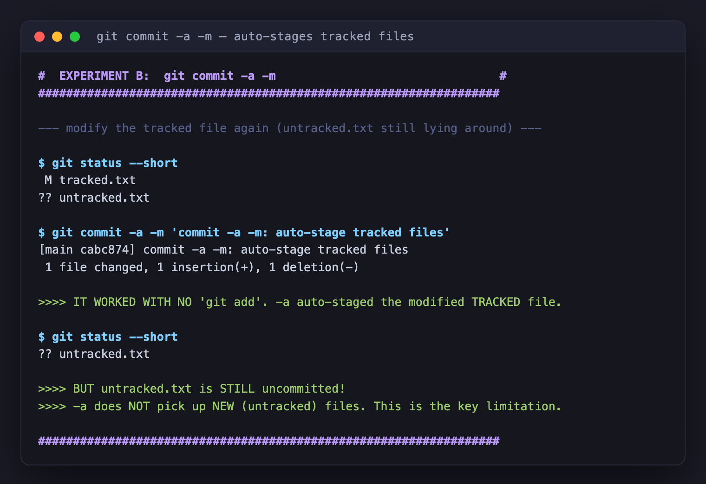

`tracked.txt` is modified again, and this time **`git commit -a -m` succeeds with no
`git add`**. The `-a` staged it automatically.

But look at the status afterwards: `?? untracked.txt` is *still there*. **`-a` skipped the
new file entirely.**

## Experiment C — does `-a` handle deletions?

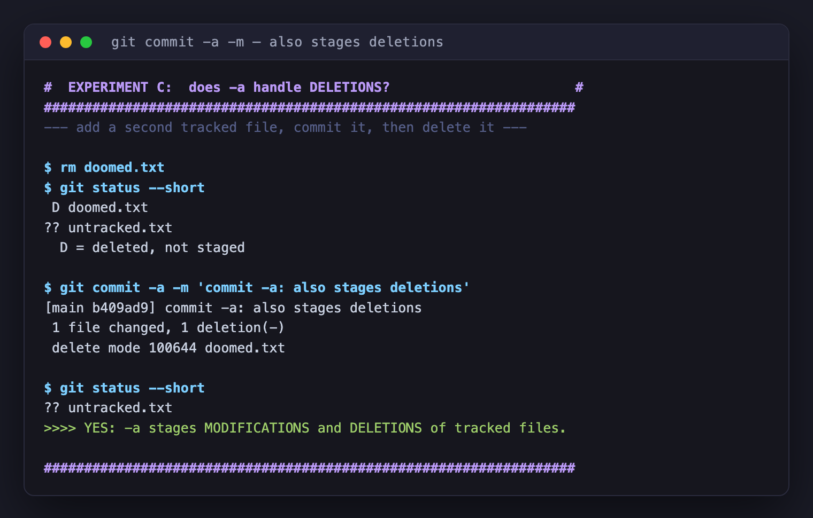

Yes. A tracked file is deleted with plain `rm` (not `git rm`), status shows `D`, and
`git commit -a -m` records the deletion:

```
1 file changed, 1 deletion(-)
delete mode 100644 doomed.txt
```

So `-a` covers **modify** and **delete** on tracked files — everything except **create**.

## Getting the new file in

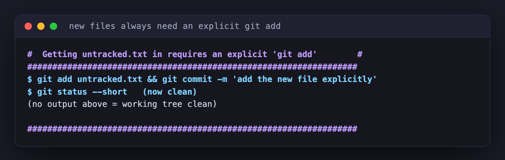

Only an explicit `git add untracked.txt` finally commits it, leaving a clean tree.

## Summary

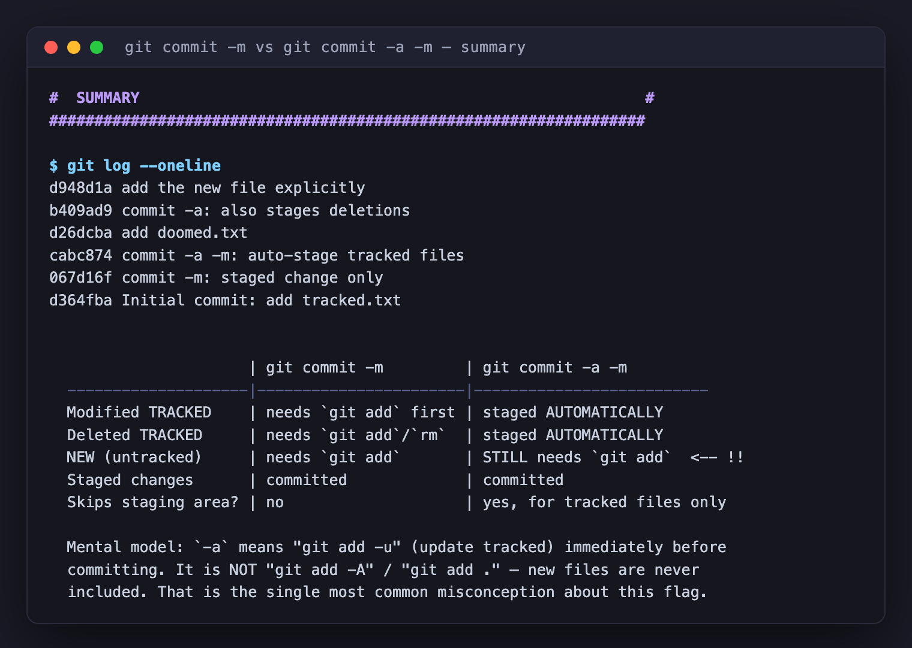

| Change | `git commit -m` | `git commit -a -m` |
|---|---|---|
| Modified **tracked** file | needs `git add` first | ✅ staged automatically |
| Deleted **tracked** file | needs `git add`/`git rm` | ✅ staged automatically |
| **New (untracked)** file | needs `git add` | ❌ **still needs `git add`** |
| Already-staged changes | ✅ committed | ✅ committed |
| Skips the staging area? | no | yes — tracked files only |

### When to use which

Use **`-a`** for quick edits to files that already exist — a typo fix, a version bump. It
saves a step.

Use **plain `git commit -m`** whenever the commit should be deliberate: when you've touched
five files but only two belong in this commit, when you want `git add -p` to stage selected
hunks, or when new files are involved. The staging area exists so you can *curate* a commit;
`-a` throws that away by design.

> **Gotcha worth remembering:** `git commit -a` after creating new files gives you a commit
> that looks complete locally but is broken for everyone else — because the new file was
> never included. The build fails on CI with "module not found" while it works fine on your
> machine. Always check `git status` before you push.

---

# Task 2 — Git Cherry-Pick

## What cherry-pick does

`git cherry-pick <hash>` takes the **change introduced by one commit** and replays it as a
**new commit** on your current branch. You get that one change without merging the whole
branch.

## Step 1–2 — Three commits on `main`, viewed with `git log`

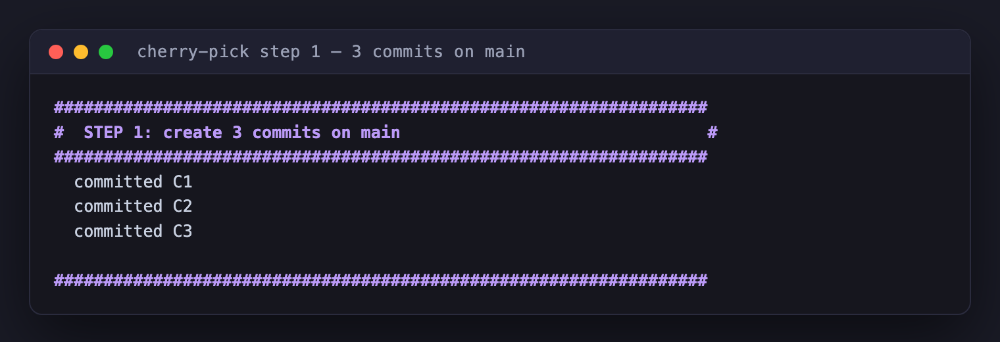
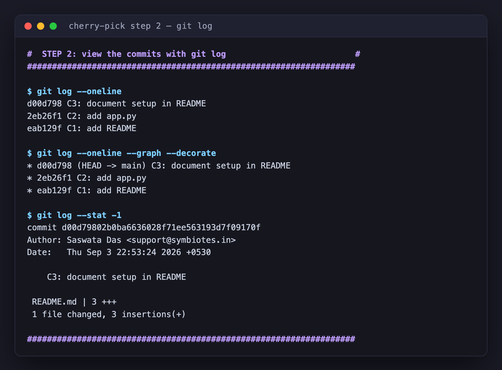

Commits `C1` (README), `C2` (app.py), `C3` (setup docs).

## Step 3 — Create a new branch

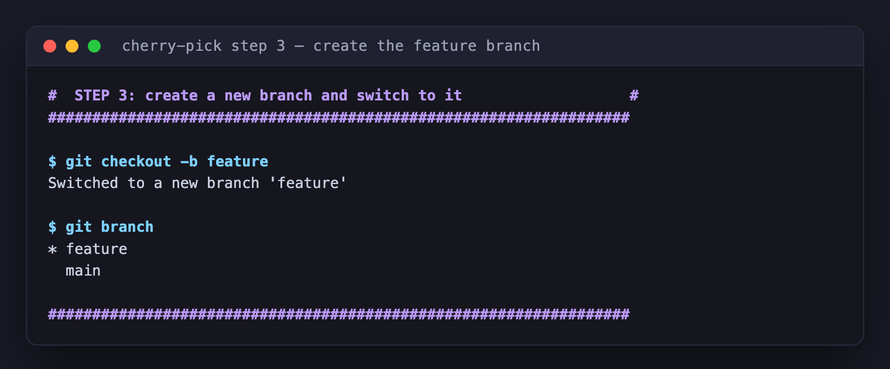

`git checkout -b feature` creates the branch **and** switches to it in one step
(modern equivalent: `git switch -c feature`).

## Step 4 — Three commits on `feature`

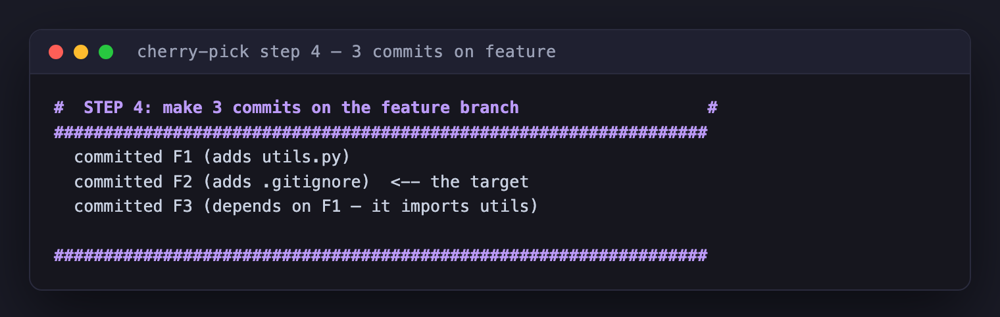

- `F1` — adds `utils.py` with a `greet()` function
- `F2` — adds `.gitignore` ← **this is the one to cherry-pick**
- `F3` — rewrites `app.py` to `from utils import greet` (so **F3 depends on F1**)

The dependency in F3 is deliberate; it sets up the lesson at the end.

## Step 5 — Use `git log` to identify the specific commit

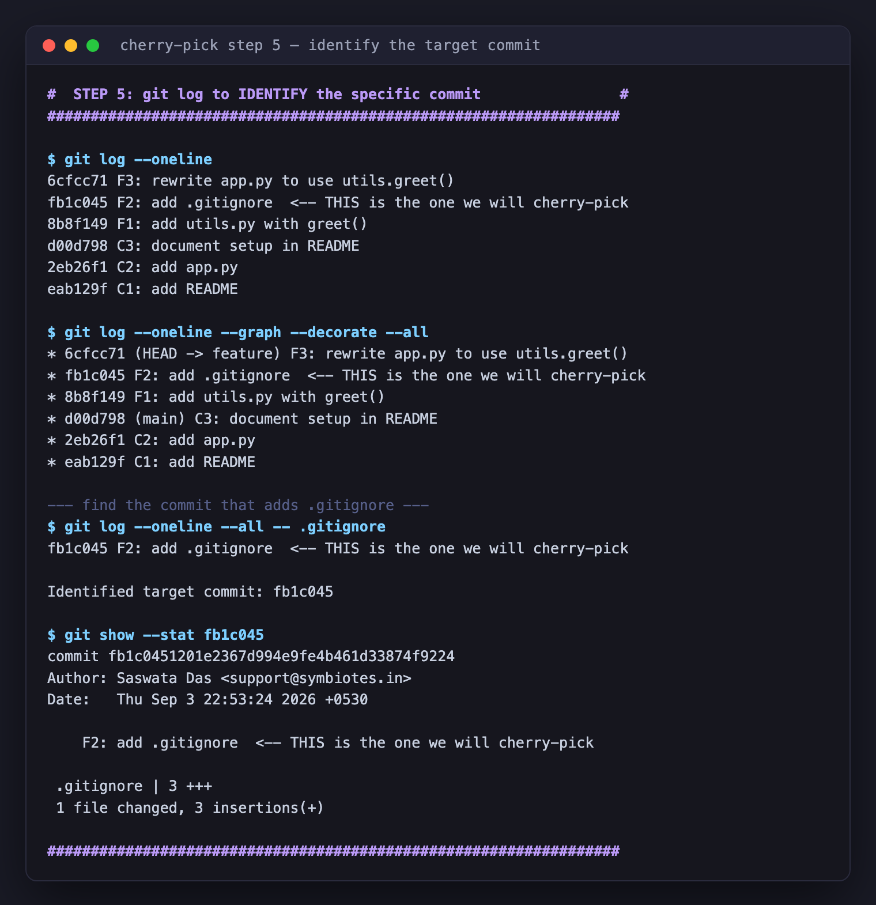

The `--graph --decorate --all` view shows both branches at once and exactly where they
diverged. To pinpoint the commit that touched one file:

```bash
git log --oneline --all -- .gitignore    # -> fb1c045
git show --stat fb1c045                  # confirm it's the right one
```

Always `git show` the hash before picking it. Picking the wrong commit is easy and annoying to unwind.

## Step 6 — The cherry-pick

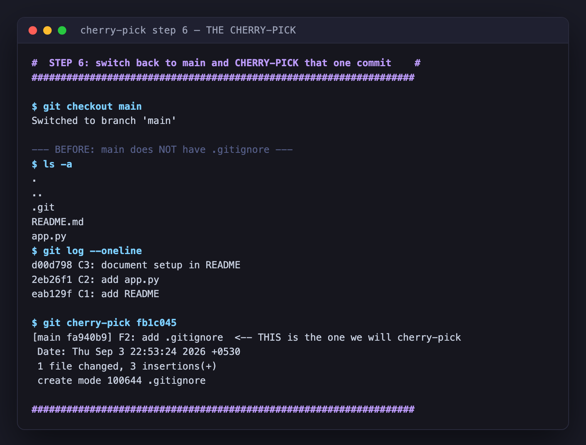

```bash
git checkout main
git cherry-pick fb1c045
```

Before: `ls -a` on main shows only `README.md` and `app.py`. After:

```
[main fa940b9] F2: add .gitignore
 1 file changed, 3 insertions(+)
 create mode 100644 .gitignore
```

## Step 7 — Verification

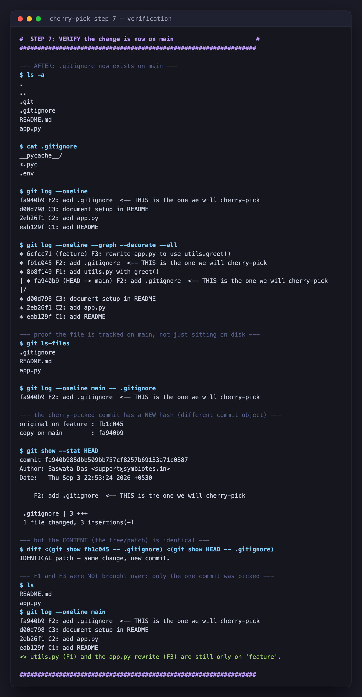

Four independent checks that the change really is on `main`:

1. **`ls -a`** — `.gitignore` is now present in the working tree.
2. **`cat .gitignore`** — the contents match what F2 created.
3. **`git ls-files`** — it is **tracked by git on main**, not just sitting on disk.
4. **`git log --oneline main -- .gitignore`** — main's history contains a commit for it.

The commit graph tells the whole story:

```
* 6cfcc71 (feature) F3: rewrite app.py to use utils.greet()
* fb1c045           F2: add .gitignore          <- the original
* 8b8f149           F1: add utils.py with greet()
| * fa940b9 (HEAD -> main) F2: add .gitignore   <- the cherry-picked COPY
|/
* d00d798 C3: document setup in README
* 2eb26f1 C2: add app.py
* eab129f C1: add README
```

### The key insight: same change, different commit

```
original on feature : fb1c045
copy on main        : fa940b9
```

**Different hashes, identical patch.** A commit's hash is computed from its content *plus*
its parent, author, timestamp and message. The cherry-picked commit has a different parent
(`d00d798` instead of `8b8f149`), so it is a genuinely different commit object that happens
to make the same change. The script verifies this by diffing the two patches — they are
identical.

This is why cherry-picking a commit and *then* merging the branch can produce a duplicate
entry in history: git sees two distinct commits, even though a human sees one change.

### Only the picked commit came across

`ls` on main shows `README.md`, `app.py`, `.gitignore` — **no `utils.py`**. F1 and F3
stayed on `feature`. Cherry-pick means *this commit and nothing else*.

## The dependency trap

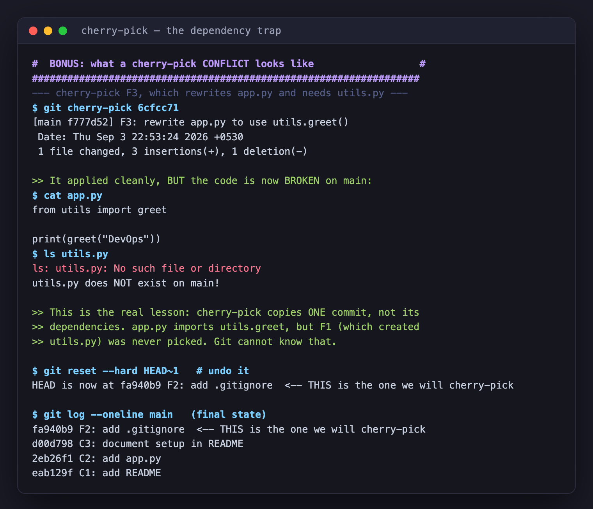

As a bonus I cherry-picked **F3** (the `app.py` rewrite) onto main. Git applied it
**cleanly — no conflict at all**. But the result is broken:

```python
from utils import greet     # app.py on main
```
```
$ ls utils.py
ls: utils.py: No such file or directory
```

**This is the most important thing to understand about cherry-pick.** "No conflict" means
the *text* merged fine. It does **not** mean the code works. F3 depends on F1, git has no
idea, and you get a silently broken `main`.

The rule: when you cherry-pick, ask *what else does this commit need?* — then either pick
those commits too, or test afterwards.

## Cherry-pick command reference

| Command | What it does |
|---|---|
| `git cherry-pick <hash>` | apply that one commit here |
| `git cherry-pick A B C` | apply three specific commits, in order |
| `git cherry-pick A..B` | apply a range (**excluding** A) |
| `git cherry-pick A^..B` | apply a range (**including** A) |
| `git cherry-pick -n <hash>` | apply to the working tree but **don't commit** |
| `git cherry-pick -x <hash>` | append "(cherry picked from commit …)" to the message |
| `git cherry-pick --continue` | after resolving a conflict (`git add` first) |
| `git cherry-pick --abort` | give up, restore the pre-pick state |
| `git cherry-pick --skip` | skip this commit, continue the sequence |

`-x` is worth the habit on shared branches: it records where the change came from, which
makes the duplicate-looking history explainable months later.

### Resolving a conflict

```bash
git cherry-pick <hash>       # CONFLICT
git status                   # see which files
# edit the files, remove the <<<<<<< ======= >>>>>>> markers
git add <resolved-files>
git cherry-pick --continue   # or --abort to bail out
```

### When cherry-pick is the right tool

- **Hotfix backport** — a fix landed on `main`, you need it on `release/1.2` without shipping everything else on main.
- **Rescuing a commit from an abandoned branch** — the feature was scrapped but one refactor in it was good.
- **Wrong branch** — you committed to `main` instead of `feature`: pick it onto `feature`, then `git reset --hard HEAD~1` on main.

**When *not* to:** as a substitute for merging. Repeated cherry-picking between long-lived
branches creates duplicate commits and makes future merges conflict-prone. Merge or rebase
for that.

---

## Files in this folder

```
04-git-github/
├── README.md                        <- this file
├── scripts/
│   ├── task1-commit-a.sh
│   └── task2-cherry-pick.sh
├── outputs/
│   ├── task1-commit-a.txt           <- 126 lines
│   └── task2-cherry-pick.txt        <- 212 lines
└── screenshots/                     <- the 14 PNGs embedded above
```
