# 05 — Docker Fundamentals

**Saswata Das — 24BCS10248**

## Task: Hello World applications

Six Hello World web applications, each in its own folder with its own Dockerfile.
Every image was **built**, every container **run**, and **Hello World verified on the
webpage** with a real browser screenshot.

| App | Folder | Image | Size | Host port | Container port |
|---|---|---|---|---|---|
| Node.js | [`nodejs-app/`](nodejs-app/) | `hello-nodejs` | 194 MB | 3001 | 3000 |
| Python (Flask) | [`python-app/`](python-app/) | `hello-python` | 222 MB | 3002 | 5000 |
| Java | [`java-app/`](java-app/) | `hello-java` | 474 MB | 3003 | 8080 |
| Apache httpd | [`Apache-app/`](Apache-app/) | `hello-apache` | 205 MB | 3004 | 80 |
| React (Vite) | [`React-app/`](React-app/) | `hello-react` | 102 MB | 3005 | 80 |
| Nginx | [`nginx-app/`](nginx-app/) | `hello-nginx` | 102 MB | 3006 | 80 |

Reproduce everything with two scripts:

```bash
./build-and-run.sh    # builds all 6 images, runs all 6 containers, waits for HTTP 200
./verify.sh           # docker ps, health, sizes, curl checks, logs
```

---

## Build — all six images

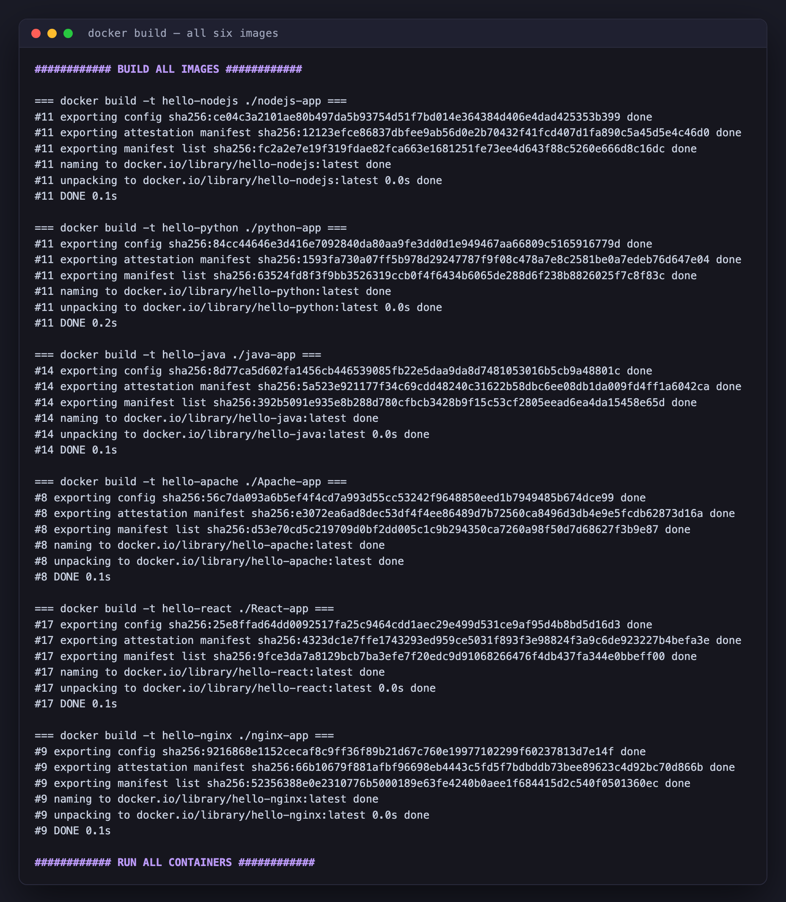

## Run — all six containers

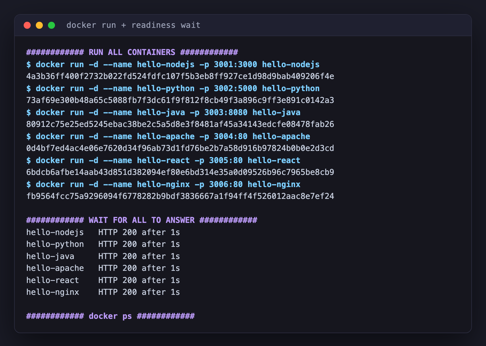

## `docker ps` — all six Up and **healthy**

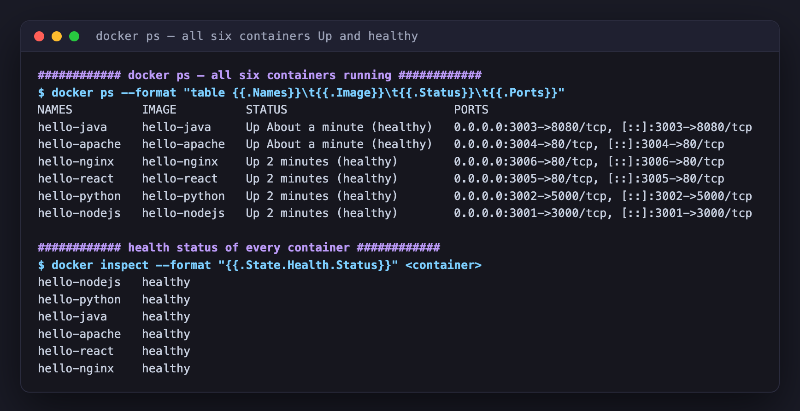

Every container defines a `HEALTHCHECK`, so Docker itself confirms the app is
answering — not merely that the process hasn't crashed.

---

# The applications

## 1. Node.js — port 3001

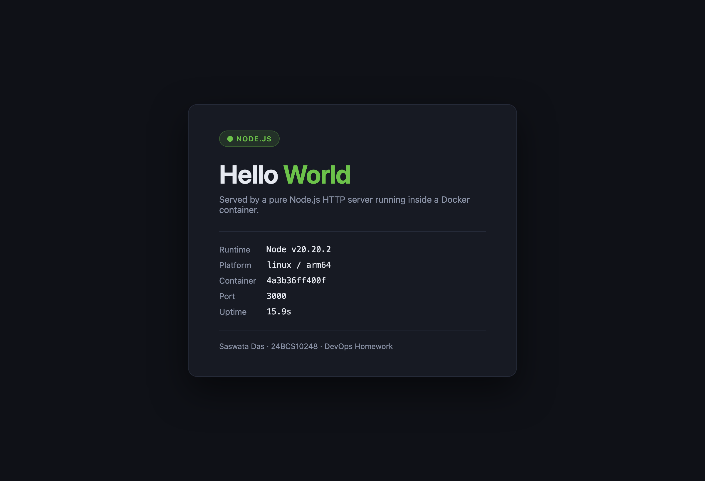

Pure Node.js `http` module, **no dependencies at all** — so `npm install` never has to
reach the network during the build, which makes the image build fast and reproducible.

```dockerfile
FROM node:20-alpine
WORKDIR /app
COPY package.json ./          # manifest first...
RUN npm install --omit=dev    # ...so this layer caches independently of the source
COPY server.js ./
RUN addgroup -S app && adduser -S app -G app && chown -R app:app /app
USER app                      # don't run as root
EXPOSE 3000
CMD ["node", "server.js"]
```

The page reports the live `process.version`, architecture and `os.hostname()` — the
hostname is the container ID, which is how you can tell the page is genuinely being
rendered inside the container.

## 2. Python / Flask — port 3002

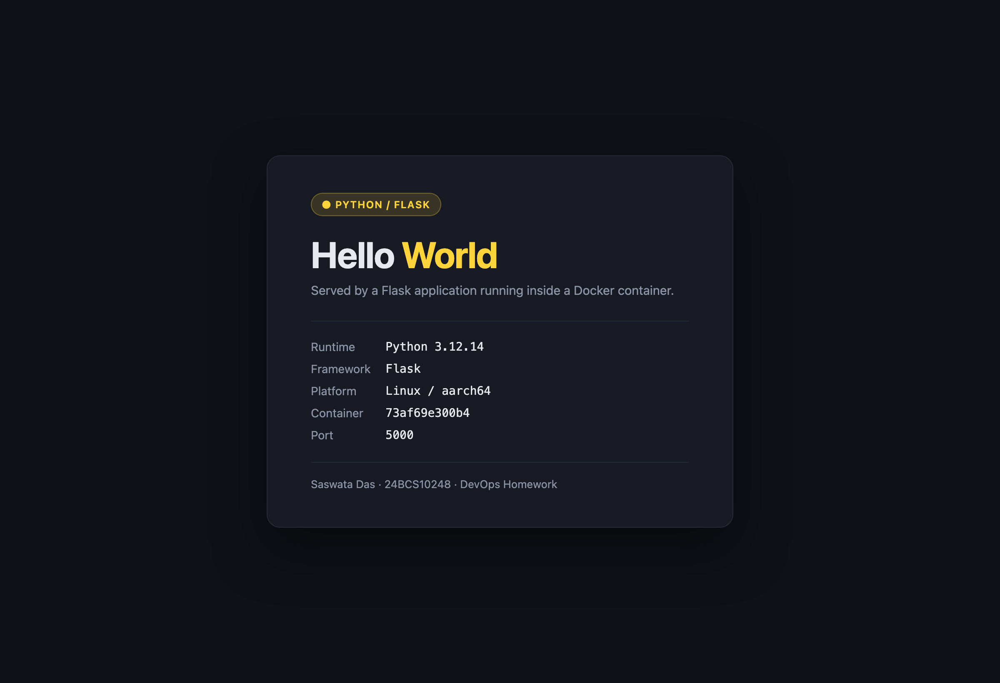

```dockerfile
FROM python:3.12-slim
ENV PYTHONDONTWRITEBYTECODE=1 PYTHONUNBUFFERED=1
COPY requirements.txt .
RUN pip install --no-cache-dir -r requirements.txt
COPY app.py .
USER app
CMD ["python", "app.py"]
```

Two environment variables that matter more than they look:

- **`PYTHONUNBUFFERED=1`** — without it, Python buffers stdout, and `docker logs` shows
  **nothing** until the buffer flushes. This is the single most common "my container has no
  logs" bug in Python images.
- **`PYTHONDONTWRITEBYTECODE=1`** — no `.pyc` files, so no dead weight in the layer.

`app.run(host="0.0.0.0")` is also essential. Flask defaults to `127.0.0.1`, which inside a
container means "reachable only from inside this container" — the published port would
connect to nothing.

## 3. Java — port 3003

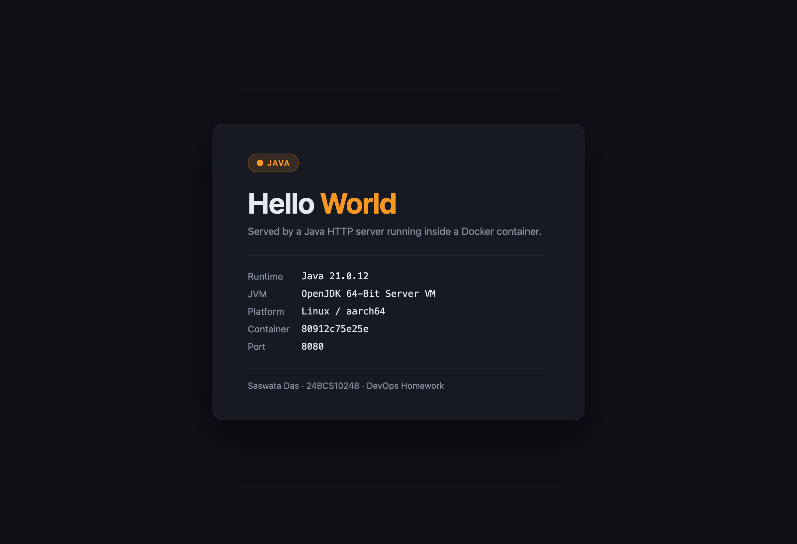

Uses the JDK's built-in `com.sun.net.httpserver` instead of Spring Boot, so there are
**zero external dependencies** and the build never contacts Maven Central. This is a
**multi-stage build**:

```dockerfile
# Stage 1: compile (needs the full JDK)
FROM eclipse-temurin:21-jdk AS build
COPY src/HelloWorld.java .
RUN javac -d classes HelloWorld.java && \
    jar --create --file app.jar --main-class HelloWorld -C classes .

# Stage 2: run (only needs the JRE)
FROM eclipse-temurin:21-jre
COPY --from=build /build/app.jar .
CMD ["java", "-jar", "app.jar"]
```

The compiler and the `.java` source never reach the final image — only `app.jar` and a JRE.
Note the page shows `Container: 80912c75e25e`, matching the container ID in `docker ps`.

## 4. Apache HTTP Server — port 3004

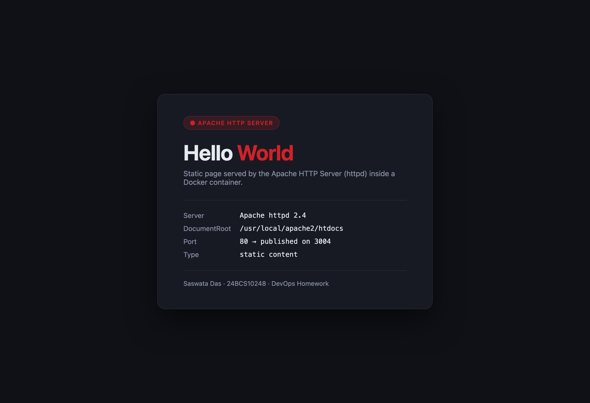

```dockerfile
FROM httpd:2.4
RUN rm -f /usr/local/apache2/htdocs/index.html
COPY index.html /usr/local/apache2/htdocs/
CMD ["httpd-foreground"]
```

> **Gotcha:** Apache's DocumentRoot in the official image is
> **`/usr/local/apache2/htdocs`**, *not* `/var/www/html`. `/var/www/html` is the Debian
> *package* layout; the Docker image builds Apache from source into `/usr/local/apache2`.
> Copying to the wrong path leaves you staring at the default "It works!" page.

> **Second gotcha, and a real one I hit:** my first `HEALTHCHECK` used `curl`, and the
> container reported **`unhealthy`** while serving perfectly. The httpd image ships neither
> `curl` nor `wget`. Rather than install a package just for a healthcheck, the fix uses
> bash's `/dev/tcp` built-in:
> ```dockerfile
> HEALTHCHECK CMD bash -c 'exec 3<>/dev/tcp/127.0.0.1/80 && \
>   printf "GET / HTTP/1.0\r\n\r\n" >&3 && head -1 <&3 | grep -q 200' || exit 1
> ```
> **Lesson: a healthcheck can only use commands that exist inside that image.**

## 5. React — port 3005

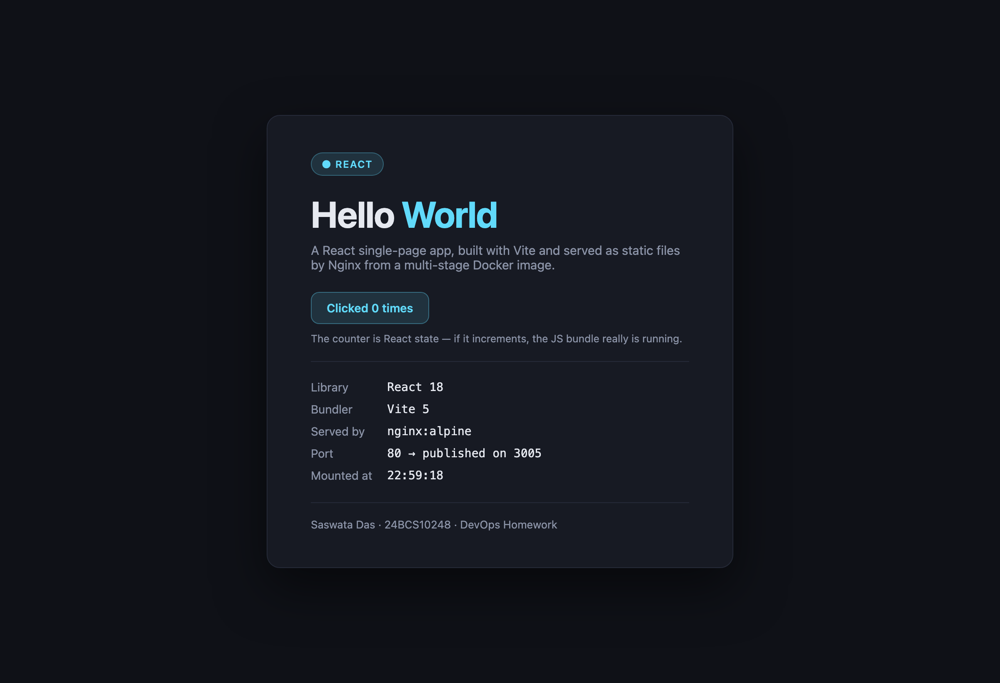

A real React 18 SPA, bundled by Vite, in a **multi-stage build**:

```dockerfile
# Stage 1: build the bundle with Node
FROM node:20-alpine AS build
COPY package.json ./
RUN npm install
COPY vite.config.js index.html ./
COPY src ./src
RUN npm run build              # -> /app/dist

# Stage 2: serve the static files with Nginx
FROM nginx:alpine
COPY --from=build /app/dist /usr/share/nginx/html
COPY nginx.conf /etc/nginx/conf.d/default.conf
```

**Node is not in the final image.** A React app compiles down to plain HTML/CSS/JS, so the
runtime only needs a static file server. That is the difference between **102 MB** and the
~400 MB you'd ship by running `vite preview` in the node image.

The counter button is deliberate: it is React state. If it increments, the JS bundle really
executed. So is `Mounted at 22:59:18` — that value comes from a `useEffect`, so its presence
proves React mounted and hydrated rather than the server returning pre-baked HTML.

The nginx config also includes the **SPA fallback** every React deployment needs:

```nginx
location / { try_files $uri $uri/ /index.html; }
```

Without it, refreshing on any client-side route returns a 404, because that path doesn't
exist as a file on disk.

## 6. Nginx — port 3006

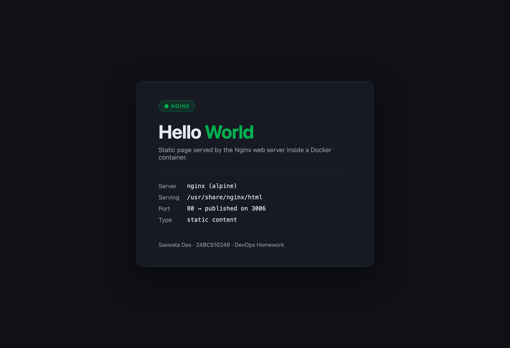

```dockerfile
FROM nginx:alpine
RUN rm -rf /usr/share/nginx/html/*
COPY index.html /usr/share/nginx/html/
COPY nginx.conf /etc/nginx/conf.d/default.conf
CMD ["nginx", "-g", "daemon off;"]
```

**`daemon off;` is not optional.** Nginx normally forks into the background and the parent
exits. In a container, when PID 1 exits the container stops — so a backgrounded nginx means
a container that starts and immediately dies. This is the classic "my container exits
straight away" bug, and the general rule behind it is: **the process in `CMD` must run in
the foreground.**

---

# Verification

## HTTP 200 + "Hello World" on all six

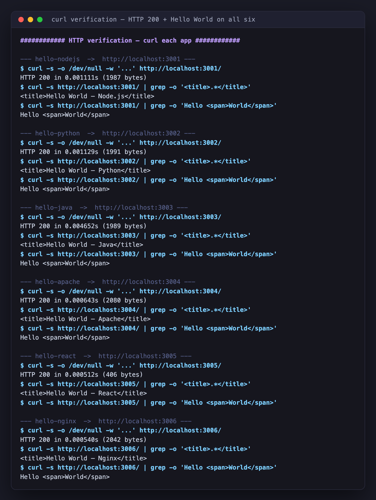

Every app returns `HTTP 200` and contains `Hello <span>World</span>` — except React, whose
response body is only **406 bytes**. That is not a failure; it is what an SPA *is*. The
HTML shell contains just `<div id="root"></div>` and a `<script>` tag. The words "Hello
World" don't exist in the HTML at all — React writes them into the DOM at runtime. **This
is exactly why the browser screenshot matters**: `curl` alone cannot verify a client-rendered
app.

## Container logs

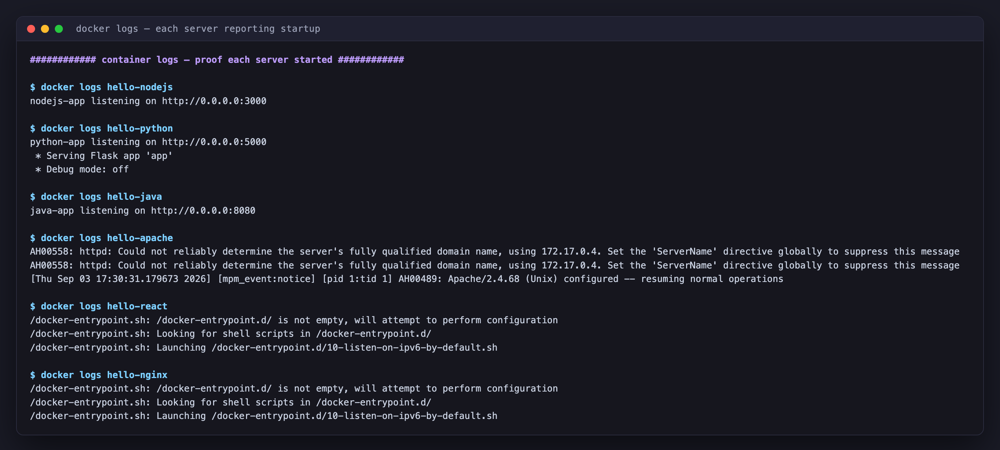

## Image sizes

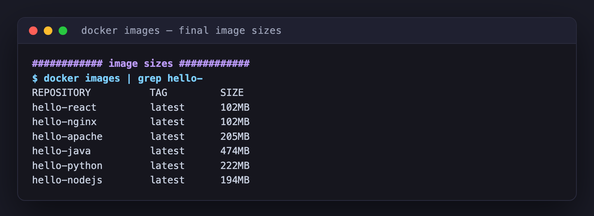

| Image | Size | Why |
|---|---|---|
| `hello-react` | 102 MB | multi-stage: Node dropped, only static files + nginx |
| `hello-nginx` | 102 MB | alpine base |
| `hello-nodejs` | 194 MB | `node:20-alpine` (vs ~1.1 GB for `node:20`) |
| `hello-apache` | 205 MB | Debian-based httpd |
| `hello-python` | 222 MB | `python:3.12-slim` + Flask |
| `hello-java` | 474 MB | JRE is big even after dropping the JDK |

The React app is the clearest illustration of the multi-stage payoff: its *build* needs
Node, npm and hundreds of megabytes of `node_modules`, but its *runtime* needs none of it.

---

## Docker concepts used

| Concept | Where |
|---|---|
| `FROM` / base image choice | alpine vs slim vs full — 194 MB vs 1.1 GB |
| **Layer caching** | `COPY package.json` → `RUN npm install` → `COPY src` |
| **Multi-stage builds** | `java-app`, `React-app` |
| `WORKDIR`, `COPY`, `RUN`, `CMD`, `EXPOSE` | all six Dockerfiles |
| `LABEL` metadata | maintainer + description on each image |
| `ENV` | `PORT`, `PYTHONUNBUFFERED` |
| **`USER`** (drop root) | node, python, java |
| **`HEALTHCHECK`** | all six |
| `.dockerignore` | `React-app` — keeps `node_modules` out of the build context |
| **Port publishing** `-p host:container` | 3001–3006 |
| `docker logs` / `docker inspect` | verification |

### Why `COPY package.json` before `COPY src`

Docker caches each layer and invalidates every layer *after* the first change. If you
`COPY . .` and then `RUN npm install`, editing one line of source busts the cache and
re-downloads every dependency. Copying the manifest first means dependency installation is
only re-run when the dependencies actually change. This one ordering decision is often the
difference between a 3-second rebuild and a 3-minute one.

---

## Files in this folder

```
05-docker-fundamentals/
├── README.md              <- this file
├── build-and-run.sh       <- builds and runs all six
├── verify.sh              <- docker ps / health / curl / logs
├── nodejs-app/    server.js, package.json, Dockerfile
├── python-app/    app.py, requirements.txt, Dockerfile
├── java-app/      src/HelloWorld.java, Dockerfile   (multi-stage)
├── Apache-app/    index.html, Dockerfile
├── React-app/     src/, vite.config.js, nginx.conf, Dockerfile  (multi-stage)
├── nginx-app/     index.html, nginx.conf, Dockerfile
├── outputs/       build-and-run.txt, verification.txt
└── screenshots/   12 PNGs — 6 browser screenshots + 6 terminal captures
```
