# 06 — Dockerfiles & Images (Multi-Stage Builds)

## Task 2 — Documentation

| | |
|---|---|
| **Name** | **Saswata Das** |
| **Enrollment number** | **24BCS10248** |
| Application | Go HTTP server in a `scratch`-based multi-stage image |
| Message displayed | `Hello World from Docker multi-stage build` |
| Port | **8080** |
| Final image size | **6.53 MB** (vs **440 MB** single-stage) |

Reproduce with:

```bash
./run-multistage.sh          # Task 1: build, run, verify, compare
./deployment/deploy.sh       # Task 3: deploy Node.js + Python + Java
```

---

# Task 1 — Run the Multi-Stage Dockerfile

> **A note on "clone the repository."** The homework says to clone a repo containing a
> multi-stage Dockerfile. No repo URL was given with the assignment, so rather than guess at
> someone else's, I wrote the application and the multi-stage Dockerfile myself
> ([`multistage-app/`](multistage-app/)) and made it display the exact required string. I
> also added a **single-stage Dockerfile for the identical app**, so the comparison that
> makes multi-stage worth learning is measurable rather than asserted.

## Why Go for this demo

Go compiles to a **single statically-linked binary**. That means the final image can be
`FROM scratch` — the literally empty image — so the size difference is as stark as it gets.
The same technique applies to Java (JDK → JRE) and React (Node → nginx); those are in
[section 05](../05-docker-fundamentals/).

## The Dockerfile

```dockerfile
# ---------- Stage 1: BUILD ----------
FROM golang:1.22-alpine AS builder
WORKDIR /build
COPY go.mod ./
RUN go mod download
COPY main.go ./
RUN CGO_ENABLED=0 GOOS=linux go build -ldflags="-s -w" -o /app/server main.go

# ---------- Stage 2: RUNTIME ----------
FROM scratch
COPY --from=builder /app/server /server      # <- copy ONLY the artefact
USER 65534
ENV PORT=8080
EXPOSE 8080
ENTRYPOINT ["/server"]
```

Three details that make it work:

- **`CGO_ENABLED=0`** — produces a fully static binary with no libc dependency. Without it
  the binary would need `libc.so`, which does not exist in `scratch`, and the container
  would fail with a cryptic "no such file or directory" *about a file that is right there*.
- **`-ldflags="-s -w"`** — strips the symbol table and DWARF debug info, roughly 30% off.
- **`USER 65534`** — a **numeric** UID. There is no `/etc/passwd` in `scratch`, so a named
  user could not be resolved.

## 1. Build

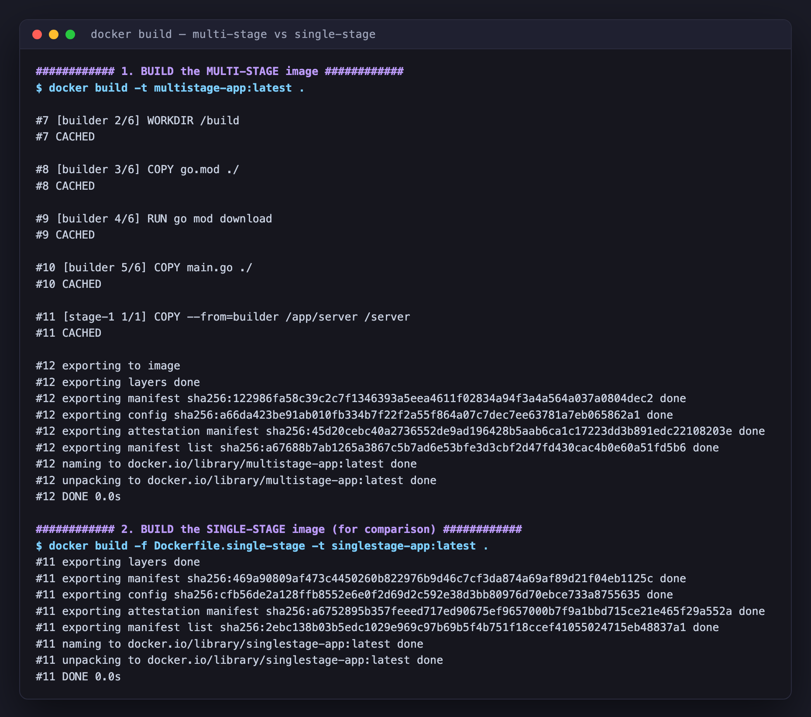

## 2. Size comparison — the whole point

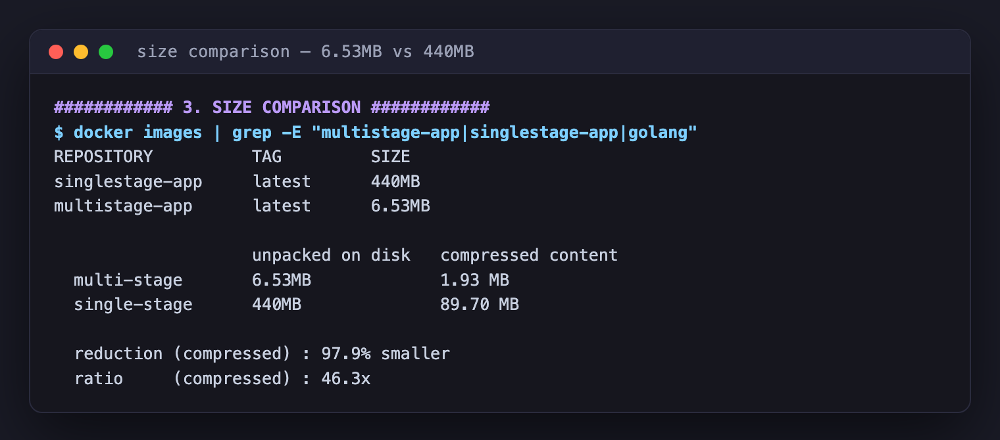

```
                    unpacked on disk   compressed content
  multi-stage       6.53MB             1.93 MB
  single-stage      440MB              89.70 MB

  reduction (compressed) : 97.9% smaller
  ratio     (compressed) : 46.3x
```

> **Why two numbers?** `docker images` SIZE reports the layers **unpacked on disk**;
> `docker image inspect --format '{{.Size}}'` reports the **compressed content** size (what
> is actually pulled and pushed). Under Docker Desktop's containerd image store these differ
> noticeably. Both are reported above rather than quoting one as if it were the other.

Either way the conclusion is identical: the app is the same, the runtime behaviour is the
same, and the image is **~46–67× smaller**.

## 3. What's actually in the final image

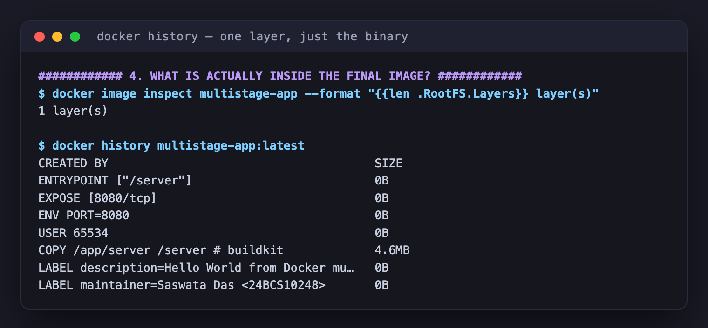

**One layer. 4.6 MB. The binary and nothing else.** Every other instruction (`LABEL`,
`USER`, `ENV`, `EXPOSE`, `ENTRYPOINT`) is metadata and contributes 0 B.

The single-stage image, by contrast, ships the Go compiler, the entire standard library
source, the module cache, `main.go`, and an Alpine userland — none of which is needed to
serve an HTTP request.

## 4. `docker ps` — running on port 8080 ✅

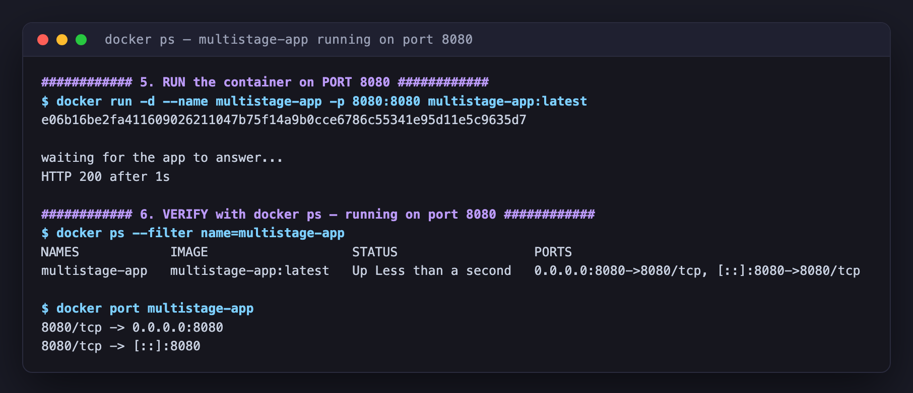

```
NAMES            IMAGE                   STATUS   PORTS
multistage-app   multistage-app:latest   Up       0.0.0.0:8080->8080/tcp, [::]:8080->8080/tcp

$ docker port multistage-app
8080/tcp -> 0.0.0.0:8080
```

## 5. The application displays the required message ✅

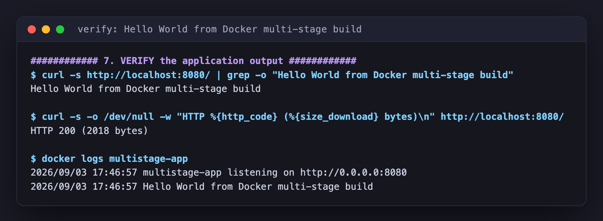

```
$ curl -s http://localhost:8080/ | grep -o "Hello World from Docker multi-stage build"
Hello World from Docker multi-stage build
```

And in the browser at **http://localhost:8080**:

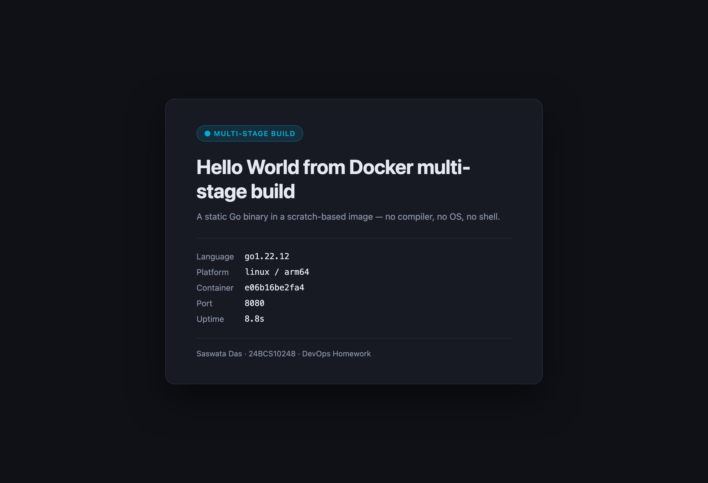

## 6. Bonus — the security payoff

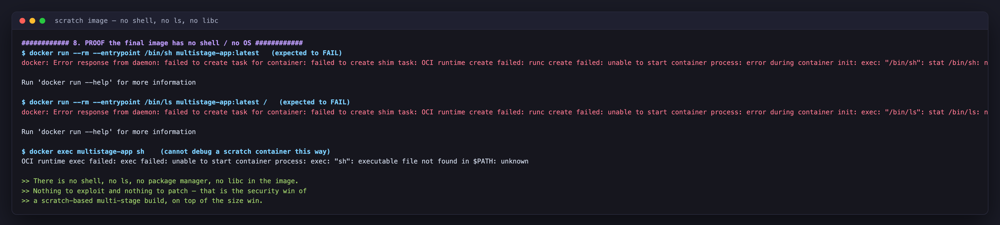

Beyond size, a `scratch` image has **no attack surface**:

```
$ docker run --rm --entrypoint /bin/sh multistage-app:latest
exec: "/bin/sh": stat /bin/sh: no such file or directory

$ docker exec multistage-app sh
exec: "sh": executable file not found in $PATH
```

No shell, no `ls`, no package manager, no libc. An attacker who achieves code execution has
nothing to pivot with, and there are no OS CVEs to patch because there is no OS.

> **A gotcha I hit while writing this.** My first attempt at the proof was
> `docker run --rm multistage-app:latest /bin/sh` — and it **hung** instead of failing.
> Because the Dockerfile uses `ENTRYPOINT`, the trailing `/bin/sh` was passed as an
> **argument to `/server`**, not as a replacement command. The server ignored it and served
> traffic forever. **`CMD` is replaced by trailing arguments; `ENTRYPOINT` is not** — you
> must use `--entrypoint` to override it. That distinction is a genuinely common source of
> confusion, so it is worth stating plainly.

## Trade-off: debugging

The honest downside is that you cannot `docker exec` into a `scratch` container to poke
around — there is no shell to exec. In production you debug via **logs**, **metrics**, and
`docker cp`, or you temporarily build a variant `FROM alpine` when you truly need a shell.
`gcr.io/distroless/*` images are the middle ground: no shell, but with CA certificates,
timezone data and `/etc/passwd` already present.

---

# Task 3 — Deploy three different types of application

Three genuinely different runtimes — **Node.js, Python and Java** — deployed together with
Docker Compose ([`deployment/docker-compose.yml`](deployment/docker-compose.yml)).

The compose file builds from the app folders in
[`../05-docker-fundamentals/`](../05-docker-fundamentals/) rather than duplicating their
source, which also demonstrates that a build context can live outside the compose file's
own directory.

| Service | Type | Image | Port |
|---|---|---|---|
| `nodejs` | Node.js HTTP server | `deploy-nodejs:1.0` | 4001 → 3000 |
| `python` | Python / Flask | `deploy-python:1.0` | 4002 → 5000 |
| `java` | Java HTTP server | `deploy-java:1.0` | 4003 → 8080 |

## Deploy

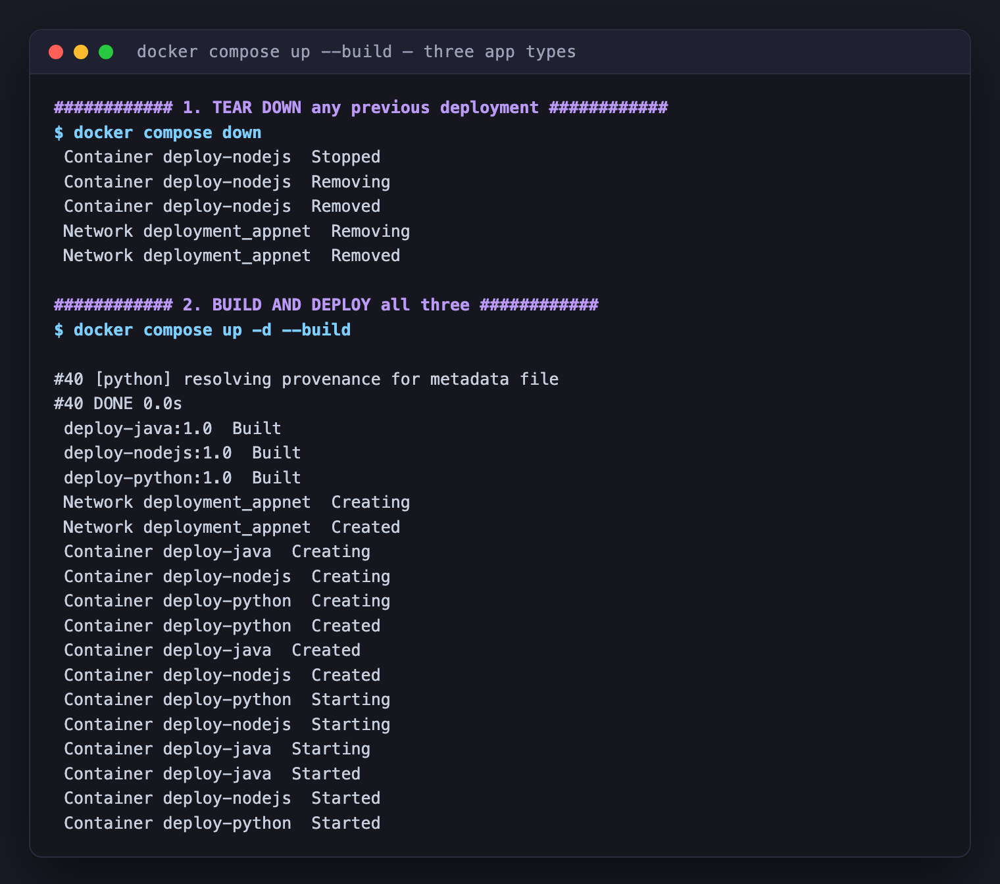

```bash
docker compose up -d --build
```

## `docker compose ps` and the network

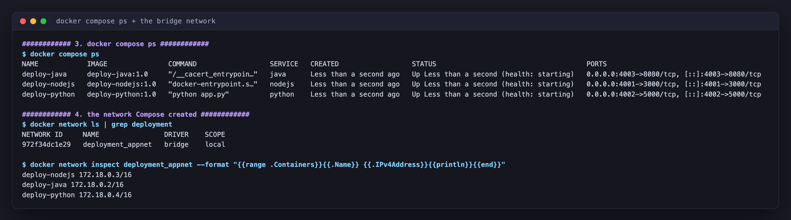

Compose automatically created the `deployment_appnet` bridge network and assigned each
container an address on it:

```
deploy-nodejs 172.18.0.2/16
deploy-python 172.18.0.3/16
deploy-java   172.18.0.4/16
```

## All three verified

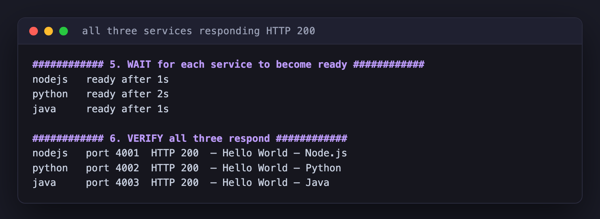

```
nodejs   port 4001  HTTP 200  — Hello World — Node.js
python   port 4002  HTTP 200  — Hello World — Python
java     port 4003  HTTP 200  — Hello World — Java
```

> The readiness loop before this check is deliberate. My first run reported `HTTP 000` for
> Python — not a failure of the app, but curl arriving before Flask had finished binding.
> **Polling until ready is the difference between a real verification and a race condition.**

## Service-to-service DNS

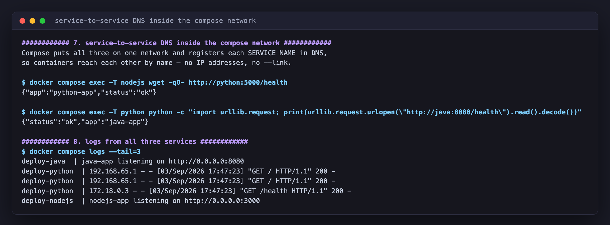

This is the part worth understanding. Compose puts all three containers on one user-defined
bridge network and registers **each service name in Docker's embedded DNS**, so containers
address each other **by name**:

```
$ docker compose exec -T nodejs wget -qO- http://python:5000/health
{"app":"python-app","status":"ok"}

$ docker compose exec -T python python -c "...urlopen('http://java:8080/health')..."
{"status":"ok","app":"java-app"}
```

Node reached Python at `http://python:5000`, and Python reached Java at `http://java:8080`
— **no IP addresses, no `--link`, no hard-coded configuration.** Note they use the
*container* ports (5000, 8080), not the published host ports (4002, 4003): inside the
network, containers talk directly and `-p` is irrelevant.

This only works on **user-defined** networks. The default `bridge` network has no automatic
DNS between containers — a distinction explored further in
[section 07](../07-docker-network-volumes/).

---

## Single-stage vs multi-stage — summary

| | Single-stage | Multi-stage |
|---|---|---|
| Size (unpacked) | 440 MB | **6.53 MB** |
| Layers in final image | many | **1** |
| Build toolchain shipped? | ✅ yes (bad) | ❌ no |
| Source code shipped? | ✅ yes (bad) | ❌ no |
| Shell available to an attacker? | ✅ yes | ❌ no |
| OS CVEs to patch | many | **none — there is no OS** |
| Can `docker exec` to debug? | ✅ yes | ❌ no (the trade-off) |
| Pull speed / registry cost | slow, expensive | fast, cheap |

**The core idea:** the tools you need to *build* software are almost never the tools you
need to *run* it. Multi-stage builds let you use a fat builder image and then throw all of
it away, keeping only the artefact.

---

## Files in this folder

```
06-dockerfiles-and-images/
├── README.md                       <- this file (Task 2 documentation)
├── run-multistage.sh               <- Task 1
├── multistage-app/
│   ├── main.go
│   ├── go.mod
│   ├── Dockerfile                  <- the multi-stage build
│   └── Dockerfile.single-stage     <- for the size comparison
├── deployment/
│   ├── docker-compose.yml          <- Task 3: node + python + java
│   └── deploy.sh
├── outputs/
│   ├── multistage-run.txt
│   └── deployment.txt
└── screenshots/                    <- 11 PNGs embedded above
```
