# 07 — Docker Networking & Volumes

**Saswata Das — 24BCS10248**

All four tasks were executed for real. Scripts in [`scripts/`](scripts/), full logs in
[`outputs/`](outputs/).

```bash
./scripts/task1-networking.sh     # 3 containers, 3 networks, backend on 2
./scripts/task2-host-network.sh   # Apache2 on the host network, port 80
./scripts/task3-bind-mount.sh     # live-editing a bind-mounted site
./scripts/task4-overlay.sh        # a REAL overlay network via swarm mode
```

---

# Task 1 — Docker Container Networking

## Topology

Three containers, three networks, with the backend deliberately bridging two tiers:

```
        frontend-net                    backend-net                isolated-net
   ┌─────────────────────┐        ┌──────────────────────┐        ┌────────────┐
   │  frontend (nginx)   │        │  database (mysql:8)  │        │ (no        │
   │        ▲            │        │        ▲             │        │  members)  │
   │        │            │        │        │             │        └────────────┘
   │        └──── backend (alpine toolbox) ┘             │
   └─────────────────────┘        └──────────────────────┘
              172.19.0.0/16                172.20.0.0/16

   backend is on BOTH networks.  frontend and database share NONE.
```

## Creating the networks and containers

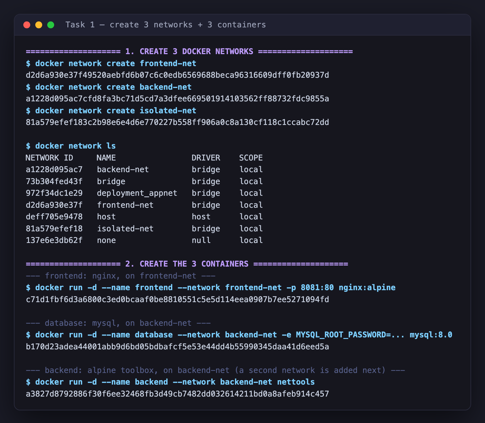

```bash
docker network create frontend-net
docker network create backend-net
docker network create isolated-net

docker run -d --name frontend --network frontend-net -p 8081:80 nginx:alpine
docker run -d --name database --network backend-net  -e MYSQL_ROOT_PASSWORD=... mysql:8.0
docker run -d --name backend  --network backend-net  nettools
```

`nettools` is a small Alpine image with `curl`, `dig`, `ping`, `nc` and a MySQL client
([`lab/Dockerfile`](lab/Dockerfile)) — so the backend can actually **test** connectivity
rather than merely exist.

## Adding the backend to a second network

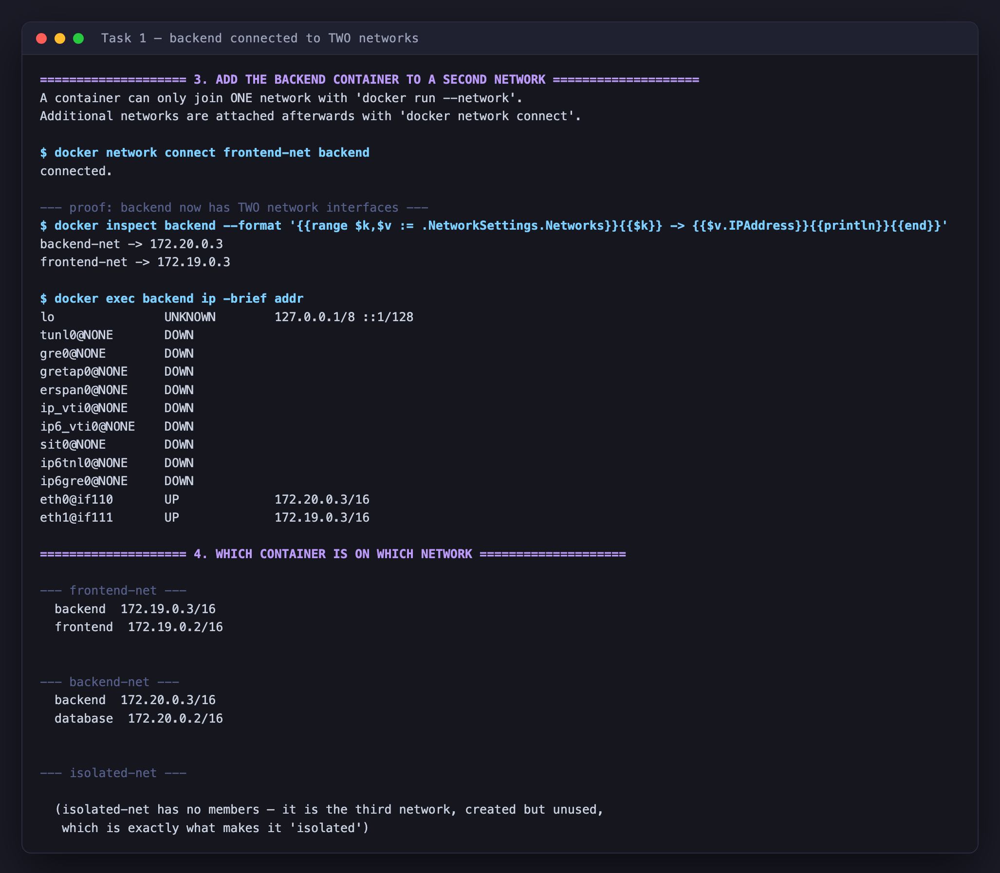

**`docker run --network` accepts only one network.** Additional networks are attached
afterwards:

```bash
docker network connect frontend-net backend
```

The proof is that `backend` now has two interfaces with an address on each:

```
backend-net  -> 172.20.0.3
frontend-net -> 172.19.0.3

eth0  UP  172.20.0.3/16
eth1  UP  172.19.0.3/16
```

## Connectivity tests

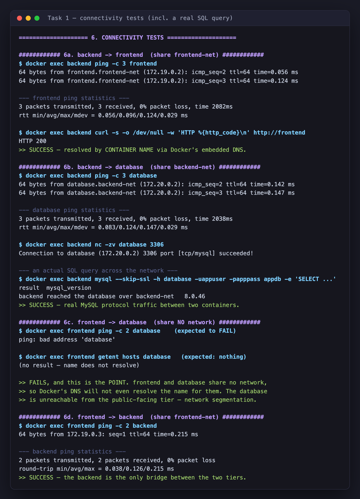

**backend → frontend** (both on `frontend-net`): ping succeeds and resolves as
`frontend.frontend-net`, `curl http://frontend` returns HTTP 200.

**backend → database** (both on `backend-net`): ping succeeds, `nc -zv database 3306`
reports `succeeded!`, and a real SQL query runs across the network:

```
result                                          mysql_version
backend reached the database over backend-net   8.0.46
```

**frontend → database** (share no network): **blocked**, and note *how* it fails:

```
$ docker exec frontend ping -c 2 database
ping: bad address 'database'
```

It doesn't time out — **the name doesn't even resolve.** Docker's embedded DNS only
answers for containers that share a network with the asker. Isolation happens at the
name-resolution layer before a packet is ever sent.

## Result

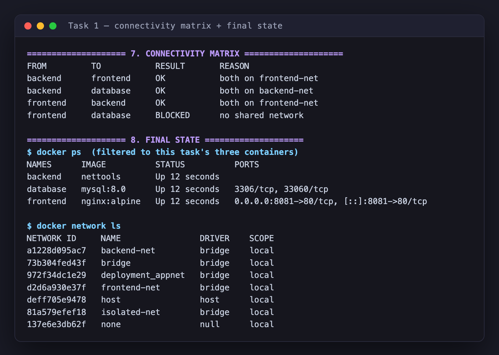

| From | To | Result | Reason |
|---|---|---|---|
| backend | frontend | ✅ OK | both on `frontend-net` |
| backend | database | ✅ OK | both on `backend-net` |
| frontend | backend | ✅ OK | both on `frontend-net` |
| **frontend** | **database** | ❌ **BLOCKED** | **no shared network** |

This is the standard **three-tier segmentation** pattern: the internet-facing tier can
never reach the database directly. Compromise the frontend and you still cannot touch the
data — you would have to get through the backend first.

### Two things worth remembering

**Container-name DNS only works on user-defined networks.** The default `bridge` network
has no automatic DNS between containers; you would be stuck with IP addresses or the
deprecated `--link`. Always create a network.

**A container's network list is not fixed at creation.** `docker network connect` and
`disconnect` work on running containers, with no restart.

### MySQL auth note

MySQL 8 defaults to the `caching_sha2_password` plugin. Alpine's `mysql` binary is
actually **MariaDB's** client, which has no such plugin and fails with
`Plugin caching_sha2_password could not be loaded`. The lab therefore starts MySQL with
`--default-authentication-plugin=mysql_native_password`. In production you would keep
`caching_sha2_password` and use the official MySQL client instead. (There was also a
`TLS/SSL error: self-signed certificate` before adding `--skip-ssl` — MySQL 8 generates a
self-signed cert on first start.)

---

# Task 2 — Host Network

## Pull Apache2 and run it on the host network

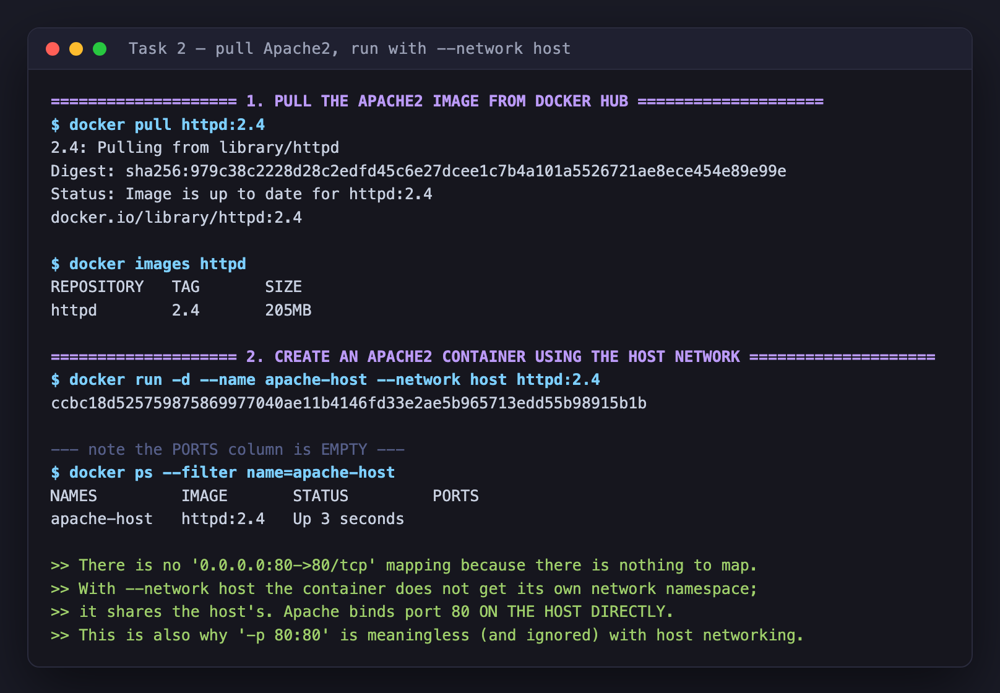

```bash
docker pull httpd:2.4
docker run -d --name apache-host --network host httpd:2.4
```

The first thing to notice in `docker ps` is that the **PORTS column is empty**:

```
NAMES         IMAGE       STATUS   PORTS
apache-host   httpd:2.4   Up       <- nothing here
```

There is no `0.0.0.0:80->80/tcp` mapping **because there is nothing to map**. With
`--network host` the container does not get its own network namespace — it shares the
host's, so Apache binds port 80 on the host directly. `-p 80:80` would be meaningless
(and is ignored).

## Proof: it really is the host's namespace

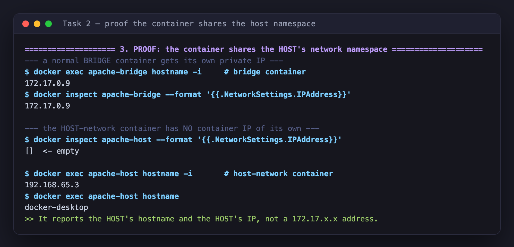

| | bridge container | host-network container |
|---|---|---|
| `docker inspect ... .IPAddress` | `172.17.0.9` | *(empty)* |
| `hostname -i` | `172.17.0.9` | `192.168.65.3` — the **host's** IP |
| `hostname` | random container ID | `docker-desktop` — the **host's** name |

## Accessing the Apache website on port 80

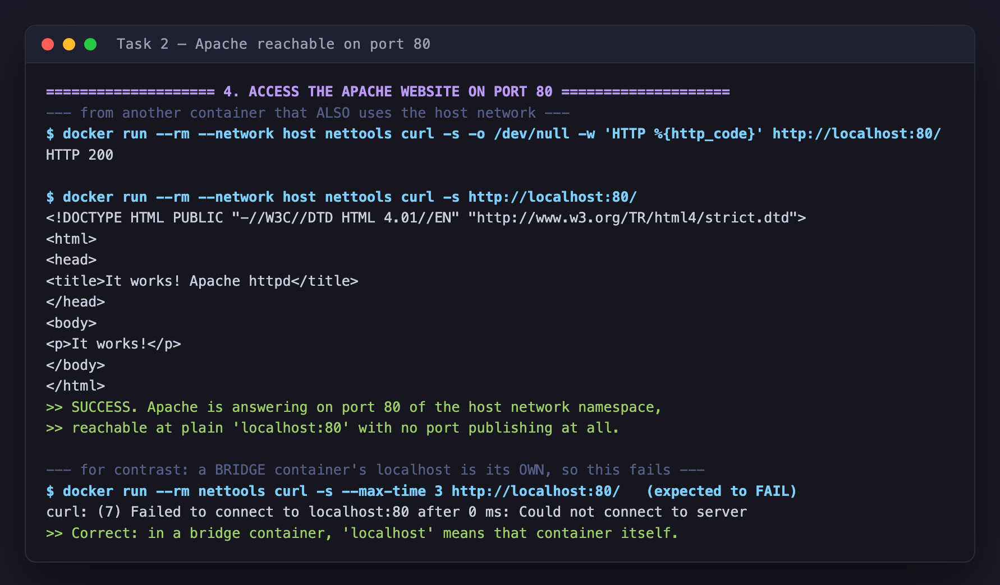

```
$ docker run --rm --network host nettools curl -s http://localhost:80/
<html><head><title>It works! Apache httpd</title></head>
<body><p>It works!</p></body></html>
```

**HTTP 200 on plain `localhost:80`, with no port publishing anywhere.** A second container
on the host network sees Apache at `localhost` because they share one namespace.

The contrast confirms it:

```
$ docker run --rm nettools curl http://localhost:80/     # a BRIDGE container
curl: (7) Failed to connect to localhost:80
```

In a bridge container, `localhost` means *that container*, so there is nothing on port 80.

## ⚠️ The macOS caveat — stated honestly

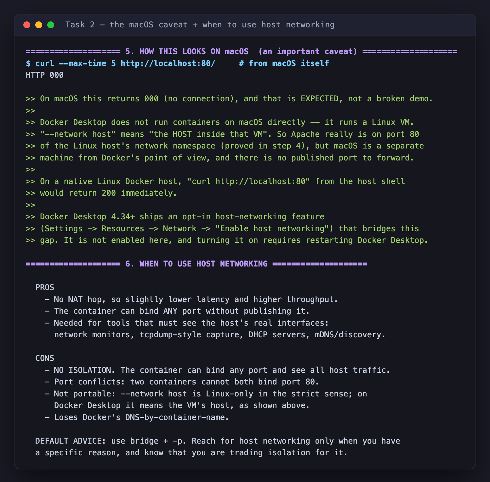

Running `curl http://localhost:80/` **from macOS itself returns `000`** (no connection),
and that is expected rather than a broken demo:

> Docker Desktop does not run containers on macOS directly — it runs a **Linux VM**.
> `--network host` means *the host inside that VM*. Apache genuinely is on port 80 of the
> Linux host's network namespace (proved above), but macOS is a separate machine from
> Docker's point of view and there is no published port to forward.
>
> **On a native Linux Docker host, `curl http://localhost:80` from the host shell returns
> 200 immediately.**
>
> Docker Desktop 4.34+ ships an opt-in host-networking feature
> (*Settings → Resources → Network → Enable host networking*) that bridges this gap. It is
> not enabled here, and turning it on requires restarting Docker Desktop.

## When to use host networking

| Pros | Cons |
|---|---|
| No NAT hop — lower latency, higher throughput | **No isolation** — sees all host traffic, can bind any port |
| Bind any port without publishing | Port conflicts: two containers can't both take :80 |
| Required for network monitors, packet capture, DHCP, mDNS/discovery | Not portable (Linux-only in the strict sense) |
| | Loses Docker's container-name DNS |

**Default to bridge + `-p`.** Reach for host networking only with a specific reason, and
know you are trading isolation for it.

---

# Task 3 — Bind Mount

## Folder, `index.html`, and the mount

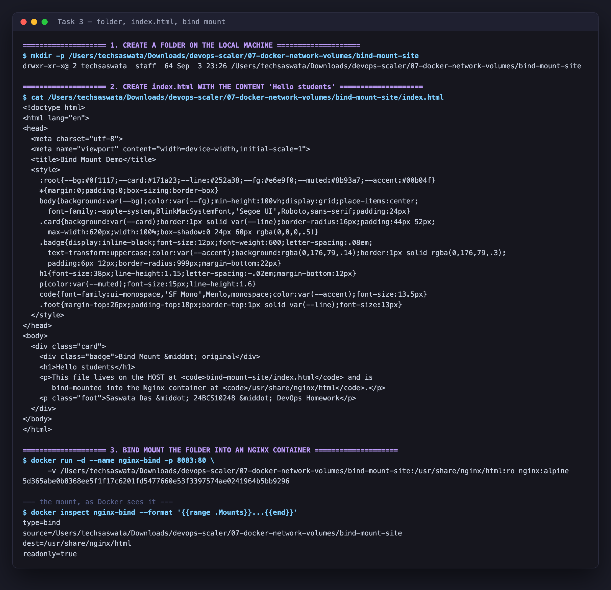

```bash
mkdir -p bind-mount-site
# index.html containing "Hello students"
docker run -d --name nginx-bind -p 8083:80 \
  -v "$PWD/bind-mount-site":/usr/share/nginx/html:ro nginx:alpine
```

Docker reports the mount as:

```
type=bind
source=/Users/.../07-docker-network-volumes/bind-mount-site
dest=/usr/share/nginx/html
readonly=true
```

## Accessing the site — "Hello students" ✅

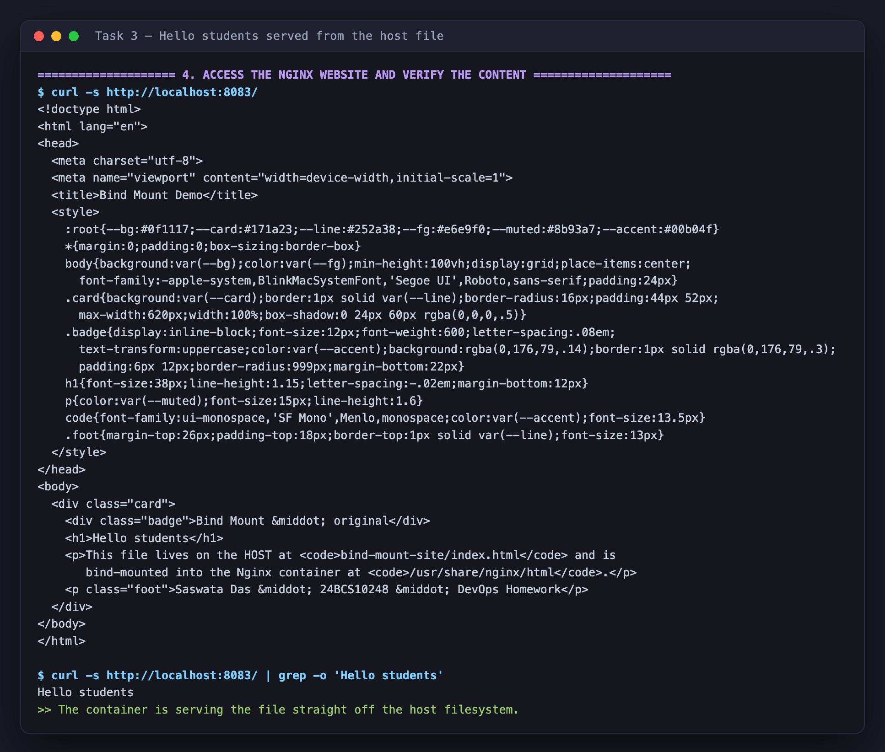

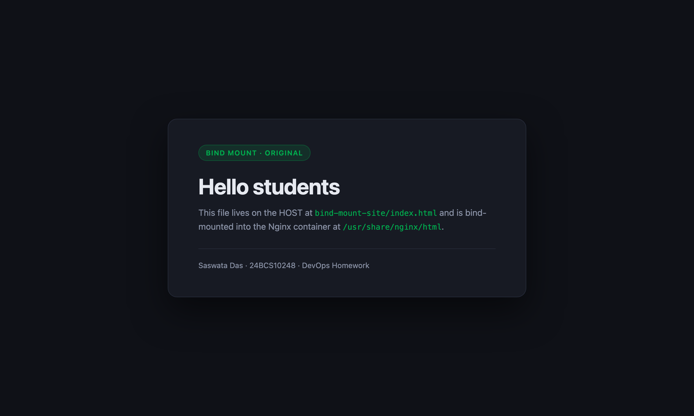

## Editing the file — reflected with **no restart** ✅

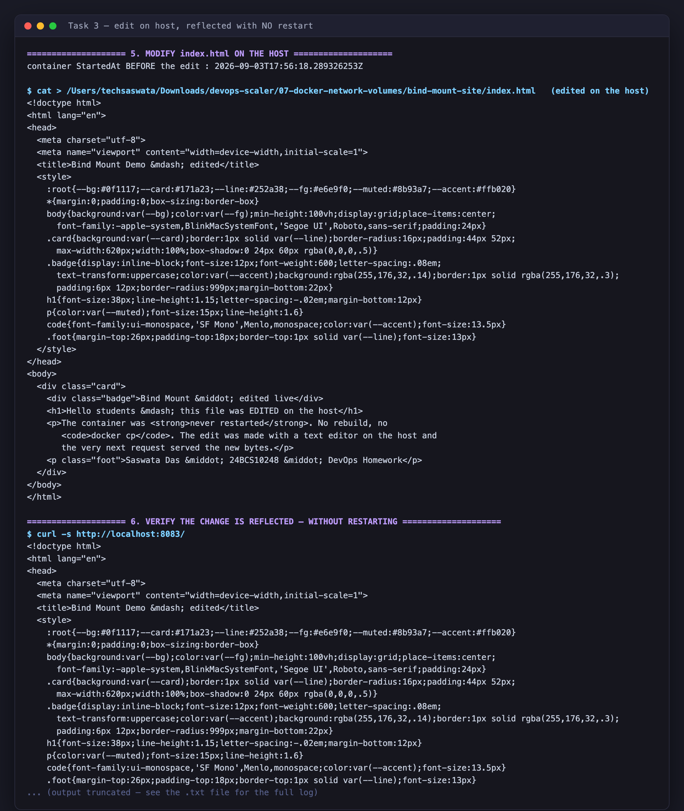

The file was edited on the host and the very next request served the new content. The
proof that nothing restarted is the container's `StartedAt` timestamp, captured before and
after:

```
StartedAt BEFORE the edit : 2026-09-03T17:53:54.336799839Z
StartedAt AFTER  the edit : 2026-09-03T17:53:54.336799839Z
>> IDENTICAL — the container was NEVER restarted.
```


## New files appear too, and `:ro` blocks writes

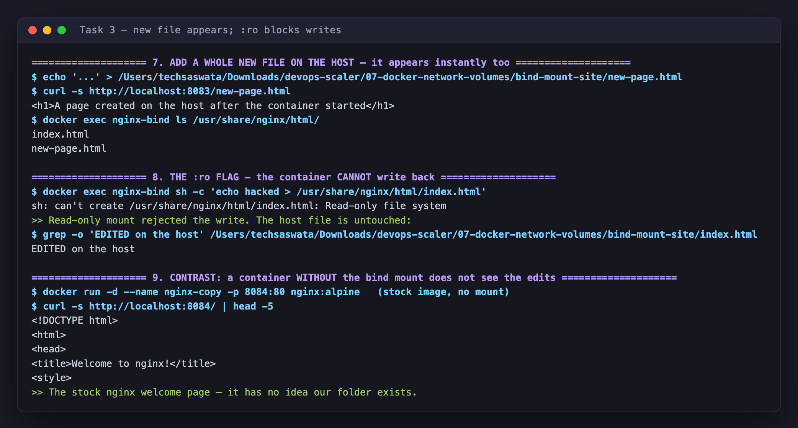

Creating `new-page.html` on the host makes it immediately servable and immediately visible
to `docker exec nginx-bind ls`. And because the mount is `:ro`, the container **cannot
write back** — a write attempt is rejected and the host file is untouched.

> **A small real-world detail I hit:** my first version curled the page *immediately* after
> writing it and got a **truncated** page. Because a bind mount is live with no copy step,
> a request can catch a file mid-write. Adding a one-second settle fixed it. It is a
> genuine (if rarely mentioned) consequence of there being no synchronisation.

## Why the live update works

A bind mount is **not a copy**. The kernel mounts the host directory into the container's
mount namespace, so both paths refer to the **same inodes on the same filesystem**. There
is nothing to synchronise — reading the file in the container *is* reading the host's file.

## Bind mount vs named volume

| | bind mount `-v /host/path:/ctr/path` | named volume `-v mydata:/ctr/path` |
|---|---|---|
| Location | a path **you** choose on the host | Docker-managed storage area |
| Host can edit with an editor | ✅ yes | ✗ awkward |
| Portable across machines | ✗ depends on the host path | ✅ Docker creates it anywhere |
| Best for | **development** — live reload, config, static content | **production data** — DB files, uploads |
| Backup | ordinary file copy | `docker volume` commands |
| If the path doesn't exist | created as an **empty directory** | created as a proper volume |

> **The classic bind-mount bug:** if you typo the host path, Docker silently creates an
> **empty directory** instead of erroring — and you get a 404 or the default welcome page
> with no clue why. If a bind mount "isn't working", check the host path first.

---

# Task 4 — Overlay Networks

The task asks to *research* overlay networks. Reading about them is much less convincing
than running one, so this section **initialises a real swarm and demonstrates a working
overlay network** — then explains the mechanism.

## Why a swarm is needed at all

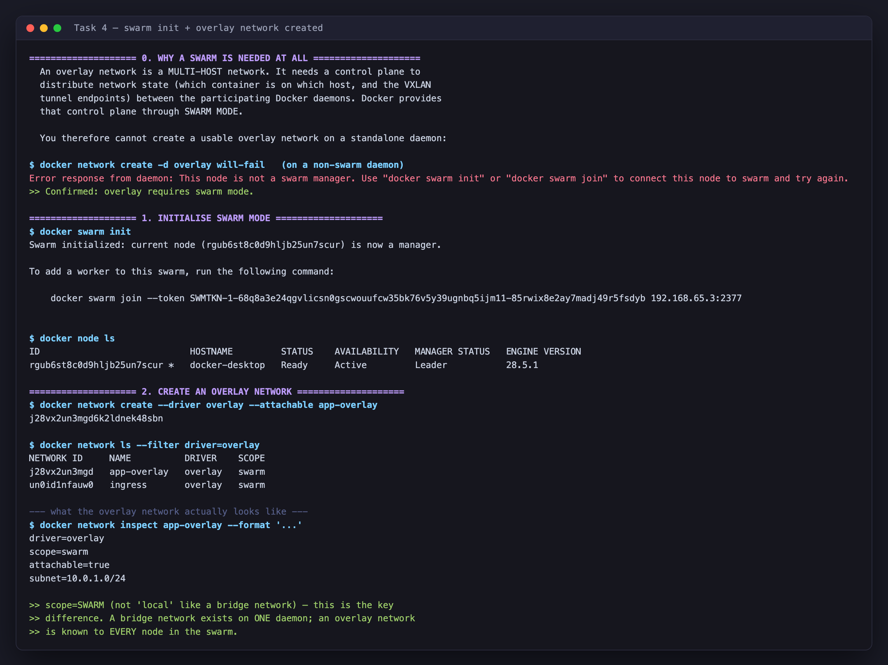

An overlay network is a **multi-host** network. It needs a control plane to distribute
network state between Docker daemons, and Docker provides that through **swarm mode**. On a
standalone daemon, creating one simply fails — which the script demonstrates before
initialising the swarm.

```bash
docker swarm init
docker network create --driver overlay --attachable app-overlay
```

```
driver=overlay
scope=swarm          <- NOT "local" like a bridge network
attachable=true
subnet=10.0.1.0/24
```

**`scope=swarm` is the key difference.** A bridge network exists on one daemon; an overlay
network is known to *every node in the swarm*.

## Ingress and services on the overlay

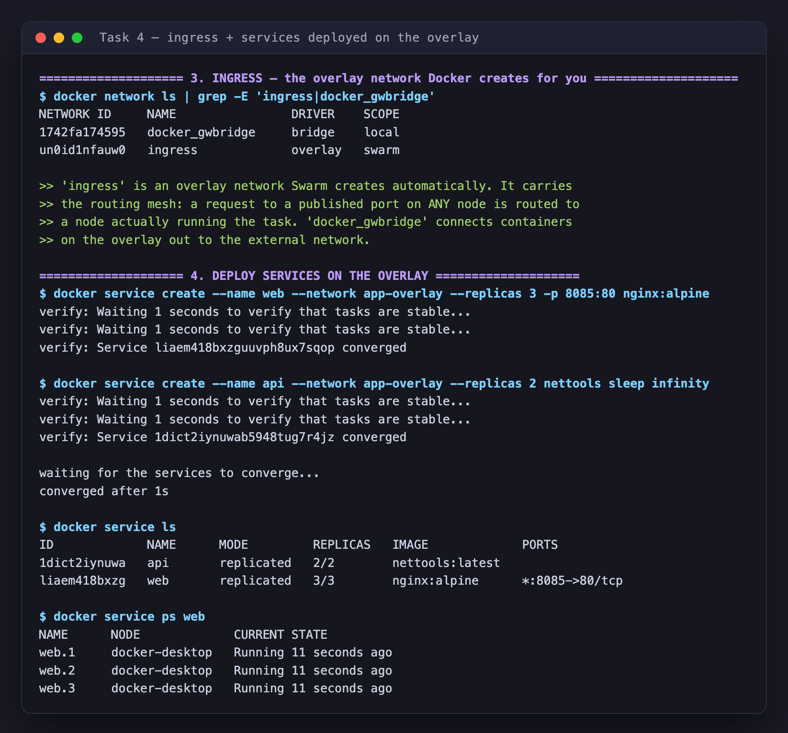

Swarm creates two networks for you:

- **`ingress`** (overlay) — carries the **routing mesh**: a request to a published port on
  *any* node is routed to a node actually running a task.
- **`docker_gwbridge`** (bridge) — connects overlay containers out to the external network.

```bash
docker service create --name web --network app-overlay --replicas 3 -p 8085:80 nginx:alpine
docker service create --name api --network app-overlay --replicas 2 nettools sleep infinity
```

```
ID             NAME   MODE         REPLICAS   IMAGE           PORTS
1dict2iynuwa   api    replicated   2/2        nettools        
liaem418bxzg   web    replicated   3/3        nginx:alpine    *:8085->80/tcp
```

## Service discovery across the overlay

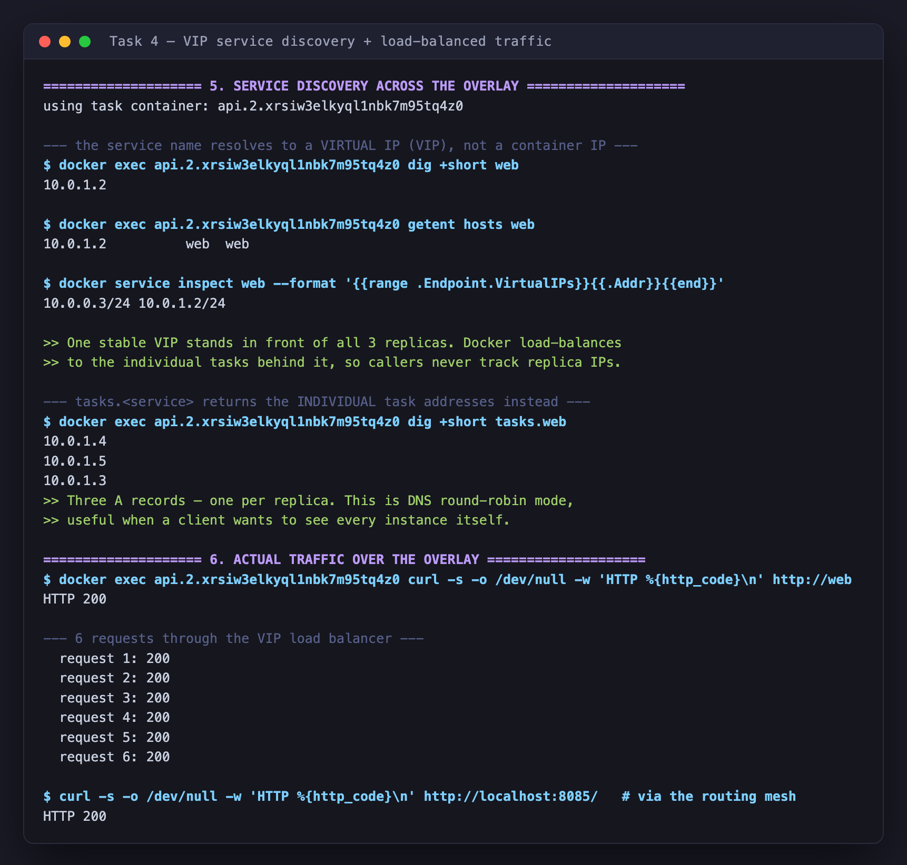

This is the part worth understanding:

```
$ dig +short web            ->  10.0.1.2          # ONE Virtual IP (VIP)
$ dig +short tasks.web      ->  10.0.1.4
                                10.0.1.5          # THREE individual task IPs
                                10.0.1.3
```

- **`web`** resolves to a single stable **VIP**. Docker load-balances traffic behind it, so
  callers never track replica addresses — replicas can come and go and the VIP is unchanged.
- **`tasks.web`** returns an A record **per replica** (DNS round-robin mode), for clients
  that want to see every instance themselves.

Six requests through the VIP all returned `200`, and `curl http://localhost:8085/` returned
`200` through the routing mesh.

## How an overlay network works across multiple hosts

**The problem:** containers on Host A get IPs from Host A's bridge (`172.17.0.0/16`).
Containers on Host B get IPs from *the same range*. The addresses collide and neither host
can route to the other's containers.

**The solution — VXLAN encapsulation:** every container gets an address from **one logical
subnet** (here `10.0.1.0/24`) that spans all hosts. When a container on Host A sends a
packet to a container on Host B, Docker:

1. takes the original layer-2 Ethernet frame,
2. **wraps it in a UDP packet** (VXLAN, port **4789**),
3. sends that UDP packet over the ordinary physical network to Host B,
4. Host B **unwraps** it and delivers the original frame to the container.

```
┌──────────────── Host A ─────────────────┐   ┌──────────────── Host B ─────────────────┐
│  container  10.0.1.5                    │   │  container  10.0.1.9                    │
│      │                                  │   │      ▲                                  │
│   vxlan0 ── encapsulate in UDP/4789 ───────────▶ vxlan0 ── decapsulate                 │
│      │                                  │   │      │                                  │
│   eth0 192.168.1.10 ═══ physical network ═══ eth0 192.168.1.11                         │
└─────────────────────────────────────────┘   └─────────────────────────────────────────┘
```

The containers believe they are on one flat LAN. The physical network only ever sees
ordinary UDP between two hosts — **it needs no special configuration**, which is precisely
why overlays work across data centres and clouds.

**Control plane:** swarm managers keep a distributed store (gossip protocol) mapping every
container's overlay IP to the host it lives on. Control traffic is encrypted by default;
**data traffic is not**, unless you pass `--opt encrypted` (which enables IPsec, at a CPU
cost).

**Ports that must be open between hosts:**

| Port | Purpose |
|---|---|
| `2377/tcp` | cluster management (managers only) |
| `7946/tcp` + `7946/udp` | node-to-node control / gossip |
| `4789/udp` | **VXLAN data plane** |

> A blocked `4789/udp` is the classic cause of *"the service starts but the containers
> can't talk to each other"* — the control plane is healthy, so everything looks fine,
> but no data ever crosses.

## Use cases

- **Multi-host container clusters** — the reason it exists.
- **Swarm services** that must reach each other by name regardless of which node they land on.
- **Migrating a Compose app to multiple machines** without rewriting service addresses.
- **Cross-datacentre / cross-cloud** connectivity over any routable IP network.

## Choosing a network driver

| Driver | Scope | Use when |
|---|---|---|
| `bridge` | single host | the default; containers on one daemon |
| `host` | single host | no isolation needed; see Task 2 |
| **`overlay`** | **multi-host** | swarm services, or `--attachable` containers across hosts |
| `macvlan` | single host | the container needs a real MAC/IP on the physical LAN |
| `none` | — | no networking at all |

**In practice:** Kubernetes solves the same problem with CNI plugins — Flannel uses VXLAN
much like this; Calico can use BGP routing instead of encapsulation. The concept, *one flat
logical network stretched across many hosts*, is the same everywhere.

---

## Files in this folder

```
07-docker-network-volumes/
├── README.md                       <- this file
├── lab/Dockerfile                  <- the "nettools" toolbox image
├── scripts/
│   ├── task1-networking.sh
│   ├── task2-host-network.sh
│   ├── task3-bind-mount.sh
│   └── task4-overlay.sh
├── bind-mount-site/                <- the folder that gets bind-mounted
│   └── index.html                  <- "Hello students"
├── outputs/                        <- 4 raw logs, ~700 lines total
└── screenshots/                    <- 17 PNGs embedded above
```
