# 08 — Kubernetes Fundamentals

**Saswata Das — 24BCS10248**

Every command below was executed against a **real three-node Kubernetes cluster**
(v1.37.0) created for this module. Raw logs are in [`outputs/`](outputs/), the scripts that
produced them in [`scripts/`](scripts/).

```bash
kind create cluster --config cluster/kind-config.yaml
./scripts/01-architecture.sh
./scripts/02-kubectl-and-objects.sh
```

---

## 1. Why Kubernetes, when Docker already runs containers?

Docker runs a container **on one machine**, and if it dies, it stays dead unless something
restarts it. Everything Docker does not do is what Kubernetes exists for:

| Question | Docker alone | Kubernetes |
|---|---|---|
| A container crashes at 3am | it stays down | the controller restarts it |
| A whole machine dies | its containers are lost | pods are rescheduled onto healthy nodes |
| "Run 5 copies" | start 5 by hand, track them yourself | `replicas: 5` and the cluster maintains it |
| Deploying a new version | stop old, start new — downtime | rolling update, zero downtime, one-command rollback |
| Which machine should this run on? | you decide | the scheduler decides, from real resource data |
| Reaching a replica whose IP changed | you update config | a Service gives a stable name and IP |
| Config and passwords | baked in or mounted by hand | ConfigMaps and Secrets |

The underlying shift: Docker is **imperative** — you issue commands. Kubernetes is
**declarative** — you describe the desired end state, and controllers work continuously to
make reality match. That difference is the whole system, and §7 below demonstrates it.

---

## 2. The cluster

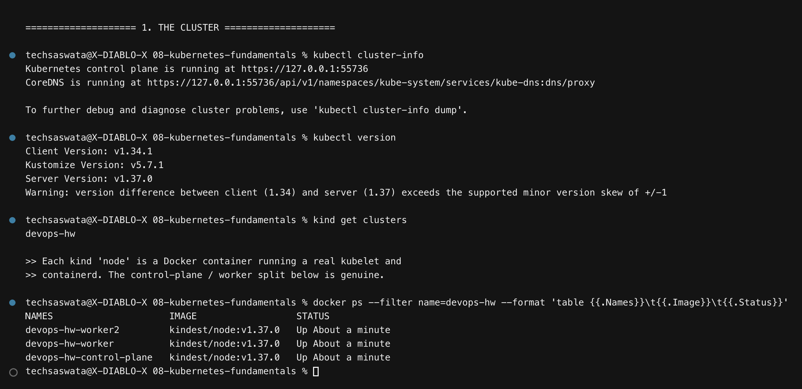

This is a genuine multi-node cluster built with **kind** (Kubernetes IN Docker), configured
in [`cluster/kind-config.yaml`](cluster/kind-config.yaml). Each "node" is a Docker container
running a real kubelet and containerd, so the control-plane/worker split below is real, not
simulated.

### Nodes

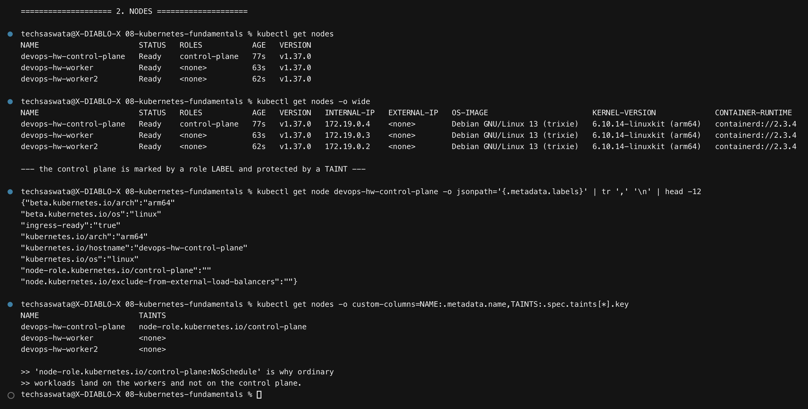

```
NAME                      STATUS   ROLES           VERSION
devops-hw-control-plane   Ready    control-plane   v1.37.0
devops-hw-worker          Ready    <none>          v1.37.0
devops-hw-worker2         Ready    <none>          v1.37.0
```

Two details worth reading from that output:

- The control plane is identified by a **label** (`node-role.kubernetes.io/control-plane`),
  not by anything structural.
- It carries a **taint**, `node-role.kubernetes.io/control-plane:NoSchedule`. That taint —
  not the label — is what actually keeps ordinary workloads off it. A taint repels pods
  unless they carry a matching toleration.

### What a node reports

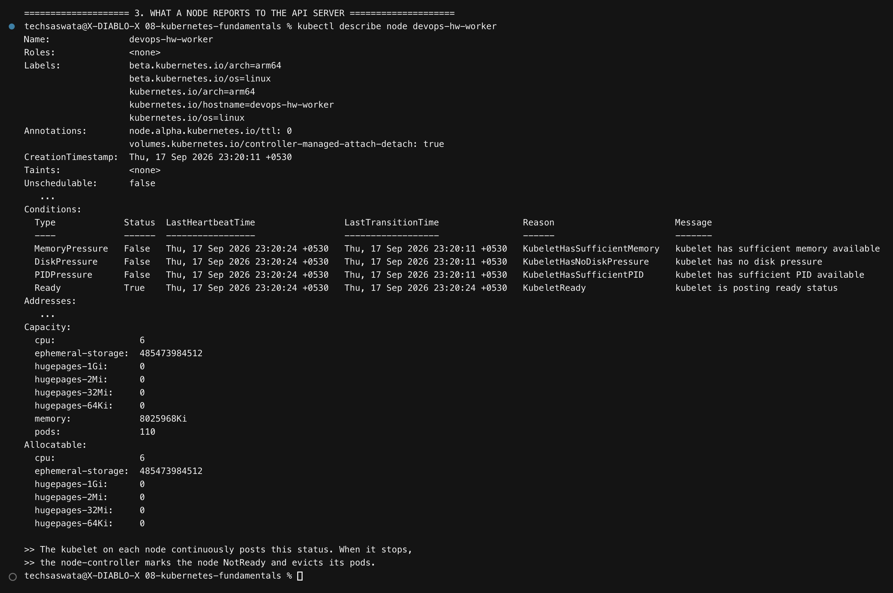

The kubelet on each node continuously posts this status to the API server: `Conditions`
(`Ready`, `MemoryPressure`, `DiskPressure`, `PIDPressure`), `Capacity` and `Allocatable`,
and the container runtime version. When those updates stop arriving, the node controller
marks the node `NotReady` and evicts its pods elsewhere.

---

## 3. Cluster architecture

```
        ┌──────────────────── CONTROL PLANE (devops-hw-control-plane) ───────────────────┐
        │                                                                                │
        │   ┌──────────────┐   watch/write   ┌────────┐                                  │
        │   │ kube-apiserver│◀──────────────▶│  etcd  │  the entire cluster state        │
        │   └──────┬───────┘                 └────────┘                                  │
        │          │  every read and write in the cluster goes through here              │
        │     ┌────┴─────────────┬──────────────────────┐                                │
        │     ▼                  ▼                      ▼                                │
        │ ┌─────────┐   ┌────────────────────┐   (kubectl, you)                          │
        │ │scheduler│   │controller-manager  │                                           │
        │ └─────────┘   └────────────────────┘                                           │
        └──────────────────────────┬─────────────────────────────────────────────────────┘
                                   │ the kubelets watch the API server
              ┌────────────────────┼────────────────────┐
              ▼                                         ▼
    ┌─────────────────────┐                   ┌─────────────────────┐
    │  devops-hw-worker   │                   │  devops-hw-worker2  │
    │  kubelet            │                   │  kubelet            │
    │  kube-proxy         │                   │  kube-proxy         │
    │  containerd         │                   │  containerd         │
    │  [ pods ]           │                   │  [ pods ]           │
    └─────────────────────┘                   └─────────────────────┘
```

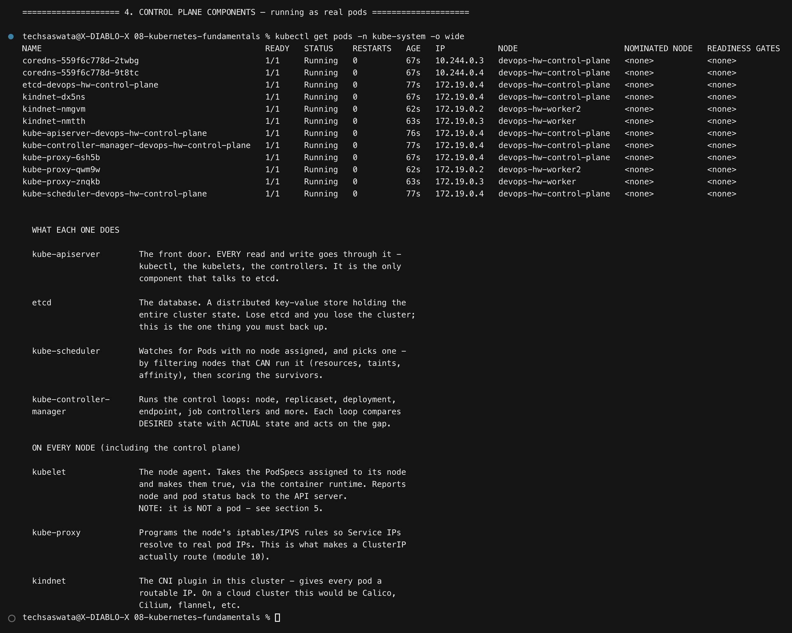

### Control plane

| Component | Responsibility |
|---|---|
| **kube-apiserver** | The front door. Every read and write — from `kubectl`, the kubelets, the controllers — goes through it. It is the **only** component that talks to etcd. |
| **etcd** | The database: a distributed key-value store holding all cluster state. Lose etcd and you lose the cluster; this is the one thing that must be backed up. |
| **kube-scheduler** | Watches for Pods with no node assigned. **Filters** nodes that *can* run the pod (resources, taints, affinity, node selectors), **scores** the survivors, and picks the best. |
| **kube-controller-manager** | Runs the control loops — node, replicaset, deployment, endpoint, job. Each loop compares desired state with actual state and acts on the difference. |

### On every node

| Component | Responsibility |
|---|---|
| **kubelet** | The node agent. Takes the PodSpecs assigned to its node and makes them true via the container runtime; reports status back. |
| **kube-proxy** | Programs iptables/IPVS so Service IPs route to real pod IPs — what makes a ClusterIP actually work ([module 10](../10-k8s-networking-services/)). |
| **containerd** | The container runtime that actually starts containers. |
| **kindnet** | The CNI plugin here, giving every pod a routable IP. On a cloud cluster this would be Calico, Cilium or similar. |

### The kubelet is not a pod

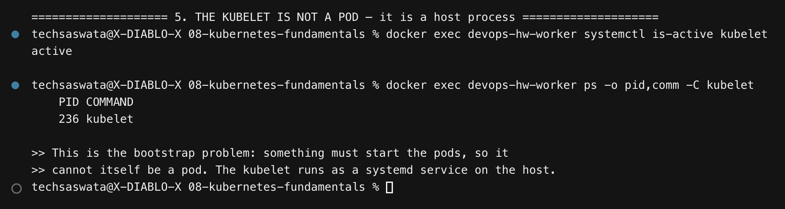

```
$ docker exec devops-hw-worker systemctl is-active kubelet
active
```

This is the **bootstrap problem**: something has to start the pods, so that thing cannot
itself be a pod. The kubelet runs as an ordinary **systemd service on the host**.

### Static pods — how the control plane starts itself

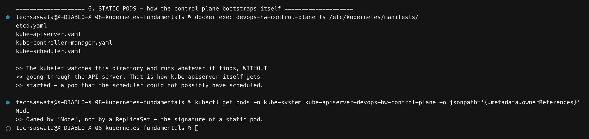

```
$ docker exec devops-hw-control-plane ls /etc/kubernetes/manifests/
etcd.yaml  kube-apiserver.yaml  kube-controller-manager.yaml  kube-scheduler.yaml
```

The kubelet watches that directory and runs whatever it finds **without going through the
API server**. That is how `kube-apiserver` itself gets started — a pod that the scheduler
could not possibly have scheduled, because the scheduler needs the API server to be running.

The proof is in the ownership:

```
$ kubectl get pod kube-apiserver-... -o jsonpath='{.metadata.ownerReferences[*].kind}'
Node
```

Owned by a **Node**, not by a ReplicaSet. That is the signature of a static pod: the
object you see in `kubectl` is only a read-only *mirror* of something the kubelet is
running locally.

---

## 4. Namespaces

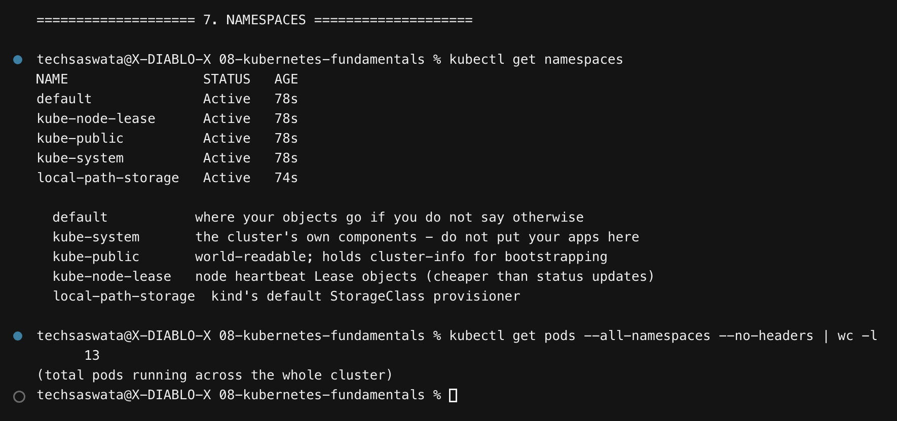

A namespace is a **scope for names**, not a security boundary by itself.

| Namespace | Purpose |
|---|---|
| `default` | where objects go when you don't specify one |
| `kube-system` | the cluster's own components — don't put your apps here |
| `kube-public` | world-readable; holds `cluster-info` for bootstrapping |
| `kube-node-lease` | node heartbeat `Lease` objects, cheaper than full status updates |
| `local-path-storage` | kind's default StorageClass provisioner |

---

## 5. What the API server exposes

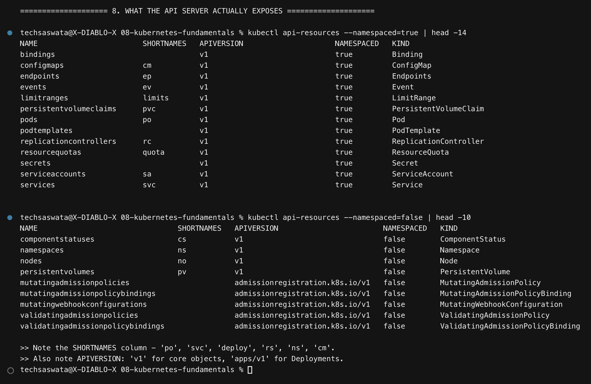

`kubectl api-resources` lists every object type the cluster understands. Two columns matter:

- **SHORTNAMES** — `po`, `svc`, `deploy`, `rs`, `ns`, `cm`. These save a great deal of typing.
- **APIVERSION** — `v1` for core objects (Pod, Service, ConfigMap), `apps/v1` for
  Deployment/ReplicaSet/DaemonSet/StatefulSet, `networking.k8s.io/v1` for Ingress. Getting
  this wrong in a manifest is one of the most common YAML errors.

Note also the `--namespaced=false` list: Nodes, Namespaces and PersistentVolumes are
**cluster-scoped** — they do not live inside a namespace.

---

## 6. Imperative vs declarative

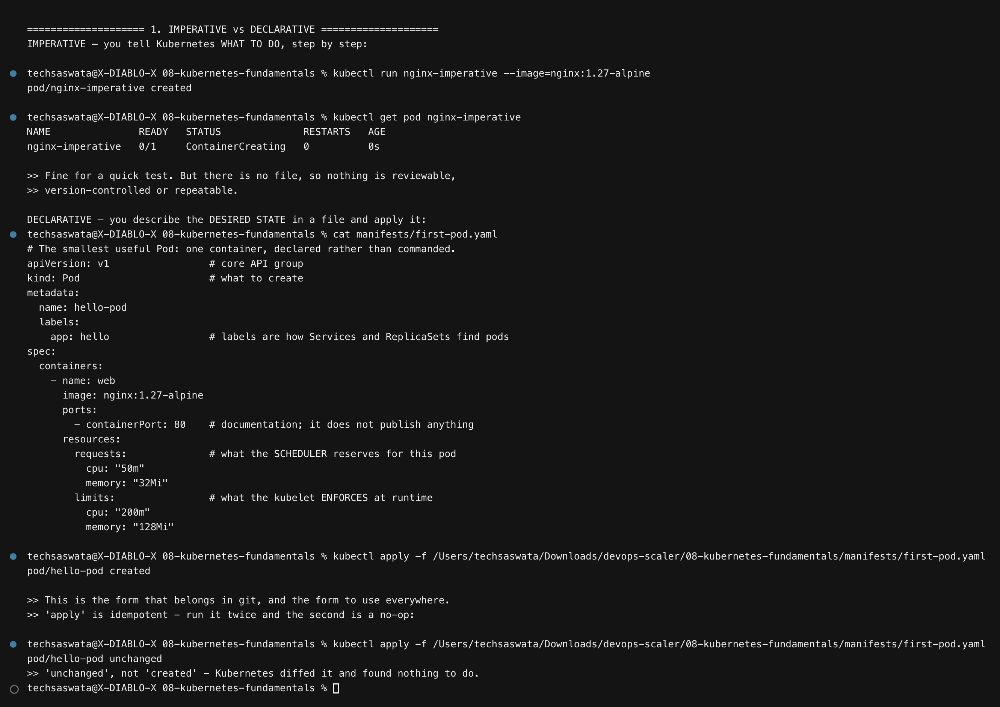

**Imperative** — you tell Kubernetes what to *do*:

```bash
kubectl run nginx-imperative --image=nginx:1.27-alpine
```

Fine for a throwaway test. But there is no file, so nothing is reviewable, version-controlled
or repeatable.

**Declarative** — you describe the desired *state* ([`manifests/first-pod.yaml`](manifests/first-pod.yaml)):

```yaml
apiVersion: v1
kind: Pod
metadata:
  name: hello-pod
  labels:
    app: hello
spec:
  containers:
    - name: web
      image: nginx:1.27-alpine
      resources:
        requests: { cpu: "50m", memory: "32Mi" }    # what the SCHEDULER reserves
        limits:   { cpu: "200m", memory: "128Mi" }  # what the KUBELET enforces
```

```bash
kubectl apply -f manifests/first-pod.yaml
```

Note what happens on the **second** `apply` in the screenshot: `unchanged`, not `created`.
Kubernetes diffed the submitted object against the live one and found nothing to do. That
idempotency is what makes the declarative form safe to run from CI on every commit.

> **`requests` vs `limits`** is worth fixing early. `requests` is what the **scheduler**
> reserves when deciding placement; `limits` is what the **kubelet** enforces at runtime.
> Exceed a CPU limit and you get throttled; exceed a memory limit and the container is
> **OOMKilled**.

---

## 7. The reconciliation loop — the central idea

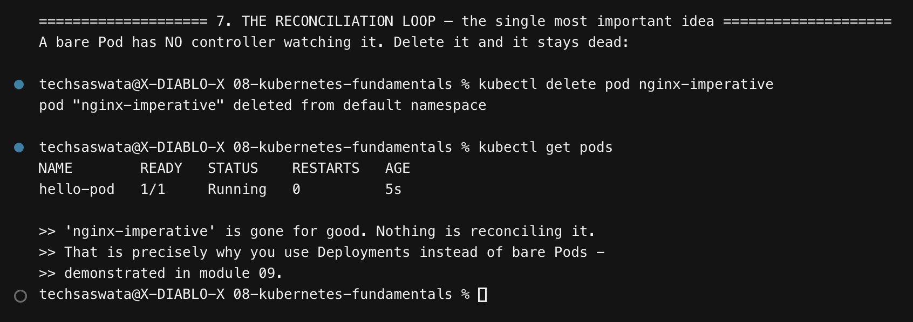

Kubernetes is built from control loops that all do the same thing:

```
     ┌──────────────────────────────────────────┐
     │  observe ACTUAL state (from the API)      │
     │  compare with DESIRED state               │
     │  act to close the gap                     │
     └───────────────────┬──────────────────────┘
                         └──── repeat, forever
```

The screenshot demonstrates the flip side of that: a **bare Pod has no controller watching
it**. Delete it and it stays deleted — nothing reconciles it back.

That is precisely why you almost never create bare Pods in practice. You create a
**Deployment**, which creates a ReplicaSet, whose controller *does* reconcile — demonstrated
in [module 09](../09-k8s-pods-replicasets-deployments/).

---

## 8. `kubectl` essentials

### Inspecting a running pod

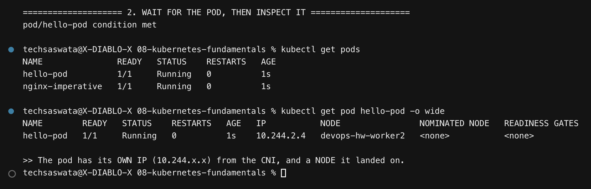

The pod gets its **own IP** (`10.244.x.x`) from the CNI and a **node** it was scheduled onto.

### `kubectl get` — output formats

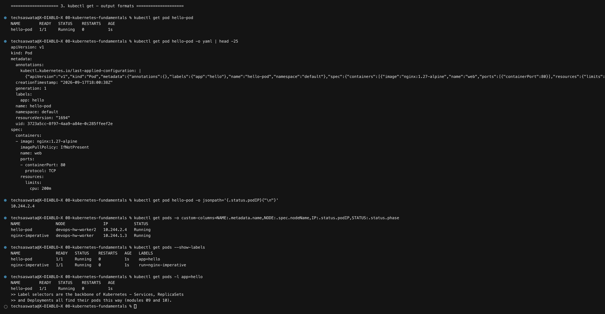

```bash
kubectl get pod hello-pod                    # the human table
kubectl get pod hello-pod -o yaml            # the full object as stored
kubectl get pod hello-pod -o jsonpath='{.status.podIP}'
kubectl get pods -o custom-columns=NAME:.metadata.name,NODE:.spec.nodeName
kubectl get pods --show-labels
kubectl get pods -l app=hello                # LABEL SELECTOR
```

Label selectors are the backbone of Kubernetes. Services, ReplicaSets and Deployments all
find their pods this way — there is no other linkage.

### `kubectl describe` — fields plus **Events**

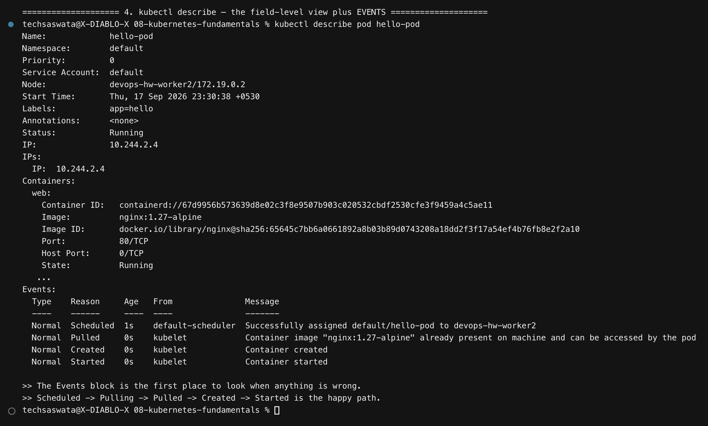

The **Events** block at the bottom is the first place to look when anything is wrong. The
happy path reads `Scheduled → Pulling → Pulled → Created → Started`; when a pod is broken,
the failure is almost always named here in plain English
([module 09](../09-k8s-pods-replicasets-deployments/) uses this repeatedly).

### `logs`, `exec`, `port-forward`

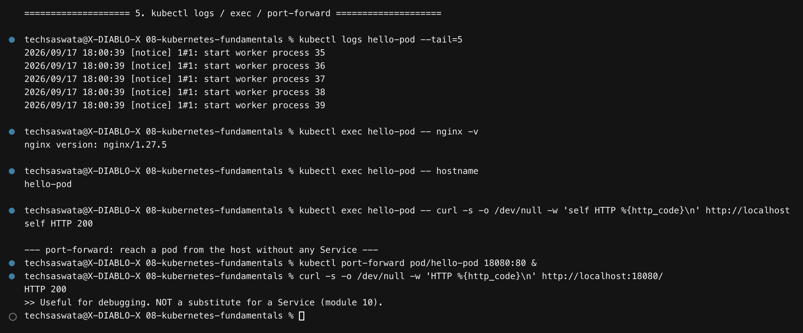

```bash
kubectl logs hello-pod --tail=5
kubectl logs hello-pod -f                    # follow
kubectl logs hello-pod --previous            # the PREVIOUS container — for crash loops
kubectl exec hello-pod -- nginx -v
kubectl exec -it hello-pod -- sh             # interactive shell
kubectl port-forward pod/hello-pod 18080:80  # reach a pod with no Service at all
```

`port-forward` returning `HTTP 200` is useful for debugging, but it is **not** a substitute
for a Service — it only lives as long as the command runs, and serves one client.

### `kubectl explain` — the API documents itself

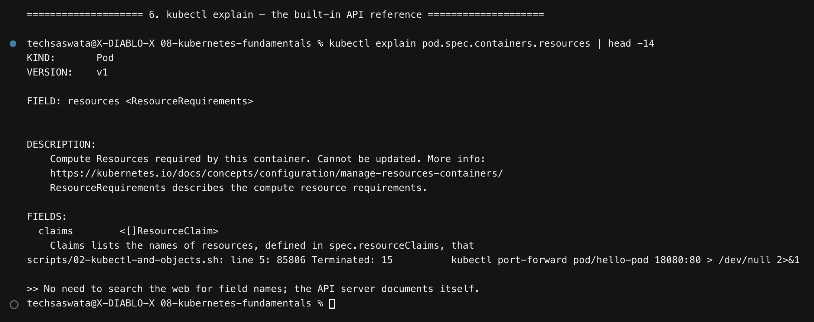

```bash
kubectl explain pod.spec.containers.resources
kubectl explain deployment.spec.strategy --recursive
```

No need to search the web for field names or indentation.

### Namespaces in practice

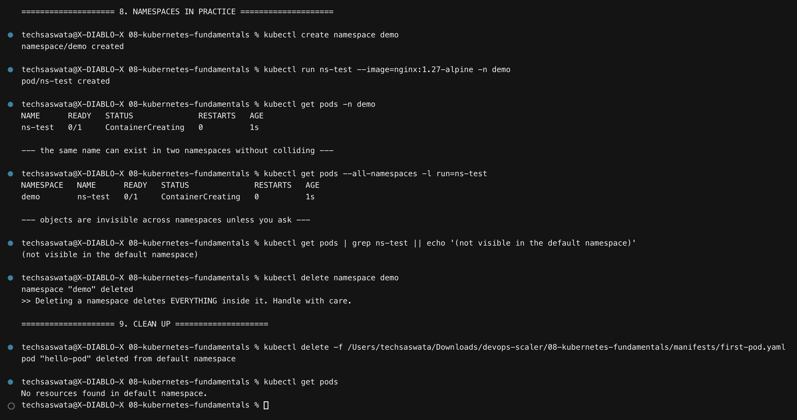

The same object name can exist in two namespaces without colliding, and objects are
invisible across namespaces unless you ask with `-n` or `--all-namespaces`.

> **`kubectl delete namespace` deletes everything inside it.** There is no confirmation
> prompt and no undo.

---

## 9. Command reference

| Task | Command |
|---|---|
| Cluster overview | `kubectl cluster-info`, `kubectl get nodes -o wide` |
| Create/update from a file | `kubectl apply -f <file>` |
| Everything in a namespace | `kubectl get all -n <ns>` |
| Why is this broken? | `kubectl describe <kind>/<name>` → read **Events** |
| Application logs | `kubectl logs <pod> [-f] [--previous]` |
| Shell inside a container | `kubectl exec -it <pod> -- sh` |
| Field documentation | `kubectl explain <path>` |
| Temporary access to a pod | `kubectl port-forward <pod> <local>:<remote>` |
| Filter by label | `kubectl get pods -l app=hello` |
| Watch changes live | `kubectl get pods -w` |
| Dry-run a manifest | `kubectl apply -f x.yaml --dry-run=server` |
| Resource usage | `kubectl top nodes` / `kubectl top pods` (needs metrics-server) |

---

## Files in this folder

```
08-kubernetes-fundamentals/
├── README.md                    this write-up
├── cluster/kind-config.yaml     the 3-node cluster definition
├── manifests/first-pod.yaml     the declarative Pod
├── scripts/
│   ├── 01-architecture.sh
│   └── 02-kubectl-and-objects.sh
├── outputs/                     raw captured logs (477 lines)
└── screenshots/                 the 16 PNGs embedded above
```
