# 09 — Kubernetes Pods, ReplicaSets & Deployments

**Saswata Das — 24BCS10248**

Every result below was produced on the live three-node cluster from
[module 08](../08-kubernetes-fundamentals/). Manifests in [`manifests/`](manifests/),
scripts in [`scripts/`](scripts/), raw logs (898 lines) in [`outputs/`](outputs/).

```bash
./scripts/01-pods-lifecycle.sh          # pods, all 12 lifecycle states, probes
./scripts/02-replicaset-deployment.sh   # ReplicaSets, Deployments, rollouts
./scripts/03-strategies-workloads.sh    # blue-green, canary, DaemonSet, StatefulSet
```

---

# Part 1 — Pods

## Multi-container pods (the sidecar pattern)

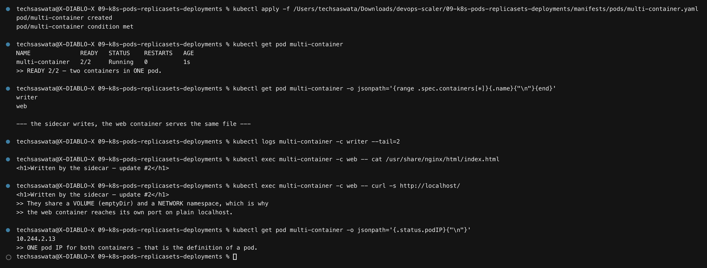

A Pod is **not** "a container". It is a group of containers that share a **network
namespace** and can share **volumes**. In [`manifests/pods/multi-container.yaml`](manifests/pods/multi-container.yaml)
a `writer` sidecar regenerates `index.html` every 5 seconds onto an `emptyDir`, and an
`nginx` container serves that same file.

Two things in the output prove the sharing is real:

- `READY 2/2` with **one pod IP** — both containers sit behind the same address.
- `kubectl exec ... -c web -- curl http://localhost` returns the sidecar's HTML, because
  in a Pod `localhost` is shared.

That is why you never need to "link" containers inside a Pod, and why two containers in
one Pod **cannot both bind port 80**.

## Init containers

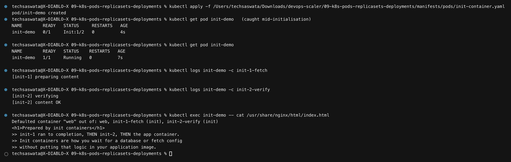

Init containers run **to completion, in order, before any app container starts**. The
screenshot catches the pod mid-initialisation showing `Init:1/2`, then both init logs in
sequence, then the app serving the file they prepared.

This is how you wait for a database, fetch config or run a migration **without** putting
that logic into your application image.

---

# Part 2 — The Pod lifecycle

The reference lab walks 12 states. Each was reproduced deliberately rather than described.

| # | State | How it was forced | Manifest |
|---|---|---|---|
| 1 | `Running` | normal pod | — |
| 2 | `Pending` | requests 500 CPUs — unschedulable | [`pending.yaml`](manifests/lifecycle/pending.yaml) |
| 3 | `Succeeded` | exits 0, `restartPolicy: Never` | [`succeeded.yaml`](manifests/lifecycle/succeeded.yaml) |
| 4 | `Failed` | exits 1, `restartPolicy: Never` | [`failed.yaml`](manifests/lifecycle/failed.yaml) |
| 5 | `CrashLoopBackOff` | exits 1 repeatedly, default restartPolicy | [`crashloop.yaml`](manifests/lifecycle/crashloop.yaml) |
| 6 | `ImagePullBackOff` | image tag does not exist | [`imagepull.yaml`](manifests/lifecycle/imagepull.yaml) |
| 7–9 | readiness / liveness / startup probes | see Part 3 | [`probes/`](manifests/probes/) |
| 10 | init container | ordered setup | [`init-container.yaml`](manifests/pods/init-container.yaml) |
| 11 | multi-container | sidecar | [`multi-container.yaml`](manifests/pods/multi-container.yaml) |
| 12 | graceful termination | `preStop` + SIGTERM trap | [`termination.yaml`](manifests/lifecycle/termination.yaml) |

## Pending, Succeeded, Failed

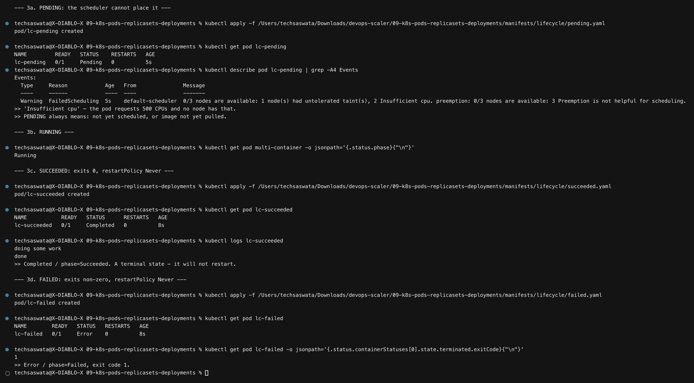

`Pending` always means **not yet scheduled, or image not yet pulled**. `describe` names the
reason exactly — here `Insufficient cpu`, because no node has 500 cores.

`Succeeded` and `Failed` are **terminal**: with `restartPolicy: Never` the pod is left in
place so you can read its logs and exit code.

## CrashLoopBackOff

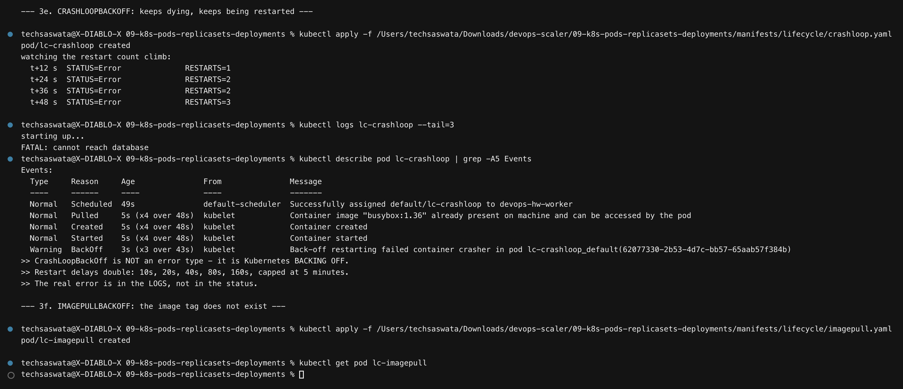

Sampled every 12s, the restart count climbs while the status flips between `Running`,
`Error` and `CrashLoopBackOff`.

> **`CrashLoopBackOff` is not an error type — it is Kubernetes *backing off*.** The
> container keeps exiting and the kubelet keeps restarting it, waiting longer each time:
> **10s → 20s → 40s → 80s → 160s, capped at 5 minutes.**
>
> The status tells you nothing about *why*. The real error is in the logs:
> `kubectl logs <pod>`, or `kubectl logs <pod> --previous` once it has already restarted.

## ImagePullBackOff

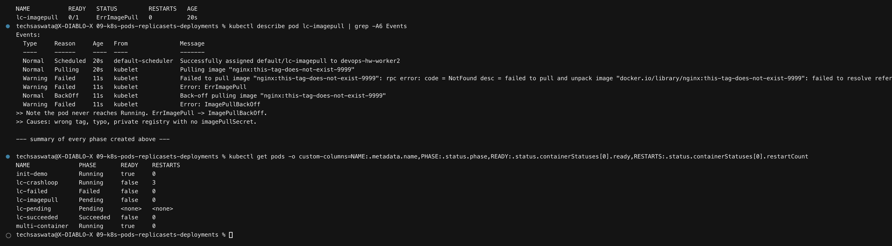

Note the pod **never reaches Running** — it goes `ErrImagePull` → `ImagePullBackOff` while
still `Pending`. Causes, in order of likelihood: wrong tag, typo in the image name, or a
private registry with no `imagePullSecret`.

---

# Part 3 — Probes

## All three on a healthy pod

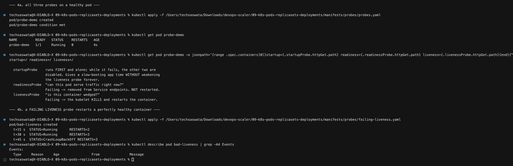

| Probe | Question it answers | Effect of failure |
|---|---|---|
| **startupProbe** | "has it finished booting?" | runs **first and alone**; the other two are disabled while it runs |
| **readinessProbe** | "can it serve traffic *right now*?" | removed from Service endpoints — **not** restarted |
| **livenessProbe** | "is it wedged?" | the kubelet **kills and restarts** the container |

The startup probe exists to solve a specific trap: a slow-booting app needs a long
`initialDelaySeconds` on liveness, but that long delay then applies **forever**, so a
genuine hang goes undetected for minutes. A startup probe gives generous time at boot and
then hands over to a strict liveness probe.

## Getting them wrong

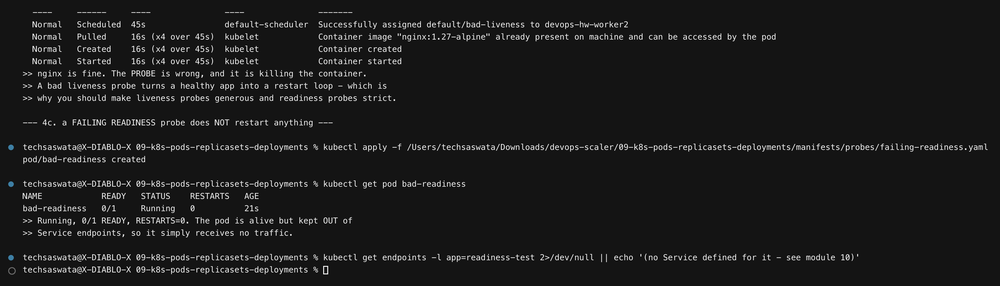

This is the part worth internalising, because the two failure modes look nothing alike:

**A failing liveness probe restarts a perfectly healthy container.** `bad-liveness` runs
nginx pointed at `/this-path-returns-404`. nginx is fine. The *probe* is wrong — and the
restart count climbs anyway. A misconfigured liveness probe turns a working app into a
restart loop.

**A failing readiness probe restarts nothing.** `bad-readiness` stays `Running`, `0/1
READY`, `RESTARTS=0` — alive, but held out of Service endpoints so it simply receives no
traffic.

> Rule of thumb: **liveness generous, readiness strict.** Liveness should only fail when
> the process is genuinely unrecoverable, because its remedy is a kill.

---

# Part 4 — Graceful termination

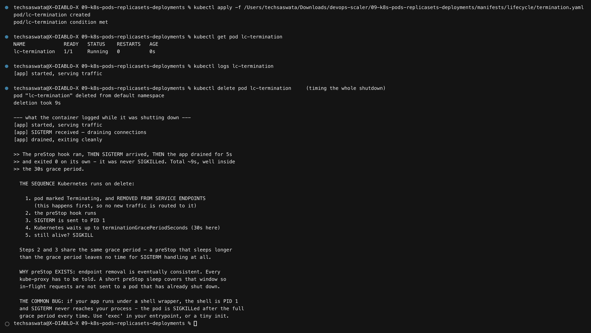

What `kubectl delete pod` actually does:

```
1. pod marked Terminating and REMOVED FROM SERVICE ENDPOINTS   (first, so no new traffic)
2. the preStop hook runs
3. SIGTERM is sent to PID 1
4. Kubernetes waits up to terminationGracePeriodSeconds (30s here)
5. still alive?  SIGKILL
```

The captured logs show the whole sequence, and the deletion was timed at **9 seconds** —
3s `preStop` + 5s drain + overhead, comfortably inside the 30s grace period. The container
exited **0 on its own**; it was never SIGKILLed.

```
[app] started, serving traffic
[app] SIGTERM received — draining connections
[app] drained, exiting cleanly
```

Two things that bite people:

- **`preStop` and SIGTERM share the same grace period.** A `preStop` that sleeps longer
  than `terminationGracePeriodSeconds` leaves *no* time for SIGTERM handling.
- **If your app runs under a shell wrapper, the shell is PID 1 and SIGTERM never reaches
  your process** — so every pod takes the full grace period and is then SIGKILLed. Use
  `exec` in your entrypoint.

`preStop` exists because endpoint removal is *eventually consistent* — every `kube-proxy`
must be told. A short sleep covers that window so in-flight requests aren't routed to a pod
that has already shut down.

---

# Part 5 — ReplicaSets

## Desired state and self-healing

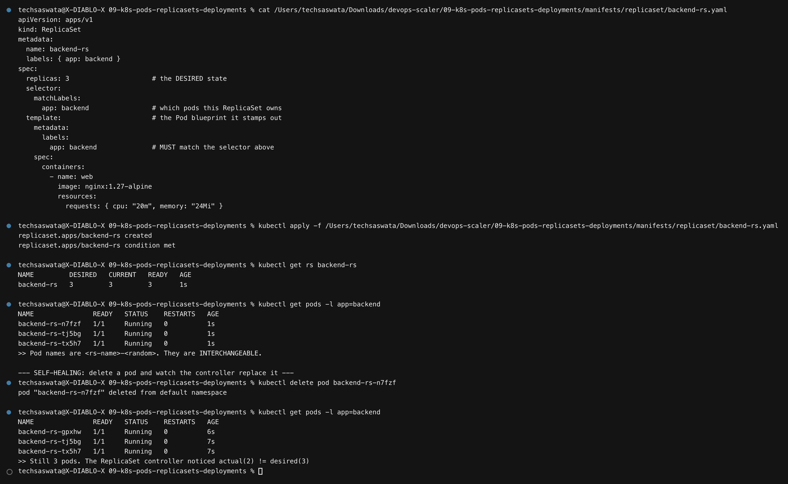

`replicas: 3` is a **desired state**, not an instruction. Deleting a pod produces a
replacement within seconds — visible in the output as a new name and an `AGE` of `0s`.

Compare with the bare Pod in [module 08](../08-kubernetes-fundamentals/#7-the-reconciliation-loop--the-central-idea),
which stayed deleted forever. The difference is that a controller is watching.

## Labels are the only link

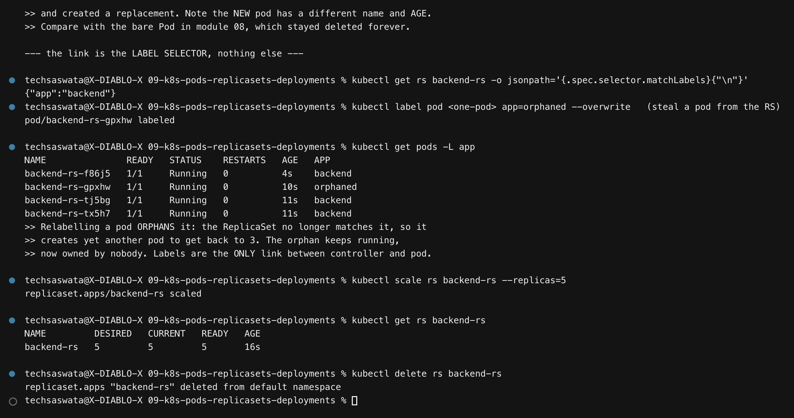

Relabelling a pod out of the selector **orphans** it: the ReplicaSet stops matching it,
counts 2 instead of 3, and creates another. The orphan keeps running, owned by nobody.

> There is no hidden pointer from controller to pod — **only the label selector**. That is
> also why `spec.selector` is immutable on a Deployment: changing it would orphan every
> existing pod at once.

---

# Part 6 — Deployments

## The ownership chain

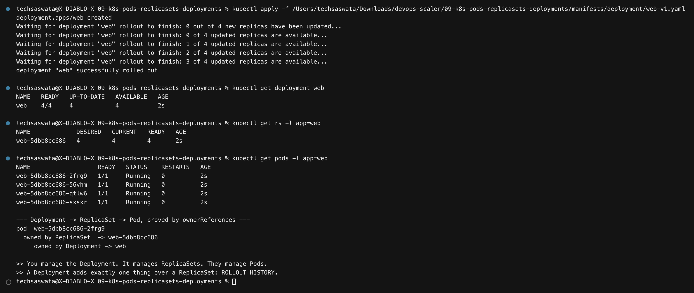

```
Deployment  web
   └── ReplicaSet  web-665d78bc7b        (ownerReferences)
          └── Pod  web-665d78bc7b-xxxxx
```

Proved through `ownerReferences`, not asserted. **A Deployment adds exactly one thing over
a ReplicaSet: rollout history.**

## Rolling update

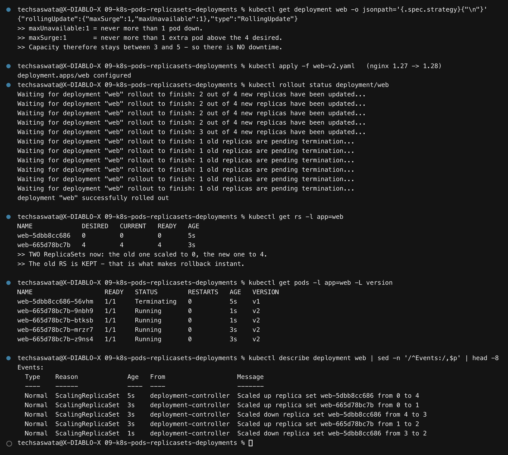

```yaml
strategy:
  type: RollingUpdate
  rollingUpdate:
    maxUnavailable: 1     # never more than 1 pod down
    maxSurge: 1           # never more than 1 extra pod above replicas
```

With `replicas: 4`, capacity stays between **3 and 5** throughout — so there is no downtime.
Afterwards there are **two ReplicaSets**: the old scaled to 0, the new to 4. The old one is
kept deliberately.

## History and rollback

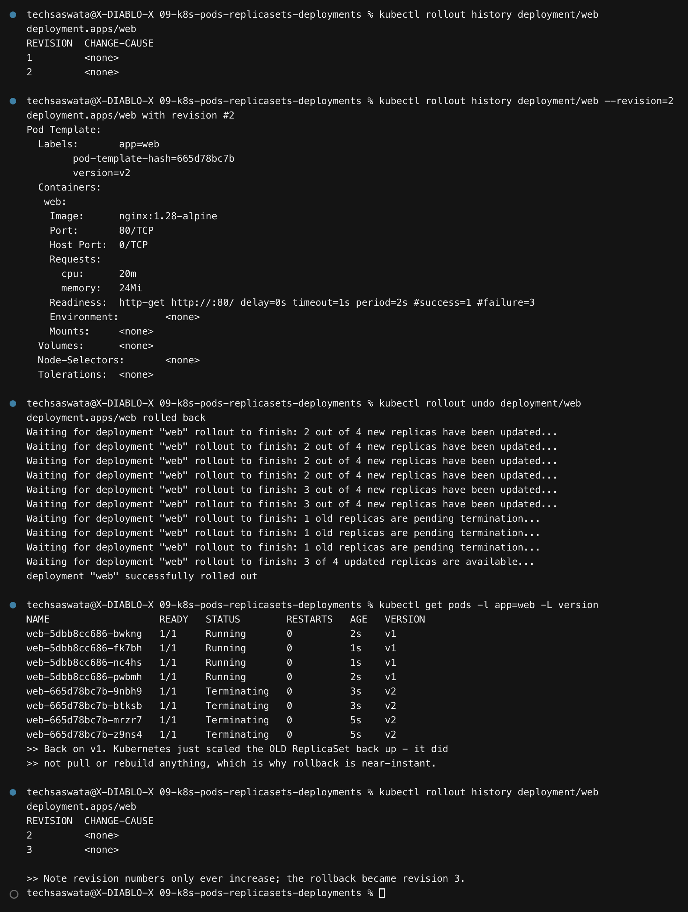

```bash
kubectl rollout history deployment/web
kubectl rollout history deployment/web --revision=2
kubectl rollout undo deployment/web
kubectl rollout undo deployment/web --to-revision=1
```

Rollback is near-instant because Kubernetes just **scales the old ReplicaSet back up** —
nothing is pulled or rebuilt. Note revision numbers only ever increase: the rollback itself
became revision 3.

## A failed rollout does not take the service down

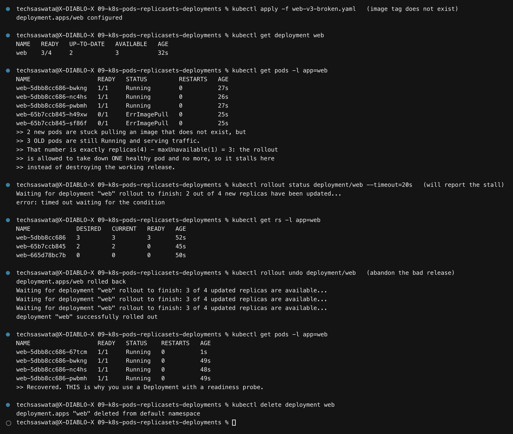

Deploying a nonexistent image tag produces the single most reassuring output in this module:

```
web-5dbb8cc686-bwkng   1/1   Running        0   27s
web-5dbb8cc686-nc4hs   1/1   Running        0   26s
web-5dbb8cc686-pwbmh   1/1   Running        0   27s
web-65b7ccb845-h49xw   0/1   ErrImagePull   0   25s
web-65b7ccb845-sf86f   0/1   ErrImagePull   0   25s
```

**3 old pods still serving.** That number is exactly `replicas(4) − maxUnavailable(1)`: the
rollout may take down one healthy pod and no more, so it **stalls** rather than destroying
the working release. `kubectl rollout status` reports the stall; `kubectl rollout undo`
recovers.

This is the entire argument for using a Deployment with a readiness probe instead of
managing pods yourself.

---

# Part 7 — Deployment strategies

## Recreate — deliberate downtime

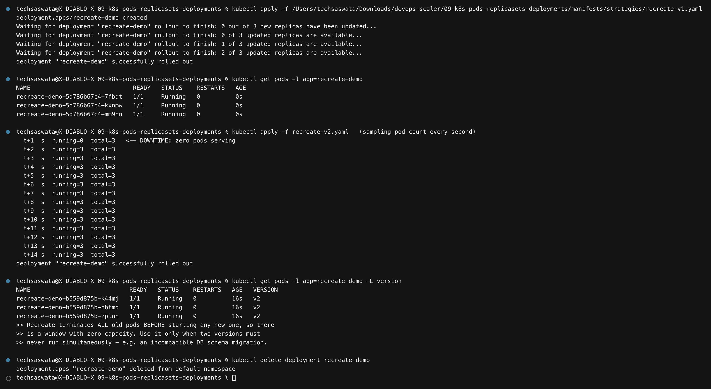

Sampling pod count once per second during the switch captures the downtime window directly:

```
t+1  s  running=0  total=3   <-- DOWNTIME: zero pods serving
```

`Recreate` terminates **all** old pods before starting any new one. Use it only when two
versions must never run simultaneously — an incompatible database schema migration being
the classic case.

## Blue-green

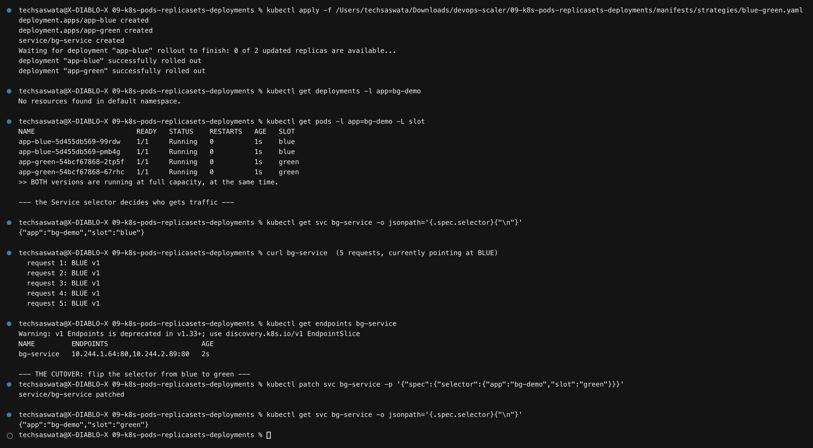
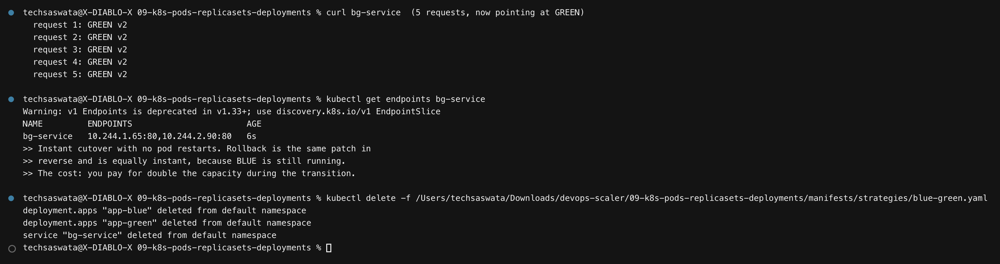

Two complete Deployments run side by side. **One Service selector is the switch:**

```bash
kubectl patch svc bg-service -p '{"spec":{"selector":{"app":"bg-demo","slot":"green"}}}'
```

Before the patch, 5/5 requests return `BLUE v1`. After it, 5/5 return `GREEN v2` — with **no
pod restarted**. Rollback is the same patch in reverse and is equally instant, because blue
is still running.

The cost is that you pay for **double capacity** during the transition.

## Canary

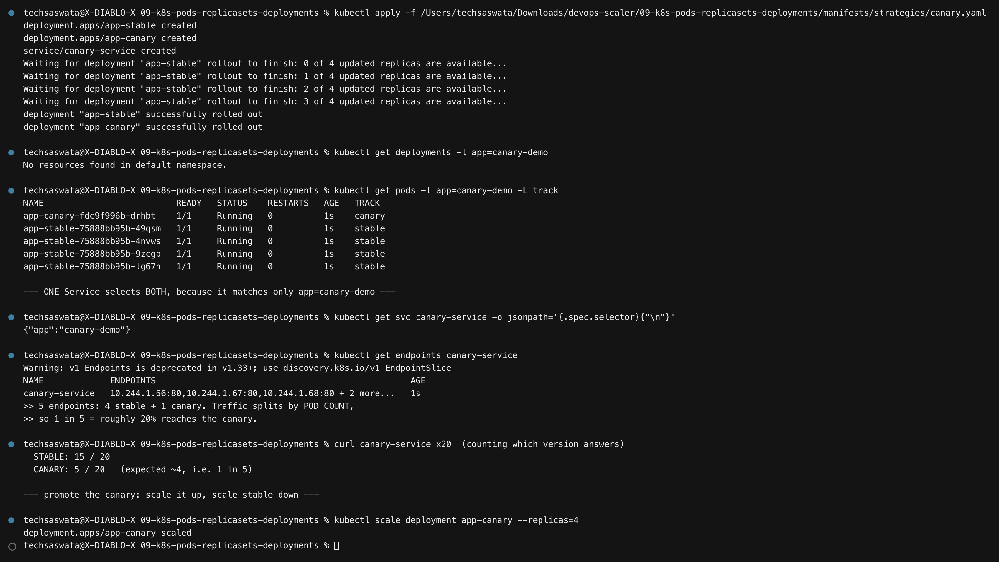

One Service selects **both** Deployments, because its selector matches only
`app: canary-demo` and omits the `track` label. Traffic then splits by **pod count**:

```
4 stable + 1 canary  →  5 endpoints  →  ~20% canary
STABLE: 15 / 20
CANARY:  5 / 20
```

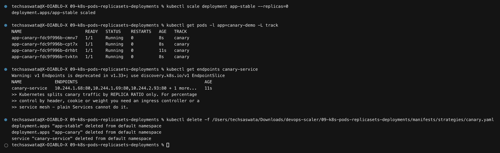

Promotion is just scaling: canary up, stable down.

> **Limitation worth knowing for interviews:** plain Kubernetes Services split traffic
> **only by replica ratio**. Want 1% of traffic, or routing by header/cookie/user? You need
> an ingress controller with canary annotations, or a service mesh. Getting 1% with replicas
> alone would need 99 stable pods.

---

# Part 8 — Other workload types

## DaemonSet — one pod per node

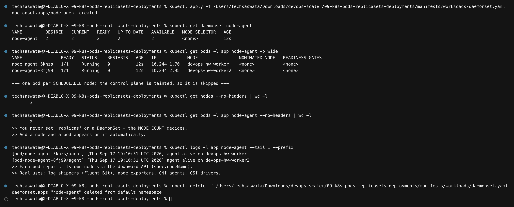

A DaemonSet has **no `replicas` field** — the node count decides. The output shows 3 nodes
and 2 agent pods, because the control-plane node carries a `NoSchedule` taint the DaemonSet
does not tolerate.

Each pod reports its own node through the **downward API**:

```yaml
env:
  - name: NODE_NAME
    valueFrom: { fieldRef: { fieldPath: spec.nodeName } }
```

Real uses: log shippers (Fluent Bit), node exporters, CNI agents, CSI drivers.

## StatefulSet — identity and per-pod storage

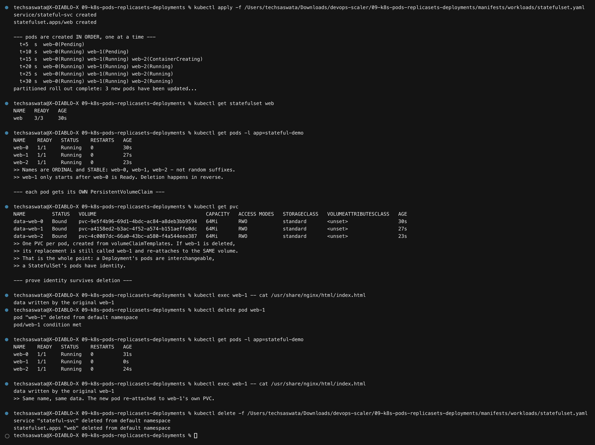

| | Deployment | StatefulSet |
|---|---|---|
| Pod names | `web-665d78bc7b-x9k2p` (random) | `web-0`, `web-1`, `web-2` (ordinal, stable) |
| Creation order | all at once | **one at a time, in order** |
| Deletion order | any | reverse ordinal |
| Storage | usually shared or none | **one PVC per pod**, via `volumeClaimTemplates` |
| Pods are | interchangeable | **identities** |

The sampling loop captures pods appearing strictly in order — `web-1` only starts once
`web-0` is Ready.

**The identity proof:** data was written into `web-1`, `web-1` was deleted, and the
replacement came back **with the same name and the same data** — it re-attached to
`data-web-1`, its own PVC.

```
$ kubectl get pvc
data-web-0   Bound   64Mi   RWO   standard
data-web-1   Bound   64Mi   RWO   standard
data-web-2   Bound   64Mi   RWO   standard
```

That is the whole distinction: a Deployment's pods are cattle, a StatefulSet's pods are
named individuals. Databases, Kafka, ZooKeeper and etcd need the latter.

---

# Part 9 — Troubleshooting

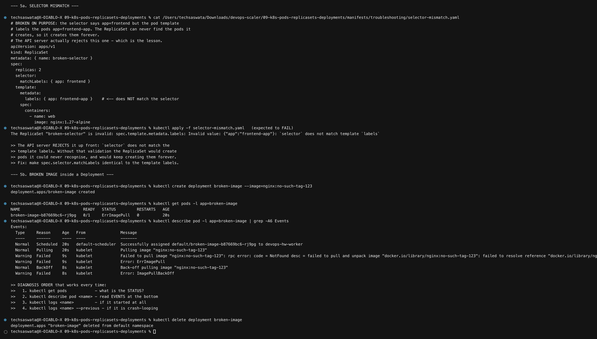

## Selector mismatch

[`selector-mismatch.yaml`](manifests/troubleshooting/selector-mismatch.yaml) sets
`selector: app=frontend` but labels its pods `app=frontend-app`. The API server **rejects it
outright**:

```
`selector` does not match template `labels`
```

Without that validation, the ReplicaSet would create pods it could never recognise, and
would keep creating them forever. **Fix:** make `spec.selector.matchLabels` identical to
`spec.template.metadata.labels`.

## Broken image

`ErrImagePull` → `ImagePullBackOff`, with the reason spelled out in Events.

## The diagnosis order that always works

```bash
kubectl get pods                     # 1. what is the STATUS?
kubectl describe pod <name>          # 2. read EVENTS at the bottom
kubectl logs <name>                  # 3. if the container started at all
kubectl logs <name> --previous       # 4. if it is crash-looping
kubectl get events --sort-by=.lastTimestamp   # 5. cluster-wide context
```

| Symptom | Usual cause |
|---|---|
| `Pending` | unschedulable — insufficient resources, taints, unbound PVC |
| `ContainerCreating` (stuck) | image pull, volume mount or CNI problem |
| `ImagePullBackOff` | wrong tag, typo, or missing `imagePullSecret` |
| `CrashLoopBackOff` | the app exits — read `logs --previous` |
| `Running` but `0/1 READY` | readiness probe failing |
| Restarts climbing, app looks fine | **liveness probe misconfigured** |
| Pods created endlessly | selector/label mismatch |

---

## Command reference

| Task | Command |
|---|---|
| Watch pods live | `kubectl get pods -w` |
| Scale | `kubectl scale deployment/web --replicas=5` |
| Update image | `kubectl set image deployment/web web=nginx:1.28-alpine` |
| Rollout progress | `kubectl rollout status deployment/web` |
| Rollout history | `kubectl rollout history deployment/web` |
| Roll back | `kubectl rollout undo deployment/web [--to-revision=N]` |
| Restart (re-read config) | `kubectl rollout restart deployment/web` |
| Pause / resume a rollout | `kubectl rollout pause\|resume deployment/web` |
| Show labels | `kubectl get pods --show-labels` / `-L <key>` |
| Ownership chain | `kubectl get pod X -o jsonpath='{.metadata.ownerReferences}'` |

---

## Files in this folder

```
09-k8s-pods-replicasets-deployments/
├── README.md
├── manifests/
│   ├── pods/           multi-container, init-container
│   ├── lifecycle/      pending, succeeded, failed, crashloop, imagepull, termination
│   ├── probes/         all three probes, plus a bad liveness and a bad readiness
│   ├── replicaset/     backend-rs
│   ├── deployment/     web v1, v2, and a deliberately broken v3
│   ├── strategies/     recreate v1/v2, blue-green, canary
│   ├── workloads/      daemonset, statefulset
│   └── troubleshooting/ selector-mismatch
├── scripts/            the three capture scripts
├── outputs/            898 lines of captured output
└── screenshots/        the 22 PNGs embedded above
```
