# 10 — Kubernetes Networking & Services

**Saswata Das — 24BCS10248**

All five Service types, CoreDNS/FQDN resolution, `kube-proxy` internals and the endpoint
triage drill — run against the live cluster from [module 08](../08-kubernetes-fundamentals/).
Manifests in [`manifests/`](manifests/), raw logs (545 lines) in [`outputs/`](outputs/).

```bash
./scripts/01-services.sh                 # ClusterIP, NodePort, LoadBalancer, ExternalName, Headless
./scripts/02-dns-and-troubleshooting.sh  # CoreDNS, FQDN, kube-proxy, empty endpoints
```

---

## 1. The problem Services solve

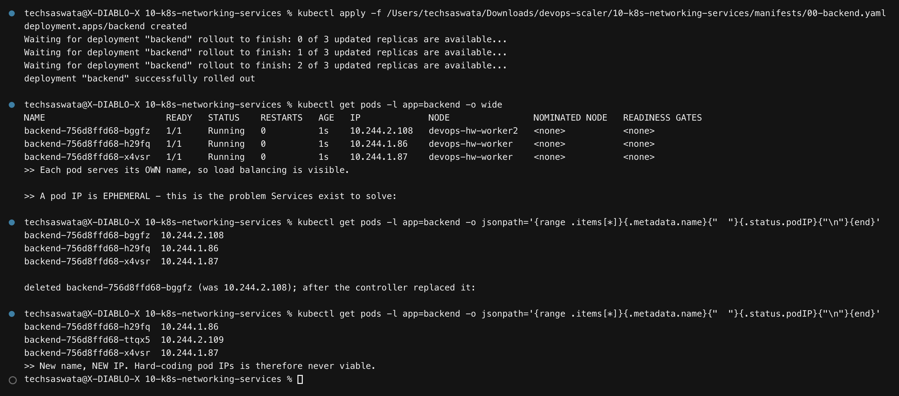

Pods are disposable, and **their IPs go with them**. The output deletes one pod and shows
the replacement arriving with a different name *and* a different IP.

So you can never hard-code a pod IP. A **Service** is a stable name and a stable virtual IP
in front of a changing set of pods. Everything below is a variation on that idea.

The backend used throughout writes its own pod name into `index.html` via the downward API,
so load balancing is directly visible in every response.

---

## 2. The four ports — the classic interview trap

```
 external client
        │  hits <anyNodeIP>:30080
        ▼
   nodePort: 30080     ← a port on EVERY node       (range 30000–32767)
        │
        ▼
   port: 80            ← the port the SERVICE listens on   (other pods use this)
        │
        ▼
   targetPort: 80      ← the port on the POD        (where traffic actually lands)

   containerPort: 8080 ← declared in the Deployment — DOCUMENTATION ONLY
```

| Field | Lives on | Who talks to it |
|---|---|---|
| `nodePort` | every node | external clients |
| `port` | the Service | other pods |
| `targetPort` | the pod | the Service |
| `containerPort` | the Pod spec | **nobody — it is metadata** |

The demo proves the last row deliberately: [`00-backend.yaml`](manifests/00-backend.yaml)
declares `containerPort: 8080` while nginx actually listens on **80**, and everything still
works — because only `targetPort` decides where traffic goes. `containerPort` is purely
informational, which is not what most people assume.

---

## 3. ClusterIP — the default

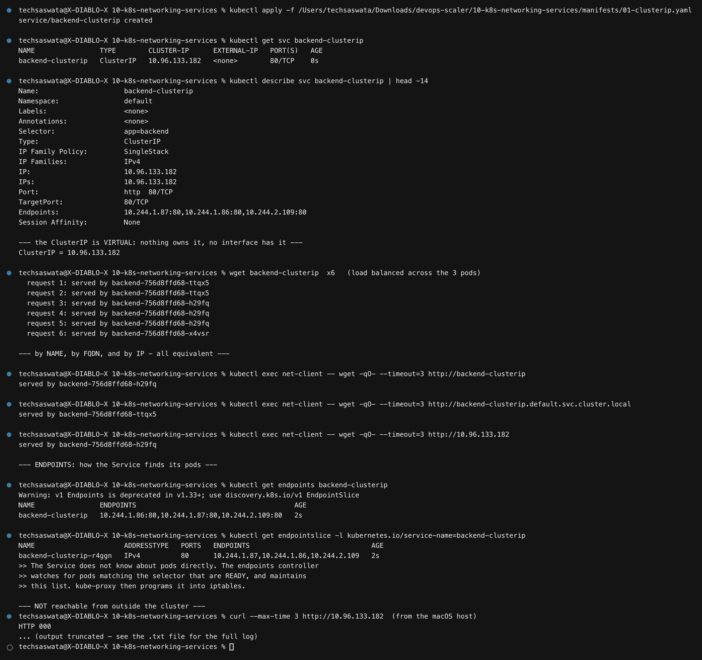

```yaml
spec:
  type: ClusterIP        # can be omitted — it is the default
  selector: { app: backend }
  ports: [{ port: 80, targetPort: 80 }]
```

Six requests fan out across all three pods. The same Service answers by **short name**, by
**FQDN** and by **ClusterIP** — all equivalent from inside the cluster.

And from the macOS host, the ClusterIP is **unreachable** — which is the entire point. A
ClusterIP is cluster-internal by definition.

### Endpoints — how a Service finds its pods

```
$ kubectl get endpoints backend-clusterip
NAME                ENDPOINTS
backend-clusterip   10.244.1.86:80,10.244.1.87:80,10.244.2.109:80
```

A Service does **not** know about pods directly. The endpoints controller watches for pods
that match the selector **and are Ready**, and maintains this list. `kube-proxy` then
programs it into iptables. That two-step is why §8's triage drill always starts with
`kubectl get endpoints`.

> `Endpoints` is deprecated since v1.33 in favour of **`EndpointSlice`**, which scales
> better (one huge object per Service becomes many small ones). Both are shown in the output.

---

## 4. NodePort — reachable from outside

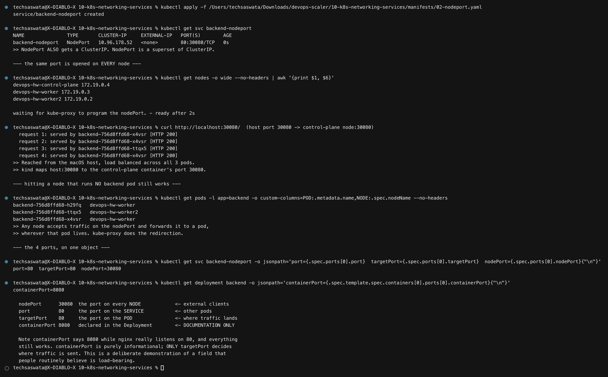

```
NAME               TYPE       CLUSTER-IP     PORT(S)
backend-nodeport   NodePort   10.96.28.169   80:30080/TCP
```

**A NodePort Service also gets a ClusterIP.** NodePort is a *superset* of ClusterIP.

Reached from the macOS host with genuine load balancing:

```
request 1: served by backend-756d8ffd68-sc92b [HTTP 200]
request 2: served by backend-756d8ffd68-t9twc [HTTP 200]
request 3: served by backend-756d8ffd68-kddzd [HTTP 200]
```

> **A timing detail the script had to handle honestly:** curling immediately after `apply`
> returned *nothing*. `kube-proxy` needs a moment to program the iptables rules for a new
> Service. The script now polls until the port answers — the alternative was a screenshot
> of empty output under a caption claiming success.

The port opens on **every** node, including nodes running no backend pod at all —
`kube-proxy` forwards to wherever a pod actually lives.

**Limitations:** the port range is restricted to 30000–32767, you get one Service per port,
and clients must know a node's IP — so nodes cannot be replaced freely. NodePort is for
dev/test, or as the thing a real load balancer points at.

---

## 5. LoadBalancer — needs a cloud provider

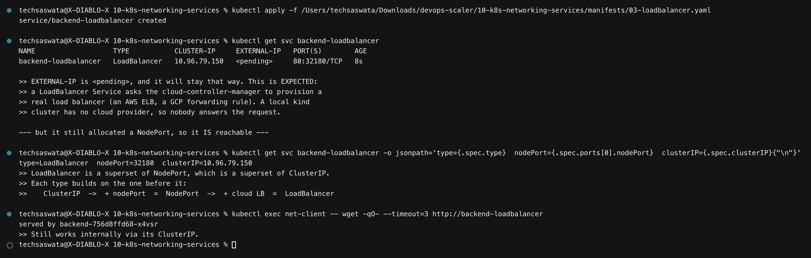

```
NAME                   TYPE           EXTERNAL-IP   PORT(S)
backend-loadbalancer   LoadBalancer   <pending>     80:31234/TCP
```

**`EXTERNAL-IP` is `<pending>` and will stay that way — this is expected, not a failure.**
A LoadBalancer Service asks the *cloud-controller-manager* to provision a real load balancer
(an AWS NLB, a GCP forwarding rule). A local `kind` cluster has no cloud provider, so
nobody answers the request. On EKS/GKE/AKS an external IP appears within a minute.

But notice it **still allocated a nodePort and a ClusterIP**, and still works internally.
That reveals the actual relationship:

```
ClusterIP  ──+ nodePort──▶  NodePort  ──+ cloud LB──▶  LoadBalancer
```

Each type is a superset of the previous one.

> **Cost note:** on a cloud provider, every `type: LoadBalancer` Service provisions a
> **separate, billed** load balancer. Ten microservices means ten of them. That is the
> economic argument for putting one Ingress in front instead
> ([module 11](../11-k8s-ingress-configmaps-secrets/)).

---

## 6. ExternalName — a CNAME out of the cluster

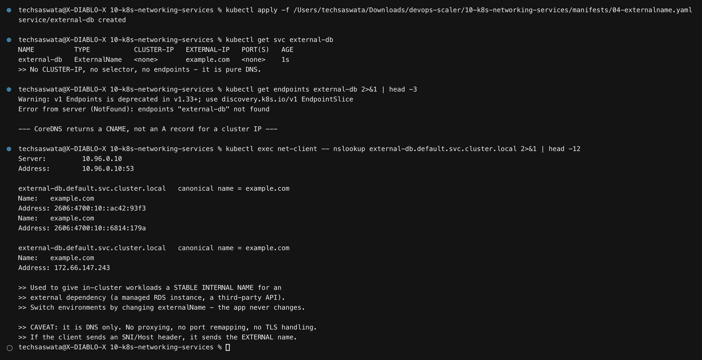

```yaml
spec:
  type: ExternalName
  externalName: example.com
```

```
NAME          TYPE           CLUSTER-IP   EXTERNAL-IP   PORT(S)
external-db   ExternalName   <none>       example.com   <none>
```

**No ClusterIP, no selector, no endpoints, no proxying.** CoreDNS simply returns a CNAME.

The value is indirection: your app connects to `external-db` in every environment, and you
point that name at a different managed database per cluster by changing one field. The app's
config never changes.

**Caveats that matter:** it is DNS only. No port remapping, no health checking, and the
client sends the *external* hostname in SNI and the `Host` header — so TLS and virtual
hosting behave as if you had typed the real name.

---

## 7. Headless Service — no virtual IP

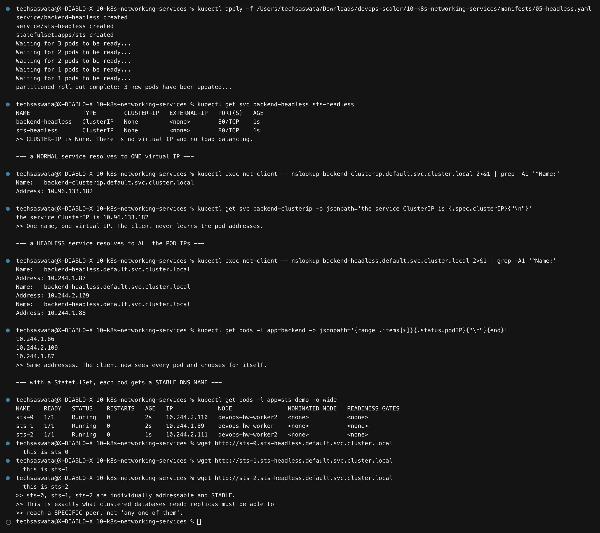

```yaml
spec:
  clusterIP: None      # ← this is what makes it headless
```

The contrast is the whole lesson:

```
# normal Service → ONE virtual IP
backend-clusterip.default.svc.cluster.local  →  10.96.133.182

# headless Service → ALL the pod IPs
backend-headless.default.svc.cluster.local   →  10.244.1.87
                                             →  10.244.2.109
                                             →  10.244.1.86
```

Those match the actual pod IPs exactly. There is no load balancing — DNS hands the client
every address and the client chooses.

### Stable per-pod DNS with a StatefulSet

```
sts-0.sts-headless.default.svc.cluster.local  →  this is sts-0
sts-1.sts-headless.default.svc.cluster.local  →  this is sts-1
sts-2.sts-headless.default.svc.cluster.local  →  this is sts-2
```

**Each pod is individually and stably addressable.** This is exactly what clustered
databases need — a replica must reach a *specific* peer to replicate to, not "any one of
them". Kafka, Cassandra, etcd and MongoDB replica sets all depend on it.

---

## 8. All five, side by side

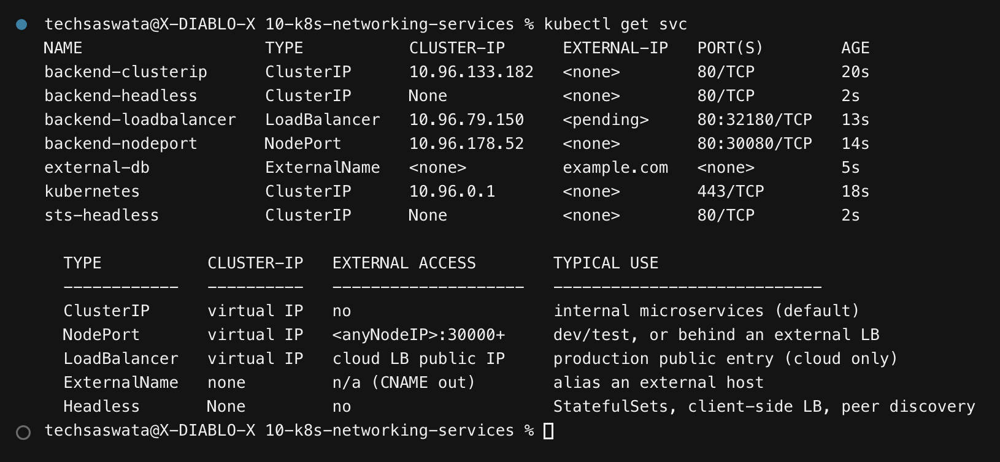

| Type | ClusterIP | External access | Load balanced | Typical use |
|---|---|---|---|---|
| **ClusterIP** | virtual IP | ✗ | ✓ | internal microservices (the default) |
| **NodePort** | virtual IP | `<anyNodeIP>:30000+` | ✓ | dev/test, or behind an external LB |
| **LoadBalancer** | virtual IP | cloud LB public IP | ✓ | production public entry (cloud only) |
| **ExternalName** | none | n/a (CNAME out) | ✗ | alias an external host |
| **Headless** | `None` | ✗ | ✗ (client-side) | StatefulSets, peer discovery |

---

# Cluster DNS

## CoreDNS and `/etc/resolv.conf`

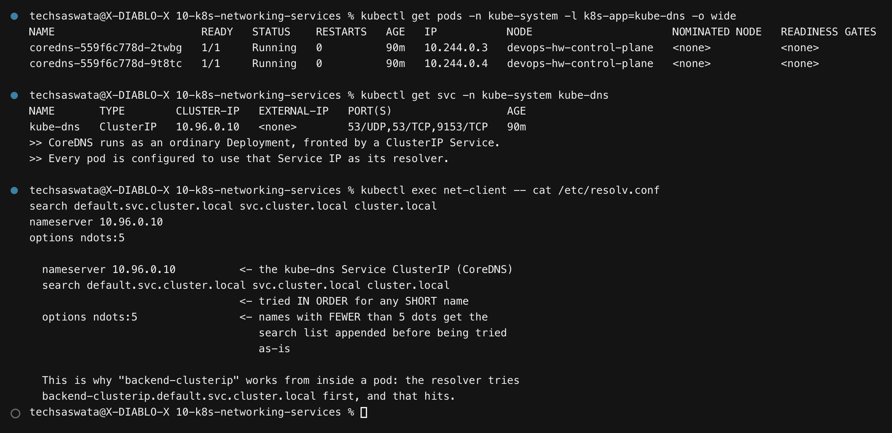

CoreDNS runs as an ordinary Deployment behind a ClusterIP Service, and every pod is pointed
at that Service IP:

```
nameserver 10.96.0.10                                    ← the kube-dns Service IP
search default.svc.cluster.local svc.cluster.local cluster.local
options ndots:5
```

- **`search`** is why the short name `backend-clusterip` works: the resolver appends each
  suffix in turn until one hits.
- **`ndots:5`** means any name with fewer than 5 dots gets the search list applied *before*
  being tried as-is. A side effect is that looking up `api.github.com` (2 dots) costs three
  failed cluster lookups first — a well-known source of DNS latency in Kubernetes.

## FQDN anatomy

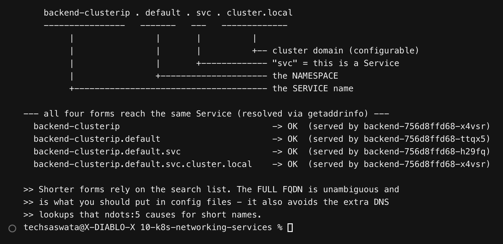

```
backend-clusterip . default . svc . cluster.local
       │              │        │          │
       │              │        │          └── cluster domain
       │              │        └───────────── "svc" = a Service (vs "pod")
       │              └────────────────────── the namespace
       └───────────────────────────────────── the Service name
```

All four progressively-shorter forms reach the same Service:

```
backend-clusterip                            -> OK
backend-clusterip.default                    -> OK
backend-clusterip.default.svc                -> OK
backend-clusterip.default.svc.cluster.local  -> OK
```

> **A tooling gotcha worth recording:** busybox's `nslookup` applet does **not** walk the
> `search` list the way the normal resolver does, so it reports `NXDOMAIN` for the short
> forms even though they work perfectly. The demo therefore tests by *connecting*, which
> goes through `getaddrinfo()` and does honour `search` and `ndots`. If `nslookup` says a
> name doesn't resolve but your app connects fine, this is why.

## Cross-namespace resolution

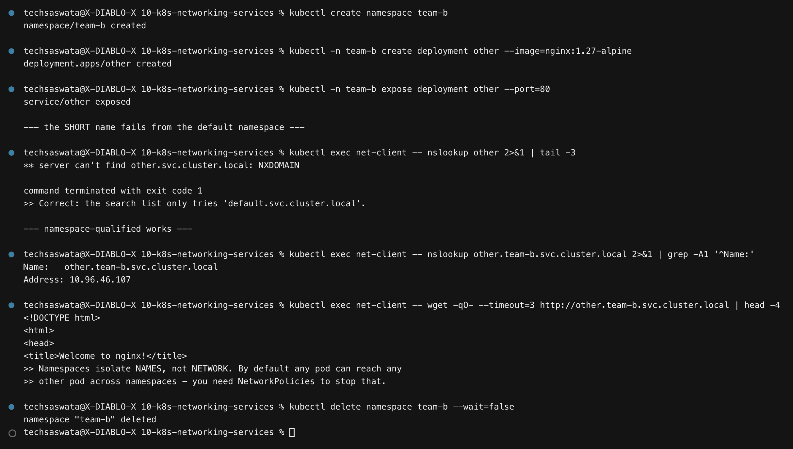

A Service in another namespace is **not** reachable by short name — the search list only
covers your own namespace. `other.team-b.svc.cluster.local` works.

> **Namespaces isolate names, not network.** By default any pod can reach any other pod in
> any namespace. Stopping that requires **NetworkPolicies**.

## Pod DNS vs Service DNS

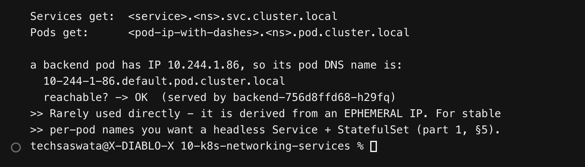

Pods also get a DNS name, derived from their IP:
`10-244-1-86.default.pod.cluster.local`. It resolves, but it is built from an **ephemeral**
IP, so it is rarely useful. For stable per-pod names, use a headless Service with a
StatefulSet.

---

## 9. How traffic actually flows — `kube-proxy`

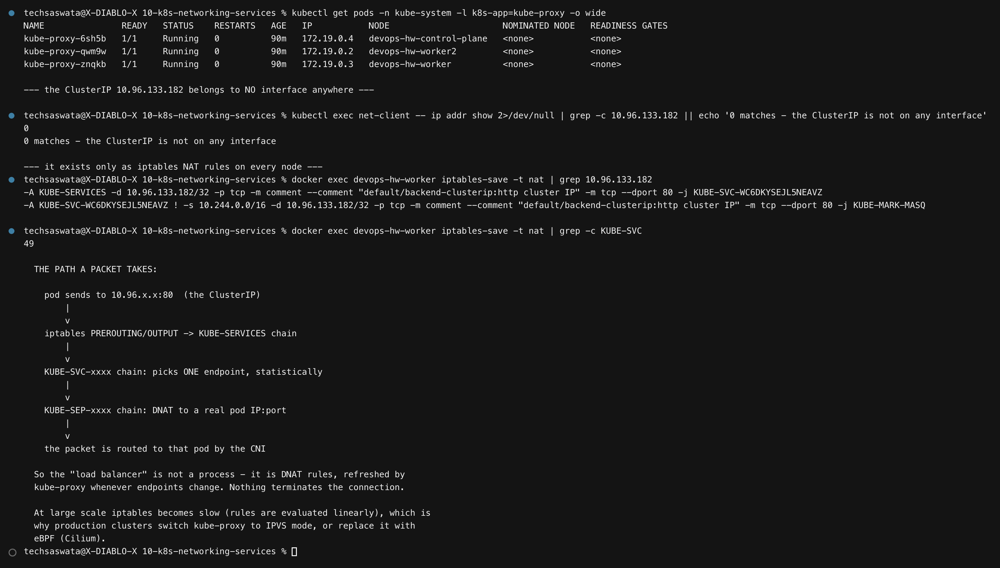

A ClusterIP is **virtual**: no interface anywhere holds that address. It exists only as
iptables NAT rules on every node, which the output dumps directly:

```
-A KUBE-SERVICES -d 10.96.133.182/32 -p tcp --dport 80 -j KUBE-SVC-WC6DKYSEJL5NEAVZ
```

with **49** `KUBE-SVC` chains on that one node.

```
pod sends to 10.96.133.182:80
      │
      ▼  iptables PREROUTING/OUTPUT → KUBE-SERVICES
KUBE-SVC-xxxx    picks ONE endpoint, statistically
      │
      ▼
KUBE-SEP-xxxx    DNAT to a real pod IP:port
      │
      ▼  routed to that pod by the CNI
```

**The "load balancer" is not a process.** Nothing terminates the connection — it is DNAT,
refreshed by `kube-proxy` whenever endpoints change. Consequences: it is L4 only (no
path-based routing, no HTTP awareness), and balancing is random per-connection rather than
round-robin.

At scale, iptables rules are evaluated linearly and become slow, which is why large clusters
switch `kube-proxy` to **IPVS** mode or replace it entirely with **eBPF** (Cilium).

---

## 10. Troubleshooting: a Service with no endpoints

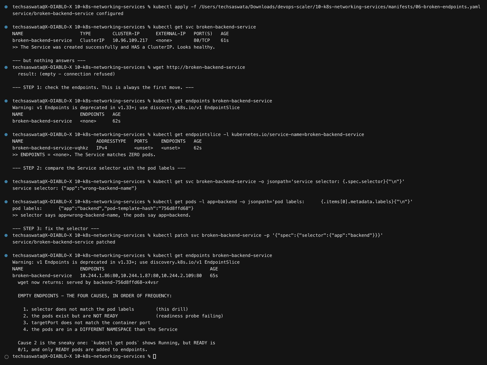

[`06-broken-endpoints.yaml`](manifests/06-broken-endpoints.yaml) selects
`app: wrong-backend-name` while the pods are labelled `app: backend`. The Service is created
**successfully**, gets a ClusterIP, and looks perfectly healthy — but nothing answers.

**Step 1 — check endpoints. Always the first move.**

```
NAME                     ENDPOINTS   AGE
broken-backend-service   <none>      62s
```

**Step 2 — compare the selector with the pod labels.**

```
service selector: {"app":"wrong-backend-name"}
pod labels:       {"app":"backend","pod-template-hash":"756d8ffd68"}
```

**Step 3 — patch the selector**, and endpoints populate immediately.

### Empty endpoints — the four causes, in order of frequency

1. **Selector doesn't match the pod labels** (this drill)
2. **Pods exist but are not Ready** — a failing readiness probe. `kubectl get pods` shows
   `Running`, but `READY` is `0/1`, and **only Ready pods are added to endpoints.** This is
   the sneaky one.
3. **`targetPort` doesn't match the container's real port**
4. **Pods are in a different namespace** than the Service

---

## 11. A Service without a selector

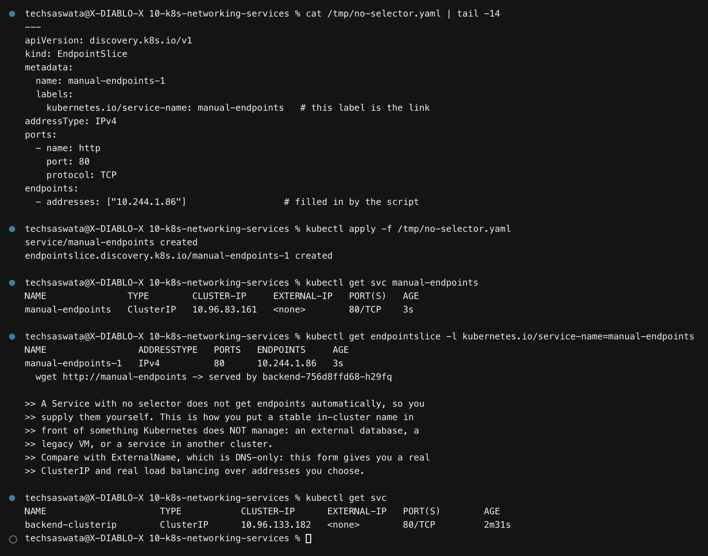

Omit the selector and Kubernetes will not populate endpoints — so you supply them yourself
via an `EndpointSlice`:

```yaml
kind: EndpointSlice
metadata:
  labels:
    kubernetes.io/service-name: manual-endpoints   # this label is the link
endpoints:
  - addresses: ["10.244.1.86"]
```

This is how you put a stable in-cluster name in front of something Kubernetes does **not**
manage — an external database, a legacy VM, a service in another cluster.

Compared with `ExternalName`, which is DNS-only, this form gives you a **real ClusterIP and
real load balancing** over addresses you choose. It is a favourite senior-level interview
question.

---

## Command reference

| Task | Command |
|---|---|
| List services | `kubectl get svc` |
| Service detail | `kubectl describe svc <name>` |
| **Which pods back it?** | `kubectl get endpointslice -l kubernetes.io/service-name=<svc>` |
| Expose a deployment quickly | `kubectl expose deployment <d> --port=80 --type=NodePort` |
| Test DNS from a pod | `kubectl exec <pod> -- nslookup <svc>.<ns>.svc.cluster.local` |
| Test connectivity | `kubectl exec <pod> -- wget -qO- http://<svc>` |
| Temporary access | `kubectl port-forward svc/<name> 8080:80` |
| See kube-proxy rules | `docker exec <node> iptables-save -t nat \| grep KUBE-SVC` |
| CoreDNS logs | `kubectl logs -n kube-system -l k8s-app=kube-dns` |

---

## Files in this folder

```
10-k8s-networking-services/
├── README.md
├── manifests/
│   ├── 00-backend.yaml          the deployment all services point at
│   ├── 01-clusterip.yaml        02-nodeport.yaml      03-loadbalancer.yaml
│   ├── 04-externalname.yaml     05-headless.yaml
│   ├── 06-broken-endpoints.yaml the triage drill
│   └── 07-no-selector.yaml      manual EndpointSlice
├── scripts/                     the two capture scripts
├── outputs/                     545 lines of captured output
└── screenshots/                 the 14 PNGs embedded above
```
