# 11 — Kubernetes Ingress, ConfigMaps & Secrets

**Saswata Das — 24BCS10248**

Run against the live cluster from [module 08](../08-kubernetes-fundamentals/).
Manifests in [`manifests/`](manifests/), raw logs (616 lines) in [`outputs/`](outputs/).

```bash
kubectl apply -f https://raw.githubusercontent.com/kubernetes/ingress-nginx/controller-v1.11.3/deploy/static/provider/kind/deploy.yaml
./scripts/01-configmaps-secrets.sh   # ConfigMaps, Secrets, injection
./scripts/02-ingress.sh              # path routing, host routing, TLS
./scripts/03-config-updates.sh       # what happens when config changes
```

## Lab Completion Checklist

The session-12 lab guide ends with a ten-item checklist. Every item is evidenced below.

| # | Requirement | Where |
|---|---|---|
| 1 | Applied `configmap.yaml` and read a key using `-o jsonpath` | [§2](#2-configmaps--checklist-1) |
| 2 | Applied `secret.yaml` and decoded `POSTGRES_PASSWORD` with `base64 --decode` | [§3](#3-secrets--checklist-2) |
| 3 | Applied `backend.yaml` and verified env vars inside the pod with `kubectl exec` | [§5](#5-injecting-config-into-pods--checklist-3) |
| 4 | Applied `frontend.yaml` and confirmed both services are `ClusterIP` | [§6](#6-the-frontend--configmap-as-a-volume--checklist-4) |
| 5 | Enabled the NGINX Ingress Controller, controller pod `Running` | [§7](#7-ingress-controller-vs-ingress-resource--checklist-5) |
| 6 | Applied `ingress.yaml`, confirmed an `ADDRESS` appeared | [§8](#8-path-based-routing--checklist-6) |
| 7 | Path `/` returns Nginx HTML via `curl -H "Host: yatri.local"` | [§9](#9-testing-the-routes--checklist-7-and-8) |
| 8 | Path `/api/` returns the backend config values | [§9](#9-testing-the-routes--checklist-7-and-8) |
| 9 | Demonstrated the `echo` vs `echo -n` newline bug | [§4](#4-the-echo-vs-echo--n-newline-bug--checklist-9) |
| 10 | Rolling restart after a ConfigMap update loads the new value | [§12](#12-making-an-env-var-change-take-effect--checklist-10) |

---

## 1. Why ConfigMaps exist

Without one, configuration is baked into the image:

```dockerfile
ENV ENVIRONMENT=production      # in the Dockerfile
```

That means a separate image per environment, a rebuild to change a log level, and no way to
inspect current config without cracking the image open. A ConfigMap decouples config from
the image: **one image, many environments.**

---

## 2. ConfigMaps  [checklist 1]

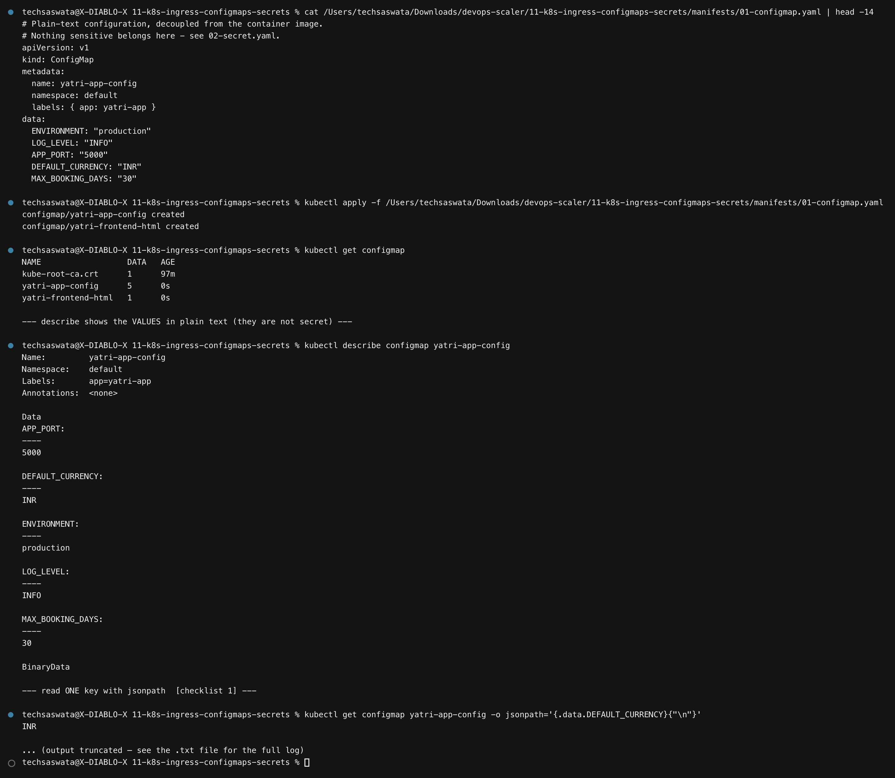

```yaml
apiVersion: v1
kind: ConfigMap
metadata: { name: yatri-app-config }
data:
  ENVIRONMENT: "production"
  LOG_LEVEL: "INFO"
  APP_PORT: "5000"
  DEFAULT_CURRENCY: "INR"
  MAX_BOOKING_DAYS: "30"
```

`kubectl describe` shows the values **in plain text** — correctly, since nothing here is
sensitive. Reading one key:

```bash
kubectl get configmap yatri-app-config -o jsonpath='{.data.DEFAULT_CURRENCY}'   # INR
```

Imperative equivalents (useful, but prefer files in git):

```bash
kubectl create configmap demo --from-literal=KEY=value
kubectl create configmap demo --from-file=./app.properties
kubectl create configmap demo --from-env-file=./.env
```

---

## 3. Secrets  [checklist 2]

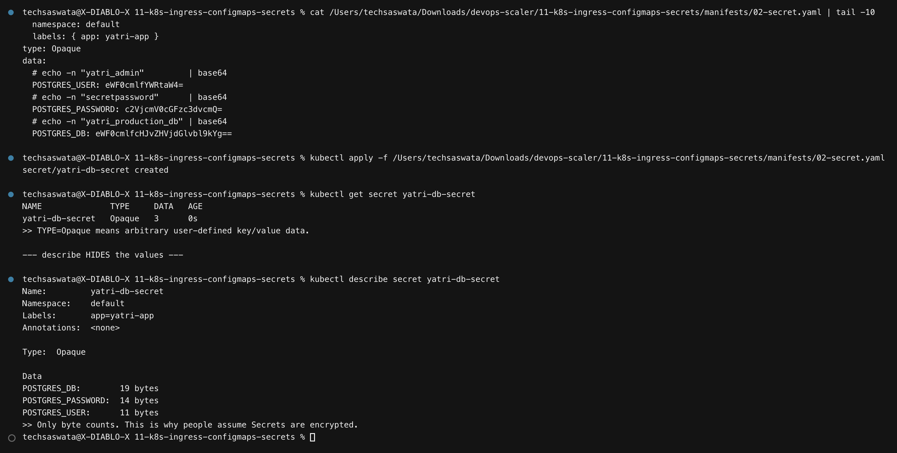

```
NAME              TYPE     DATA   AGE
yatri-db-secret   Opaque   3      1s
```

`kubectl describe secret` shows only **byte counts**, not values. That is exactly why people
assume Secrets are encrypted.

### Base64 is not encryption

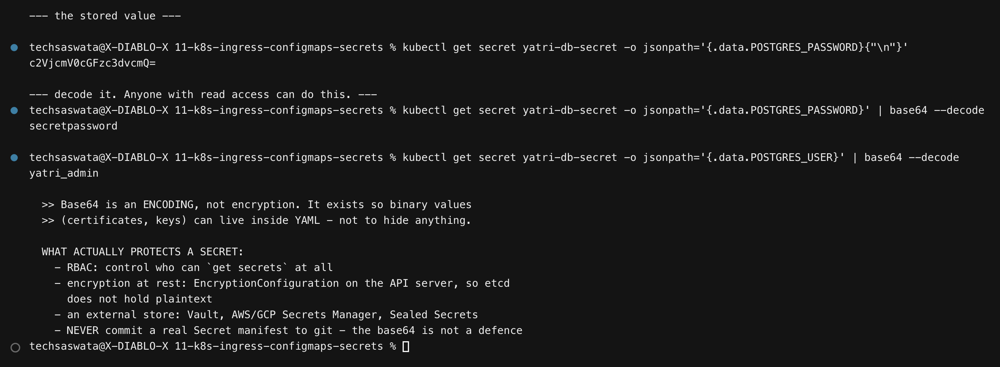

```bash
$ kubectl get secret yatri-db-secret -o jsonpath='{.data.POSTGRES_PASSWORD}' | base64 --decode
secretpassword
```

**Anyone who can read the Secret can read the password.** Base64 is an *encoding*, present
so binary values (certificates, keys) can live inside YAML — not to hide anything.

What actually protects a Secret:

| Control | What it does |
|---|---|
| **RBAC** | restrict who can `get secrets` at all — the primary defence |
| **Encryption at rest** | `EncryptionConfiguration` on the API server, so etcd holds ciphertext |
| **External store** | Vault, AWS/GCP Secrets Manager, Sealed Secrets |
| **Never commit them** | a Secret manifest in git is a plaintext credential in git |

---

## 4. The `echo` vs `echo -n` newline bug  [checklist 9]

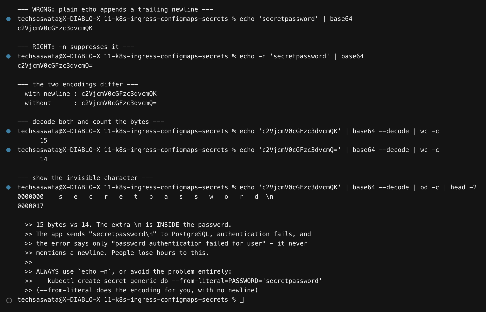

```
$ echo    'secretpassword' | base64   →  c2VjcmV0cGFzc3dvcmQK
$ echo -n 'secretpassword' | base64   →  c2VjcmV0cGFzc3dvcmQ=
```

Different encodings. Decoding and counting bytes shows why:

```
with newline : 15 bytes
without      : 14 bytes
```

And `od -c` makes the culprit visible:

```
0000000   s   e   c   r   e   t   p   a   s   s   w   o   r   d  \n
```

**The `\n` is inside the password.** The app sends `secretpassword\n` to PostgreSQL,
authentication fails, and the error says only *"password authentication failed for user"* —
it never mentions a newline. This costs people hours.

```bash
# always
echo -n 'secretpassword' | base64

# or sidestep it entirely — kubectl encodes for you, with no newline
kubectl create secret generic db --from-literal=PASSWORD='secretpassword'
```

The backend prints `PASSWORD_LENGTH` for exactly this reason: **14** means clean, **15**
means the bug is present.

---

## 5. Injecting config into pods  [checklist 3]

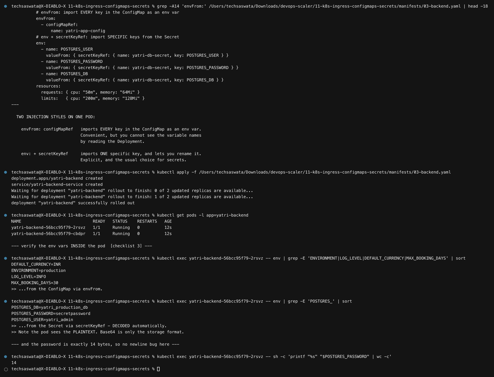

Two injection styles on one pod:

```yaml
# import EVERY key in the ConfigMap as an env var
envFrom:
  - configMapRef: { name: yatri-app-config }

# import ONE specific key from the Secret (and optionally rename it)
env:
  - name: POSTGRES_PASSWORD
    valueFrom:
      secretKeyRef: { name: yatri-db-secret, key: POSTGRES_PASSWORD }
```

| | `envFrom` | `env` + `...KeyRef` |
|---|---|---|
| Scope | every key | one named key |
| Rename | ✗ | ✓ |
| Readable from the Deployment | ✗ you must open the ConfigMap | ✓ explicit |
| Usual choice for | bulk config | **secrets** |

Verified inside the pod:

```
DEFAULT_CURRENCY=INR        ← from the ConfigMap via envFrom
ENVIRONMENT=production
LOG_LEVEL=INFO
MAX_BOOKING_DAYS=30

POSTGRES_DB=yatri_production_db       ← from the Secret via secretKeyRef
POSTGRES_PASSWORD=secretpassword         DECODED automatically
POSTGRES_USER=yatri_admin
```

> **The pod sees plaintext.** Base64 is purely the storage format; the kubelet decodes
> before injection. And the password measures exactly **14** bytes — no newline bug.

---

## 6. The frontend — ConfigMap as a volume  [checklist 4]

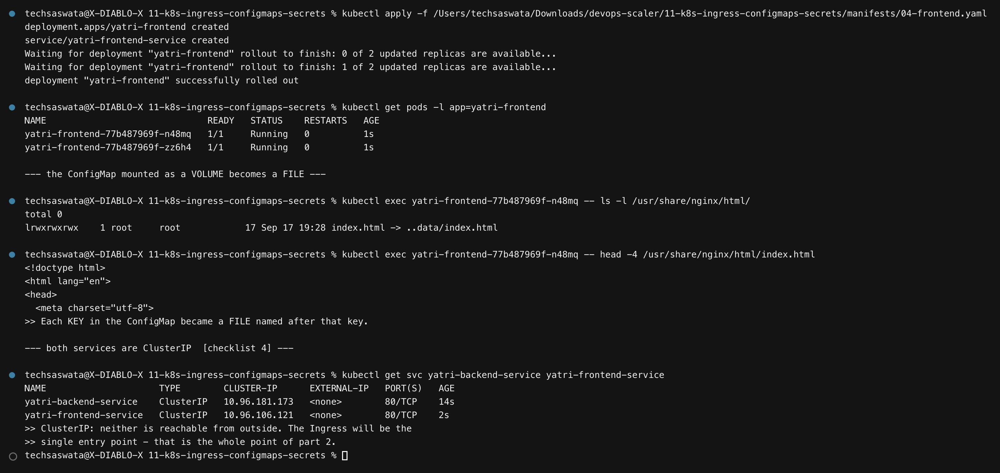

The third way to consume a ConfigMap is to mount it, which turns **each key into a file**:

```yaml
volumes:
  - name: html
    configMap: { name: yatri-frontend-html }
volumeMounts:
  - { name: html, mountPath: /usr/share/nginx/html }
```

```
$ kubectl exec <pod> -- ls -l /usr/share/nginx/html/
index.html -> ..data/index.html
```

Note it is a **symlink** — the kubelet manages a projected directory so it can swap contents
atomically. That mechanism is what makes §11's live update possible.

Both services are `ClusterIP`, so neither is reachable from outside. The Ingress will be the
single entry point.

---

## 7. Ingress controller vs Ingress resource  [checklist 5]

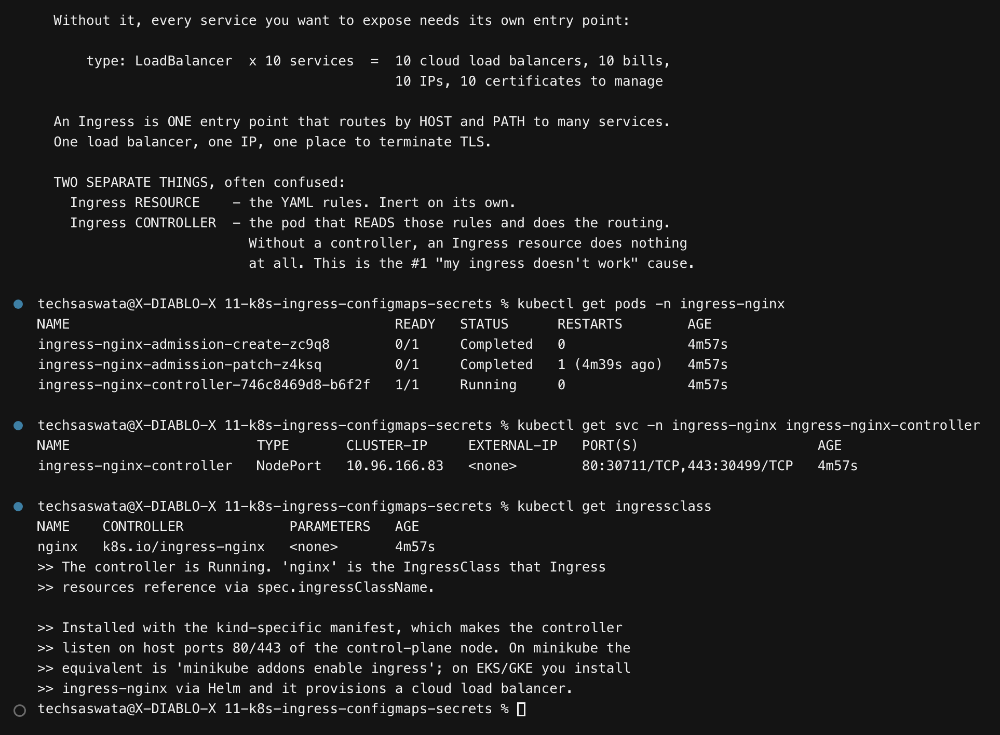

Without Ingress, every exposed service needs its own entry point: **10 `type: LoadBalancer`
services = 10 cloud load balancers, 10 bills, 10 IPs, 10 certificates.**

Two separate things, constantly confused:

| | What it is |
|---|---|
| **Ingress resource** | the YAML rules. **Inert on its own.** |
| **Ingress controller** | the pod that *reads* those rules and does the routing |

> **Without a controller, an Ingress resource does nothing at all.** This is the number-one
> cause of "my Ingress doesn't work" — the object exists, `kubectl get ingress` shows it,
> and nothing happens.

```
NAME                                        READY   STATUS
ingress-nginx-controller-746c8469d8-b6f2f   1/1     Running
```

The install differs per platform: the **kind** manifest used here binds the controller to
host ports 80/443; minikube uses `minikube addons enable ingress`; on EKS/GKE you install
ingress-nginx via Helm and it provisions a cloud load balancer.

---

## 8. Path-based routing  [checklist 6]

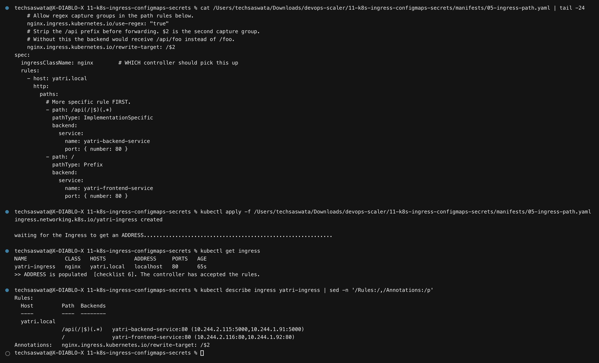

```yaml
annotations:
  nginx.ingress.kubernetes.io/ssl-redirect: "false"
  nginx.ingress.kubernetes.io/use-regex: "true"
  nginx.ingress.kubernetes.io/rewrite-target: /$2
spec:
  ingressClassName: nginx
  rules:
    - host: yatri.local
      http:
        paths:
          - path: /api(/|$)(.*)      # more specific rule FIRST
            backend: { service: { name: yatri-backend-service,  port: { number: 80 } } }
          - path: /
            backend: { service: { name: yatri-frontend-service, port: { number: 80 } } }
```

```
NAME            CLASS   HOSTS         ADDRESS     PORTS   AGE
yatri-ingress   nginx   yatri.local   localhost   80      5s
```

**`ADDRESS` is populated** — the controller accepted the rules.

`rewrite-target: /$2` is doing real work: the request arrives as `/api/` but the backend is
asked for `/`. Without it the backend would receive `/api/` and return 404.

---

## 9. Testing the routes  [checklist 7 and 8]

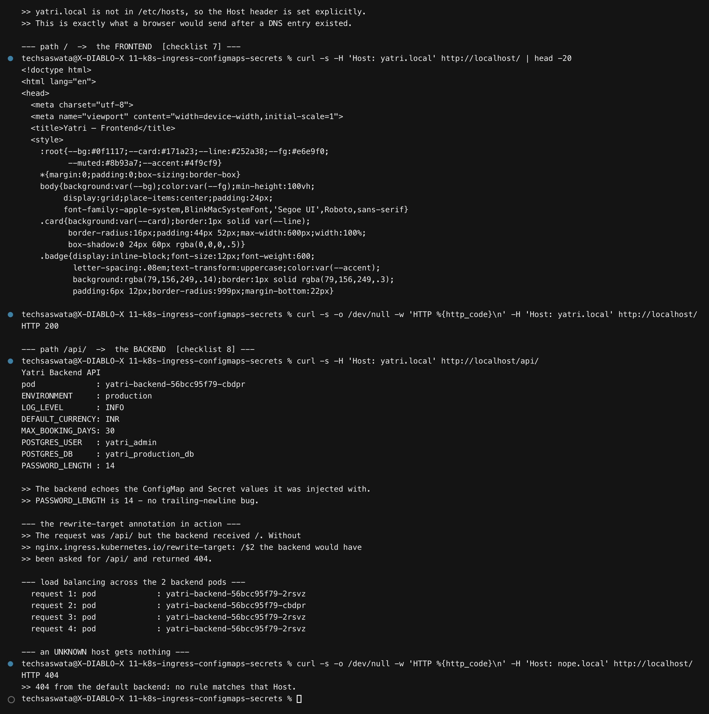

`yatri.local` is not in `/etc/hosts`, so the `Host` header is set explicitly — exactly what a
browser would send once DNS existed.

### Path `/` → the frontend  [checklist 7]

```bash
curl -s -o /dev/null -w '%{http_code}' -H 'Host: yatri.local' http://localhost/   # 200
```


### Path `/api/` → the backend  [checklist 8]

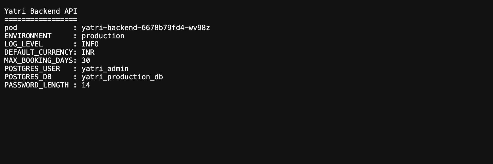

```
Yatri Backend API
=================
pod             : yatri-backend-7bffcdfc8f-8txsn
ENVIRONMENT     : production
LOG_LEVEL       : INFO
DEFAULT_CURRENCY: INR
MAX_BOOKING_DAYS: 30
POSTGRES_USER   : yatri_admin
POSTGRES_DB     : yatri_production_db
PASSWORD_LENGTH : 14
```

Every value came from the ConfigMap or the Secret. Four consecutive requests land on both
backend pods, so the Ingress is load balancing through the Service.

An **unknown host returns 404** from the default backend — no rule matches it.

---

## 10. Host-based routing

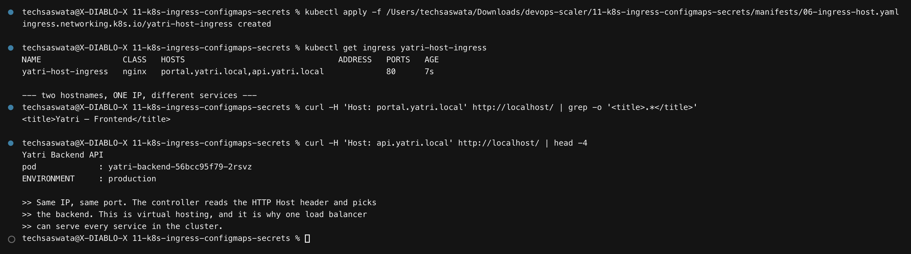

Two hostnames, **one IP, one port**, different services:

| Host | → Service |
|---|---|
| `portal.yatri.local` | `yatri-frontend-service` |
| `api.yatri.local` | `yatri-backend-service` |


The controller reads the HTTP `Host` header and picks the backend. This is virtual hosting,
and it is why **one** load balancer can serve every service in a cluster.

---

## 11. TLS termination

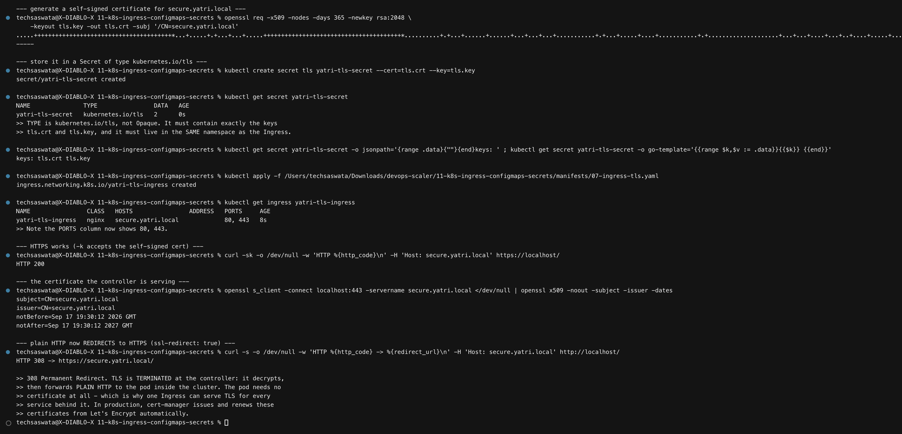

```bash
openssl req -x509 -nodes -days 365 -newkey rsa:2048 \
  -keyout tls.key -out tls.crt -subj "/CN=secure.yatri.local"

kubectl create secret tls yatri-tls-secret --cert=tls.crt --key=tls.key
```

```
NAME               TYPE                DATA   AGE
yatri-tls-secret   kubernetes.io/tls   2      0s
```

> The type is **`kubernetes.io/tls`**, not `Opaque`. It must contain exactly the keys
> `tls.crt` and `tls.key`, and it must live in the **same namespace** as the Ingress.

```yaml
spec:
  tls:
    - hosts: [secure.yatri.local]
      secretName: yatri-tls-secret
```

The `PORTS` column becomes `80, 443`. Results:

```
HTTPS request                          →  HTTP 200
certificate served                     →  subject=CN=secure.yatri.local
                                          notAfter=Sep 17 19:30:12 2027 GMT
plain HTTP with ssl-redirect: "true"   →  HTTP 308 → https://secure.yatri.local/
```

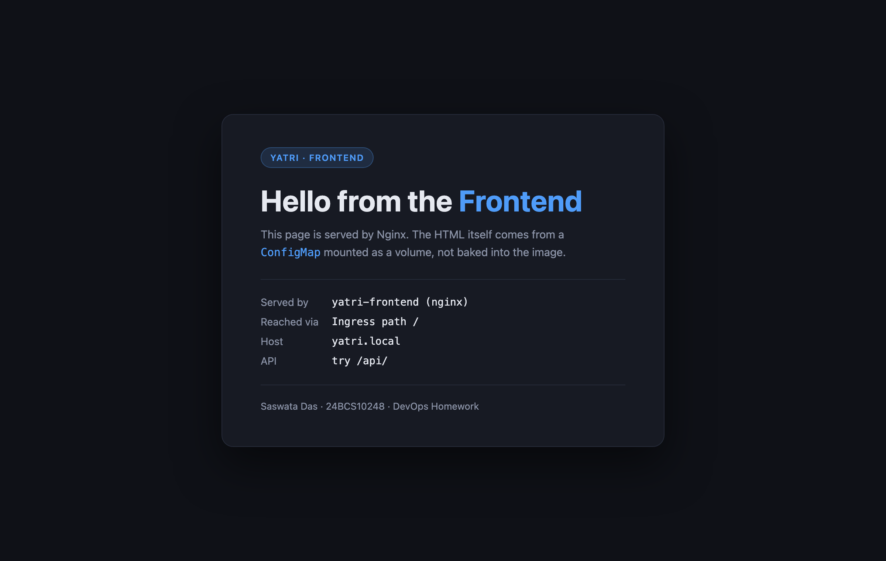

**TLS is *terminated* at the controller**: it decrypts, then forwards **plain HTTP** to the
pod inside the cluster. The pod needs no certificate at all — which is precisely why one
Ingress can serve TLS for every service behind it.

In production, **cert-manager** issues and renews these certificates from Let's Encrypt
automatically, and you never run `openssl` by hand.

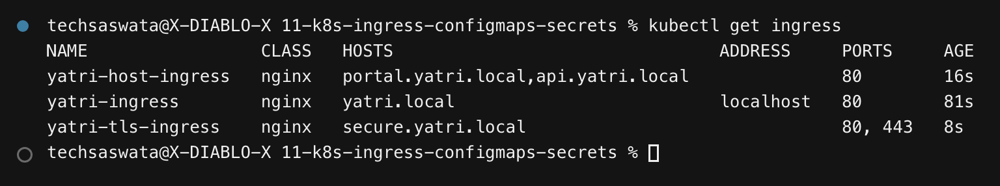

---

## 12. What happens when config changes

### Env vars do **not** update  [the trap]

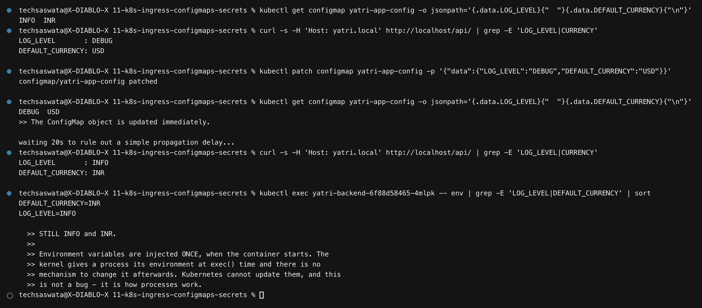

The ConfigMap is patched to `LOG_LEVEL=DEBUG`, `DEFAULT_CURRENCY=USD`. The object updates
instantly. The running pods, even 20 seconds later:

```
LOG_LEVEL       : INFO
DEFAULT_CURRENCY: INR
```

> **Environment variables are injected once, at container start.** The kernel hands a process
> its environment at `exec()` and there is no mechanism to change it afterwards. Kubernetes
> cannot update them — this is not a bug, it is how processes work.

### Volume-mounted ConfigMaps **do** update live

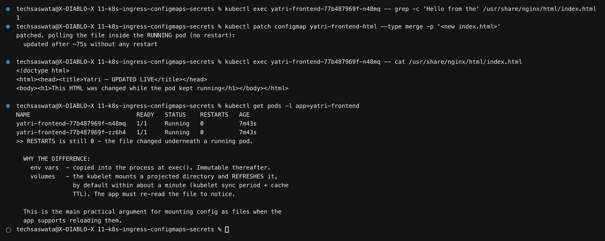

Patching the HTML ConfigMap changed the file **inside the running pod after ~45 seconds**,
with `RESTARTS` still `0`.

| | env vars | volume mounts |
|---|---|---|
| Updated in a running pod | ❌ never | ✅ after ~1 min |
| Mechanism | copied at `exec()` | kubelet refreshes a projected dir |
| App must | be restarted | re-read the file |

> A detail worth knowing: the two frontend pods refreshed **~25 seconds apart**. Each
> kubelet syncs on its own schedule, so during a config change your replicas are briefly
> **inconsistent with each other**. If that matters, do a rolling restart instead of relying
> on live refresh.

### 12. Making an env-var change take effect  [checklist 10]

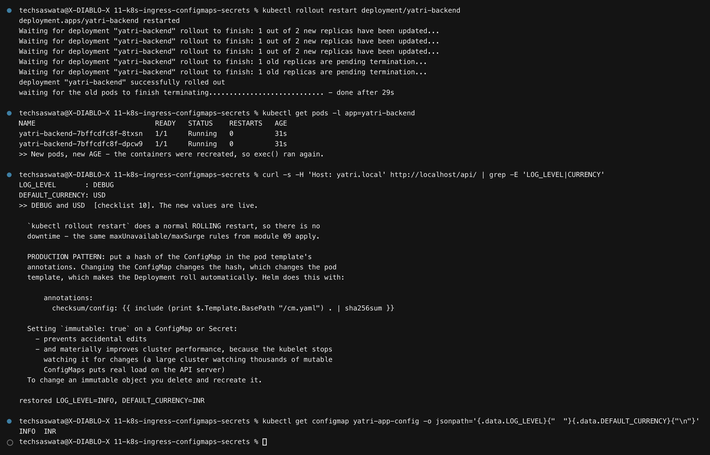

```bash
kubectl rollout restart deployment/yatri-backend
```

```
LOG_LEVEL       : DEBUG
DEFAULT_CURRENCY: USD
```

`rollout restart` is a normal **rolling** restart, so there is no downtime — the same
`maxUnavailable`/`maxSurge` rules from [module 09](../09-k8s-pods-replicasets-deployments/)
apply.

> **A real bug this demo hit:** `kubectl rollout status` returns while the old pods are still
> `Terminating`, and a terminating pod can still be in the Service endpoints for a moment.
> The first version of this script curled immediately and got the **old** value back, under a
> caption claiming the new one. The script now waits for every old pod to disappear before
> asserting anything.

**Production pattern:** put a hash of the ConfigMap in the pod template's annotations.
Changing the ConfigMap changes the hash, which changes the pod template, which makes the
Deployment roll automatically. Helm does exactly this:

```yaml
annotations:
  checksum/config: {{ include (print $.Template.BasePath "/cm.yaml") . | sha256sum }}
```

### Immutable ConfigMaps

Setting `immutable: true` prevents accidental edits **and** materially improves performance —
the kubelet stops watching the object for changes, which matters on a cluster with thousands
of them. To change an immutable object you delete and recreate it.

---

## Command reference

| Task | Command |
|---|---|
| Create a ConfigMap | `kubectl create configmap x --from-literal=K=V` / `--from-file=` |
| Create a Secret | `kubectl create secret generic x --from-literal=K=V` |
| Create a TLS Secret | `kubectl create secret tls x --cert=tls.crt --key=tls.key` |
| Read one key | `kubectl get cm x -o jsonpath='{.data.KEY}'` |
| **Decode a Secret** | `kubectl get secret x -o jsonpath='{.data.K}' \| base64 --decode` |
| Decode every key | `kubectl get secret x -o go-template='{{range $k,$v := .data}}{{$k}}={{$v\|base64decode}}{{"\n"}}{{end}}'` |
| Edit in place | `kubectl edit configmap x` |
| Apply a change | `kubectl rollout restart deployment/y` |
| List ingresses | `kubectl get ingress` |
| Why isn't it routing? | `kubectl describe ingress x` → check Rules and Events |
| Controller logs | `kubectl logs -n ingress-nginx -l app.kubernetes.io/component=controller` |
| Test a host rule | `curl -H 'Host: yatri.local' http://localhost/` |

---

## Files in this folder

```
11-k8s-ingress-configmaps-secrets/
├── README.md
├── manifests/
│   ├── 01-configmap.yaml     app config + the frontend HTML ConfigMap
│   ├── 02-secret.yaml        Opaque secret, base64 with echo -n
│   ├── 03-backend.yaml       envFrom + secretKeyRef, ClusterIP Service
│   ├── 04-frontend.yaml      ConfigMap mounted as a volume
│   ├── 05-ingress-path.yaml  path-based routing with rewrite-target
│   ├── 06-ingress-host.yaml  host-based (virtual host) routing
│   └── 07-ingress-tls.yaml   TLS termination
├── scripts/                  the three capture scripts
├── outputs/                  616 lines of captured output
└── screenshots/              20 PNGs — 15 terminal + 5 browser
```
