# 12 — Kubernetes Storage, HPA & Probes

**Saswata Das — 24BCS10248** · Session 13

Run against the live 3-node cluster from [module 08](../08-kubernetes-fundamentals/).
Manifests in [`manifests/`](manifests/), raw logs (778 lines) in [`outputs/`](outputs/).

```bash
./scripts/01-volumes.sh        # emptyDir, hostPath, PV/PVC, dynamic provisioning
./scripts/02-hpa.sh            # HPA end to end with a real load generator
./scripts/03-probes.sh         # startup / readiness / liveness
./scripts/04-mini-project.sh   # all three combined
```

## Task coverage

| # | Task | Deliverable | Status |
|---|---|---|---|
| 1 | Kubernetes Volumes documentation | [`01-kubernetes-volumes/README.md`](01-kubernetes-volumes/README.md) — emptyDir, hostPath, PV, PVC, StorageClass, dynamic provisioning, each with a working example | ✔ |
| 2 | HPA hands-on | Deploy → configure HPA → load generator → observe CPU → observe scaling, with `get hpa` / `top pods` / `describe hpa` | ✔ |
| 3 | Mini project | [`mini-project/`](mini-project/) — PVC + init container + all three probes + HPA in one namespace | ✔ |

---

# Part 1 — Volumes

The full write-up is the required deliverable in
[`01-kubernetes-volumes/README.md`](01-kubernetes-volumes/README.md). The evidence:

### StorageClasses on this cluster

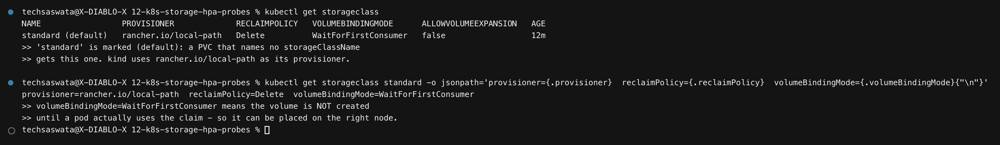

```
provisioner=rancher.io/local-path  reclaimPolicy=Delete  volumeBindingMode=WaitForFirstConsumer
```

### `emptyDir` — dies with the pod

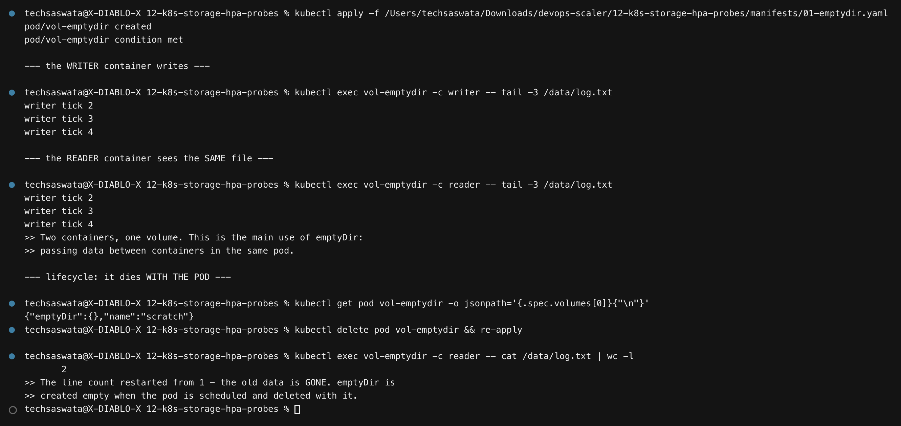

A `writer` container appends to `/data/log.txt`; a `reader` container in the **same pod**
reads the identical file. After deleting and recreating the pod the line count restarts
from 1 — the data is gone.

### `hostPath` — survives the pod, tied to one node

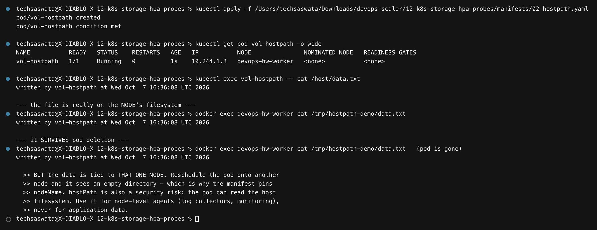

The file written by the pod is readable directly on the node
(`docker exec devops-hw-worker cat /tmp/hostpath-demo/data.txt`) and is **still there after
the pod is deleted**.

### PV + PVC — static provisioning

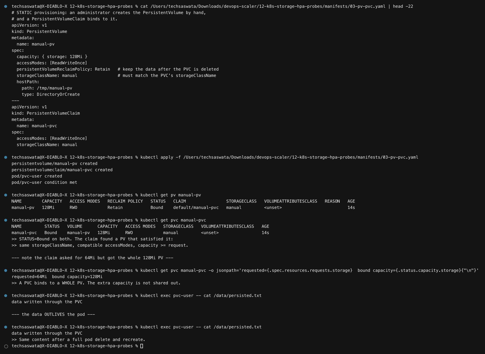

Both go `Bound`, and the data survives a full pod delete-and-recreate.

> The claim requested `64Mi` and bound to the `128Mi` PV — getting **the whole thing**. A
> PVC binds to an entire PV; the surplus is not shared out.

### Dynamic provisioning

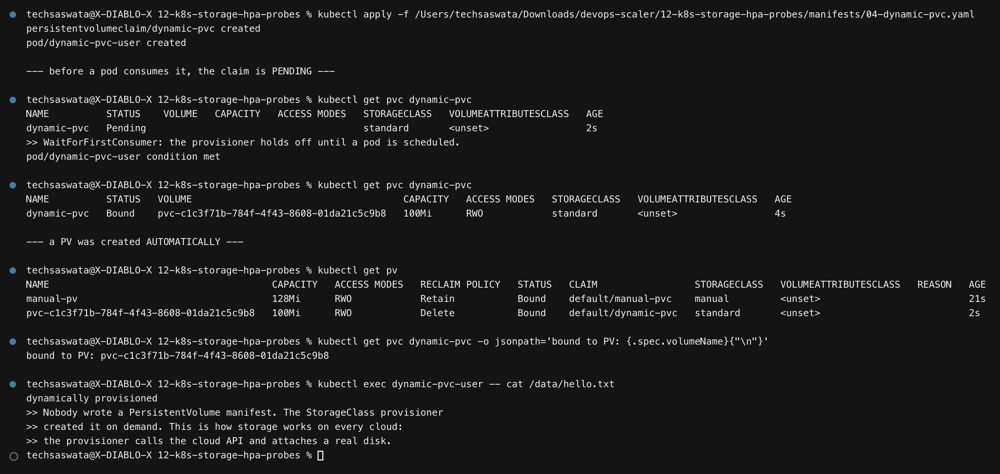

```
dynamic-pvc   Pending                                        standard    ← before a pod uses it
dynamic-pvc   Bound     pvc-c1c3f71b-...   100Mi   RWO       standard    ← after
```

**Nobody wrote a PersistentVolume.** The provisioner created `pvc-c1c3f71b-…` on demand.

> The `Pending` is not a fault. `volumeBindingMode: WaitForFirstConsumer` holds the volume
> back until a pod is scheduled, so the disk can be created on the right node or
> availability zone. A PVC pending **with** a pod attached is the one that's actually broken.

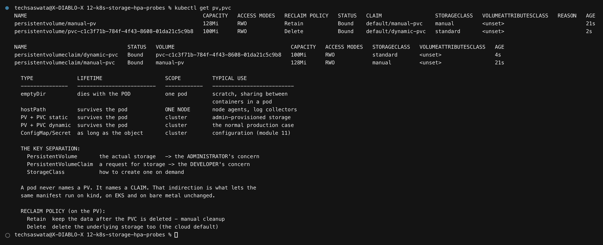

---

# Part 2 — Horizontal Pod Autoscaler

### metrics-server — the prerequisite everyone forgets

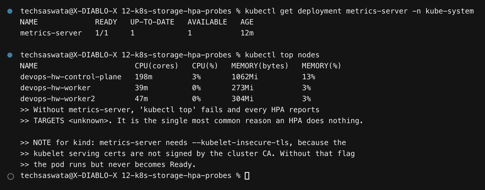

```
$ kubectl top nodes
devops-hw-control-plane   181m   3%    750Mi   9%
devops-hw-worker           45m   0%    184Mi   2%
```

> **On kind, metrics-server needs `--kubelet-insecure-tls`** — the kubelet serving certs
> aren't signed by the cluster CA, so without it the pod runs but never becomes Ready, and
> every HPA sits at `<unknown>` forever.

### Deploying the HPA

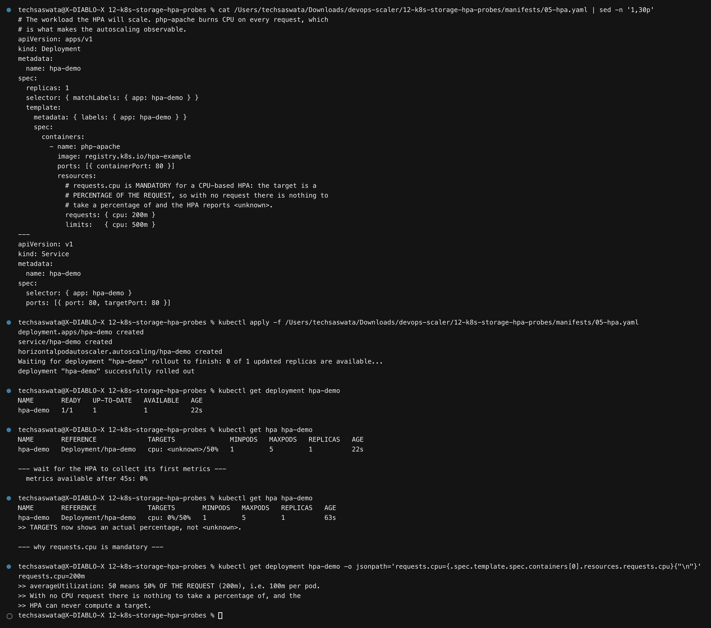

```yaml
resources:
  requests: { cpu: 200m }     # MANDATORY
...
target:
  type: Utilization
  averageUtilization: 50      # = 50% of the request = 100m per pod
```

> **`requests.cpu` is not optional.** `averageUtilization` is a *percentage of the request*.
> With no request there is nothing to take a percentage of, and the HPA can never compute a
> target.

### Baseline, then load

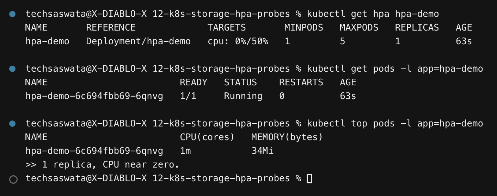
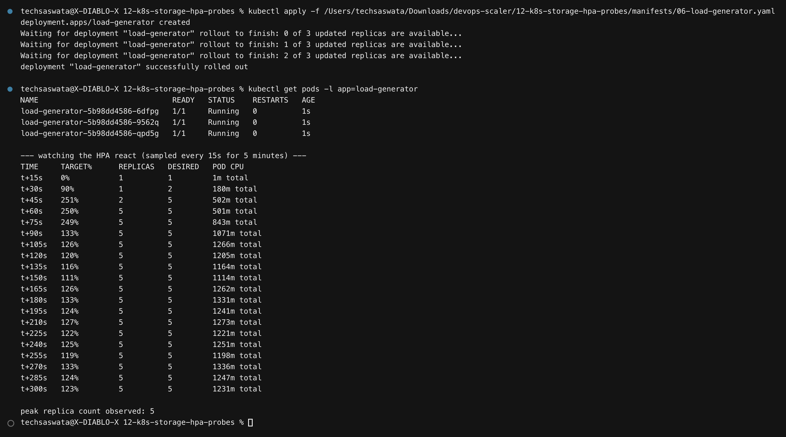

Three looping clients hammer the Service. The HPA reacts:

```
TIME     TARGET%   REPLICAS   DESIRED   POD CPU
t+15s    0%        1          1         1m total
t+30s    90%       1          2         180m total
t+45s    251%      2          5         502m total
t+60s    250%      5          5         501m total
...
t+300s   123%      5          5         1231m total
```

**1 → 2 → 5 replicas**, capped at `maxReplicas: 5`. CPU climbed from 1m to ~1300m total.

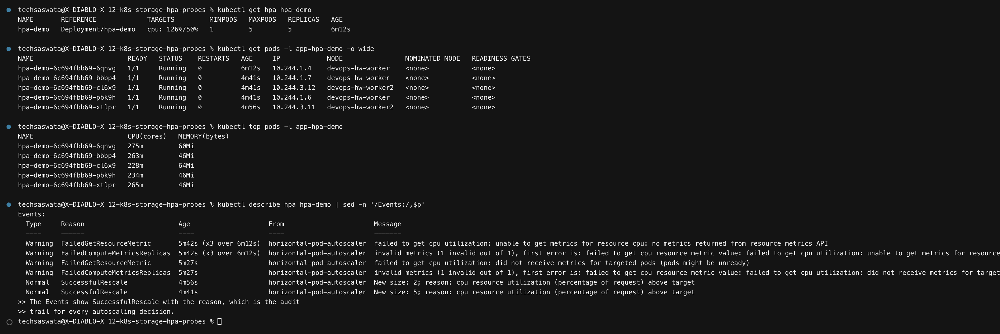

The `describe hpa` events are the audit trail for every decision:

```
Normal  SuccessfulRescale  New size: 2; reason: cpu resource utilization (percentage of request) above target
Normal  SuccessfulRescale  New size: 5; reason: cpu resource utilization (percentage of request) above target
```

> The earlier `FailedGetResourceMetric` warnings in the same event list are worth reading —
> that's the `<unknown>` window before metrics-server has scraped the new pods. It resolves
> itself after ~30s; people often "fix" it by deleting the HPA and recreating it, which
> just restarts the same wait.

### Removing the load

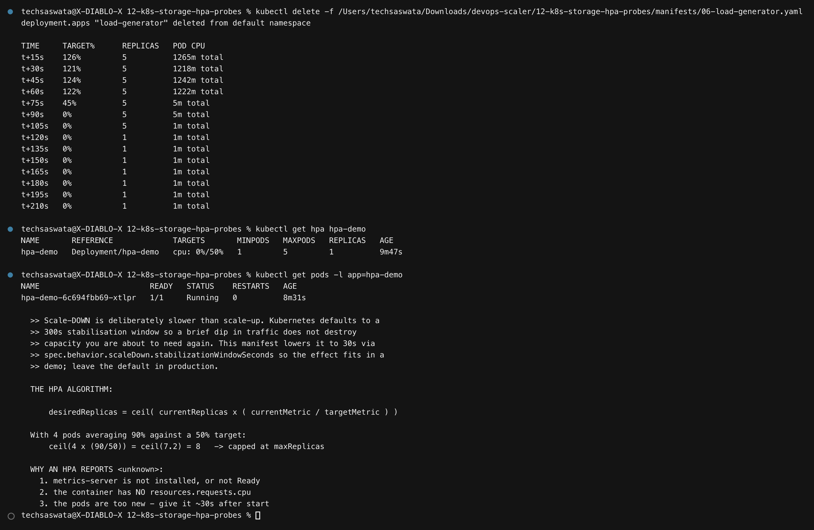

```
t+60s    122%   5   1222m
t+75s    45%    5   5m        ← load generator deleted
t+120s   0%     1   1m        ← scaled back to minReplicas
```

> **Scale-down is deliberately slower than scale-up.** The default stabilisation window is
> **300s**, so a brief dip in traffic doesn't destroy capacity you're about to need again.
> This manifest sets `behavior.scaleDown.stabilizationWindowSeconds: 30` so the effect fits
> in a demo — **leave the default in production.**

### The algorithm

```
desiredReplicas = ceil( currentReplicas × ( currentMetric / targetMetric ) )
```

With 4 pods averaging 90% against a 50% target: `ceil(4 × 90/50) = ceil(7.2) = 8`, then
capped at `maxReplicas`.

**Why an HPA shows `<unknown>`:** metrics-server missing or not Ready · no
`resources.requests.cpu` · pods too new.

---

# Part 3 — Probes

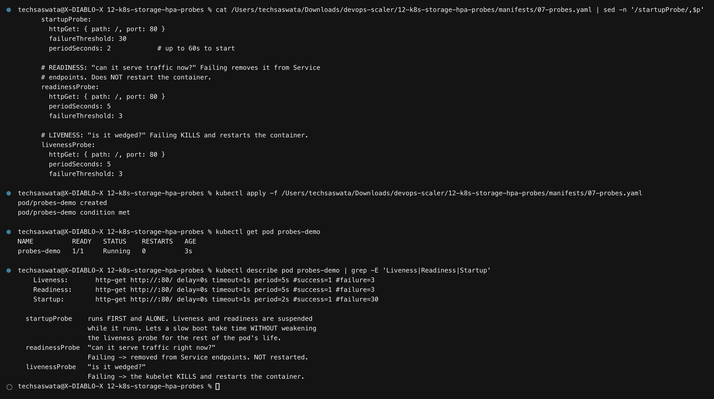

| Probe | Question | Effect of failure |
|---|---|---|
| **startup** | "has it finished booting?" | runs **first and alone**; suspends the other two |
| **readiness** | "can it serve traffic *now*?" | removed from Service endpoints — **not** restarted |
| **liveness** | "is it wedged?" | the kubelet **kills and restarts** it |

### Readiness gates Service endpoints — proven

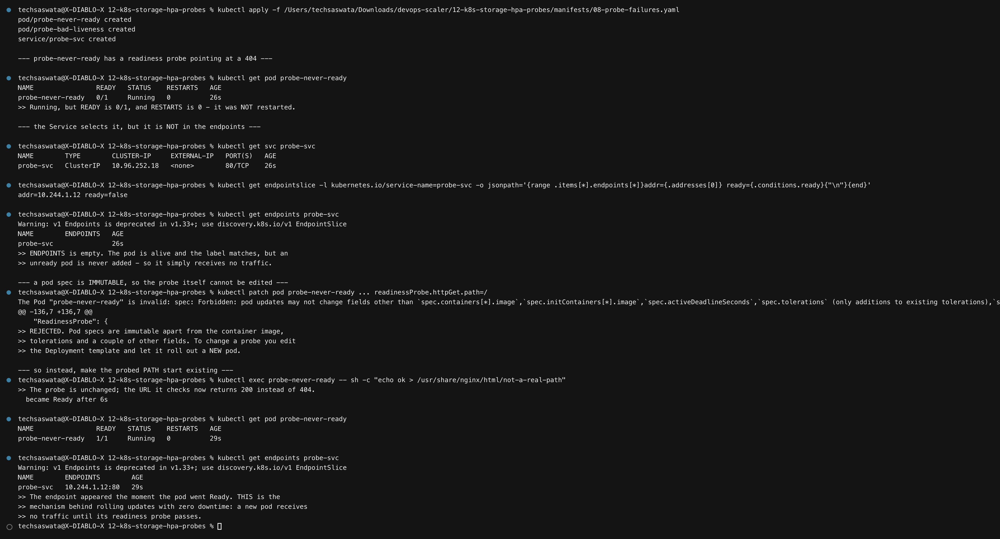

This is the part [module 09](../09-k8s-pods-replicasets-deployments/) described but couldn't
show, because it had no Service attached. Here it's demonstrated end to end:

```
probe-never-ready   0/1   Running   RESTARTS 0      ← alive, not ready, NOT restarted

$ kubectl get endpointslice ... -o jsonpath=...
addr=10.244.1.10 ready=false

$ kubectl get endpoints probe-svc
probe-svc   <empty>                                  ← receives no traffic
```

Then the probed path is made to exist, and:

```
became Ready after 6s
probe-svc   10.244.1.12:80                           ← endpoint appears immediately
```

**This is the mechanism behind zero-downtime rolling updates**: a new pod receives no
traffic until its readiness probe passes.

> **A genuine obstacle, kept in:** my first attempt tried `kubectl patch` on the pod's probe
> and was rejected — *"pod updates may not change fields other than
> `spec.containers[*].image`…"*. **Pod specs are immutable.** To change a probe you edit the
> Deployment template and roll out a new pod. The demo instead makes the probed *path* start
> existing, which flips readiness without touching the spec.

### A bad liveness probe restarts a healthy container

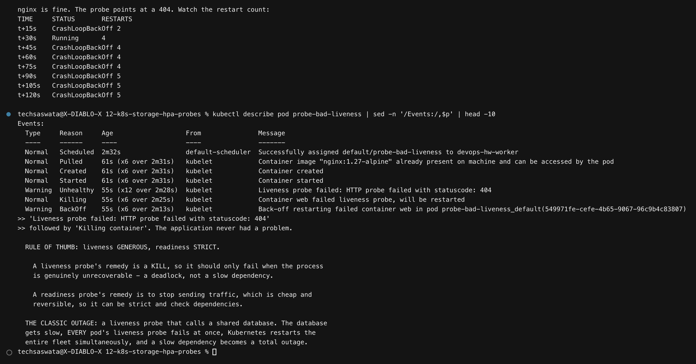

```
t+15s    CrashLoopBackOff   2
t+90s    CrashLoopBackOff   5

Warning  Unhealthy  Liveness probe failed: HTTP probe failed with statuscode: 404
Normal   Killing    Container web failed liveness probe, will be restarted
```

**nginx was never unhealthy.** The probe was wrong, and it drove a working container into
`CrashLoopBackOff`.

> **Liveness generous, readiness strict.** A liveness probe's remedy is a kill, so it should
> only fail when the process is genuinely unrecoverable.
>
> **The classic outage:** a liveness probe that calls a shared database. The database gets
> slow, *every* pod's liveness probe fails at once, Kubernetes restarts the entire fleet
> simultaneously, and a slow dependency becomes a total outage.

---

# Part 4 — Mini project

[`mini-project/manifests.yaml`](mini-project/manifests.yaml) — one workload using every
concept in this module: its own namespace, a dynamically provisioned PVC, an init container
that seeds it, all three probes, resource requests, a Service and an HPA.

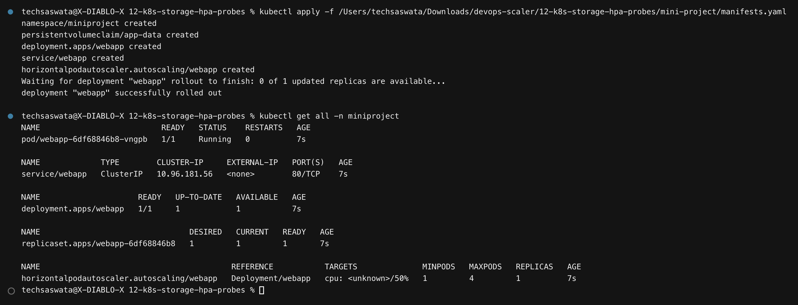

### Storage persistence across a rollout

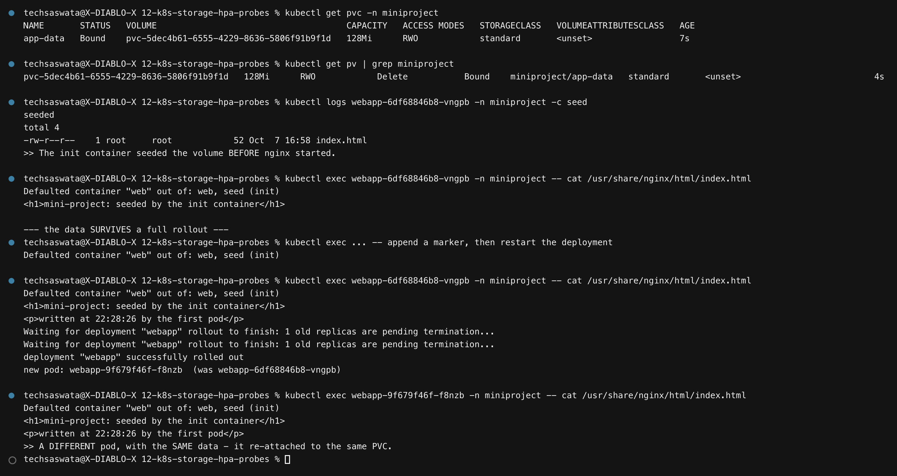

The init container seeds `index.html` **before** nginx starts. A marker is appended, the
deployment is restarted, and a **different pod** serves the **same content**:

```
new pod: webapp-9f679f46f-f8nzb   (was webapp-6df68846b8-vngpb)

<h1>mini-project: seeded by the init container</h1>
<p>written at 22:28:26 by the first pod</p>
```

### Probes and HPA

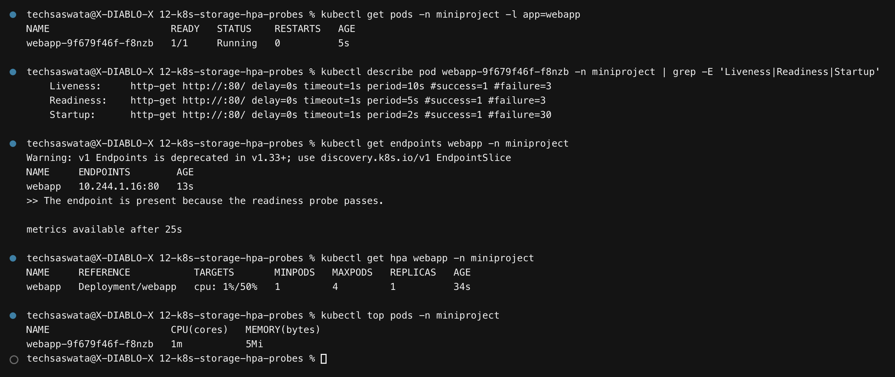
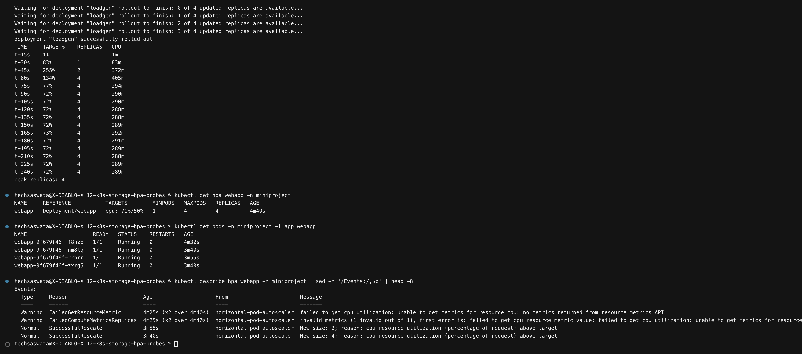

```
t+15s    1%     1   1m
t+45s    255%   2   372m
t+60s    134%   4   405m      ← maxReplicas
t+240s   72%    4   289m
```

Note it settles at **72%, above the 50% target** — because it has hit `maxReplicas: 4` and
cannot scale further. That is exactly what a saturated autoscaler looks like, and it is the
signal to raise the cap or make the app cheaper per request.

### An honest caveat about RWO and Deployments

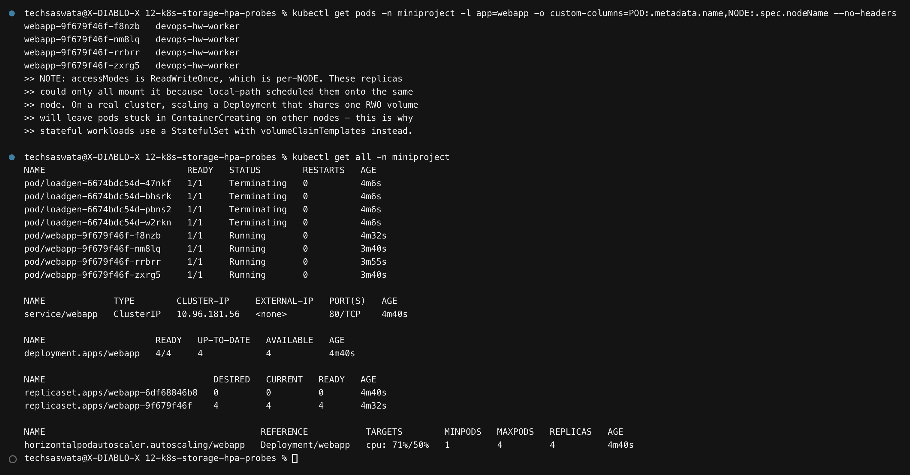

All four replicas mounted the same PVC — but only because `local-path` scheduled them onto
the **same node**. `ReadWriteOnce` is per-**node**, not per-pod.

> On a real multi-node cluster, scaling a Deployment that shares one RWO volume leaves pods
> stuck in `ContainerCreating` on other nodes. Stateful workloads use a **StatefulSet with
> `volumeClaimTemplates`** so each pod gets its own volume — demonstrated in
> [module 09](../09-k8s-pods-replicasets-deployments/#statefulset--identity-and-per-pod-storage).

---

## Command reference

| Task | Command |
|---|---|
| Storage classes | `kubectl get storageclass` |
| Volumes and claims | `kubectl get pv,pvc` |
| Why is a PVC Pending? | `kubectl describe pvc <name>` → Events |
| HPA status | `kubectl get hpa` |
| HPA decisions | `kubectl describe hpa <name>` → Events |
| Live resource usage | `kubectl top pods` / `kubectl top nodes` |
| Probe configuration | `kubectl describe pod <name> \| grep -E 'Liveness\|Readiness\|Startup'` |
| Is a pod in endpoints? | `kubectl get endpointslice -l kubernetes.io/service-name=<svc>` |

---

## Files in this folder

```
12-k8s-storage-hpa-probes/
├── README.md
├── 01-kubernetes-volumes/README.md   the required volumes deliverable
├── manifests/                        8 YAML files
├── mini-project/manifests.yaml       namespace + PVC + probes + HPA
├── scripts/                          4 capture scripts
├── outputs/                          778 lines of captured output
└── screenshots/                      the 20 PNGs embedded above
```
