# 13 — Kubernetes Troubleshooting

**Saswata Das — 24BCS10248** · Session 14

Nine failure modes, each **planted deliberately**, then identified, investigated,
root-caused, fixed and verified on the live cluster. Plus a five-fault mini project.

Manifests in [`manifests/`](manifests/), raw logs (861 lines) in [`outputs/`](outputs/).

```bash
./scripts/01-commands.sh        # the command toolkit
./scripts/02-common-issues.sh   # the nine drills
./scripts/03-mini-project.sh    # the five-fault stack
```

## Task coverage

| # | Task | Status |
|---|---|---|
| 1 | `get`, `describe`, `logs`, `exec`, `events`, `explain`, `top`, `get -o wide` | ✔ [Part 1](#part-1--the-command-toolkit) |
| 2 | CrashLoopBackOff · ImagePullBackOff · ErrImagePull · Pending · ContainerCreating · Service connectivity · DNS · Pod networking · Configuration | ✔ [Part 2](#part-2--nine-failures-diagnosed) — each with identify → investigate → root cause → fix → verify |
| 3 | Mini project | ✔ [Part 3](#part-3--mini-project--five-planted-faults) |

---

# Part 1 — The command toolkit

## `kubectl get` — what *is* there?

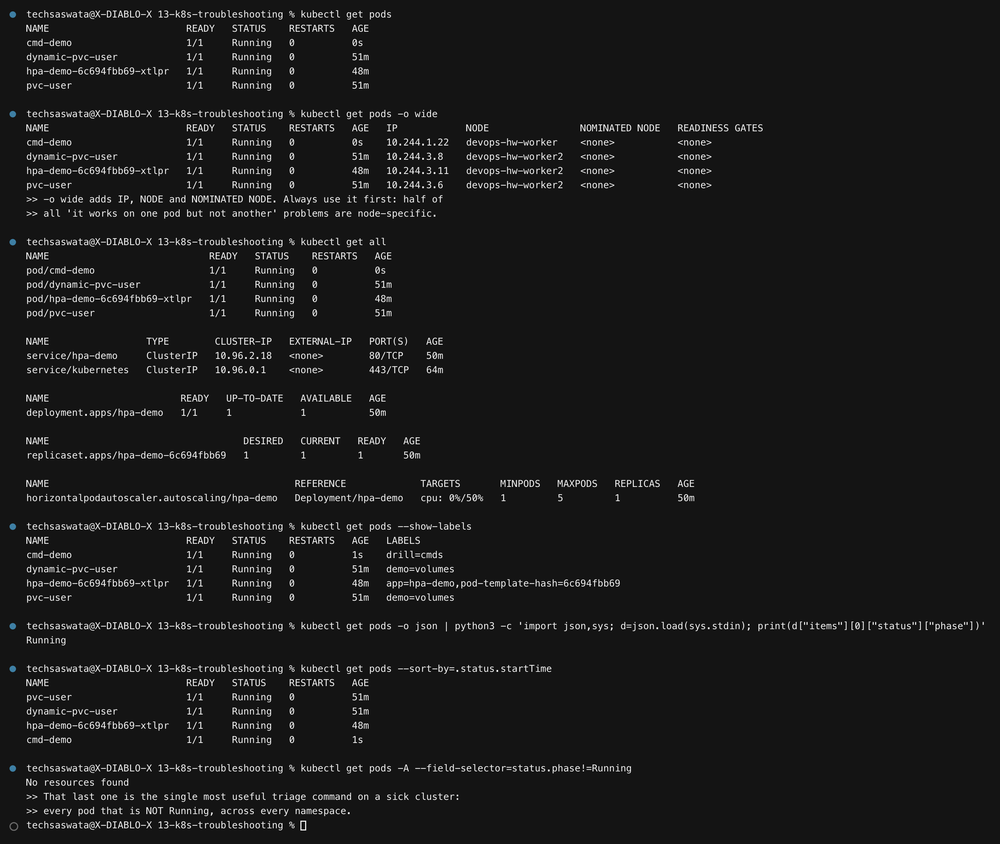

```bash
kubectl get pods -o wide          # adds IP, NODE — always start here
kubectl get all
kubectl get pods --show-labels
kubectl get pods --sort-by=.status.startTime
kubectl get pods -A --field-selector=status.phase!=Running   # ← the triage command
```

That last one is the single most useful command on a sick cluster: **every pod that is not
Running, across every namespace.**

## `kubectl describe` — *why* is it like that?

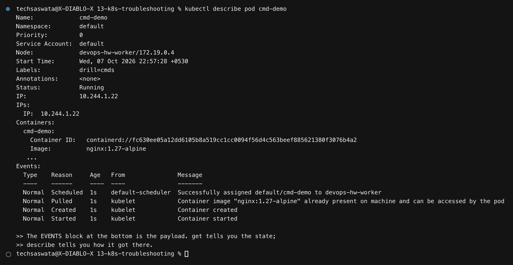

The **Events** block at the bottom is the payload. `get` tells you the state; `describe`
tells you how it got there.

## `kubectl logs` / `exec`

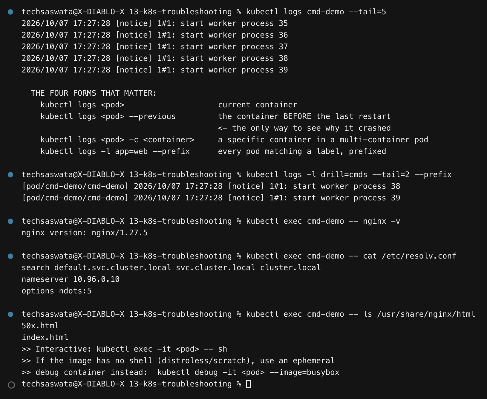

| Form | Use |
|---|---|
| `kubectl logs <pod>` | the current container |
| `kubectl logs <pod> --previous` | **the container before the last restart** — the only way to see why it crashed |
| `kubectl logs <pod> -c <container>` | one container in a multi-container pod |
| `kubectl logs -l app=web --prefix` | every pod matching a label |

> If the image has no shell (distroless or scratch, like
> [module 06](../06-dockerfiles-and-images/)), `exec` fails. Use
> `kubectl debug -it <pod> --image=busybox` to attach an ephemeral container instead.

## `kubectl events` and `explain`

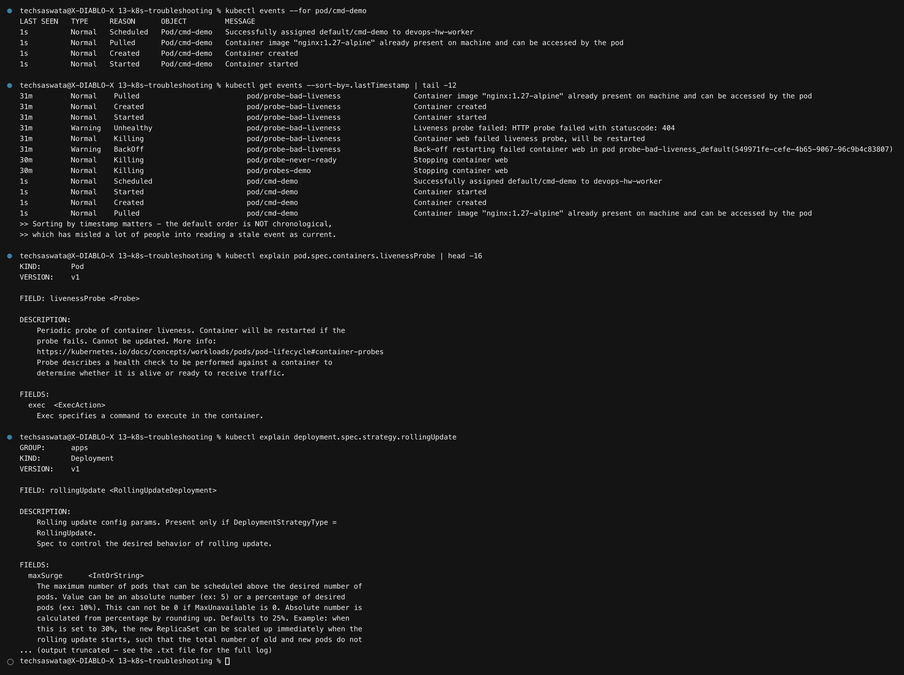

```bash
kubectl events --for pod/<name>
kubectl get events --sort-by=.lastTimestamp
```

> **Sort by timestamp.** The default order is *not* chronological, which regularly leads
> people to read a stale event as the current one.

## `kubectl top`

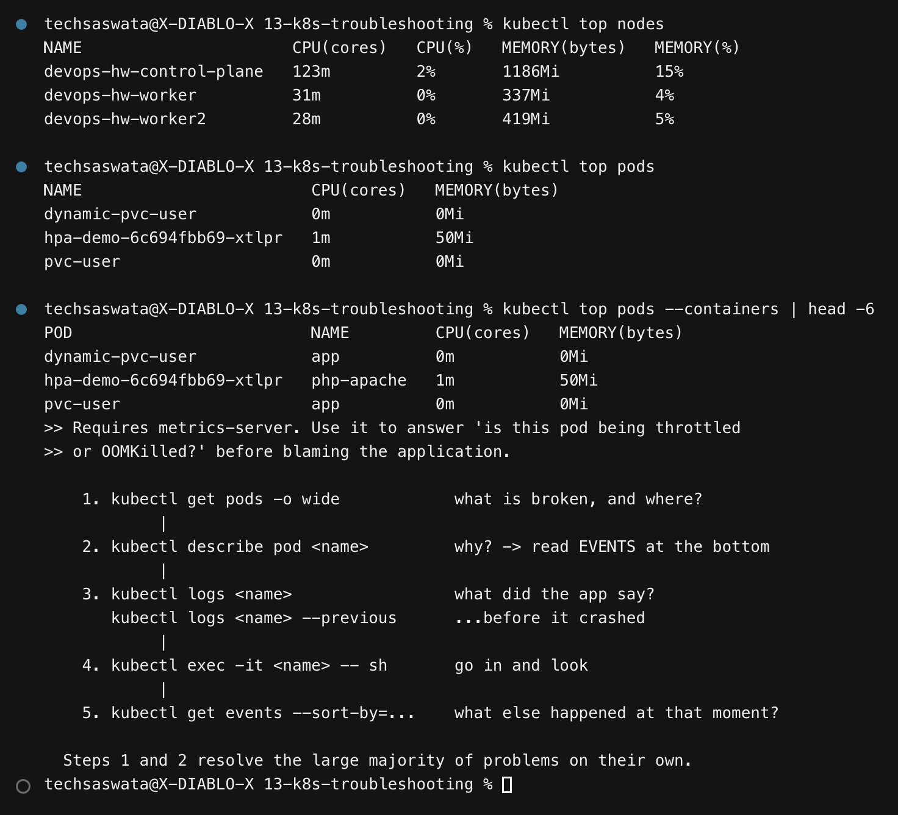

### The triage order

```
1. kubectl get pods -o wide              what is broken, and where?
2. kubectl describe pod <name>           why?  → read EVENTS
3. kubectl logs <name> [--previous]      what did the app say?
4. kubectl exec -it <name> -- sh         go in and look
5. kubectl get events --sort-by=...      what else happened then?
```

**Steps 1 and 2 resolve most problems on their own.**

---

# Part 2 — Nine failures, diagnosed

## 1. CrashLoopBackOff

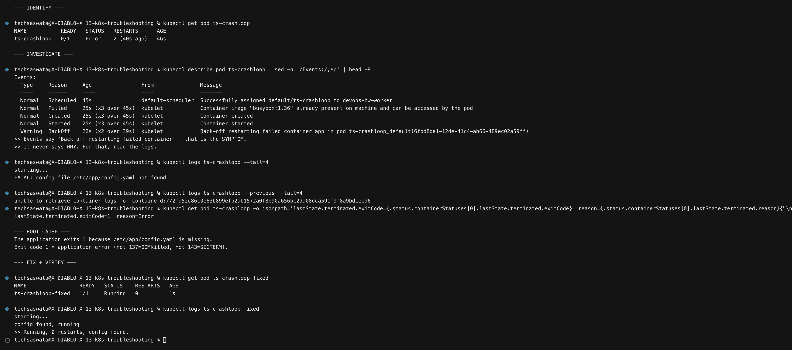

| | |
|---|---|
| **Symptom** | `CrashLoopBackOff`, restart count climbing |
| **Events say** | `Back-off restarting failed container` — the symptom, never the cause |
| **Root cause** | the app exits 1 because its config file is missing |
| **Found via** | `kubectl logs --previous` and `lastState.terminated.exitCode` |

```
lastState.terminated.exitCode=1  reason=Error
```

> **Exit codes are diagnostic:** `1` = application error · `137` = **OOMKilled** (raise the
> memory limit) · `143` = SIGTERM · `126/127` = command not executable / not found.

## 2. ImagePullBackOff / ErrImagePull

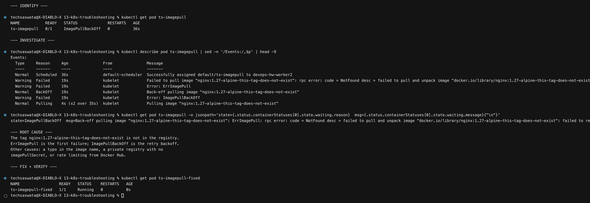

`ErrImagePull` is the first failure; `ImagePullBackOff` is the retry backoff. The pod
**never reaches Running**. Causes: bad tag, typo, private registry with no
`imagePullSecret`, or Docker Hub rate limiting.

## 3. Pending — insufficient resources

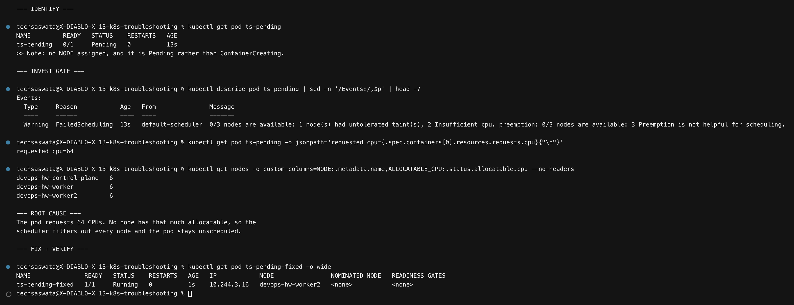

```
Events:  0/3 nodes are available: 3 Insufficient cpu
requested cpu=64      node allocatable: 6, 6, 6
```

No node can satisfy the request, so the scheduler filters all of them out. **No NODE is
assigned** — that is what distinguishes `Pending` from `ContainerCreating`.

## 4. Pending — a *different* cause: unbound PVC

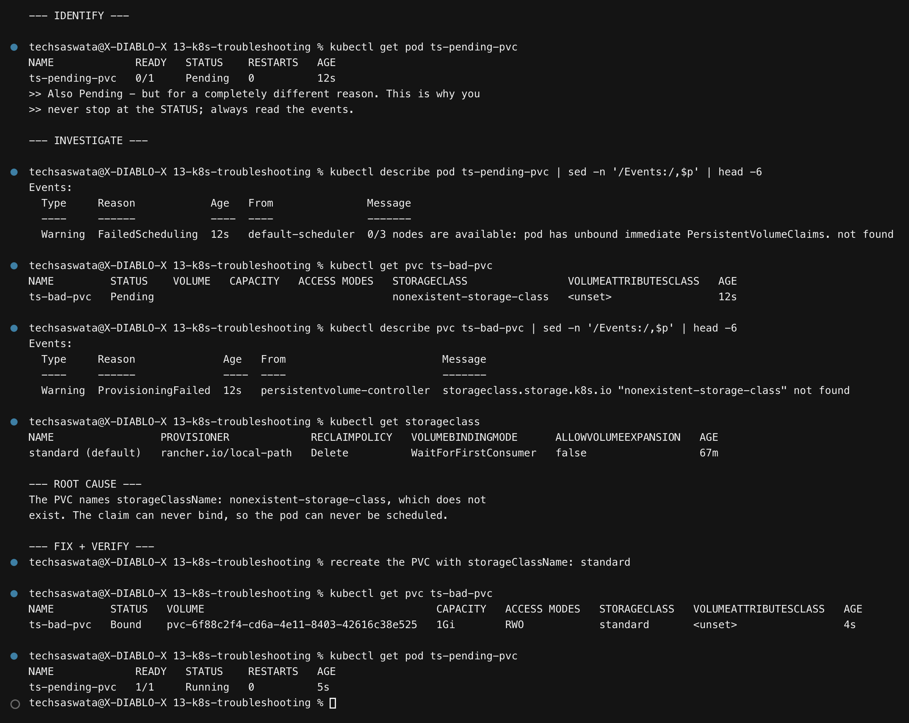

**Same status, unrelated bug.** The PVC names a StorageClass that doesn't exist, so it never
binds, so the pod can never be scheduled.

> This pair is the argument for never stopping at the status. `Pending` is a category, not a
> diagnosis.

## 5. ContainerCreating (stuck)

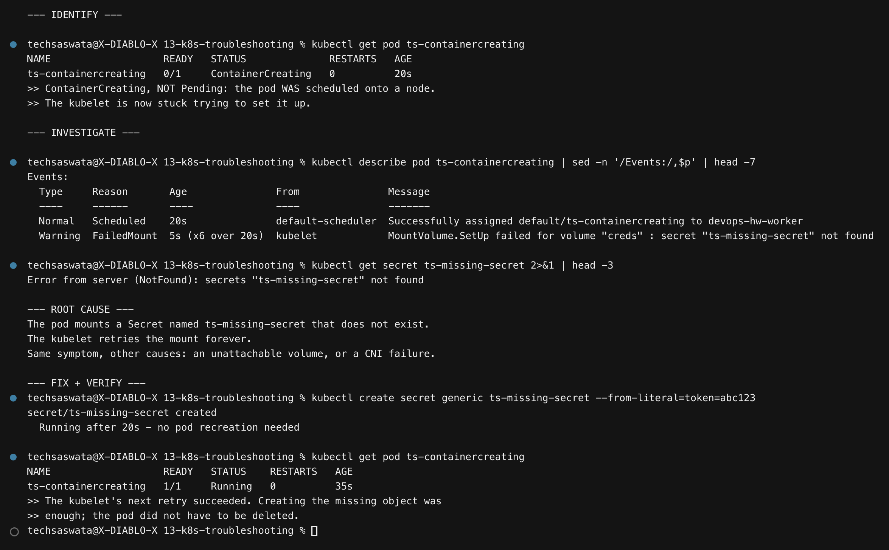

`ContainerCreating`, **not** `Pending` — the pod *was* scheduled; the kubelet is stuck
setting it up. Here it mounts a Secret that doesn't exist.

```
$ kubectl create secret generic ts-missing-secret --from-literal=token=abc123
  Running after 20s - no pod recreation needed
```

> **The pod did not have to be deleted.** The kubelet retries the mount on a loop, so
> creating the missing object was enough. People routinely delete the pod unnecessarily.

## 6. Service connectivity — selector mismatch

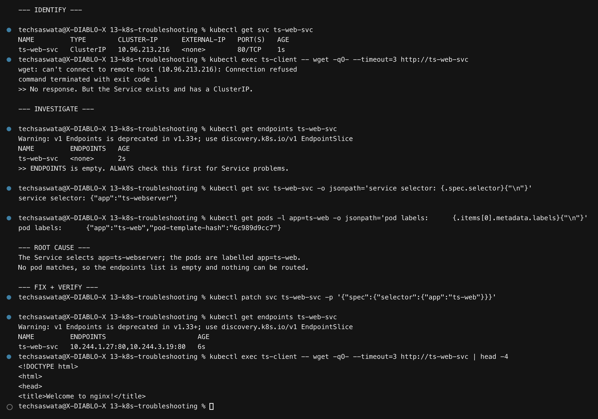

```
$ kubectl get endpoints ts-web-svc
ts-web-svc   <none>                       ← empty

service selector: {"app":"ts-webserver"}
pod labels:       {"app":"ts-web", ...}
```

## 7. Service connectivity — wrong `targetPort`

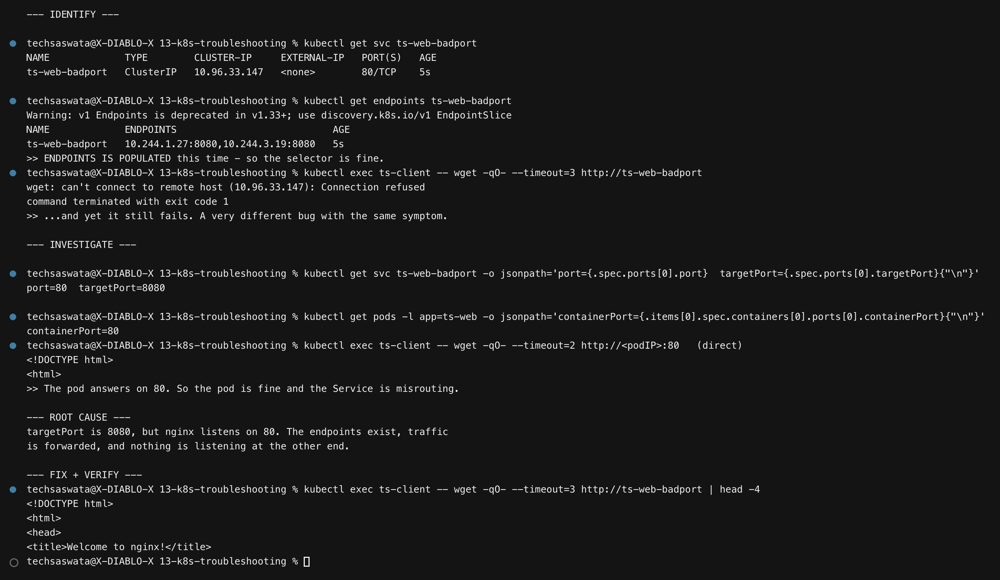

**The same symptom as #6, and a completely different bug:**

```
$ kubectl get endpoints ts-web-badport
ts-web-badport   10.244.1.21:8080,10.244.3.18:8080     ← POPULATED
```

Endpoints exist, so the selector is fine — yet requests still fail. `targetPort: 8080`, but
nginx listens on **80**. Connecting directly to the pod IP on :80 works, which proves the
pod is healthy and the Service is misrouting.

> **`kubectl get endpoints` is what separates these two.** Empty → selector problem.
> Populated but failing → port, probe or application problem.

## 8. DNS resolution

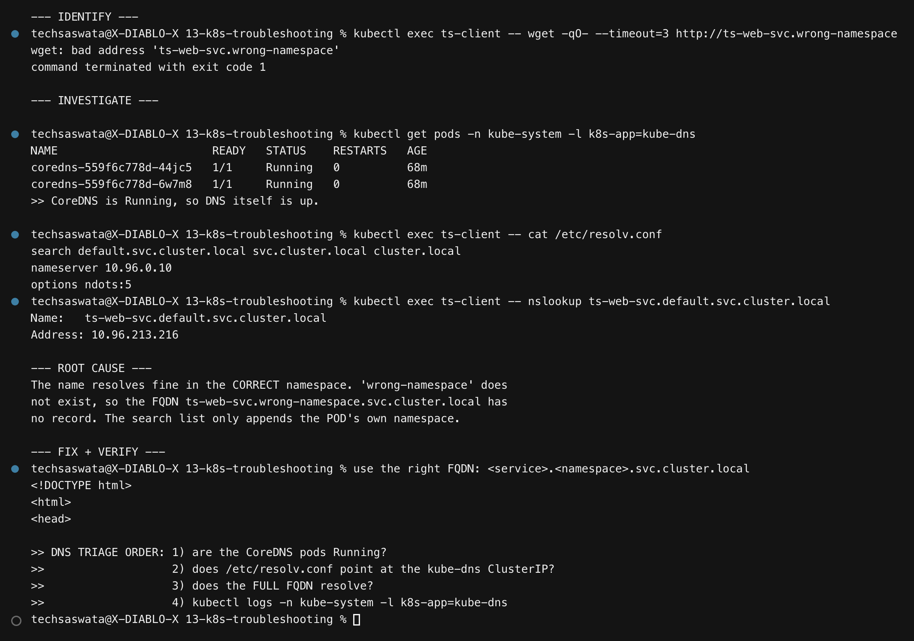

CoreDNS is Running and `/etc/resolv.conf` is correct — the name was simply wrong.
`ts-web-svc.wrong-namespace` has no record; the `search` list only appends the **pod's own**
namespace.

**DNS triage order:** CoreDNS pods Running? → does `/etc/resolv.conf` point at the kube-dns
ClusterIP? → does the **full FQDN** resolve? → `kubectl logs -n kube-system -l k8s-app=kube-dns`.

## 9. Configuration error

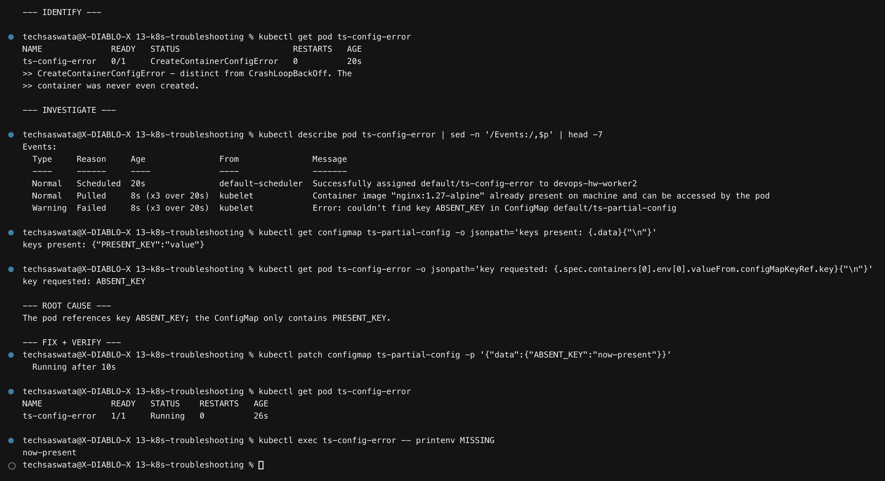

`CreateContainerConfigError` — **distinct from `CrashLoopBackOff`**: the container was never
even created. The pod references ConfigMap key `ABSENT_KEY`, which isn't there.

```
$ kubectl exec ts-config-error -- printenv MISSING
now-present
```

## Symptom → cause reference

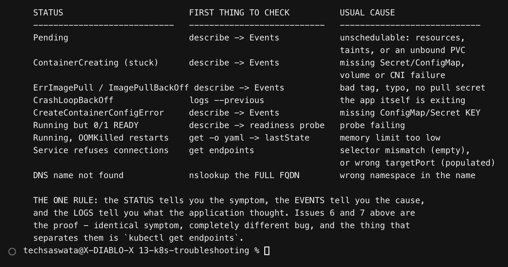

| Status | Check first | Usual cause |
|---|---|---|
| `Pending` | `describe` → Events | unschedulable: resources, taints, **or an unbound PVC** |
| `ContainerCreating` (stuck) | `describe` → Events | missing Secret/ConfigMap, volume or CNI failure |
| `ErrImagePull` / `ImagePullBackOff` | `describe` → Events | bad tag, typo, no pull secret |
| `CrashLoopBackOff` | **`logs --previous`** | the application itself is exiting |
| `CreateContainerConfigError` | `describe` → Events | missing ConfigMap/Secret **key** |
| `Running` but `0/1 READY` | `describe` → readiness probe | probe failing |
| Restarts with `OOMKilled` | `get -o yaml` → `lastState` | memory limit too low |
| Service refuses connections | **`kubectl get endpoints`** | empty → selector; populated → targetPort |
| DNS name not found | `nslookup` the **full FQDN** | wrong namespace in the name |

**The one rule:** the **status** is the symptom, the **events** are the cause, the **logs**
are what the application thought.

---

# Part 3 — Mini project — five planted faults

[`mini-project/broken-stack.yaml`](mini-project/broken-stack.yaml) is a 2-tier stack with
**five independent faults**, built so that fixing one only reveals the next.

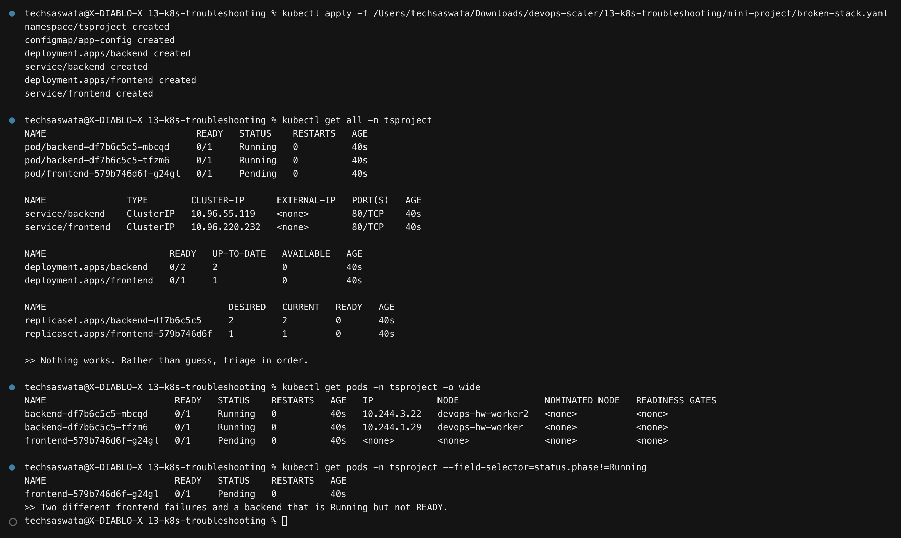

| # | Fault | Symptom |
|---|---|---|
| 1 | frontend `requests.cpu: 32` | `Pending` |
| 2 | frontend image tag doesn't exist | `ImagePullBackOff` |
| 3 | frontend env references a missing ConfigMap key | `CreateContainerConfigError` |
| 4 | backend readiness probe hits `/healthz` (404) | `Running` but `0/1 READY` |
| 5 | backend Service selector typo | empty endpoints |

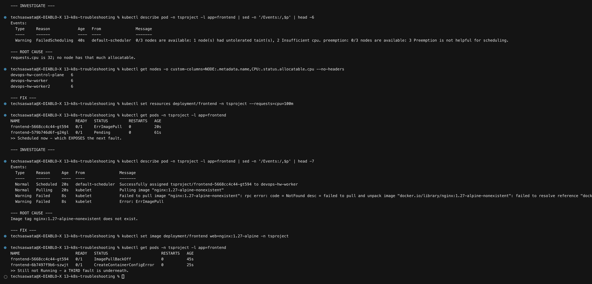
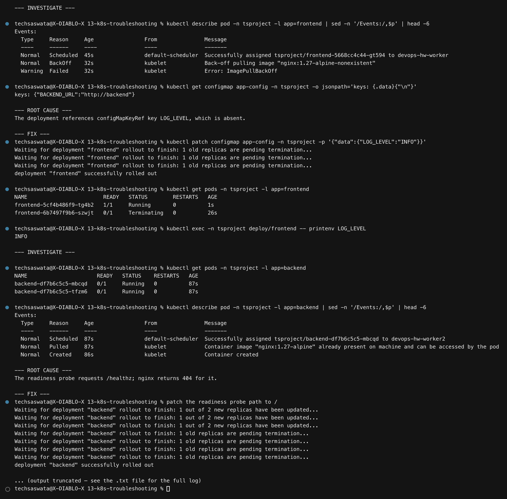
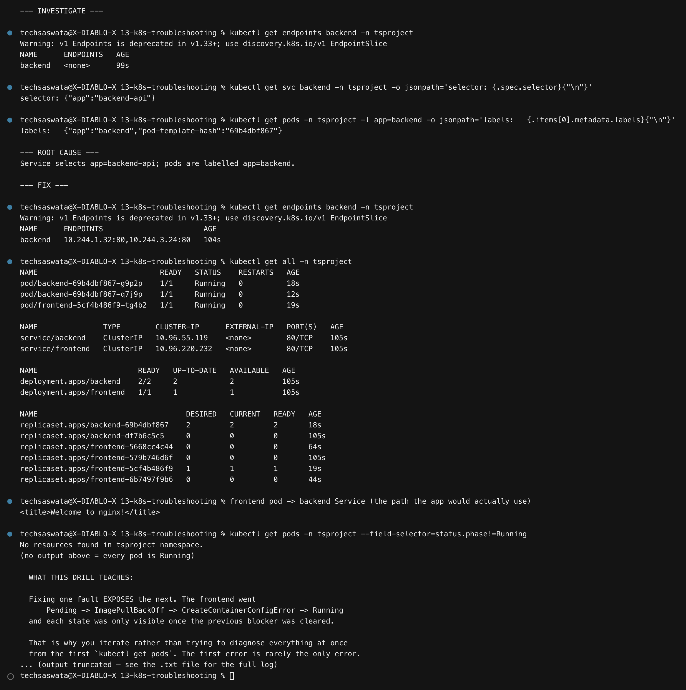

### Final verification

```
pod/backend-69b4dbf867-g9p2p    1/1   Running
pod/backend-69b4dbf867-q7j9p    1/1   Running
pod/frontend-5cf4b486f9-tg4b2   1/1   Running

$ frontend pod → backend Service
<title>Welcome to nginx!</title>
```

### What the drill teaches

**Fixing one fault exposes the next.** The frontend went

```
Pending → ImagePullBackOff → CreateContainerConfigError → Running
```

and each state was only visible once the previous blocker was cleared. That is why you
iterate rather than trying to diagnose everything from the first `kubectl get pods`:

```bash
while true; do
  kubectl get pods -A --field-selector=status.phase!=Running   # anything left?
  kubectl describe pod <the first one>                         # read Events
  # fix, repeat
done
```

**The first error is rarely the only error.**

---

## Files in this folder

```
13-k8s-troubleshooting/
├── README.md
├── manifests/                    11 YAML files — broken and fixed pairs
├── mini-project/broken-stack.yaml  the five-fault stack
├── scripts/                      3 capture scripts
├── outputs/                      861 lines of captured output
└── screenshots/                  the 19 PNGs embedded above
```
