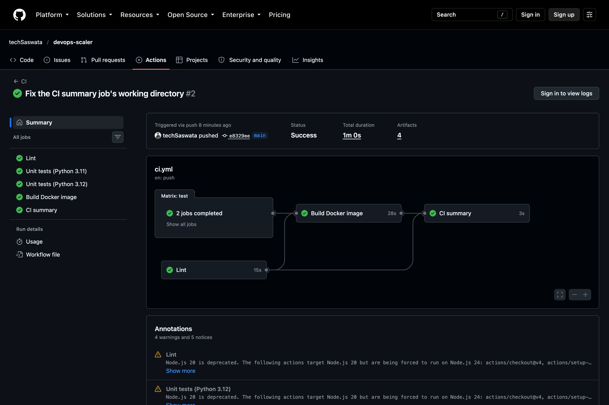
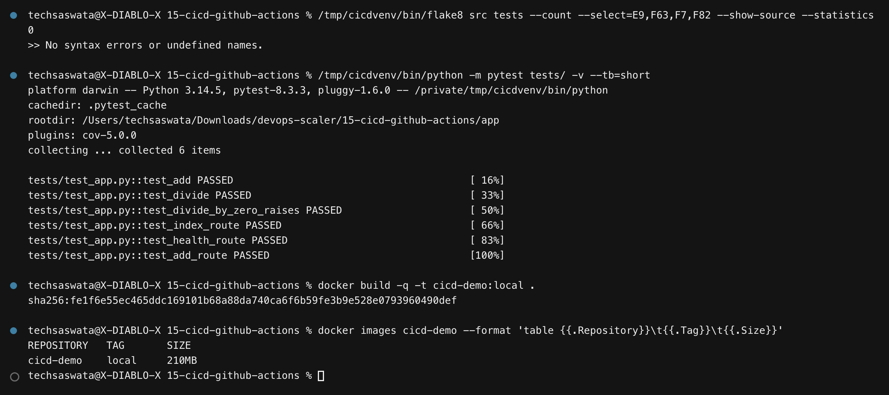
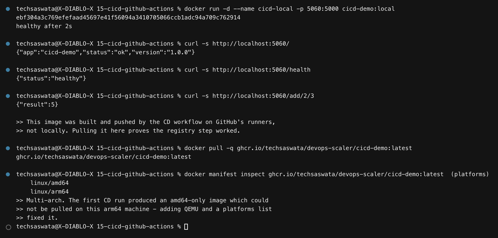
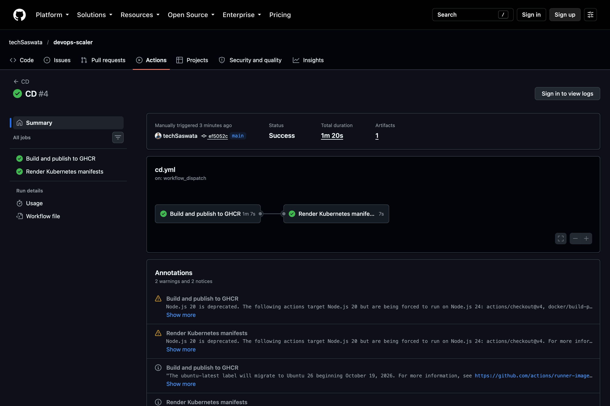
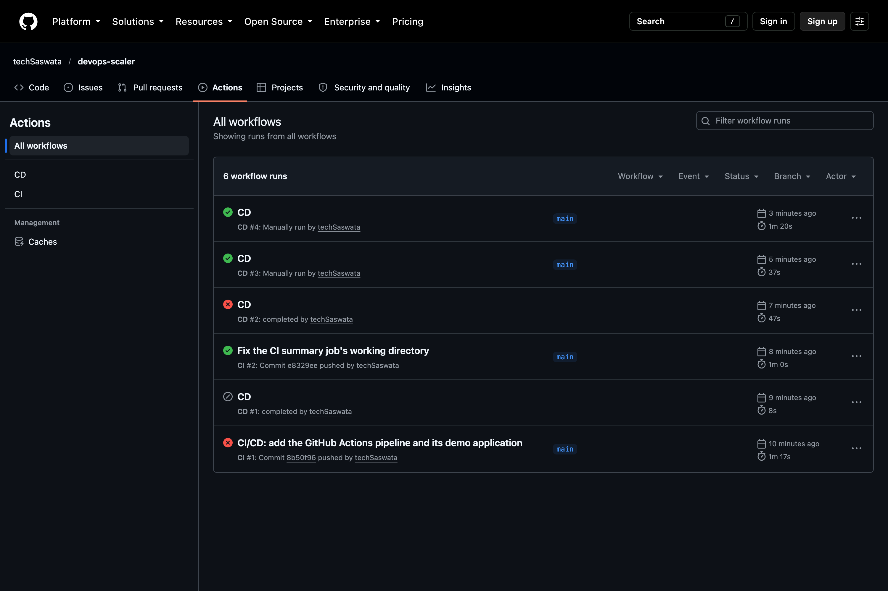
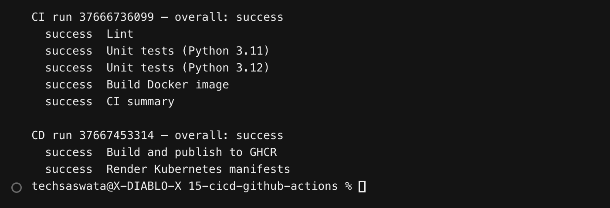
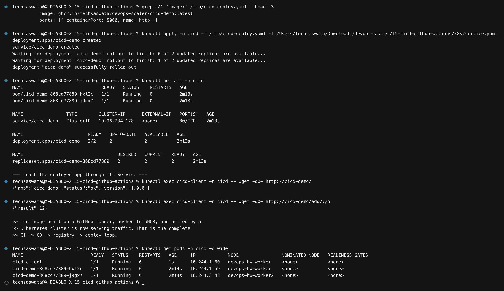

# 15 — CI/CD & GitHub Actions

**Saswata Das — 24BCS10248** · Session 16

**These pipelines really ran.** Both workflows execute on GitHub-hosted runners in this
repository — the screenshots below are the actual Actions UI, and the container image was
genuinely published to GHCR and pulled back down to a Kubernetes cluster.

| | |
|---|---|
| Workflows | [`.github/workflows/ci.yml`](../.github/workflows/ci.yml) · [`.github/workflows/cd.yml`](../.github/workflows/cd.yml) |
| Live runs | [Actions tab](https://github.com/techSaswata/devops-scaler/actions) · [CI run](https://github.com/techSaswata/devops-scaler/actions/runs/37666736099) · [CD run](https://github.com/techSaswata/devops-scaler/actions/runs/37667453314) |
| Published image | `ghcr.io/techsaswata/devops-scaler/cicd-demo:latest` |
| Application | [`app/`](app/) — Flask API, 6 unit tests, Dockerfile |

## Task coverage

| Concept | Where it appears |
|---|---|
| CI vs CD | [§1](#1-ci-vs-cd) — two separate workflows, with CD gated on CI |
| Pipeline | `lint → test → build → summary`, then `publish → deploy` |
| Workflow / Jobs / Steps | [§2](#2-workflow--jobs--steps) |
| Runners | `ubuntu-latest`, GitHub-hosted |
| Secrets | `GITHUB_TOKEN`, auto-injected, used for GHCR auth |
| Artifacts | coverage XML per Python version + the smoke-test response |
| Build | multi-arch Docker build via buildx + QEMU |
| Test | pytest matrix across Python 3.11 and 3.12 |
| Pipeline execution | [§5](#5-the-real-runs) — real green runs |

---

## 1. CI vs CD

| | CI — Continuous Integration | CD — Continuous Delivery/Deployment |
|---|---|---|
| Question | "does this change break anything?" | "can this change reach users?" |
| Runs on | every push **and** pull request | only after CI passes on `main` |
| Produces | test results, coverage, a **local** image | a **published** image, a deployment |
| Here | [`ci.yml`](../.github/workflows/ci.yml) | [`cd.yml`](../.github/workflows/cd.yml) |

The separation is enforced, not just conceptual:

```yaml
# cd.yml
on:
  workflow_run:
    workflows: [CI]
    types: [completed]
jobs:
  publish:
    if: github.event.workflow_run.conclusion == 'success'
```

**CD is triggered by CI finishing, and only proceeds if CI passed.** That guard is visible
in the run history: the first CD run shows `skipped`, because the CI run before it failed.

---

## 2. Workflow → Jobs → Steps

```
workflow  (ci.yml)
  ├── job: lint                 ─┐
  ├── job: test (matrix ×2)     ─┤ run in PARALLEL
  ├── job: build   needs:[lint,test]   ← waits for both
  └── job: ci-summary  needs:[lint,test,build]  if: always()
```

- A **job** is scheduled onto a runner. Jobs are parallel **by default**.
- **`needs:`** creates the dependency that makes it a *pipeline*. Without it, `build` would
  run alongside `test` and a failing test would still produce an image.
- **Steps** run in order inside one job, sharing a filesystem and a working directory.

### The matrix

```yaml
strategy:
  matrix:
    python-version: ['3.11', '3.12']
```

One job definition, run twice in parallel, proving the app works on both interpreters
without duplicating a line of YAML.

---

## 3. The CI pipeline



That is the real run: **5 jobs, all green, 1m 0s, 4 artifacts.** The graph shows `Lint` and
the 2-job test matrix feeding into `Build Docker image`, then `CI summary`.

### Stages, reproduced locally



```
6 passed in 0.28s
```



The build job doesn't just build — it **runs** the image and asserts it answers:

```yaml
- name: Smoke-test the built image
  run: |
    docker run -d --name smoke -p 5000:5000 cicd-demo:${{ github.sha }}
    # poll /health until it responds, then exercise the real endpoints
```

> A build that only checks `docker build` exits 0 proves very little. Starting the container
> and calling it catches a broken `CMD`, a missing dependency, or a port mismatch — all of
> which build cleanly.

### Artifacts and the job summary

```yaml
- uses: actions/upload-artifact@v4
  with:
    name: coverage-py${{ matrix.python-version }}
    path: .../coverage.xml
```

Artifacts outlive the runner, which is destroyed when the job ends. The run produced **4**:
coverage for each Python version, plus the smoke-test response.

`ci-summary` writes a markdown table to `$GITHUB_STEP_SUMMARY`, which renders on the run
page, and fails the workflow if any upstream job failed — a **security/quality gate** in
miniature.

---

## 4. The CD pipeline



### Authentication without a stored secret

```yaml
- uses: docker/login-action@v3
  with:
    registry: ghcr.io
    username: ${{ github.actor }}
    password: ${{ secrets.GITHUB_TOKEN }}
```

**`GITHUB_TOKEN` is injected automatically** — nothing to create, store or rotate. It is
scoped to this repository and expires when the job ends. The only configuration needed is:

```yaml
permissions:
  packages: write
```

> For anything outside GitHub (Docker Hub, AWS, a cluster) you'd store a real secret under
> *Settings → Secrets and variables → Actions* and read it the same way. The principle is
> that the secret is never in the repository.

### Image tagging

`docker/metadata-action` derives tags automatically — a `sha-<commit>` tag for traceability
and `latest` only on the default branch.

---

## 5. The real runs




```
CI run 37666736099 — overall: success
  success  Lint
  success  Unit tests (Python 3.11)
  success  Unit tests (Python 3.12)
  success  Build Docker image
  success  CI summary

CD run 37667453314 — overall: success
  success  Build and publish to GHCR
  success  Render Kubernetes manifests
```

---

## 6. End to end: runner → GHCR → Kubernetes



The image built on a GitHub runner was pulled onto the kind cluster and deployed:

```
pod/cicd-demo-868cd77889-hxl2c   1/1   Running
pod/cicd-demo-868cd77889-j9gx7   1/1   Running

$ kubectl exec cicd-client -n cicd -- wget -qO- http://cicd-demo/
{"app":"cicd-demo","status":"ok","version":"1.0.0"}

$ kubectl exec cicd-client -n cicd -- wget -qO- http://cicd-demo/add/7/5
{"result":12}
```

**Code → CI → CD → registry → cluster → serving traffic**, with no manual step in between.

---

## 7. Three real failures, and the fixes

These were genuine red runs, not hypotheticals.

### `working-directory` applies to **every** job

```
X An error occurred trying to start process '/usr/bin/bash' with working directory
  '/home/runner/work/devops-scaler/devops-scaler/15-cicd-github-actions/app'.
  No such file or directory
```

Lint, both test jobs and the build all passed; only `ci-summary` failed. A workflow-level
`defaults.run.working-directory` applies to **all** jobs — and `ci-summary` never checks the
repo out, so the path doesn't exist. Fixed by overriding `working-directory: .` in that job.

### `kubectl --dry-run=client` still needs a cluster

```
error validating "deployment.yaml": failed to download openapi:
  Get "http://localhost:8080/openapi/v2": dial tcp [::1]:8080: connect: connection refused
```

Despite the name, it contacts a cluster for the OpenAPI schema. A GitHub-hosted runner has
none. Replaced with **`kubeconform`**, which validates against the published Kubernetes JSON
schemas entirely offline.

### The published image was amd64-only

```
no matching manifest for linux/arm64/v8 in the manifest list entries
```

CD succeeded and the image was in GHCR — but it **couldn't be pulled on Apple Silicon**,
because GitHub runners are amd64. Fixed with QEMU and an explicit platform list:

```yaml
- uses: docker/setup-qemu-action@v3
- uses: docker/build-push-action@v6
  with:
    platforms: linux/amd64,linux/arm64
```

Now verified on both:

```
$ docker manifest inspect ghcr.io/techsaswata/devops-scaler/cicd-demo:latest
    linux/amd64
    linux/arm64
```

> This one is easy to miss, because **the pipeline is green either way**. The failure only
> appears for whoever pulls the image on a different architecture.

---

## 8. One honest limitation

The CD workflow **renders and validates** the Kubernetes manifests but does not `kubectl
apply` them from the runner. The cluster used throughout this repo is a `kind` cluster on a
laptop, which has no public endpoint a GitHub-hosted runner could reach.

The apply is therefore demonstrated **locally**, against the genuinely published image
(§6). In a real setup the runner would authenticate to a managed cluster with a kubeconfig
secret, or — better — a GitOps agent in the cluster would pull the change, which is
[module 19](../19-monitoring-observability-gitops/).

---

## Command reference

| Task | Command |
|---|---|
| List runs | `gh run list` |
| Watch a run | `gh run watch <id> --exit-status` |
| Per-job results | `gh run view <id> --json jobs` |
| Failed-step logs | `gh run view <id> --log-failed` |
| Trigger manually | `gh workflow run <file> --ref main` |
| Re-run failures | `gh run rerun <id> --failed` |
| Download artifacts | `gh run download <id>` |

---

## Files

```
15-cicd-github-actions/
├── README.md
├── app/            src/app.py, tests/test_app.py (6 tests), Dockerfile, requirements
├── k8s/            deployment.yaml (IMAGE_PLACEHOLDER), service.yaml
├── scripts/        01-local-pipeline.sh
├── outputs/        captured output
└── screenshots/    7 PNGs — 3 real Actions UI captures + 4 terminal
../.github/workflows/ci.yml, cd.yml
```
