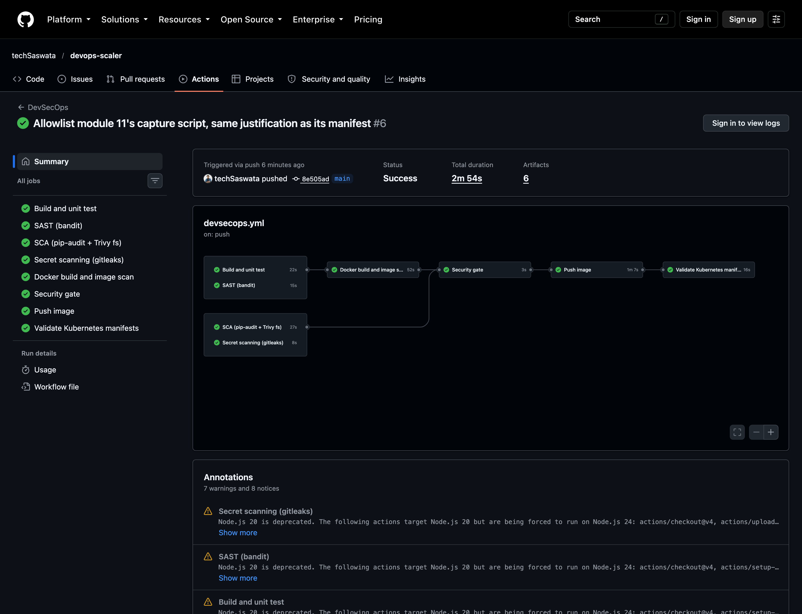
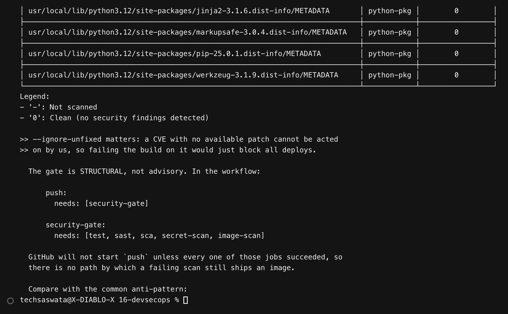
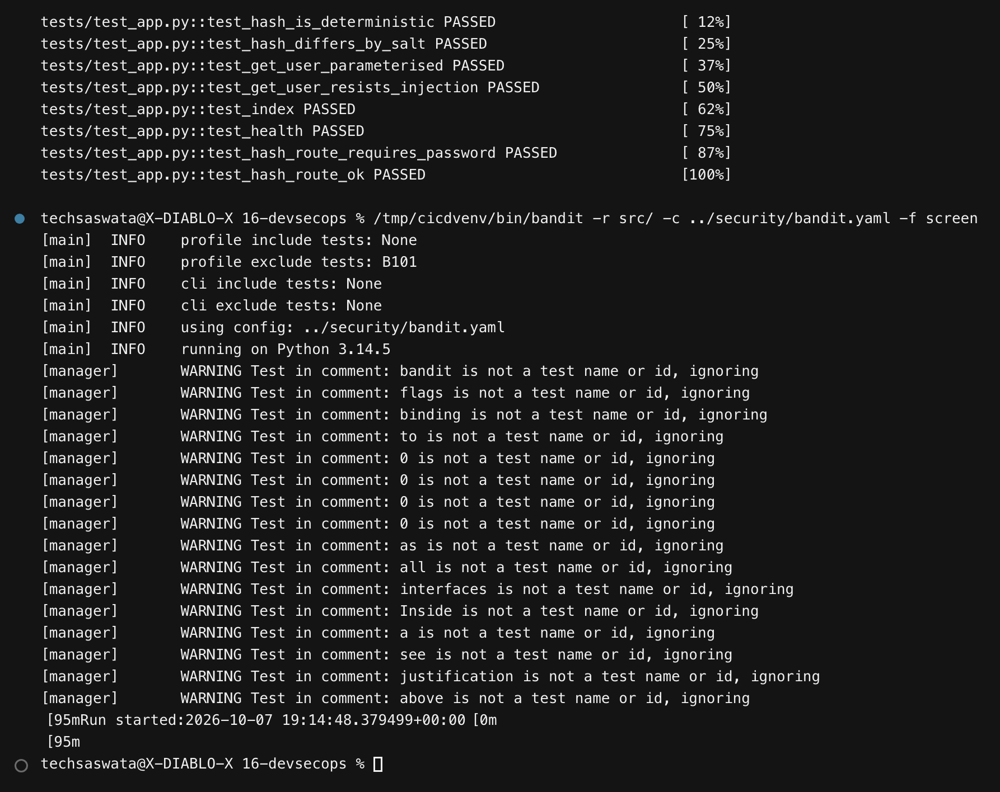
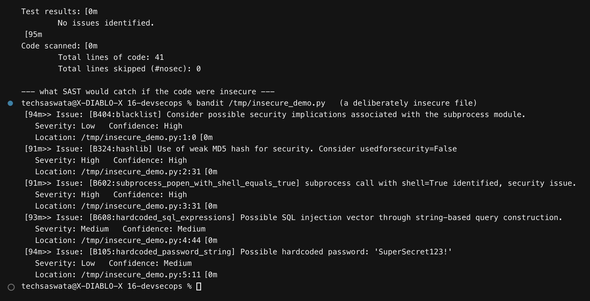
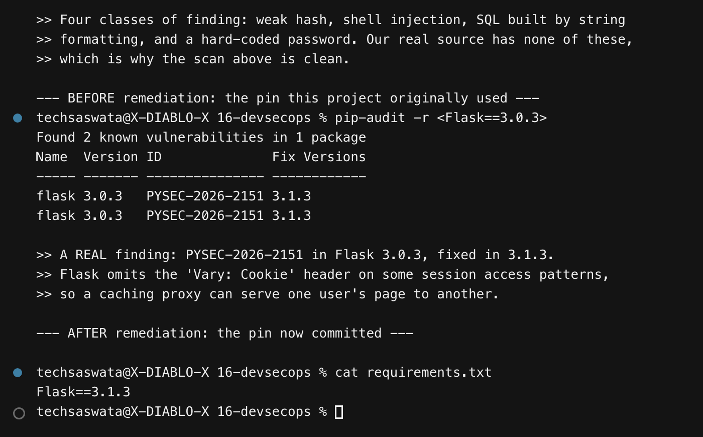
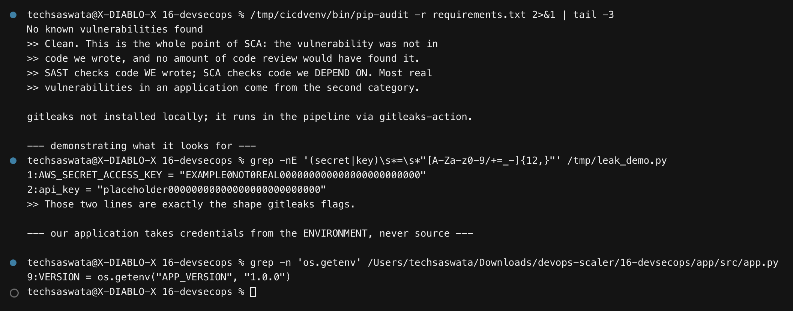
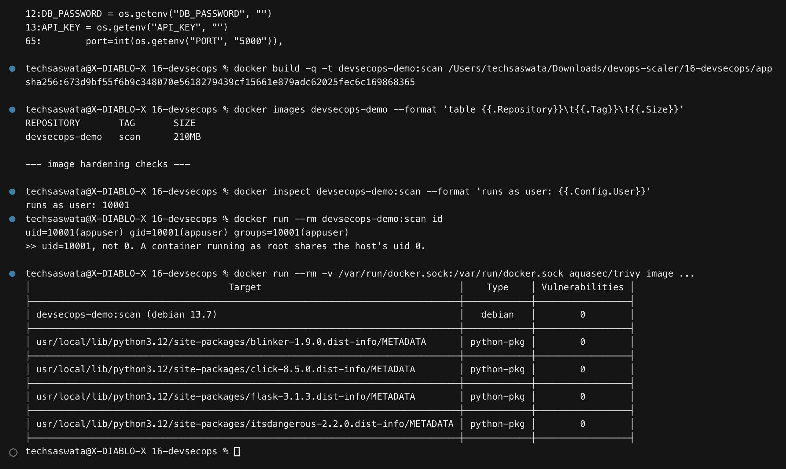
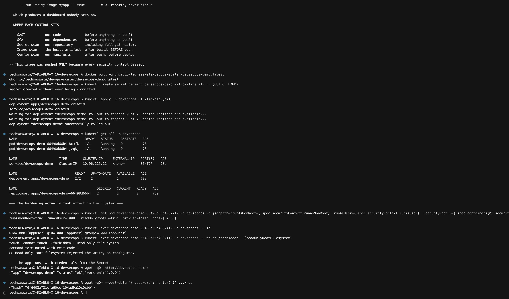

# 16 — Complete CI/CD & DevSecOps

**Saswata Das — 24BCS10248** · Session 17

A CI/CD pipeline with security controls wired in as **blocking gates**, not advisory
reports. It runs for real on GitHub-hosted runners.

| | |
|---|---|
| Workflow | [`.github/workflows/devsecops.yml`](../.github/workflows/devsecops.yml) |
| Green run | [run 37672544353](https://github.com/techSaswata/devops-scaler/actions/runs/37672544353) — all 8 jobs |
| Published image | `ghcr.io/techsaswata/devops-scaler/devsecops-demo` |
| Policy | [`security/SECURITY.md`](security/SECURITY.md) |

## The required flow

```
Code → Build → Unit Test → SAST → SCA → Secret Scan → Docker Build
     → Container Image Scan → SECURITY GATE → Push Image → Deploy
```



| Stage | Tool | Catches | Gate |
|---|---|---|---|
| Unit test | pytest | regressions | fail on any |
| **SAST** | bandit | insecure code *we* wrote | fail on HIGH |
| **SCA** | pip-audit + Trivy fs | CVEs in code we *depend on* | fail on HIGH/CRITICAL (fixable) |
| **Secret scan** | gitleaks | credentials in the repo **and its history** | fail on any |
| **Image scan** | Trivy | CVEs inside the built image | fail on HIGH/CRITICAL (fixable) |
| Config scan | Trivy config | misconfigured manifests | report |

---

## 1. The gate is structural, not advisory

```yaml
push:
  needs: [security-gate]

security-gate:
  needs: [test, sast, sca, secret-scan, image-scan]
```

GitHub will not **start** `push` unless all five scan jobs succeeded. There is no path by
which a failing scan still ships an image.



Compare with the common anti-pattern:

```yaml
- run: trivy image myapp || true    # reports, never blocks
```

which produces a dashboard nobody acts on. **Every failed run in this module's history
shows `Push image: skipped`** — the gate holding.

---

## 2. SAST — static analysis of our own code



Running bandit against a deliberately insecure file shows what it catches:

| Finding | Issue |
|---|---|
| `B324` | `hashlib.md5()` — weak hash |
| `B602` | `subprocess.call(cmd, shell=True)` — shell injection |
| `B608` | SQL built by string formatting |
| `B105` | hard-coded password |

Our source has none of these — it uses PBKDF2, parameterised queries, and reads credentials
from the environment.

### One finding, triaged rather than suppressed

bandit flagged **`B104` — binding to `0.0.0.0`**. That is a *true* finding and a **false
positive in context**: inside a container the app *must* bind `0.0.0.0`, because binding
`127.0.0.1` makes it unreachable from its Service — demonstrated in
[module 05](../05-docker-fundamentals/#2-python--flask--port-3002).

The fix was an inline suppression **with written justification**, not disabling the check:

```python
app.run(
    host="0.0.0.0",  # nosec B104 - see justification above
    ...
)
```

> Blanket-skipping `B104` in the config would have hidden it everywhere, including somewhere
> it genuinely mattered. Scoping the suppression to one line keeps the rule live.

---

## 3. SCA — and a real CVE, found and fixed



**This is the module's most valuable result.** pip-audit found a genuine vulnerability in a
dependency this project was actually pinning:

```
BEFORE                                          AFTER
Found 2 known vulnerabilities in 1 package      No known vulnerabilities found
flask 3.0.3  PYSEC-2026-2151  fix: 3.1.3        Flask==3.1.3
```

**PYSEC-2026-2151** — Flask omits the `Vary: Cookie` header on some session access patterns,
so a caching proxy can serve one user's page to another.

Remediated by bumping to 3.1.3 here **and in the two earlier modules** that pinned the same
version ([05](../05-docker-fundamentals/), [15](../15-cicd-github-actions/)).

> **SAST checks code we wrote; SCA checks code we depend on.** No amount of code review
> would have found this — the vulnerable line is in a library. Most real vulnerabilities in
> an application arrive this way.

---

## 4. Secret scanning — which caught *me*, twice



The application reads every credential from the environment:

```python
DB_PASSWORD = os.getenv("DB_PASSWORD", "")
API_KEY     = os.getenv("API_KEY", "")
```

### Catch 1: GitHub push protection blocked my own push

My demo file illustrating "what a leaked key looks like" used a realistic
`sk_live_…` string. GitHub's push protection **rejected the push**:

```
remote: - GITHUB PUSH PROTECTION
remote:   —— Stripe API Key ——
remote:    path: 16-devsecops/scripts/01-security-scans.sh:62
```

The control worked — on the very module teaching the control. Fixed by generating the sample
at runtime so the script contains no credential-shaped literal.

### Catch 2: I had committed a Secret manifest

gitleaks flagged `DB_PASSWORD: "demo-not-a-real-password"` in `k8s/deployment.yaml` — a
correct finding, and precisely the anti-pattern [module 11](../11-k8s-ingress-configmaps-secrets/#3-secrets--checklist-2)
warns about.

The Secret was removed from the manifest entirely. It is now created **out of band**:

```bash
kubectl create secret generic devsecops-demo \
  --from-literal=DB_PASSWORD='<real value>' \
  --from-literal=API_KEY='<real value>'
```

with [`k8s/secret.example.yaml`](k8s/secret.example.yaml) documenting the pattern and the
production options (External Secrets, Sealed Secrets, CSI drivers).

### The lesson that cost the most runs

**Removing a secret from the working tree does not remove it from the repository.** gitleaks
scans **history**, and kept failing on the commit that had introduced it:

```
Finding:  DB_REDACTED: "demo-not-a-real-password"
File:     16-devsecops/k8s/deployment.yaml
Commit:   668f1da2c91f6b074b851583405c368088230ef2
```

History had to be rewritten to purge it. And in a real incident **that still would not be
enough — the credential must be rotated**, because anyone who cloned before the rewrite
still holds it.

### Allowlisting, done narrowly

Two legitimate findings remain, both deliberate teaching material. They are allowlisted by
**exact path**, never by disabling the rule:

```toml
# Module 11 proves base64 is encoding, not encryption, by decoding a Secret.
# That lesson requires a committed manifest. Invented lab values, documented as such.
'''11-k8s-ingress-configmaps-secrets/manifests/02-secret\.yaml$''',
```

> Allowlisting a *rule* would blind the scanner everywhere. Allowlisting a *path* keeps it
> live for every other file.

---

## 5. Image hardening and scanning




The Dockerfile is multi-stage — the build stage has pip and a compiler, the runtime stage
has neither — and patches the base image's OS packages. Trivy reports **0 HIGH/CRITICAL**:

```
devsecops-demo:scan (debian 13.7)   0
flask-3.0.3.dist-info/METADATA      0
...
```

```
$ docker run --rm devsecops-demo:scan id
uid=10001(appuser) gid=10001(appuser)
```

> `--ignore-unfixed` matters: a CVE with no available patch cannot be acted on, so failing
> the build on it would just block every deploy without improving anything.

---

## 6. Deploying the gate-approved image



The image reached the registry **only because every control passed**. Deployed to the
cluster, the hardening is verifiably in effect:

```
runAsNonRoot=true  runAsUser=10001  readOnlyRootFS=true  privEsc=false  caps=["ALL"]

$ kubectl exec ... -- id
uid=10001(appuser) gid=10001(appuser)

$ kubectl exec ... -- touch /forbidden
touch: cannot touch '/forbidden': Read-only file system
```

**The read-only root filesystem actually rejected a write** — the control is real, not just
declared in YAML.

| Setting | Why |
|---|---|
| `runAsNonRoot` + `runAsUser: 10001` | a container running as root shares the host's uid 0 |
| `readOnlyRootFilesystem` | an attacker cannot drop a binary into the container |
| `allowPrivilegeEscalation: false` | blocks setuid escalation |
| `capabilities.drop: [ALL]` | removes every Linux capability |
| `seccompProfile: RuntimeDefault` | restricts the syscall surface |

---

## 7. Where each control belongs

```
SAST          our code            ─┐
SCA           our dependencies     ├─ before anything is built
Secret scan   our repo + history  ─┘

Docker build
Image scan    the built artefact   ← after build, BEFORE push

SECURITY GATE ─────────────────────  no pass, no push

Push → Config scan → Deploy
```

**Shift left:** the cheapest place to fix a vulnerability is before the artefact exists. The
image scan sits *after* build and *before* push precisely so a bad image is never published.

---

## Files

```
16-devsecops/
├── README.md
├── app/        src/app.py (PBKDF2, parameterised SQL, env credentials), 8 tests, Dockerfile
├── k8s/        deployment.yaml (hardened), secret.example.yaml
├── security/   SECURITY.md, bandit.yaml, trivy.yaml, .gitleaks.toml
├── scripts/    01-security-scans.sh
├── outputs/    captured output
└── screenshots/ 9 PNGs — 1 real Actions UI + 8 terminal
```
