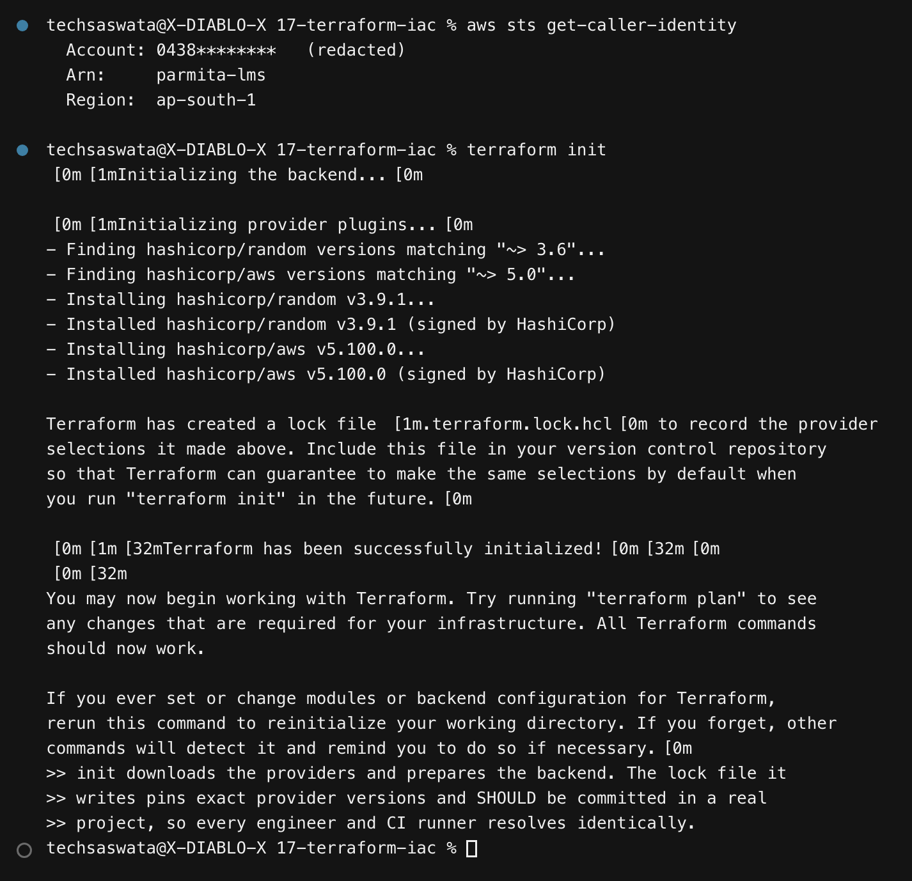
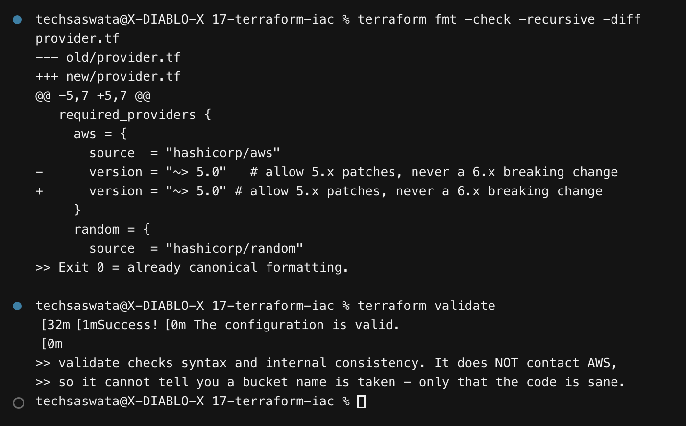
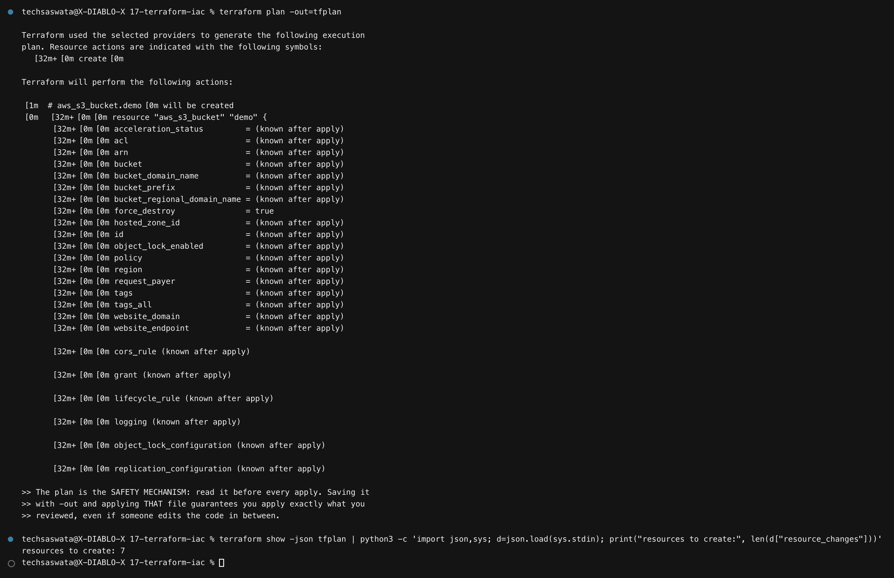
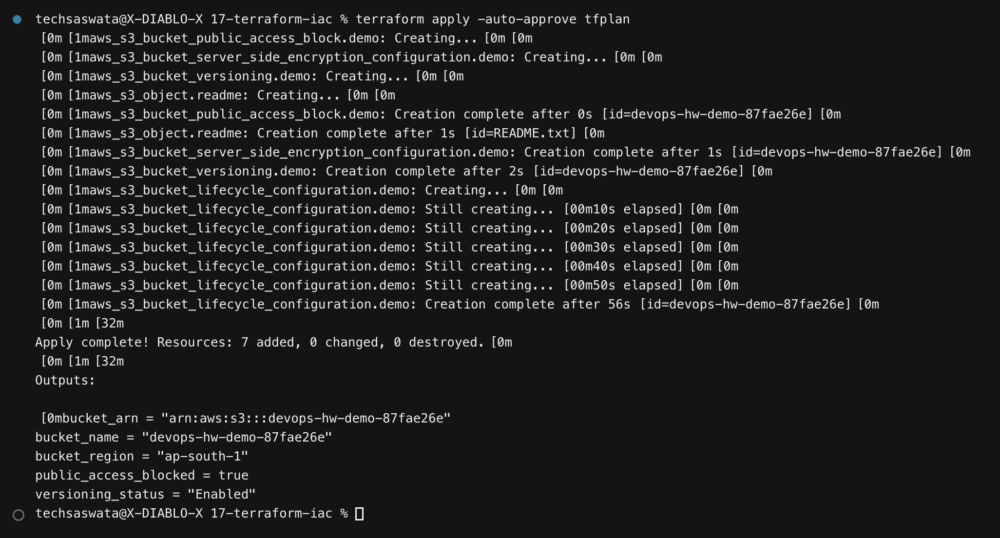
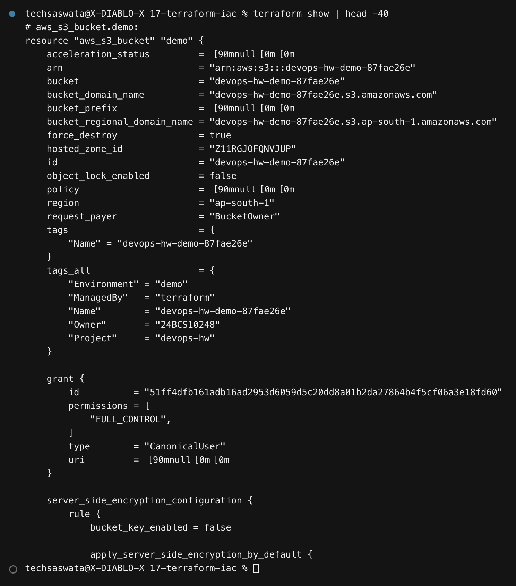
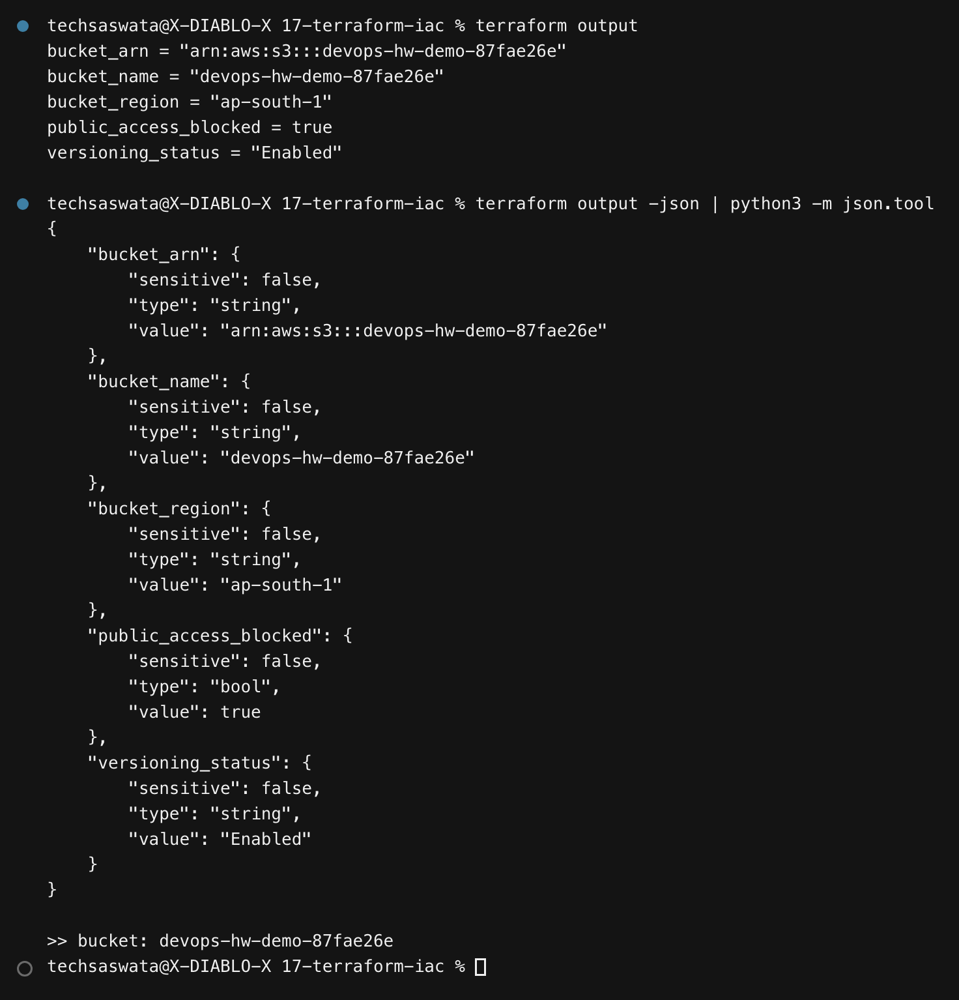
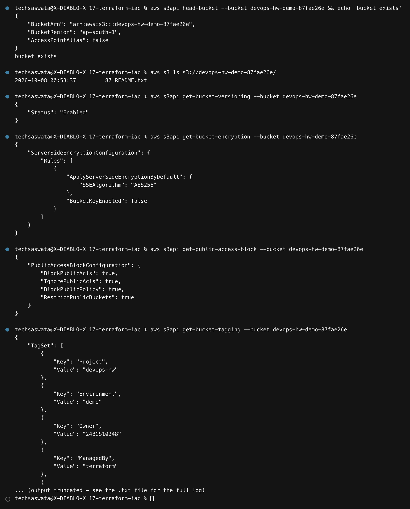
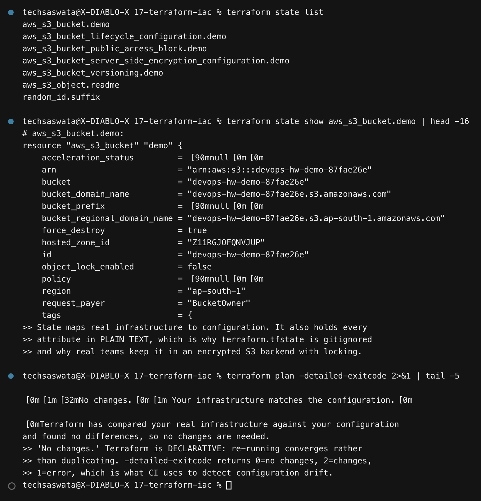
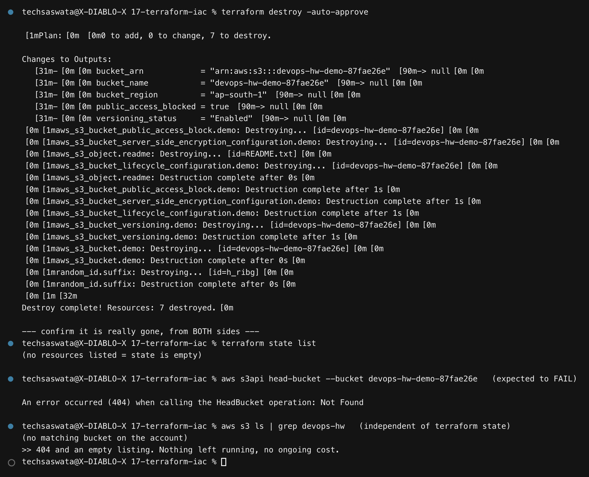

# 17 — Terraform & Infrastructure as Code

**Saswata Das — 24BCS10248** · Session 18

**This ran against real AWS** — account verified, region `ap-south-1`, 7 resources created
and destroyed. Nothing was left running.

```bash
./scripts/01-terraform-s3.sh    # init → fmt → validate → plan → apply → show → output → destroy
```

## Task coverage

| # | Task | Deliverable | Status |
|---|---|---|---|
| 1 | Terraform S3 demo with the full workflow | [`terraform-s3-demo/`](terraform-s3-demo/) — `main.tf`, `variables.tf`, `outputs.tf`, `provider.tf`, `terraform.tfvars` | ✔ |
| 2 | AWS services research, one README each | [`aws-services/`](aws-services/) — [IAM](aws-services/01-iam/), [EC2](aws-services/02-ec2/), [S3](aws-services/03-s3/), [VPC](aws-services/04-vpc/), [DynamoDB & RDS](aws-services/05-dynamodb-rds/) | ✔ |

---

# Task 1 — The Terraform workflow

## Project layout

```
terraform-s3-demo/
├── provider.tf       required_version, provider pinning, default_tags
├── variables.tf      typed inputs with validation rules
├── main.tf           the resources
├── outputs.tf        values exposed after apply
├── terraform.tfvars  this deployment's values
└── .gitignore        *.tfstate, .terraform/
```

### Credentials are *not* in the code

```hcl
provider "aws" {
  region = var.aws_region
  # No access keys here. Terraform uses the standard chain: environment
  # variables, then ~/.aws/credentials, then the instance role.
}
```

### `default_tags` — nothing goes untagged

```hcl
default_tags {
  tags = {
    Project = var.project_name
    Owner   = "24BCS10248"
    ManagedBy = "terraform"
  }
}
```

Applied to every resource the provider creates, so everything is attributable. On a shared
account this is what lets you find and clean up your own resources.

### Variable validation catches errors before AWS does

```hcl
variable "environment" {
  validation {
    condition     = contains(["demo", "dev", "staging", "prod"], var.environment)
    error_message = "environment must be one of: demo, dev, staging, prod."
  }
}
```

---

## 1. `terraform init`



Downloads providers and prepares the backend. The **lock file** it writes pins exact provider
versions and should be committed, so every engineer and CI runner resolves identically.

## 2. `fmt` and `validate`



```bash
terraform fmt -check -recursive -diff   # canonical formatting; exit 0 = clean
terraform validate                      # syntax + internal consistency
```

> **`validate` does not contact AWS.** It cannot tell you a bucket name is taken or that you
> lack permission — only that the configuration is internally sane. That is what `plan` is
> for.

## 3. `terraform plan`



```
Plan: 7 to add, 0 to change, 0 to destroy.
```

**The plan is the safety mechanism.** Saving it with `-out=tfplan` and applying *that file*
guarantees you apply exactly what you reviewed, even if the code changes in between.

Read the symbols: `+` create, `-` destroy, `~` update in place, and **`-/+` replace** — which
means destroy and recreate, and is how people accidentally delete databases.

## 4. `terraform apply`



```
Apply complete! Resources: 7 added, 0 changed, 0 destroyed.

bucket_arn            = "arn:aws:s3:::devops-hw-demo-87fae26e"
bucket_name           = "devops-hw-demo-87fae26e"
bucket_region         = "ap-south-1"
public_access_blocked = true
versioning_status     = "Enabled"
```

Seven resources: the bucket, versioning, encryption, public-access block, lifecycle rules, an
object, and the random suffix.

> **Why a random suffix?** S3 bucket names are globally unique across every AWS account on
> earth. `random_id` makes the configuration reusable without a name collision.

## 5. `terraform show` and `output`




`terraform output -json` is the machine-readable form — this is how a pipeline passes a
bucket name or VPC ID to the next stage.

## 6. Verifying with the AWS CLI — independently



Trusting Terraform's own output to prove Terraform worked is circular. Every setting was
confirmed against AWS directly:

```
$ aws s3api get-bucket-versioning     → "Status": "Enabled"
$ aws s3api get-bucket-encryption     → "SSEAlgorithm": "AES256"
$ aws s3api get-public-access-block   → all four blocks true
$ aws s3api get-bucket-tagging        → Project, Owner, ManagedBy, Environment
$ aws s3 cp s3://.../README.txt -     → the templated file contents
```

## 7. State and idempotence



```
$ terraform plan -detailed-exitcode
No changes. Your infrastructure matches the configuration.
```

Terraform is **declarative**: re-running converges rather than duplicating.
`-detailed-exitcode` returns `0` = no changes, `2` = changes, `1` = error — which is exactly
how CI detects **configuration drift**.

> **State holds every attribute in plain text**, including anything sensitive a resource
> exposes. That is why `terraform.tfstate` is gitignored here, and why real teams use an
> encrypted S3 backend with DynamoDB locking — so two engineers cannot apply simultaneously
> and corrupt it.

## 8. `terraform destroy`



```
Destroy complete! Resources: 7 destroyed.

$ terraform state list                   → (empty)
$ aws s3api head-bucket --bucket ...     → An error occurred (404): Not Found
$ aws s3 ls | grep devops-hw             → (no matching bucket on the account)
```

Verified from **both sides** — Terraform's state *and* an independent account listing.

### A real failure worth recording

The first version of this script wrapped every command in a helper that piped output through
`head`. When `head` has taken its lines it exits, the writer receives **SIGPIPE**, and the
process dies.

That killed `terraform destroy` partway through. The captured log claimed *"404 Not Found.
Nothing was left running"* — while a **real S3 bucket was still sitting in the account**. The
false claim was caught by running `aws s3 ls` separately, outside the script.

Two fixes:

1. Long-running commands now use a `runfull()` helper that captures output **first** and
   truncates after, so nothing is ever SIGPIPEd.
2. The destroy verification now queries AWS **independently of Terraform's state**, because
   an empty state proves nothing if the destroy did not actually complete.

> The general lesson: **never pipe a command whose completion matters into `head`.** And when
> a script asserts "it's gone", verify from a source the script does not control.

---

# Task 2 — AWS services

| Service | README | Covers |
|---|---|---|
| **IAM** | [`aws-services/01-iam/`](aws-services/01-iam/) | users, groups, roles, policies, permission evaluation, least privilege, best practices |
| **EC2** | [`aws-services/02-ec2/`](aws-services/02-ec2/) | AMIs, instance types, key pairs, security groups, EBS, public vs private IP, lifecycle |
| **S3** | [`aws-services/03-s3/`](aws-services/03-s3/) | buckets, objects, storage classes, versioning, lifecycle, encryption, bucket policies |
| **VPC** | [`aws-services/04-vpc/`](aws-services/04-vpc/) | CIDR, subnets, route tables, IGW, NAT, security groups vs NACLs, public vs private |
| **DynamoDB & RDS** | [`aws-services/05-dynamodb-rds/`](aws-services/05-dynamodb-rds/) | NoSQL vs relational, keys, engines, Multi-AZ, read replicas, backups |

Each is written against what the Terraform project actually did, and cross-references the
earlier Kubernetes and Docker modules where the same idea appears — security-group
references behave like label selectors, a NAT gateway is the cloud's version of the host
networking question from module 07, and the public/private IP distinction is the same
confusion as pod IPs versus Service IPs.

---

## Terraform command reference

| Command | Purpose |
|---|---|
| `terraform init` | download providers, prepare the backend |
| `terraform fmt -recursive` | canonical formatting |
| `terraform validate` | syntax and consistency, **offline** |
| `terraform plan -out=tfplan` | preview; save it to apply exactly what you reviewed |
| `terraform apply tfplan` | make it real |
| `terraform show` | human-readable state |
| `terraform output -json` | machine-readable outputs for pipelines |
| `terraform state list` / `show` | inspect tracked resources |
| `terraform plan -detailed-exitcode` | **drift detection** — exit 2 means changes |
| `terraform destroy` | tear everything down |
| `terraform import` | adopt an existing resource into state |
| `terraform taint` / `-replace` | force recreation |

---

## Files

```
17-terraform-iac/
├── README.md
├── terraform-s3-demo/   provider.tf variables.tf main.tf outputs.tf terraform.tfvars .gitignore
├── aws-services/        01-iam  02-ec2  03-s3  04-vpc  05-dynamodb-rds
├── scripts/             01-terraform-s3.sh
├── outputs/             386 lines of captured output
└── screenshots/         9 PNGs
```
