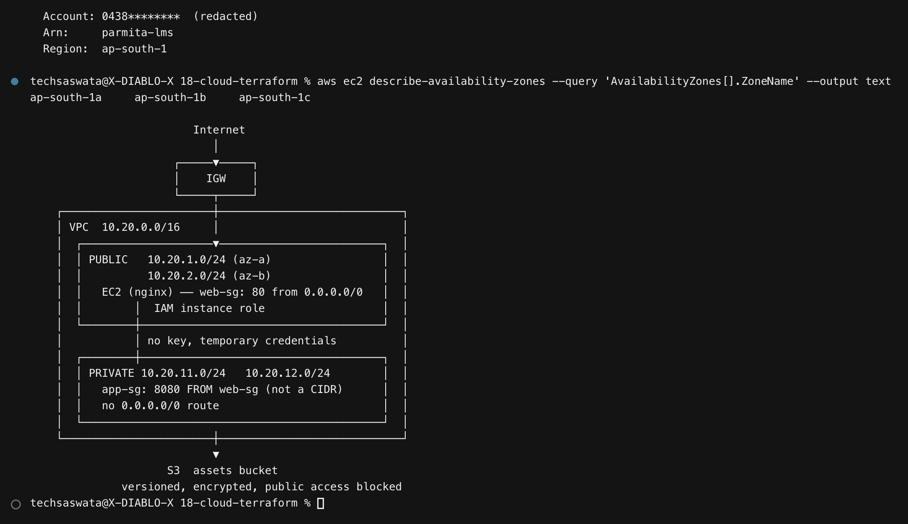
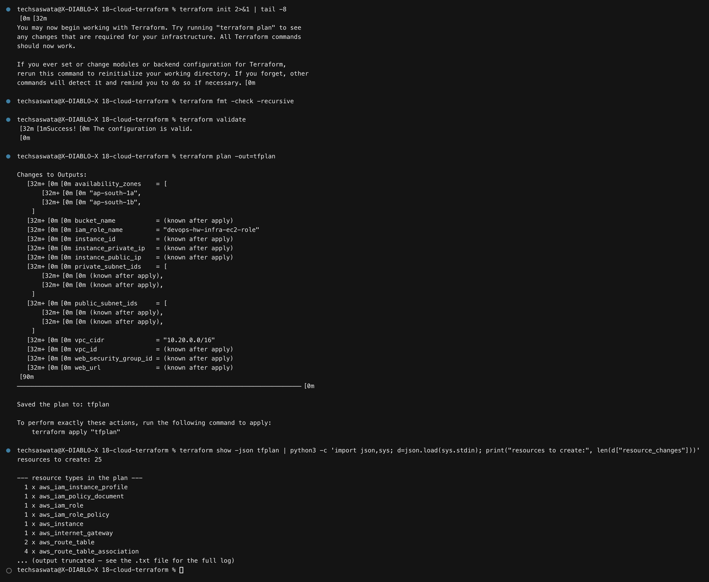
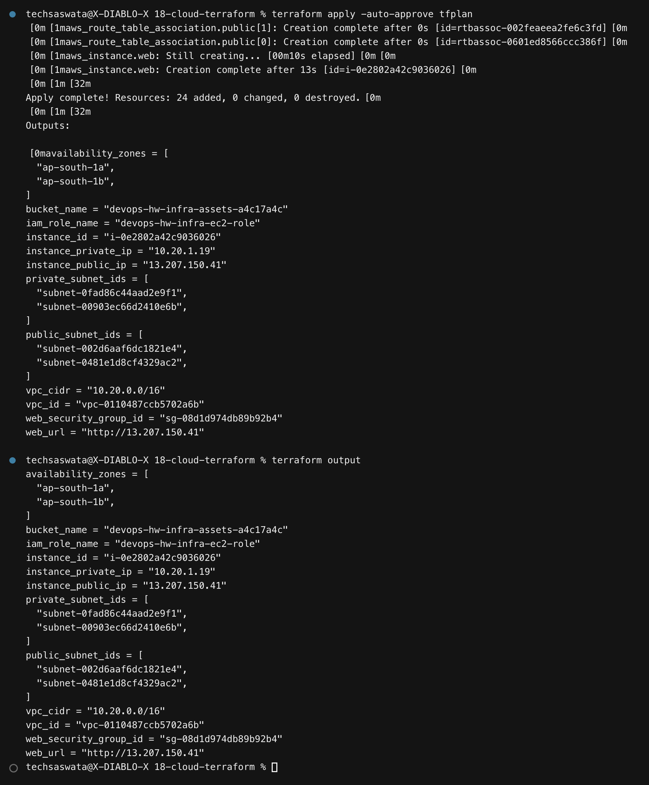
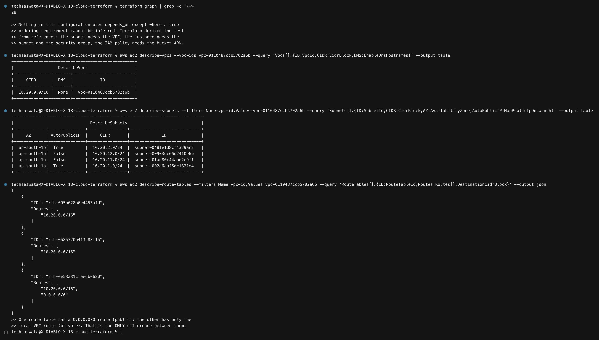
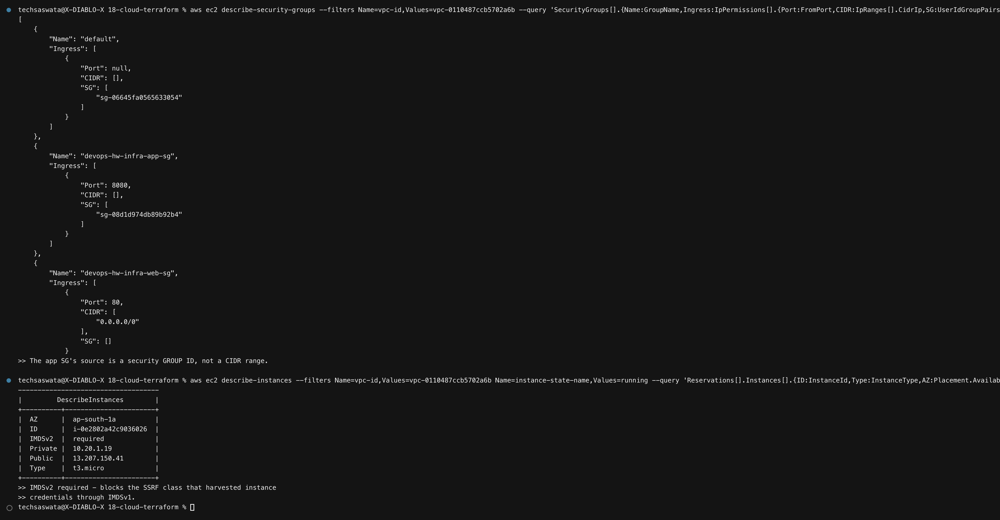
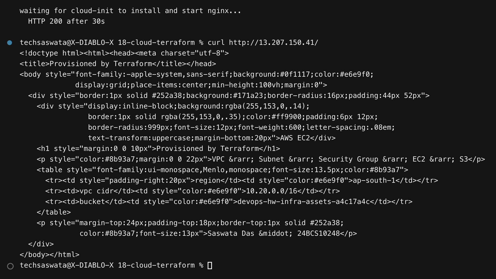
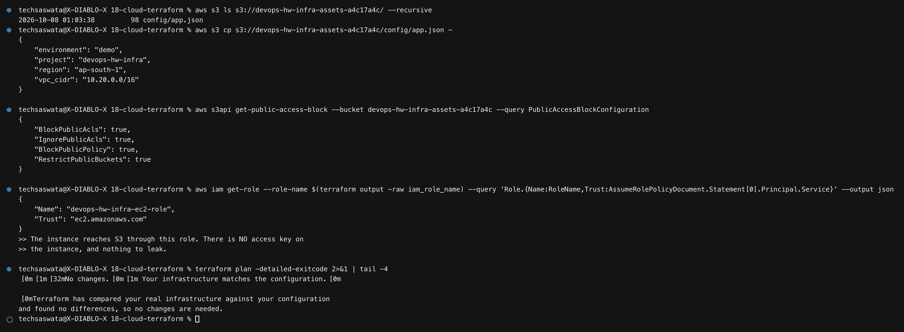
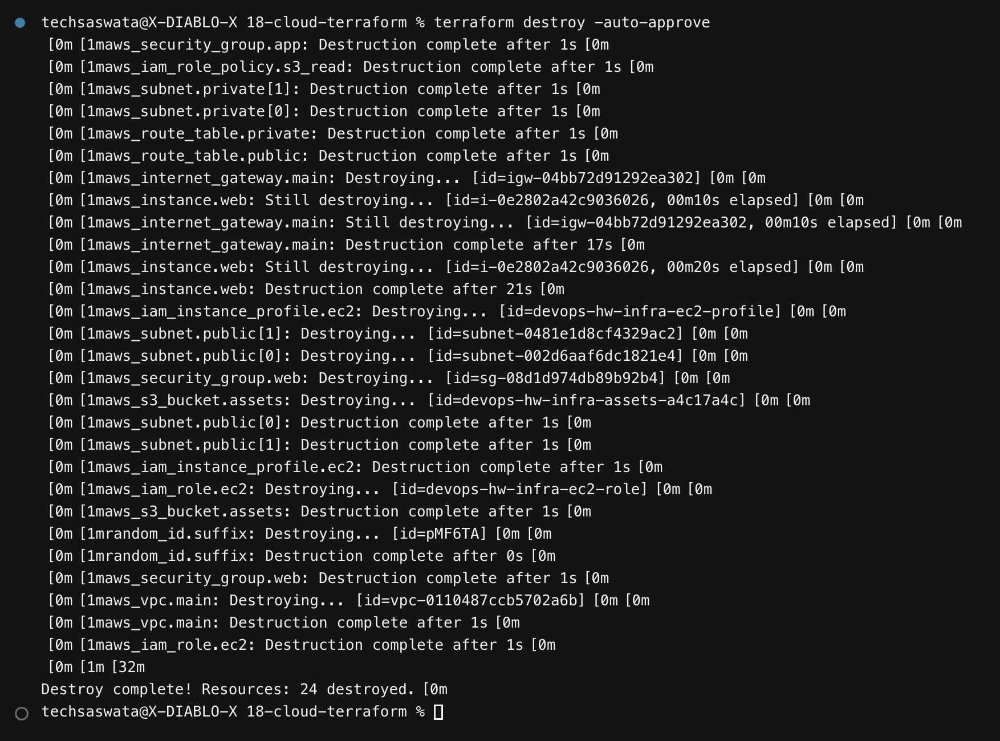

# 18 — Cloud & Terraform in Action

**Saswata Das — 24BCS10248** · Session 19

An end-to-end AWS environment built with Terraform and **applied to a real account** in
`ap-south-1` — **24 resources created, verified, and destroyed**. Nothing was left running.

```bash
./scripts/01-deploy-infra.sh    # plan → apply → verify → destroy, with a cleanup trap
```

## Architecture

```
                         Internet
                            │
                      ┌─────▼─────┐
                      │    IGW    │
                      └─────┬─────┘
    ┌───────────────────────┼────────────────────────────┐
    │ VPC  10.20.0.0/16     │                            │
    │  ┌────────────────────▼─────────────────────────┐  │
    │  │ PUBLIC   10.20.1.0/24 (ap-south-1a)          │  │
    │  │          10.20.2.0/24 (ap-south-1b)          │  │
    │  │   EC2 (nginx) ── web-sg: 80 from 0.0.0.0/0   │  │
    │  │        │  IAM instance role                  │  │
    │  └────────┼─────────────────────────────────────┘  │
    │           │ no access key, temporary credentials   │
    │  ┌────────┼─────────────────────────────────────┐  │
    │  │ PRIVATE 10.20.11.0/24   10.20.12.0/24        │  │
    │  │   app-sg: 8080 FROM web-sg (not a CIDR)      │  │
    │  │   no 0.0.0.0/0 route                         │  │
    │  └──────────────────────────────────────────────┘  │
    └───────────────────────┼────────────────────────────┘
                            ▼
                     S3  assets bucket
              versioned · encrypted · public access blocked
```



## Task coverage

| Requirement | Where |
|---|---|
| Terraform providers | [`provider.tf`](infrastructure/provider.tf) — pinned `~> 5.0`, `default_tags` |
| Variables | [`variables.tf`](infrastructure/variables.tf) — typed, with `validation` blocks |
| Resources | [`network.tf`](infrastructure/network.tf) · [`security.tf`](infrastructure/security.tf) · [`compute.tf`](infrastructure/compute.tf) · [`storage.tf`](infrastructure/storage.tf) |
| Outputs | [`outputs.tf`](infrastructure/outputs.tf) — 12 outputs |
| Dependencies | inferred from references — see [§4](#4-dependencies-terraform-worked-out-itself) |
| AWS infrastructure | VPC, subnets, IGW, route tables, security groups, IAM role, EC2, S3 |
| Terraform state | [§7](#7-state-idempotence-and-drift) |
| plan / apply / destroy | [§2](#2-plan), [§3](#3-apply), [§8](#8-destroy--and-proving-it) |

---

## 1. Files, split by concern

```
infrastructure/
├── provider.tf    version pinning, region, default_tags
├── variables.tf   typed inputs with validation
├── network.tf     VPC, subnets, IGW, route tables
├── security.tf    security groups + IAM role and instance profile
├── compute.tf     AMI data source, EC2 instance
├── storage.tf     S3 bucket, versioning, encryption, public access block
└── outputs.tf     12 outputs
```

Terraform loads every `.tf` file in a directory, so splitting by concern is purely for
readability — there is no import graph to maintain.

### Two data sources instead of hard-coded values

```hcl
data "aws_availability_zones" "available" { state = "available" }

data "aws_ami" "al2023" {
  most_recent = true
  owners      = ["amazon"]
  filter { name = "name", values = ["al2023-ami-2023.*-x86_64"] }
}
```

> **AMI IDs are regional** and AZ names are per-account. Hard-coding either makes the
> configuration unusable anywhere else. Resolving them at plan time means the same code runs
> in any region.

---

## 2. Plan



```
resources to create: 24

  2 x aws_route_table              1 x aws_vpc
  4 x aws_subnet                   1 x aws_internet_gateway
  4 x aws_route_table_association  1 x aws_instance
  2 x aws_security_group           1 x aws_iam_role
  ...
```

## 3. Apply



```
Apply complete! Resources: 24 added, 0 changed, 0 destroyed.

vpc_id                = "vpc-0110487ccb5702a6b"
vpc_cidr              = "10.20.0.0/16"
public_subnet_ids     = ["subnet-002d6aaf6dc1821e4", "subnet-0481e1d8cf4329ac2"]
private_subnet_ids    = ["subnet-0fad86c44aad2e9f1", "subnet-00903ec66d2410e6b"]
availability_zones    = ["ap-south-1a", "ap-south-1b"]
instance_public_ip    = "13.207.150.41"
bucket_name           = "devops-hw-infra-assets-a4c17a4c"
web_url               = "http://13.207.150.41"
```

---

## 4. Dependencies Terraform worked out itself



The configuration contains **almost no `depends_on`**. Terraform derives the order from
references:

```
aws_vpc.main
  └─▶ aws_subnet.public        (vpc_id = aws_vpc.main.id)
        └─▶ aws_instance.web   (subnet_id = aws_subnet.public[0].id)
aws_s3_bucket.assets
  └─▶ aws_iam_role_policy      (resources = [aws_s3_bucket.assets.arn])
        └─▶ aws_instance.web   (iam_instance_profile = ...)
```

Because the IAM policy references the bucket's ARN, Terraform knows the bucket must exist
first — and because the instance references the profile, the instance comes last. It also
parallelises everything *not* connected by such an edge.

> `depends_on` is only needed for ordering that cannot be expressed as a reference — the S3
> lifecycle rule in [module 17](../17-terraform-iac/) is a genuine example, because it
> depends on versioning being configured but does not reference any of its attributes.

---

## 5. The network, verified against AWS

```
$ aws ec2 describe-route-tables --filters Name=vpc-id,Values=vpc-011...
  rtb-public   Routes: ["10.20.0.0/16", "0.0.0.0/0"]     ← public
  rtb-private  Routes: ["10.20.0.0/16"]                  ← private
```

**That is the only difference between a public and a private subnet.** There is no checkbox:
a subnet is public because its route table sends `0.0.0.0/0` to an Internet Gateway.

Subnets are spread across **two availability zones**, because a subnet lives in exactly one
AZ and a single-AZ design has a single point of failure.

> No NAT Gateway is created. A NAT costs roughly **$32/month each** plus per-GB processing,
> and this demo's private tier needs no outbound internet. In production you would add one
> per AZ — and use a free **S3 Gateway Endpoint** to keep bucket traffic off it entirely.

---

## 6. Security groups referencing security groups



```hcl
ingress {
  from_port       = 8080
  security_groups = [aws_security_group.web.id]   # not a CIDR
}
```

The app tier accepts traffic **only from the web tier's security group**. The rule keeps
working as instances come and go — the same reasoning as a Kubernetes label selector in
[module 10](../10-k8s-networking-services/).

Two deliberate hardening choices:

- **No SSH rule.** Port 22 open to `0.0.0.0/0` is the most commonly abused AWS
  misconfiguration. Access is via SSM Session Manager, which needs no inbound port.
- **IMDSv2 required** (`http_tokens = "required"`), which blocks the SSRF class that
  harvested instance credentials through IMDSv1.

---

## 7. The instance really served



```
HTTP 200 after 30s

$ curl http://13.207.150.41/
<h1>Provisioned by Terraform</h1>
  region     ap-south-1
  vpc cidr   10.20.0.0/16
  bucket     devops-hw-infra-assets-a4c17a4c
```

A real EC2 instance, booted from `user_data`, serving a page whose values were templated in
by Terraform — which proves the whole chain was wired together, not just created.

### S3 and the IAM role



```
$ aws s3 ls s3://devops-hw-infra-assets-a4c17a4c/ --recursive
config/app.json

$ aws s3api get-public-access-block ...
BlockPublicAcls: true   BlockPublicPolicy: true
IgnorePublicAcls: true  RestrictPublicBuckets: true
```

The instance reaches S3 through an **instance role** scoped to `s3:GetObject` and
`s3:ListBucket` on **that one bucket**. There is no access key on the instance, so there is
nothing to leak.

---

## 7. State, idempotence and drift

```
$ terraform plan -detailed-exitcode
No changes. Your infrastructure matches the configuration.
```

Exit `0` = no changes, `2` = drift, `1` = error. A scheduled `plan -detailed-exitcode` is how
teams detect someone changing infrastructure by hand in the console.

---

## 8. Destroy — and proving it



```
Destroy complete! Resources: 24 destroyed.
```

The script wraps the teardown in a **trap**, so it runs even if an earlier step fails:

```bash
cleanup(){ runfull "terraform destroy -auto-approve"; }
trap cleanup EXIT
```

And the account was swept **independently of Terraform's state**, because an empty state
proves nothing if the destroy did not complete:

```
EC2 instances tagged for this project   → (none)
VPCs                                     → (none)
S3 buckets matching devops-hw            → (none)
IAM roles matching devops-hw             → (none)
terraform state list                     → (empty)
```

> This verification exists because of a real failure in
> [module 17](../17-terraform-iac/#a-real-failure-worth-recording): piping `terraform
> destroy` into `head` SIGPIPEd it partway through, and the log claimed success while a
> bucket was still live. Here, `runfull()` captures output before truncating, and the sweep
> queries AWS directly.

---

## Cost

Everything used is free-tier eligible or free, and ran for about ten minutes:

| Resource | Cost |
|---|---|
| VPC, subnets, route tables, IGW, security groups | **free** |
| EC2 `t3.micro` | free-tier eligible; ~₹1 otherwise for 10 min |
| EBS 8 GB gp3 | free-tier eligible |
| S3 (one small object) | negligible |
| **NAT Gateway** | **deliberately not created** — the one component that would have cost real money |

---

## Files

```
18-cloud-terraform/
├── README.md
├── infrastructure/   provider, variables, network, security, compute, storage, outputs
├── scripts/          01-deploy-infra.sh  (with a destroy trap)
├── outputs/          375 lines of captured output
└── screenshots/      8 PNGs
```
