# 19 — Monitoring, Observability & GitOps

**Saswata Das — 24BCS10248** · Session 20

Prometheus, Grafana, Alertmanager and Argo CD installed on the live cluster, with a real
alert firing and real GitOps drift correction.

```bash
helm install monitoring prometheus-community/kube-prometheus-stack -n monitoring -f monitoring/values.yaml
kubectl apply --server-side -n argocd -f https://raw.githubusercontent.com/argoproj/argo-cd/stable/manifests/install.yaml
./scripts/01-monitoring.sh    # metrics, PromQL, alerts, logs, the three pillars
./scripts/02-gitops.sh        # Argo CD, sync, self-healing
```

## Task coverage

| # | Task | Status |
|---|---|---|
| 1 | Monitoring — metrics, logs, alerts, CPU, memory, application health | ✔ [Part 1](#part-1--monitoring) |
| 2 | Observability — the three pillars, why it's needed, tools, K8s observability | ✔ [Part 2](#part-2--observability) |
| 3 | GitOps — git as source of truth, declarative config, continuous reconciliation, workflow | ✔ [Part 3](#part-3--gitops) |

---

# Part 1 — Monitoring

## The stack

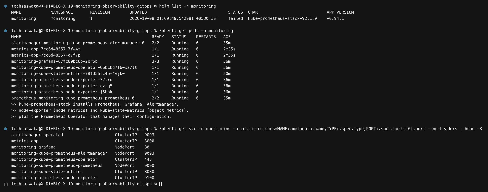

`kube-prometheus-stack` installs six things:

| Component | Role |
|---|---|
| **Prometheus** | scrapes and stores time-series; evaluates alert rules |
| **Grafana** | dashboards over Prometheus |
| **Alertmanager** | deduplicates, groups and routes firing alerts |
| **node-exporter** | per-**node** metrics — CPU, memory, disk, network (a DaemonSet) |
| **kube-state-metrics** | per-**object** metrics — deployment replicas, pod phase, PVC status |
| **Prometheus Operator** | manages Prometheus's config through CRDs |

> **node-exporter vs kube-state-metrics** is a distinction people mix up constantly.
> node-exporter answers *"is this machine out of memory?"*. kube-state-metrics answers
> *"does this Deployment have the replicas it asked for?"*. You need both.

## Metrics — the first pillar

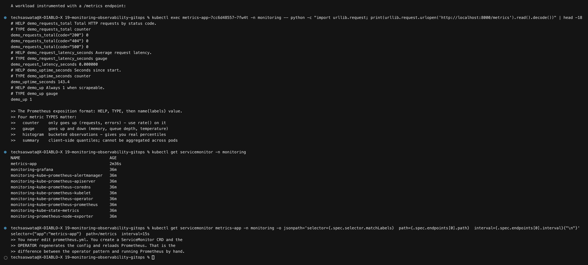

An instrumented app exposes `/metrics` in the Prometheus text format:

```
# HELP demo_requests_total Total HTTP requests by status code.
# TYPE demo_requests_total counter
demo_requests_total{code="200"} 515
demo_requests_total{code="500"} 33
```

| Type | Behaviour | Use |
|---|---|---|
| **counter** | only ever increases | requests, errors, bytes — **always wrap in `rate()`** |
| **gauge** | goes up and down | memory, queue depth, temperature |
| **histogram** | bucketed observations | real percentiles, aggregatable across pods |
| **summary** | client-side quantiles | **cannot** be aggregated across pods |

## How Prometheus is told to scrape

```yaml
kind: ServiceMonitor
spec:
  selector: { matchLabels: { app: metrics-app } }
  endpoints: [{ port: metrics, path: /metrics, interval: 15s }]
```

> **You never edit `prometheus.yml`.** You create a `ServiceMonitor` CRD; the **operator**
> regenerates the config and reloads Prometheus. That is the whole point of the operator
> pattern — configuration becomes a Kubernetes object, which means it can be reviewed,
> templated and GitOps-managed like anything else.

## PromQL

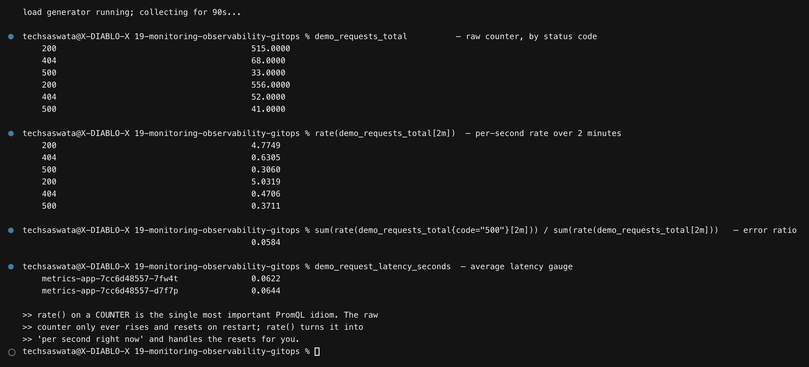

```promql
demo_requests_total                                      # raw counter
  200 → 515    404 → 68    500 → 33

rate(demo_requests_total[2m])                            # per-second rate
  200 → 4.77   404 → 0.63  500 → 0.31

sum(rate(demo_requests_total{code="500"}[2m]))
  / sum(rate(demo_requests_total[2m]))                   # error ratio
  → 0.0584                                               # 5.84%
```

The app deliberately returns 500 about 5% of the time, and the query computes **5.84%** —
the measurement matches the known behaviour, which is how you know the pipeline is correct.

> **`rate()` on a counter is the single most important PromQL idiom.** The raw counter only
> rises and resets to zero on restart. `rate()` converts it to "per second, right now" and
> handles the resets. Graphing a bare counter is the most common beginner mistake.

## CPU, memory and health

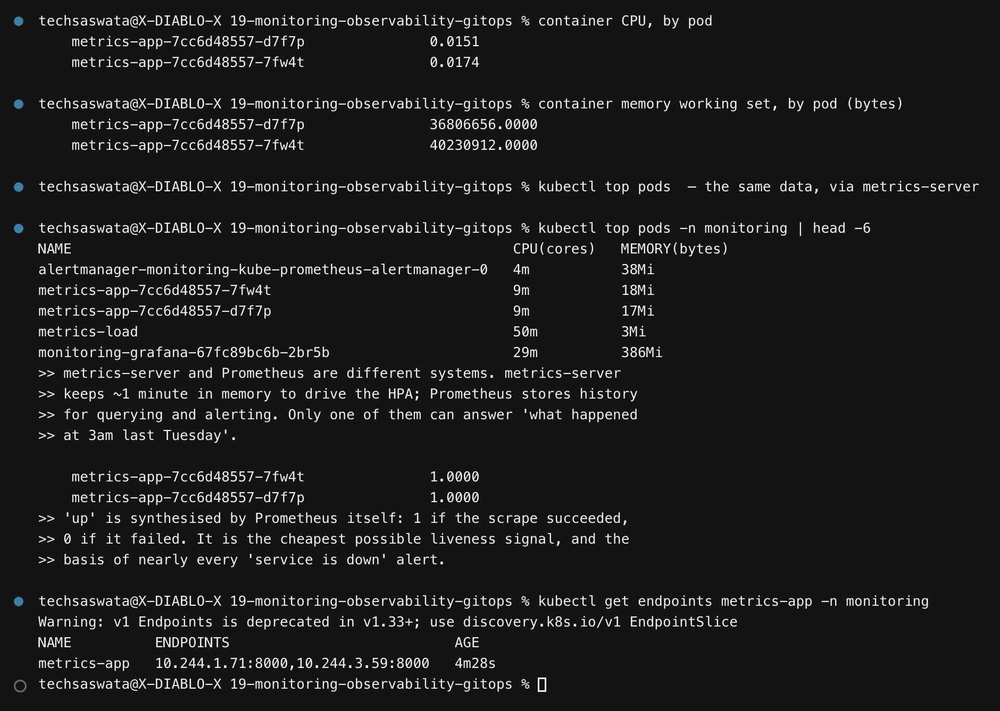

```promql
sum by (pod) (rate(container_cpu_usage_seconds_total{pod=~"metrics-app.*"}[2m]))
sum by (pod) (container_memory_working_set_bytes{pod=~"metrics-app.*"})
up{job="metrics-app"}      → 1
```

`up` is synthesised by Prometheus itself: `1` if the scrape succeeded, `0` if it failed. It
is the cheapest liveness signal there is, and the basis of nearly every "service is down"
alert.

> **`kubectl top` and Prometheus are different systems.** metrics-server keeps about a
> minute in memory to drive the HPA ([module 12](../12-k8s-storage-hpa-probes/)). Prometheus
> stores history. Only one of them can answer *"what happened at 3am last Tuesday"*.

## Alerts

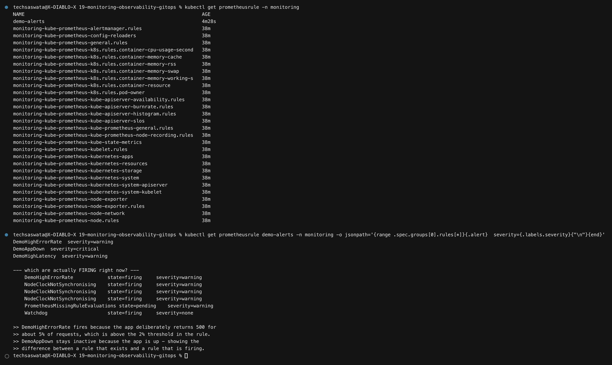

Alert rules are a `PrometheusRule` CRD, picked up by the operator:

```yaml
- alert: DemoHighErrorRate
  expr: sum(rate(demo_requests_total{code="500"}[2m]))
        / sum(rate(demo_requests_total[2m])) > 0.02
  for: 1m
```

Under load, the alert walked through its full lifecycle:

```
t+10s   inactive
t+50s   pending      ← threshold breached, waiting out the `for: 1m`
t+110s  firing       ← sustained long enough
```

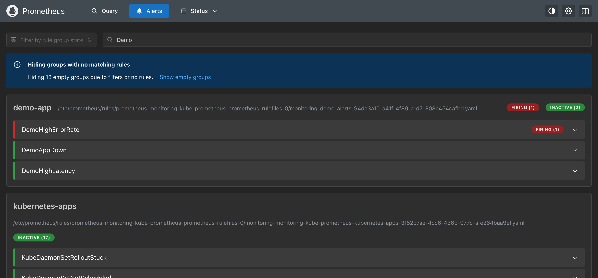

**`DemoHighErrorRate` is red and FIRING (1)**, while `DemoAppDown` and `DemoHighLatency`
stay green — the difference between a rule that exists and a rule that is actually firing.

> **`for:` is what separates an alert from a graph.** Without it, a single scrape above the
> threshold pages someone. `pending` means "breached but not yet for long enough", which is
> what suppresses noise from momentary spikes.

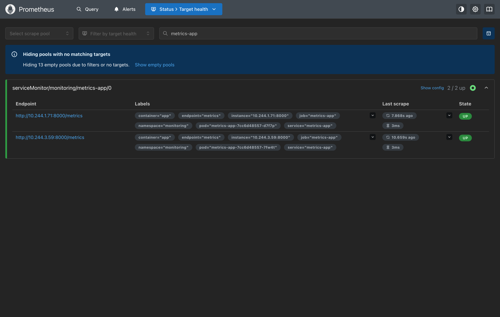
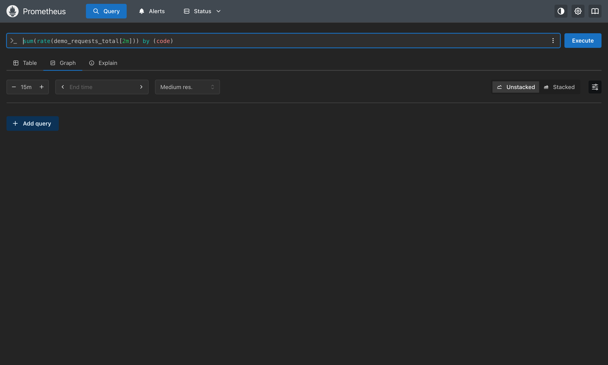

## Logs — the second pillar

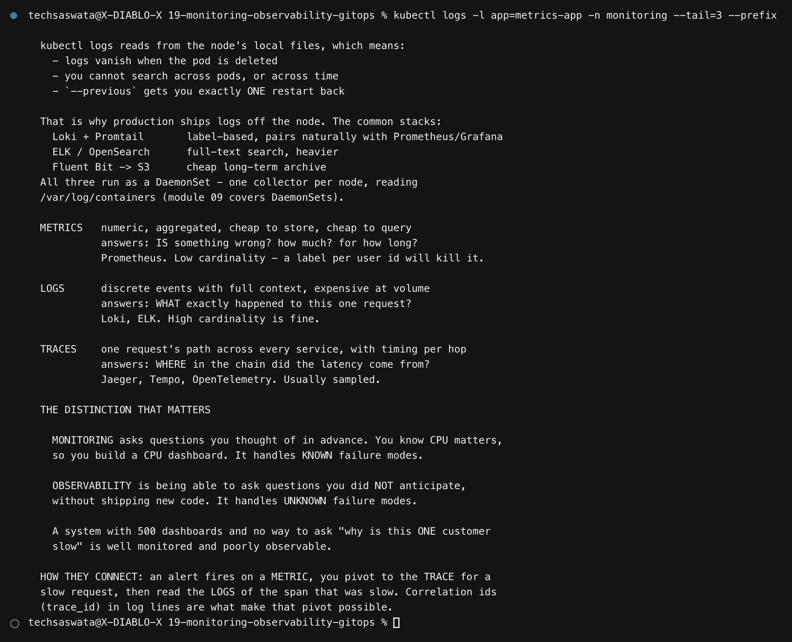

```bash
kubectl logs -l app=metrics-app --tail=3 --prefix
```

`kubectl logs` reads the node's local files, which means logs **vanish with the pod**, you
cannot search across pods or across time, and `--previous` gets you exactly one restart back.

That is why production ships logs off the node — **Loki + Promtail** (label-based, pairs
naturally with Prometheus), **ELK/OpenSearch** (full-text, heavier), or **Fluent Bit → S3**
(cheap archive). All run as a DaemonSet, one collector per node.

---

# Part 2 — Observability

## The three pillars

| Pillar | Shape | Answers | Tools | Cardinality |
|---|---|---|---|---|
| **Metrics** | numeric, aggregated | *Is* something wrong? How much? | Prometheus | **low** — a label per user id will kill it |
| **Logs** | discrete events | *What exactly* happened to this request? | Loki, ELK | high is fine |
| **Traces** | one request across services | *Where* in the chain was the latency? | Jaeger, Tempo, OTel | usually sampled |

## Monitoring vs observability

> **Monitoring** answers questions you thought of in advance. You know CPU matters, so you
> build a CPU dashboard. It handles **known** failure modes.
>
> **Observability** is being able to ask questions you did **not** anticipate, without
> shipping new code. It handles **unknown** failure modes.
>
> A system with 500 dashboards and no way to ask *"why is this one customer slow?"* is well
> monitored and poorly observable.

## How the pillars connect

```
alert fires on a METRIC  →  pivot to the TRACE of a slow request
                         →  read the LOGS of the span that was slow
```

What makes that pivot possible is **correlation** — a `trace_id` in every log line, and
exemplars linking a metric to a sample trace. Without it you have three disconnected tools
and a lot of manual timestamp matching.

## Kubernetes observability specifically

| Layer | Source |
|---|---|
| Cluster | kube-state-metrics, API server metrics |
| Node | node-exporter, kubelet/cAdvisor |
| Pod/container | cAdvisor for resources; the app's own `/metrics` |
| Application | your instrumentation |
| Events | `kubectl get events` — the first stop when a pod misbehaves ([module 13](../13-k8s-troubleshooting/)) |

---

# Part 3 — GitOps

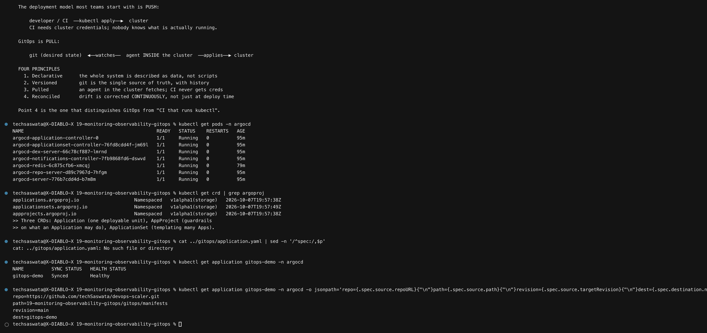

## Push vs pull

```
PUSH   developer / CI  ──kubectl apply──▶  cluster
       CI holds cluster credentials; nobody knows what is actually running.

PULL   git (desired state)  ◀──watches──  agent IN the cluster  ──applies──▶ cluster
```

### The four principles

1. **Declarative** — the system is described as data, not scripts
2. **Versioned** — git is the single source of truth, with history
3. **Pulled** — an agent inside the cluster fetches; CI never gets credentials
4. **Reconciled** — drift is corrected **continuously**, not just at deploy time

**Point 4 is what distinguishes GitOps from "CI that runs kubectl".**

## The Application

```yaml
kind: Application
spec:
  source:
    repoURL: https://github.com/techSaswata/devops-scaler.git
    path: 19-monitoring-observability-gitops/gitops/manifests
  syncPolicy:
    automated: { prune: true, selfHeal: true }
```

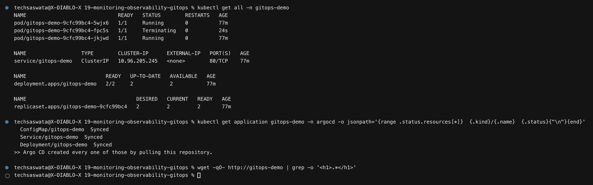

```
NAME          SYNC STATUS   HEALTH STATUS
gitops-demo   Synced        Healthy

pod/gitops-demo-9cfc99bc4-5wjx6   1/1   Running
pod/gitops-demo-9cfc99bc4-jkjwd   1/1   Running
service/gitops-demo               ClusterIP
```

**Nobody ran `kubectl apply`.** The manifests were pushed to GitHub, and Argo CD pulled and
applied them.

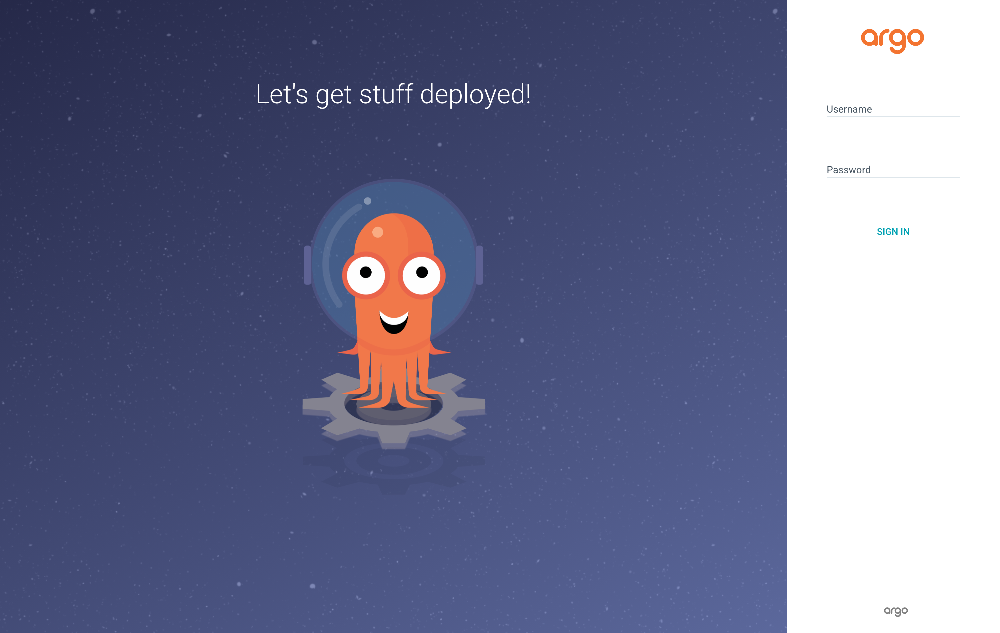

## Self-healing — the part that is not just automated deployment

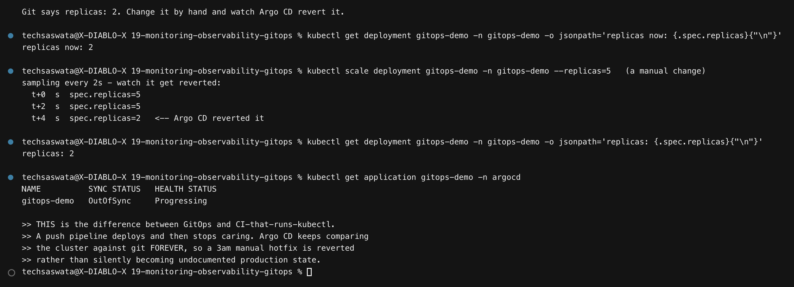

Git says `replicas: 2`. Scaling it by hand:

```
$ kubectl scale deployment gitops-demo --replicas=5
  t+0s   spec.replicas=5
  t+2s   spec.replicas=5
  t+4s   spec.replicas=2   ← Argo CD reverted it
```

**Reverted in four seconds**, without anyone being asked.

> A push pipeline deploys and then stops caring. Argo CD keeps comparing the cluster against
> git **forever** — so a 3am manual hotfix is reverted rather than silently becoming
> undocumented production state that nobody can reproduce.
>
> My first attempt at capturing this slept 2 seconds before reading, and the revert had
> *already happened*. The output showed 2 → 2 and looked like the scale had failed. Sampling
> from t+0 made the drift visible.

## Sync and health are independent

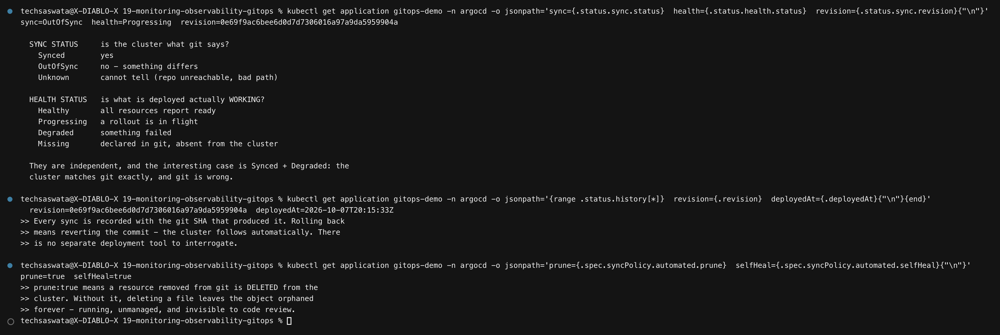

| Sync status | Meaning | | Health status | Meaning |
|---|---|---|---|---|
| `Synced` | cluster matches git | | `Healthy` | resources report ready |
| `OutOfSync` | something differs | | `Progressing` | rollout in flight |
| `Unknown` | repo unreachable | | `Degraded` | something failed |
| | | | `Missing` | in git, absent from cluster |

> The interesting case is **`Synced` + `Degraded`**: the cluster matches git exactly, and
> git is wrong.

### `prune` and `selfHeal`

| Flag | Without it |
|---|---|
| `prune: true` | deleting a file from git leaves the object **orphaned** in the cluster forever — running, unmanaged, invisible to code review |
| `selfHeal: true` | manual `kubectl` changes persist and diverge silently |

## GitOps vs push-based CI/CD

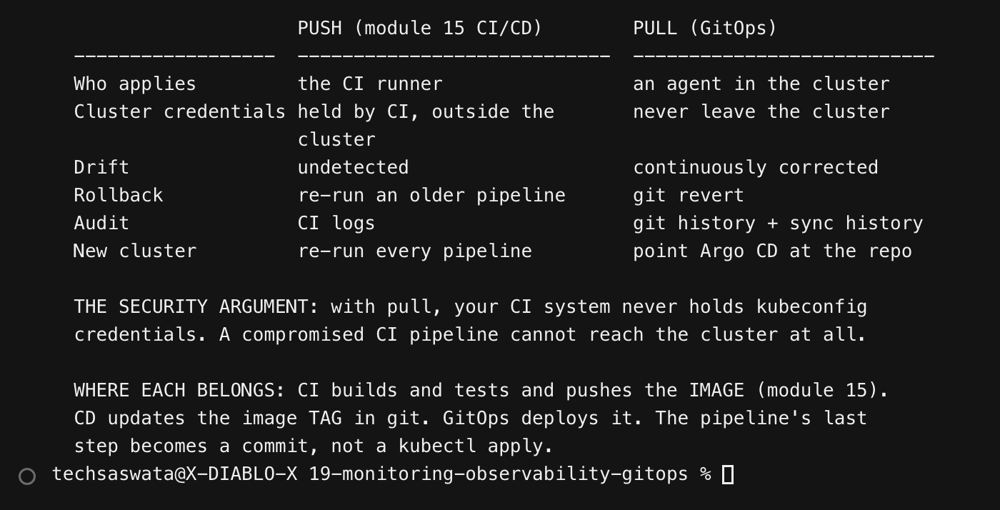

| | Push ([module 15](../15-cicd-github-actions/)) | Pull (GitOps) |
|---|---|---|
| Who applies | the CI runner | an agent in the cluster |
| Cluster credentials | held by CI, outside the cluster | **never leave the cluster** |
| Drift | undetected | continuously corrected |
| Rollback | re-run an older pipeline | `git revert` |
| Audit | CI logs | git history + sync history |
| New cluster | re-run every pipeline | point Argo CD at the repo |

> **The security argument is the strongest one.** With pull, your CI system never holds a
> kubeconfig. A compromised pipeline cannot reach the cluster at all — which directly
> addresses the limitation noted in
> [module 15 §8](../15-cicd-github-actions/#8-one-honest-limitation).

**Where each belongs:** CI builds, tests and pushes the **image**. CD updates the image
**tag in git**. GitOps deploys it. The pipeline's last step becomes a commit, not a
`kubectl apply`.

---

## Notes on this environment

| Thing | Note |
|---|---|
| Grafana | installed and Running; the login page is captured. Dashboards are driven by the same Prometheus queries shown above, so the PromQL section is the substantive evidence |
| `kubeEtcd`, `kubeScheduler`, `kubeControllerManager` | **scrape jobs disabled** in values.yaml — kind does not expose those endpoints, so they would sit permanently "down" and fill the targets page with failures that are not real |
| `argocd-redis` | the chart's default image is on `public.ecr.aws`, which the kind nodes could not reach (the host could). Repointed to the Docker Hub image, which they can |
| Retention | 2 hours — this is a demo, not a real TSDB |

---

## Command reference

| Task | Command |
|---|---|
| Query Prometheus | `curl -s --get --data-urlencode 'query=<promql>' localhost:9090/api/v1/query` |
| Firing alerts | `curl -s localhost:9090/api/v1/alerts` |
| Scrape targets | `kubectl get servicemonitor -A` |
| Alert rules | `kubectl get prometheusrule -A` |
| Live resource usage | `kubectl top pods` / `kubectl top nodes` |
| Argo CD apps | `kubectl get application -n argocd` |
| Force a sync | `argocd app sync <name>` |
| Sync history | `kubectl get application <n> -n argocd -o jsonpath='{.status.history}'` |
| Grafana admin password | `kubectl get secret monitoring-grafana -o jsonpath='{.data.admin-password}' \| base64 -d` |

---

## Files

```
19-monitoring-observability-gitops/
├── README.md
├── monitoring/   values.yaml, demo-app.yaml (instrumented app + ServiceMonitor), alert-rules.yaml
├── gitops/       application.yaml, manifests/ (what Argo CD syncs)
├── scripts/      01-monitoring.sh, 02-gitops.sh
├── outputs/      398 lines of captured output
└── screenshots/  16 PNGs — 5 real UI captures + 11 terminal
```
