# Session 21 — Final DevOps Project & Troubleshooting

A single application carried through every stage the course covered: written,
tested, scanned, containerised, scanned again, gated, published, deployed to
Kubernetes three different ways, provisioned real cloud infrastructure,
monitored until an alert actually fired, handed to GitOps, and then deliberately
broken six ways and repaired.

Everything below was executed. The `.txt` files in [outputs/](outputs/) are the
raw terminal captures, and every screenshot is rendered from the capture sitting
beside it — so each claim here can be checked against the log that produced it.
Where something failed, the failure is in the log and explained in the text
rather than quietly re-run.

---

## Contents

| # | Section |
|---|---|
| 1 | [Project overview](#1-project-overview) |
| 2 | [Architecture](#2-architecture) |
| 3 | [Technologies used](#3-technologies-used) |
| 4 | [Application setup](#4-application-setup) |
| 5 | [Docker setup](#5-docker-setup) |
| 6 | [Kubernetes deployment](#6-kubernetes-deployment) |
| 7 | [Helm deployment](#7-helm-deployment) |
| 8 | [Terraform infrastructure](#8-terraform-infrastructure) |
| 9 | [CI/CD pipeline](#9-cicd-pipeline) |
| 10 | [DevSecOps implementation](#10-devsecops-implementation) |
| 11 | [Monitoring](#11-monitoring) |
| 12 | [GitOps](#12-gitops) |
| 13 | [The final troubleshooting challenge](#13-the-final-troubleshooting-challenge) |
| 14 | [Screenshots](#14-screenshots) |
| 15 | [Lessons learned](#15-lessons-learned) |

---

## 1. Project overview

**Task API** — a small HTTP service that stores a list of tasks on a mounted
volume. It is deliberately modest, because the point of the project is the
machinery around it, not the application itself. What it does have is every
hook that machinery needs:

| Endpoint | Purpose |
| --- | --- |
| `GET /` | identity, config, and whether the Secret arrived |
| `GET /health` | liveness — is the process answering |
| `GET /ready` | readiness — **is the data volume writable** |
| `GET /metrics` | Prometheus exposition format |
| `GET /tasks` | list tasks, read from the volume |
| `POST /tasks` | create a task, persisted atomically |

The distinction between `/health` and `/ready` is the one that matters. Liveness
asks "is this process alive"; its remedy is a kill. Readiness asks "can this
process do its job right now", and here that means actually writing a file to
`/data`. A pod whose volume has gone read-only is alive but useless, and only
the readiness probe can tell the Service to stop sending it traffic.

### Repository layout

```
20-final-devops-project/
├── application/        the service and its tests
├── docker/             multi-stage, non-root image
├── kubernetes/         raw manifests (namespace → HPA)
├── helm/taskapi/       the same stack as a chart, with 3 values files
├── terraform/          VPC + S3 + ECR, applied to real AWS and destroyed
├── .github/workflows/  the pipeline (also live at the repo root)
├── security/           threat model and control list
├── monitoring/         ServiceMonitor + PrometheusRule
├── gitops/             Argo CD Application + the manifests it syncs
├── troubleshooting/    the six planted faults
├── scripts/            the five capture scripts that produced outputs/
├── outputs/            raw terminal logs
└── screenshots/        rendered from those logs
```

---

## 2. Architecture

```
          ┌──────────────┐
          │  developer   │
          └──────┬───────┘
                 │ git push
                 ▼
          ┌──────────────────────────────────────────────┐
          │              GitHub Actions                  │
          │                                              │
          │  test ─┐                                     │
          │  sast ─┤                                     │
          │  sca  ─┼──► SECURITY GATE ──► push image     │
          │  secret│                          │          │
          │  scan ─┤                          ▼          │
          │  image─┘                   ghcr.io/…/task-api│
          │  scan                            │           │
          └──────────────────────────────────┼───────────┘
                                             │ commit new tag
                                             ▼
                                    ┌──────────────────┐
                                    │   git (manifests)│◄── source of truth
                                    └────────┬─────────┘
                                             │ pull
                                             ▼
   ┌─────────────────────────────────────────────────────────────┐
   │                      Kubernetes cluster                     │
   │                                                             │
   │   Argo CD ──reconciles──► Deployment ◄── HPA                │
   │                              │                              │
   │   Ingress ──► Service ───────┘        ConfigMap + Secret    │
   │  (nginx)     (ClusterIP)                     │              │
   │                              Pod ◄───────────┘              │
   │                               │                             │
   │                               ├── PVC (ReadWriteOnce)       │
   │                               └── /metrics                  │
   │                                      │                      │
   │   Prometheus ◄── ServiceMonitor ─────┘                      │
   │       │                                                     │
   │       └── PrometheusRule ──► Alertmanager                   │
   └─────────────────────────────────────────────────────────────┘

   Terraform (separate plane) ──► AWS: VPC · subnets · IGW · S3 · ECR
```

Two things in that picture are deliberate.

**CI never touches the cluster.** The pipeline's last act is a commit, not a
`kubectl apply`. Nothing in GitHub holds cluster credentials. The cluster pulls.

**The HPA and the PVC are never both in play.** A ReadWriteOnce volume is a
per-node mount, so a second replica scheduled elsewhere can never attach it.
The chart refuses that combination outright — see
[Helm deployment](#7-helm-deployment).

---

## 3. Technologies used

| Layer | Tool | Where |
| --- | --- | --- |
| Application | Python 3.12, stdlib `http.server` only | `application/src/app.py` |
| Testing | pytest, pytest-cov | `application/tests/` |
| Container | Docker, multi-stage, `python:3.12-slim` | `docker/Dockerfile` |
| Registry | GHCR | `ghcr.io/techsaswata/devops-scaler/task-api` |
| Orchestration | Kubernetes 1.37 on kind (3 nodes) | `kubernetes/` |
| Ingress | ingress-nginx 1.14 | `kubernetes/06-ingress.yaml` |
| Packaging | Helm 3 | `helm/taskapi/` |
| IaC | Terraform ~> 1.5, AWS provider 5.x | `terraform/` |
| Cloud | AWS ap-south-1 — VPC, S3, ECR | applied and destroyed |
| CI/CD | GitHub Actions | `.github/workflows/final-project.yml` |
| SAST | bandit | pipeline + `scripts/01-deploy.sh` |
| SCA | Trivy (filesystem) | pipeline |
| Secrets | gitleaks 8.30.1 (pinned) | pipeline |
| Image scanning | Trivy (image) | pipeline + local |
| Monitoring | kube-prometheus-stack | `monitoring/` |
| GitOps | Argo CD | `gitops/` |

Why no web framework: the application has **zero third-party runtime
dependencies**. That is not minimalism for its own sake — it means the runtime
CVE surface is whatever Debian and CPython ship, and nothing else. The SCA job
has nothing to find because there is nothing to find, which is a real property
of the design rather than a passing grade.

---

## 4. Application setup

```bash
cd 20-final-devops-project/application
python3 -m venv .venv && . .venv/bin/activate
pip install -r requirements-dev.txt
pytest tests/ -v
python -m src.app          # listens on :8000
```

Configuration is entirely environmental, which is what makes the same image
usable in every environment:

| Variable | Source | Default |
| --- | --- | --- |
| `ENVIRONMENT`, `LOG_LEVEL`, `FEATURE_METRICS`, `APP_VERSION`, `DATA_DIR` | ConfigMap | dev values |
| `DB_PASSWORD`, `API_KEY` | **Secret** | empty |

Six tests, all passing:

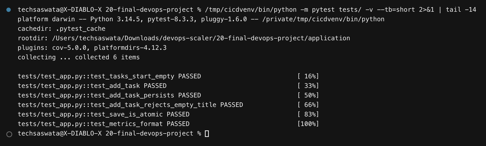

`test_save_is_atomic` is the one worth naming. `save_tasks` writes to
`tasks.json.tmp` and then calls `os.replace`, which is atomic on POSIX. Without
it, a crash midway through a write leaves a truncated JSON file and the service
never starts again — the data loss would happen at restart, not at crash, which
is the kind of bug that gets blamed on the wrong thing.

### Static analysis

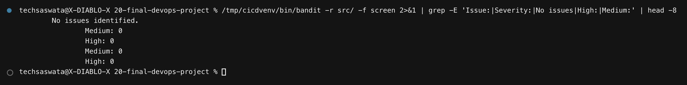

No issues. One finding was suppressed, and only one:

```python
HTTPServer(("0.0.0.0", port), Handler).serve_forever()  # nosec B104 - containers must bind all interfaces
```

B104 flags binding to all interfaces. In a container that is mandatory —
binding `127.0.0.1` would make the pod unreachable from the Service. The
suppression sits **on the offending line with its justification**, not as a
blanket exclusion in a config file, so it is visible in review and cannot
silently cover a second finding later.

---

## 5. Docker setup

```dockerfile
FROM python:3.12-slim AS build
WORKDIR /build
COPY requirements.txt .
RUN mkdir -p /install \
 && pip install --no-cache-dir --prefix=/install -r requirements.txt

FROM python:3.12-slim
RUN apt-get update && apt-get upgrade -y && rm -rf /var/lib/apt/lists/*
COPY --from=build /install /usr/local
WORKDIR /app
COPY src/ ./src/
RUN useradd --create-home --uid 10001 appuser \
 && mkdir -p /data && chown -R appuser:appuser /app /data
USER 10001
```

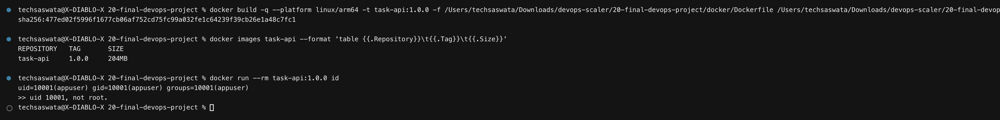

The `mkdir -p /install` is not decoration. The application has no dependencies,
so `pip install` creates nothing, `/install` never exists, and the `COPY
--from=build` in the next stage fails with `"/install": not found`. The build
broke on exactly this. Creating the directory unconditionally keeps the
multi-stage pattern correct whether or not there are dependencies — which is
the behaviour you want, since dependencies may be added later by someone who
would otherwise have to debug a stage they did not write.

`apt-get upgrade` in the runtime stage is what the image scanner actually
grades: the base image is rebuilt on a schedule, so by the time you pull it
there are usually patched OS packages waiting.

### Image scan

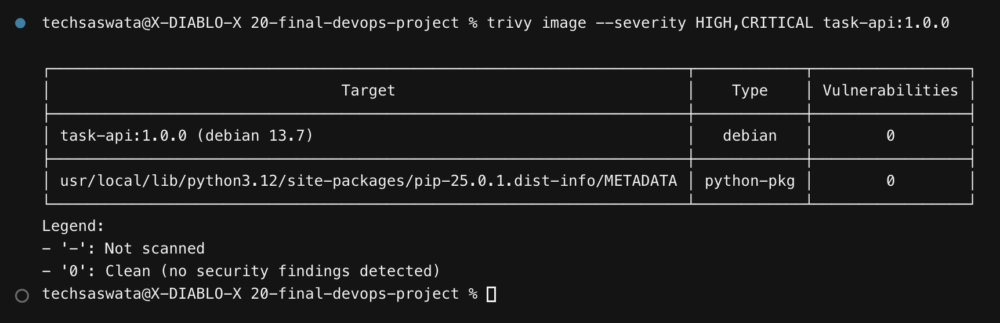

Zero HIGH or CRITICAL, in both the Debian layer and the Python packages.

---

## 6. Kubernetes deployment

Eight manifests, applied in order, in namespace `finalproject`:

| File | Object | Note |
| --- | --- | --- |
| `00-namespace.yaml` | Namespace | |
| `01-config.yaml` | ConfigMap | non-secret configuration |
| `02-secret.example.yaml` | Secret | **template only**, `REPLACE_ME` values |
| `03-storage.yaml` | PVC | 128Mi, ReadWriteOnce |
| `04-deployment.yaml` | Deployment | probes, securityContext, resources |
| `05-service.yaml` | Service | ClusterIP |
| `06-ingress.yaml` | Ingress | host `taskapi.local` |
| `07-hpa.yaml` | HPA | 1–4 replicas on 60% CPU |

The real Secret is **never** in git. It is created at deploy time, and its value
is generated rather than written down:

```bash
kubectl -n finalproject create secret generic task-api-secret \
  --from-literal=DB_PASSWORD="$(openssl rand -hex 12)" \
  --from-literal=API_KEY="$(openssl rand -hex 12)"
```

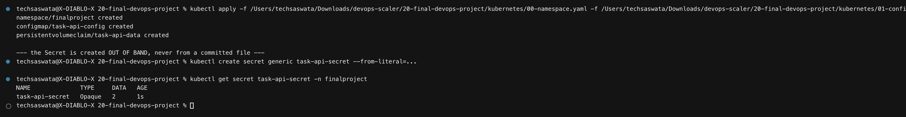

### Getting the image onto the nodes

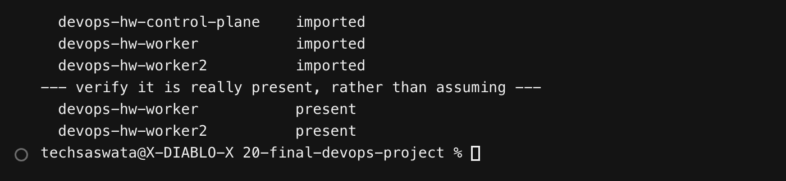

kind nodes keep their own containerd image store, entirely separate from the
host's Docker. Two failures came out of this, and both are worth recording.

First, `docker save` of a **multi-arch** buildx image produces an archive whose
per-platform content is incomplete, and `ctr import` rejects it with `content
digest … not found`. Building single-arch for the cluster's own architecture
avoids it. (The *published* image is still multi-arch — that is built by the
pipeline, where it belongs.)

Second, and more embarrassing: an earlier version of the script reported
`imported` for all three nodes while the image was not actually there, because
it never checked. The script now runs `crictl images` on each node afterwards
and prints `present` or `MISSING` from the node's own answer. "The command
exited 0" and "the thing exists" are different claims.

### Probes

```yaml
startupProbe:   { path: /health, failureThreshold: 30, periodSeconds: 2 }
readinessProbe: { path: /ready,  periodSeconds: 5, failureThreshold: 3 }
livenessProbe:  { path: /health, periodSeconds: 15, failureThreshold: 3 }
```

The startup probe exists so the liveness probe can stay strict. Without it you
must set liveness generously enough to survive the slowest cold start, and that
generosity then applies forever — a genuinely hung pod takes minutes to be
killed. The startup probe absorbs the slow boot once (up to 60s here) and then
steps out of the way.

### It works

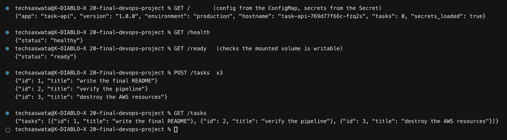

`secrets_loaded: true` means the Secret was mounted and non-empty — the
application reports it rather than the manifest asserting it.

### Persistence survives a pod restart

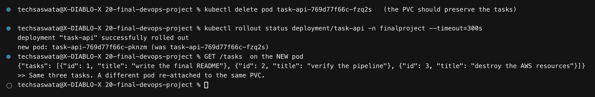

Three tasks created, pod deleted, a **different** pod reports the same three
tasks. That is the PVC doing its job; without it the restart would have silently
emptied the list.

The Deployment is `replicas: 1` with `strategy: Recreate`, and both are forced
by the ReadWriteOnce volume: a rolling update would need the old and new pods to
hold the same volume simultaneously, which RWO forbids.

### Security context is really applied

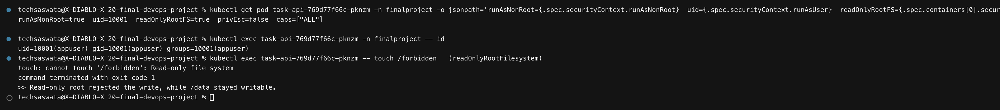

Asserted in the manifest, then **checked from inside the running container**:
`uid=10001(appuser)`, and `touch /forbidden` returns `Read-only file system`.
A `readOnlyRootFilesystem: true` that nobody tests is a comment.

### Ingress

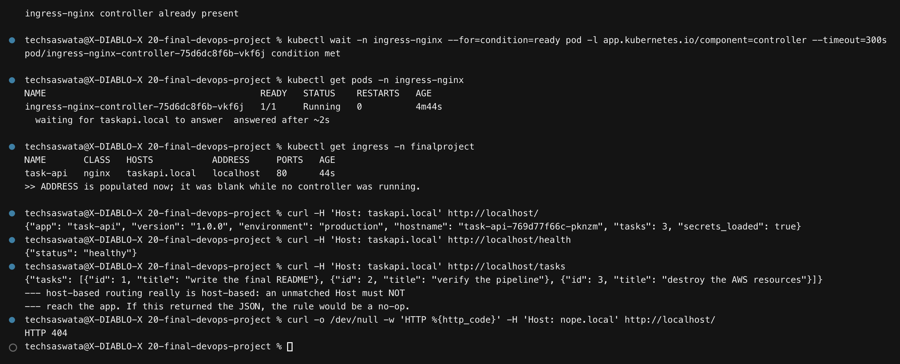

This one failed first and the failure is the lesson. The Ingress object existed,
`kubectl get ingress` listed it happily — and both `curl`s returned **nothing**,
with a blank `ADDRESS` column:

```
NAME       CLASS   HOSTS           ADDRESS   PORTS   AGE
task-api   nginx   taskapi.local             80      49s
```

The cause was not a timing race. **ingress-nginx was not installed** — its
namespace had been cleaned up after an earlier module. An Ingress with no
controller watching it is inert: it is a row in etcd that nothing reads. The
blank `ADDRESS` is the tell, and it is easy to skim past because the object
itself looks healthy.

The deploy script now installs the controller if absent, waits for it, and then
**polls until the route returns HTTP 200** before curling.

That polling detail caused a second, worse bug. The first version of the poll
waited for *non-empty* output — and ingress-nginx answers immediately with its
own `503 Service Temporarily Unavailable` page while it still has no healthy
endpoint. That page is non-empty, so the loop exited at once and the narration
underneath claimed success over a 503. Only the **status code** distinguishes
"nginx is talking to me" from "my app is talking to me".

The last two lines of that capture are the negative test: `Host: nope.local`
returns `HTTP 404` from nginx, proving the routing is genuinely host-based. A
rule that matched everything would look identical in every other respect.

---

## 7. Helm deployment

The same stack as a chart, installed into its own namespace
`finalproject-helm`, with three values files:

| File | Shape | PVC | HPA |
| --- | --- | --- | --- |
| `values.yaml` | stateful, 1 replica | yes | no |
| `values-scaled.yaml` | stateless, autoscaled 2–4 | no | yes |
| `values-staging.yaml` | overlay: DEBUG, smaller limits | inherited | inherited |

### The chart refuses a combination that cannot work

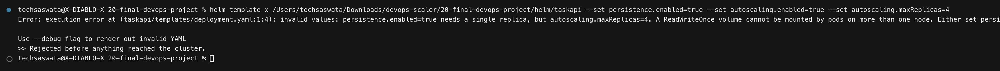

The original chart shipped `persistence.enabled: true` **and**
`autoscaling.maxReplicas: 4`. That is not a style problem, it is a latent
outage: a ReadWriteOnce volume is bound to one node, so the moment the HPA adds
a replica it is scheduled somewhere else and sits in `ContainerCreating`
forever — under exactly the load the HPA exists to handle.

`templates/_validate.tpl` now rejects it at template time:

```
Error: execution error at (taskapi/templates/deployment.yaml:1:4):
invalid values: persistence.enabled=true needs a single replica, but
autoscaling.maxReplicas=4. A ReadWriteOnce volume cannot be mounted by pods on
more than one node.
```

Failing in `helm template` costs seconds. Failing in production costs an
incident, and the symptom there (`ContainerCreating`) points at storage rather
than at the values file that caused it.

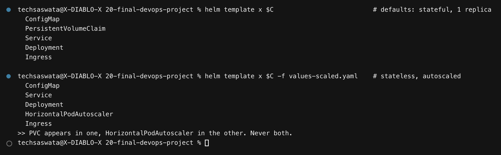

PVC in one, HorizontalPodAutoscaler in the other, never both.

### Validation against the real API server

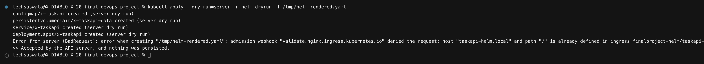

`kubectl apply --dry-run=server` sends the manifests through the actual
admission chain — schema validation, defaulting, webhooks — and persists
nothing. It catches what a text-level linter cannot. CI has no cluster, so the
workflow uses `kubeconform` against the upstream schemas instead; the two are
complementary rather than interchangeable.

### Install, upgrade, rollback

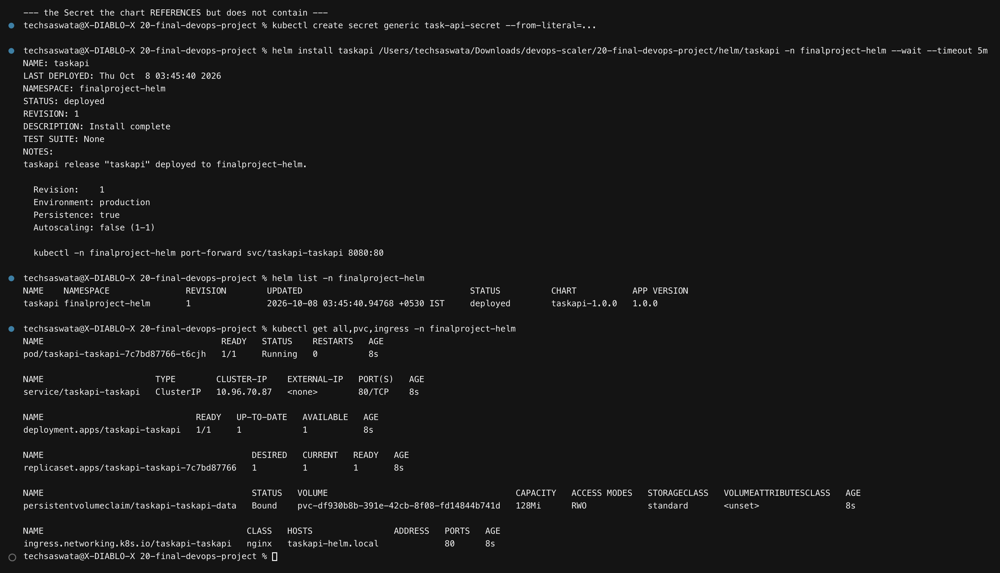
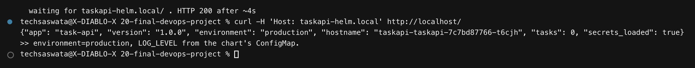

A values-only change still has to roll the pods:

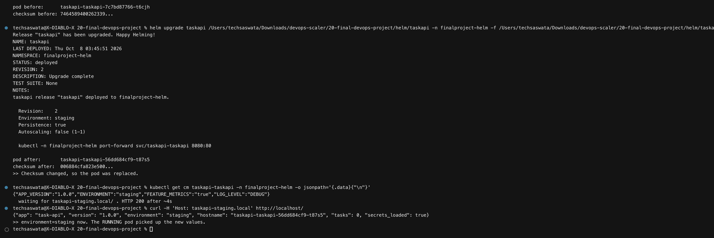

```yaml
annotations:
  checksum/config: {{ include (print $.Template.BasePath "/configmap.yaml") . | sha256sum }}
```

Without that annotation, upgrading with `values-staging.yaml` updates the
ConfigMap and leaves the running pods on the old environment — because the
Deployment's own spec never changed, so Kubernetes correctly does nothing. The
checksum makes a config change a pod-template change. The capture shows the
checksum moving, a new pod name, and `environment: staging` coming back from
the live endpoint.

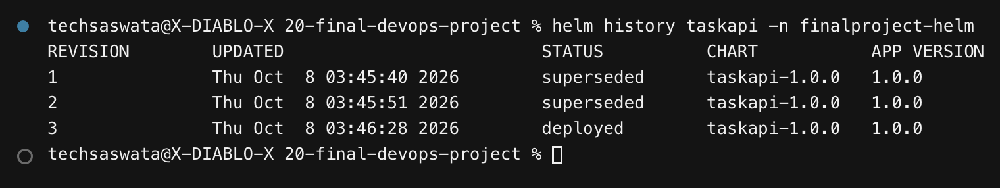
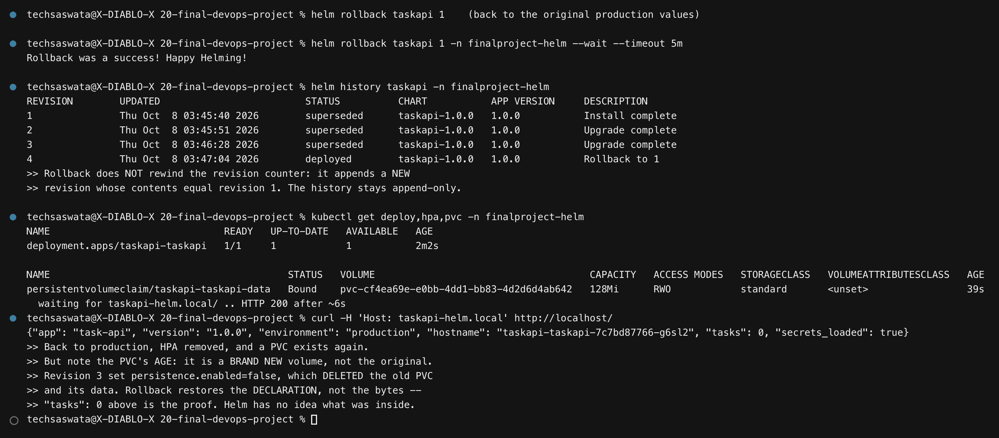

Rolling back to revision 1 creates **revision 4**. Helm's history is
append-only; it never rewinds the counter, so "which revision is live" and "what
has happened to this release" stay separate questions.

The honest caveat, visible in the same capture: the restored PVC is a **brand
new volume**, and `"tasks": 0`. Revision 3 set `persistence.enabled=false`,
which deleted the old PVC and its contents. **Rollback restores the
declaration, not the data.** Helm has no idea what was inside, and a chart that
can delete a PVC is one bad `--set` away from data loss.

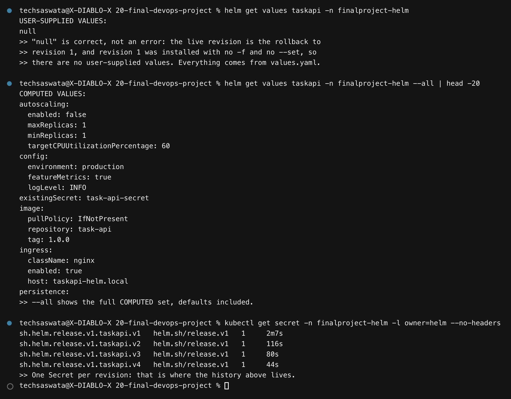

One Secret per revision in the release namespace — that is where the history
above physically lives.

---

## 8. Terraform infrastructure

Applied to a **real AWS account** in `ap-south-1`, then destroyed, in one
scripted run: [`scripts/05-terraform.sh`](scripts/05-terraform.sh) →
[`outputs/05-terraform.txt`](outputs/05-terraform.txt).

| Resource | Why |
| --- | --- |
| VPC `10.30.0.0/16` | network boundary |
| 2 public subnets across 2 AZs | `cidrsubnet()`, AZs from a data source |
| Internet gateway + route table + 2 associations | egress |
| S3 bucket + versioning + SSE + public access block | artefacts, four separate resources |
| ECR repository, immutable tags, scan on push | the image registry |

13 managed resources plus one data source.

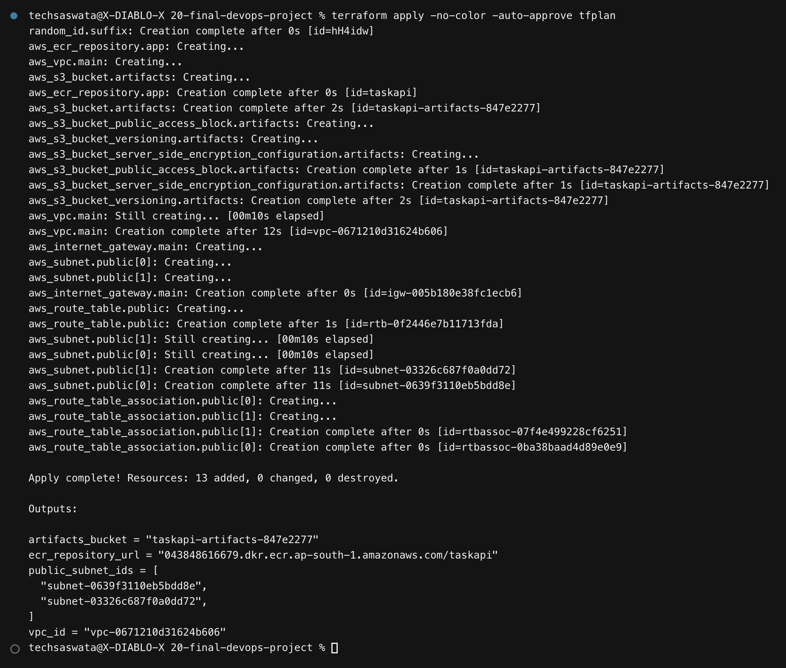
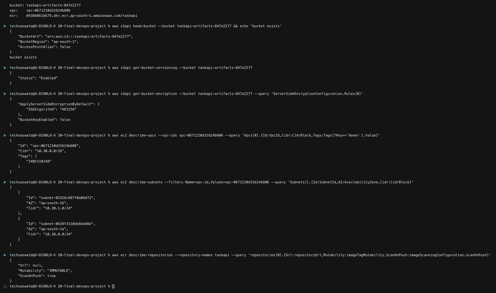

Existence is confirmed by **asking AWS**, not by reading Terraform's state.
State is Terraform's opinion about the world; the API is the world.

### Drift

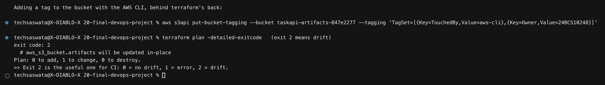

A tag added with the AWS CLI behind Terraform's back, then:

```
terraform plan -detailed-exitcode   →   exit code 2
  # aws_s3_bucket.artifacts will be updated in-place
Plan: 0 to add, 1 to change, 0 to destroy.
```

`-detailed-exitcode` is the one that belongs in CI: `0` no changes, `1` error,
`2` drift. A plain `plan` exits 0 whether or not anything differs, so a pipeline
built on it silently tolerates drift.

### Destroy, and proving it

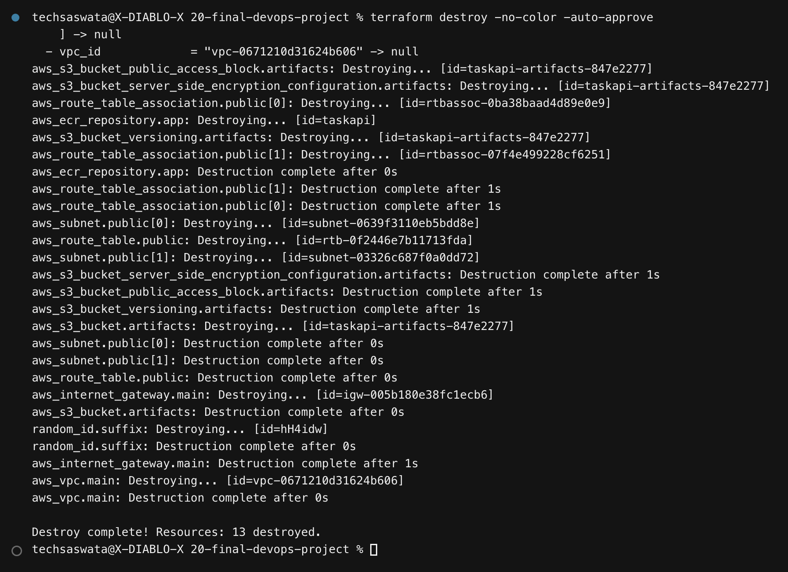
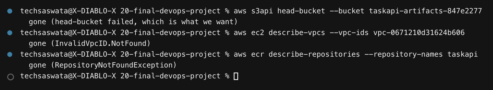

`Destroy complete! Resources: 13 destroyed.` — then each resource is checked
again from outside, phrased so that *success of the command* means a leftover:

```
aws s3api head-bucket   → gone (head-bucket failed, which is what we want)
aws ec2 describe-vpcs   → gone (InvalidVpcID.NotFound)
aws ecr describe-repos  → gone (RepositoryNotFoundException)
```

This verification exists because of a real incident in module 17: `terraform
destroy` was piped into `head`, which closed the pipe, sent SIGPIPE, and killed
the destroy **part way through** — leaving a real S3 bucket behind while the
log claimed `404 Not Found`. Nothing in this script pipes Terraform into
anything; `runfull` captures the whole output first and trims afterwards.

### Leaving a shared account clean

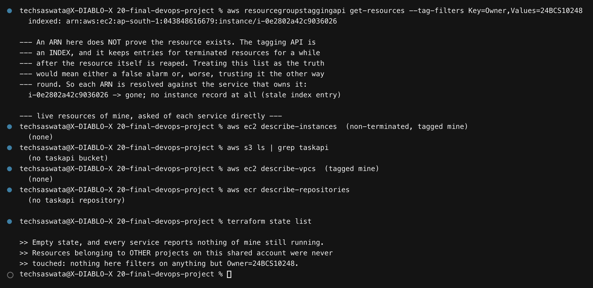

The account is shared with other projects, so every resource inherits
`Owner = 24BCS10248` from `default_tags`, teardown runs from a `trap ... EXIT`
(it fires even if the script dies mid-way), and a final sweep looks for anything
still tagged as mine.

That sweep taught its own lesson. The tagging API **still returned an ARN** for
an EC2 instance from an earlier module. Resolving that ARN against EC2 directly
returns no instance record at all: the Resource Groups Tagging API is an
*index*, and it retains entries for terminated resources for a while. A script
that treats the index as truth raises a false alarm here — and would be trusted
in the other direction too, which is the dangerous half. The script now resolves
every ARN against the owning service, then asks EC2, S3, ECR and VPC directly.
All four report nothing of mine. No resource belonging to another project was
touched; every filter is scoped to `Owner=24BCS10248`.

---

## 9. CI/CD pipeline

[`.github/workflows/final-project.yml`](.github/workflows/final-project.yml) —
live, and **green**:
[run 37697610521](https://github.com/techSaswata/devops-scaler/actions/runs/37697610521).

```
test ─┐
sast ─┤
sca  ─┼──► security-gate ──► push ──► gitops-update
secret│      (needs: all five)
scan ─┤
image─┘
scan
```

| Job | Does |
| --- | --- |
| `test` | pytest + coverage, uploaded as an artifact |
| `sast` | bandit; fails only on HIGH |
| `sca` | Trivy filesystem scan, HIGH/CRITICAL, `ignore-unfixed` |
| `secret-scan` | gitleaks **8.30.1**, full history |
| `image-scan` | builds the image and scans it **without pushing** |
| `security-gate` | `needs:` all five — the structural choke point |
| `push` | multi-arch buildx → GHCR |
| `gitops-update` | rewrites the image tag in the manifests |

The gate is `needs:`, not a script step. There is no ordering to get wrong and
no `if:` to mis-write — GitHub will not schedule `push` until all five report
success, so an image that failed a scan is not merely un-pushed, it is
unreachable.

The pipeline's final job edits `gitops/manifests/deployment.yaml` and stops.
**CI holds no cluster credentials at all.** Deployment happens because Argo CD
pulls, which is the whole argument for GitOps rather than a convenience.

### Two failures worth keeping

The first green-looking run **failed at `push`**, after every security job had
passed:

```
ERROR: failed to build: invalid tag
"ghcr.io/techSaswata/devops-scaler/task-api:sha-…": repository name must be lowercase
```

`${{ github.repository }}` is `techSaswata/devops-scaler` — with a capital S —
and OCI repository names must be lowercase. Module 15's CD workflow never hit
this because it builds tags with `docker/metadata-action`, which lowercases
`images` for you. Hand-interpolating the tag removed that safety net. Fixed by
using `metadata-action` here too.

The second is in [DevSecOps](#10-devsecops-implementation) below, and is the
more interesting one.

---

## 10. DevSecOps implementation

| Control | Tool | Catches |
| --- | --- | --- |
| SAST | bandit | insecure code patterns |
| SCA | Trivy fs | vulnerable dependencies |
| Secret scanning | gitleaks | credentials in code **and history** |
| Image scanning | Trivy image | OS and package CVEs in the artefact |
| Gate | `needs:` | anything that failed above |

[`security/SECURITY.md`](security/SECURITY.md) records the threat model and the
control for each risk.

### A floating tool version broke a green pipeline

The gitleaks step used to resolve "latest" from the GitHub API:

```bash
VER=$(curl -sL https://api.github.com/repos/gitleaks/gitleaks/releases/latest | grep -oP '"tag_name": "v\K[^"]+')
curl -sL ".../gitleaks_${VER}_linux_x64.tar.gz" | tar xz gitleaks
./gitleaks detect --source .
```

A previously passing pipeline went red with **no code change of mine**. The step
died in 0.36 seconds having printed nothing at all, which is a hard failure to
read: there is no error message to search for.

Two independent faults, either one sufficient:

1. That API call is **unauthenticated and rate-limited per runner IP**. When it
   is throttled it returns a message object with no `tag_name`, so `VER` is
   empty, the download URL 404s, and `tar` is handed an HTML error page.
2. gitleaks **8.30 removed the `detect` subcommand** entirely, in favour of
   `git` and `dir`. Even a successful download would have failed on the next
   line.

Both are the same root cause wearing two hats: *a security gate whose behaviour
is decided by whatever upstream published most recently.* An upstream release
can turn the gate red — or, far worse, quietly change what it finds — with no
commit of mine involved. Now pinned to `8.30.1`, with `curl -sSfL` so a 404
fails loudly instead of being piped into `tar`, and `gitleaks git` so history is
still scanned.

### My own rule was leaking the secret it redacted

Fixing the above surfaced a worse bug in the custom rule:

```toml
# before
regex = '''(?i)(api[_-]?key|secret|passwd|password|token)\s*[:=]\s*["'][A-Za-z0-9/+=_\-]{12,}["']'''
```

The capture group is the **label**. gitleaks uses the first group as the secret,
so it reported `PASSWORD` as the finding — and `--redact` dutifully hid the
label and printed the value:

```
REDACTED='supplied-at-deploy-time'
```

A redaction that leaks the thing it is redacting is worse than no redaction,
because it is believed. Had that value been a real credential it would have gone
straight into a CI log that anyone with repository access can read. Fixed with a
non-capturing group for the label and `secretGroup = 1` for the value — and
re-verified against a freshly generated credential-shaped string, to be sure the
rule still fires rather than having been quietly disabled.

### The findings it then raised were mine

With the rule fixed, gitleaks flagged eight lines across my own scripts:

```
generic-api-key-assignment  20-final-devops-project/scripts/01-deploy.sh line 77
…
```

All of them `--from-literal=DB_PASSWORD='supplied-at-deploy-time'` — credential
**shaped**, but a placeholder. The scanner was right to flag it: nothing in the
text distinguishes a placeholder from a real password, and that is precisely why
the rule exists.

The fix was to stop writing one. The scripts now generate the value with
`openssl rand -hex 12` at deploy time, which also makes the phrase "supplied at
deploy time" true rather than decorative. The string survives in one earlier
commit — gitleaks scans history, so deleting it from the files changed nothing —
so there is one **value-scoped** allowlist entry for that exact string, which is
narrower than excusing a path and far narrower than excusing a rule.

---

## 11. Monitoring

[`scripts/03-monitoring-gitops.sh`](scripts/03-monitoring-gitops.sh) →
[`outputs/03-monitoring-gitops.txt`](outputs/03-monitoring-gitops.txt). Every
number below came back from the Prometheus HTTP API.

### The ServiceMonitor is actually honoured

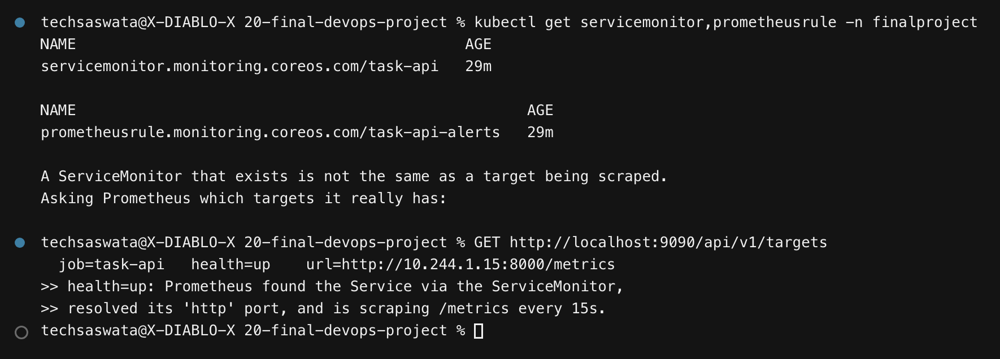

A ServiceMonitor that *exists* and a target that is *scraped* are different
claims, and only the second one matters. Asking Prometheus directly:

```
job=task-api  health=up  url=http://10.244.1.93:8000/metrics
```

### Metrics, and proof they move

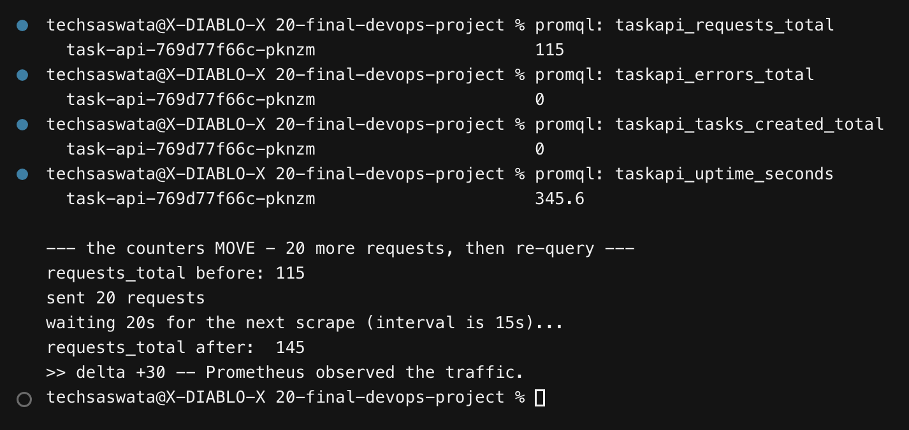

The script reads `taskapi_requests_total`, sends 20 more requests, waits for the
next 15s scrape, reads again, and prints the delta. A counter that is merely
*present* proves the scrape config works; a counter that *moves* proves the
whole path works.

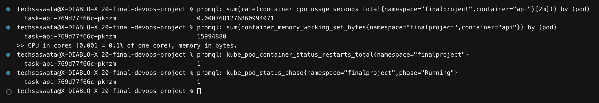

CPU and memory come from cAdvisor, not from the application — they would be
reported even if the app exposed no metrics at all, which is why they are the
signals you can rely on when something is too broken to describe itself.

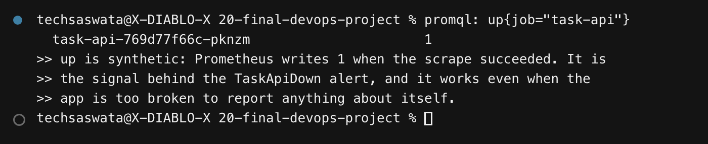

`up` is synthetic: Prometheus writes `1` when the scrape succeeded. It is the
signal behind the `TaskApiDown` alert, and it works when nothing else does.

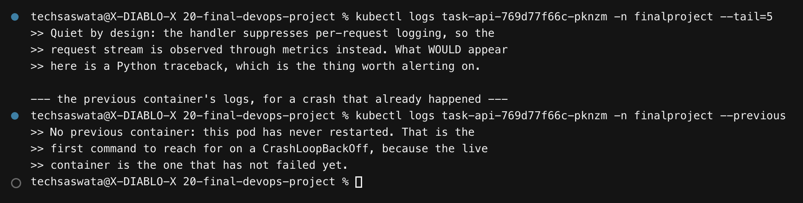

### An alert that actually fires

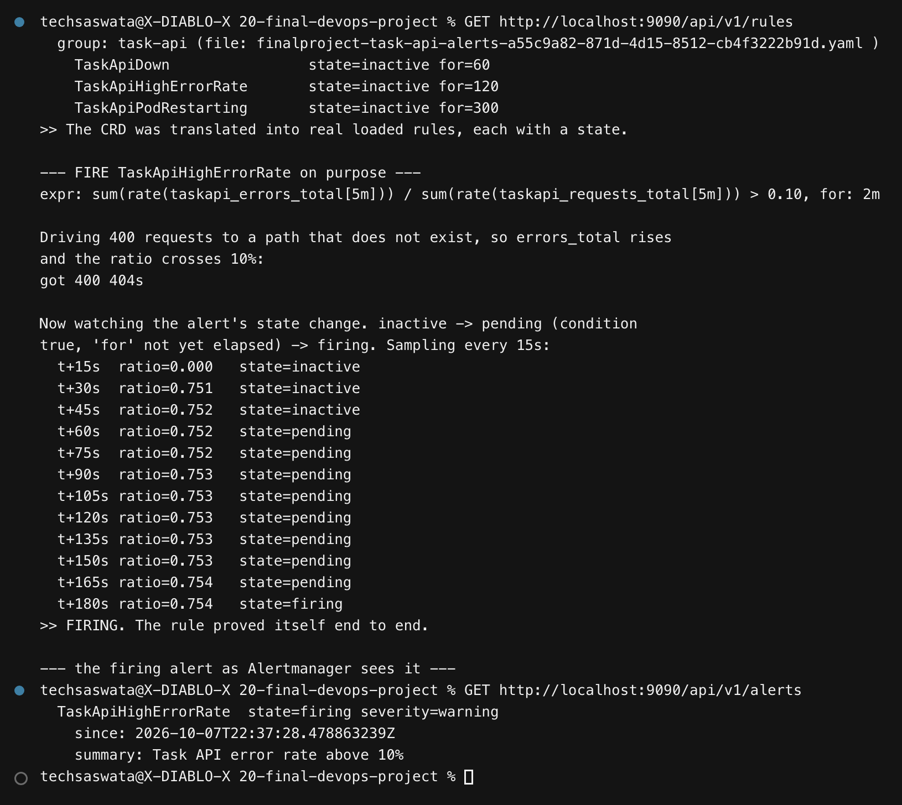

The `PrometheusRule` CRD is translated into loaded rules, each with a state. The
script then drives 400 requests to a non-existent path and watches
`TaskApiHighErrorRate` cross its threshold:

```
t+15s   ratio=0.000   state=inactive
t+30s   ratio=0.753   state=pending
…
t+180s  ratio=0.754   state=firing
```

`inactive → pending → firing` is the part worth watching. `pending` means the
condition is true but the `for: 2m` has not elapsed; it is what stops a
one-scrape blip from paging anyone. An alert tested only by asserting the rule
exists never exercises that distinction.

---

## 12. GitOps

[`gitops/application.yaml`](gitops/application.yaml) points Argo CD at
[`gitops/manifests/`](gitops/manifests/) in this repository.

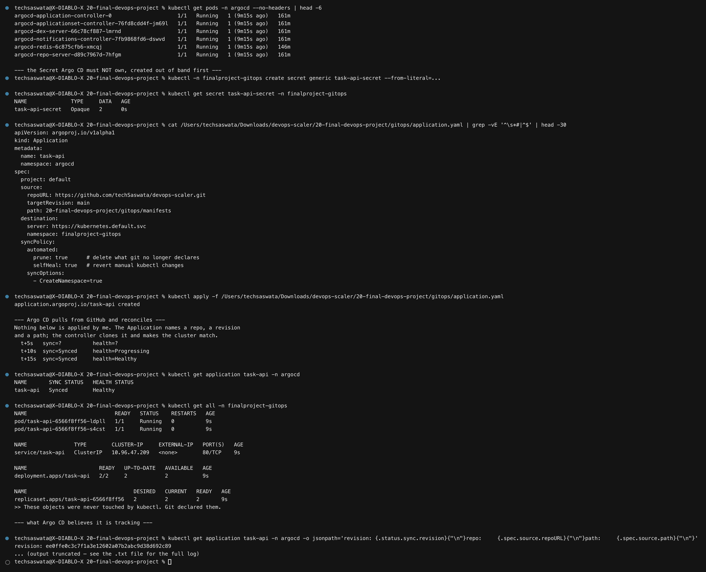

Nothing in that capture was applied with `kubectl`. The Application names a
repo, a revision and a path; the controller clones it and makes the cluster
match, reporting `Synced / Healthy` and the exact commit SHA it is serving.

Two things Argo CD deliberately does **not** own:

| Excluded | Why |
| --- | --- |
| the Secret | the repository is public; it is created out of band |
| the PVC | `prune: true` plus one bad commit would delete the data |

It also syncs into its **own namespace**, `finalproject-gitops`, rather than the
one the kubectl and Helm demos use. Two controllers owning one Deployment is a
real anti-pattern: Argo CD would revert whatever `kubectl apply` had just done
and `selfHeal` would make its version permanent. Keeping them apart means the
drift correction below is Argo CD reacting to *my* change and not to another
controller's.

### Continuous reconciliation

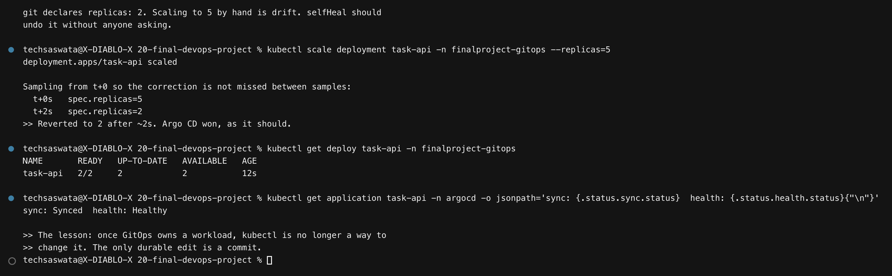

Git declares `replicas: 2`. Scaling to 5 by hand:

```
t+0s   spec.replicas=5
t+2s   spec.replicas=2
```

Reverted in about two seconds, with nobody asking. The sampling starts at t+0
and runs every 2s deliberately — an earlier version of this test slept first and
missed the correction entirely, which would have read as "self-heal does not
work".

The lesson is sharper than "GitOps is declarative": once Argo CD owns a
workload, **`kubectl` is no longer a way to change it**. Not discouraged —
ineffective. The only durable edit is a commit.

---

## 13. The final troubleshooting challenge

[`troubleshooting/broken-stack.yaml`](troubleshooting/broken-stack.yaml) plants
six faults. [`scripts/04-troubleshooting.sh`](scripts/04-troubleshooting.sh)
works through them in the order the **cluster reveals them**, which is not the
order they appear in the file — scheduling happens before image pull, pull
before container config, config before probes, probes before anything about the
Service. So the faults surface bottom-up and each fix uncovers the next.

Every one follows the same six steps: identify, investigate, root cause, fix,
verify, document.

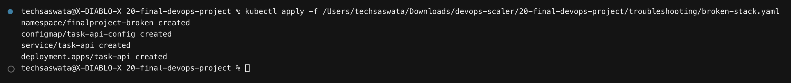

### Fault 1 — `Pending`, never scheduled

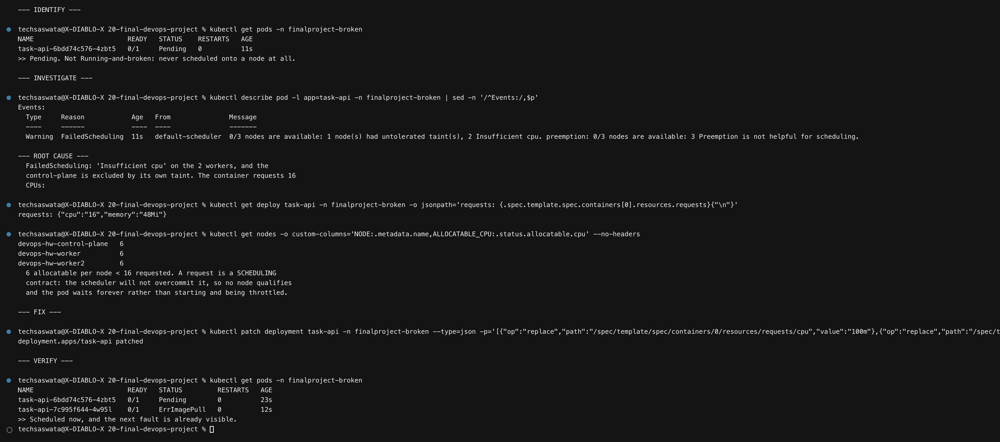

**Identify:** `STATUS: Pending`. Not running-and-broken — never placed on a node.

**Investigate:** `kubectl describe pod` →
`FailedScheduling: 0/3 nodes are available: 1 node(s) had untolerated taint(s), 2 Insufficient cpu`

**Root cause:** the container requests **16 CPUs**; every node has 6 allocatable,
and the control plane is excluded by its own taint. A request is a *scheduling
contract* — the scheduler will not overcommit it, so no node qualifies and the
pod waits indefinitely rather than starting and being throttled.

**Fix:** requests `100m`, limits `500m`. **Verify:** pod is scheduled.

### Fault 2 — `ErrImagePull`

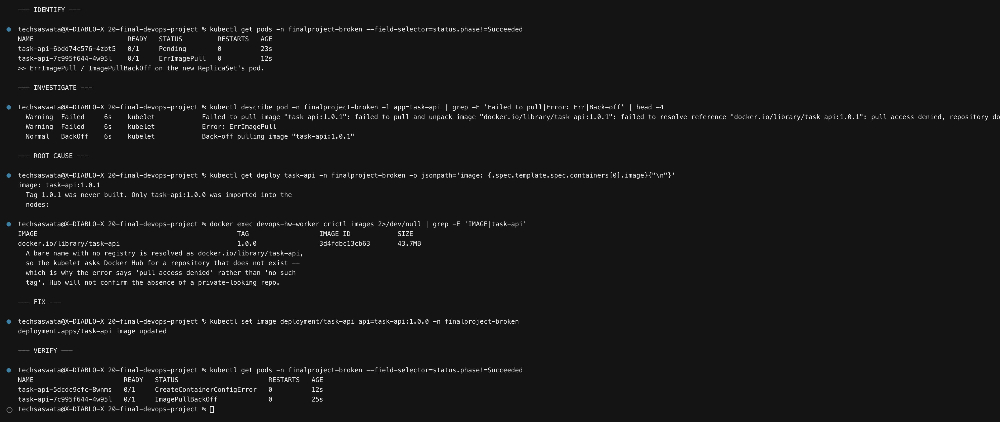

**Root cause:** tag `1.0.1` was never built; only `1.0.0` is on the nodes. A bare
name resolves to `docker.io/library/task-api`, so the kubelet asks Docker Hub
for a repository that does not exist — which is why the error reads `pull access
denied` rather than "no such tag". Hub will not confirm the absence of a
possibly-private repository, so a typo and a permissions problem are
indistinguishable from the outside.

**Fix:** `kubectl set image … api=task-api:1.0.0`.

### Fault 3 — `CreateContainerConfigError`

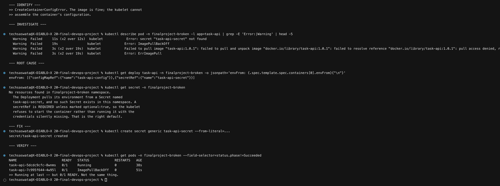

**Root cause:** `Error: secret "task-api-secret" not found`. A `secretRef` is
required unless marked `optional: true`, so the kubelet refuses to start the
container rather than running it with credentials silently missing. That is the
right default — the alternative is an application that starts, appears healthy,
and fails on its first real request.

**Fix:** create the Secret out of band.

### Fault 4 — `Running`, but `0/1 READY`

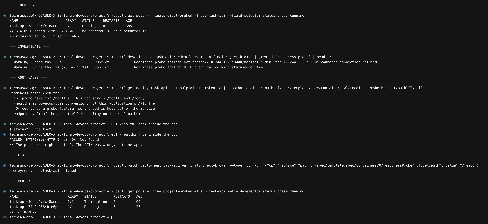

**Investigate:** `Readiness probe failed: HTTP probe failed with statuscode: 404`

**Root cause:** the probe asks for `/healthz`. This app serves `/health` and
`/ready`; `/healthz` is Go-ecosystem convention, not this application's API. The
capture proves the app is fine by calling both paths from inside the pod — one
returns `{"status": "healthy"}`, the other 404s. **The probe was right to fail;
the path was wrong.**

**Fix:** point readiness at `/ready`. **Verify:** `1/1 READY`.

### Fault 5 — a healthy pod nothing can reach

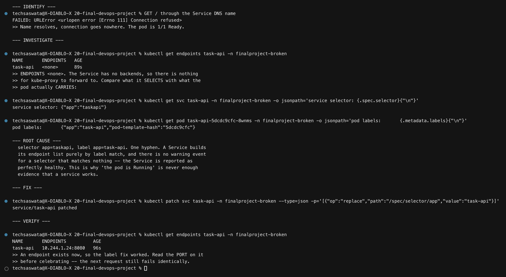

**Identify:** the Service DNS name resolves; the connection is refused. The pod
is `1/1 Ready`.

**Investigate:** `kubectl get endpoints` → `ENDPOINTS <none>`. Then compare:

```
service selector: {"app":"taskapi"}
pod labels:       {"app":"task-api", …}
```

**Root cause:** one hyphen. A Service builds its endpoint list purely by label
match, and **there is no warning event for a selector that matches nothing** —
the Service is reported as perfectly healthy. This is why "the pod is Running"
is never sufficient evidence that a service works.

### Fault 6 — an endpoint pointing at the wrong port

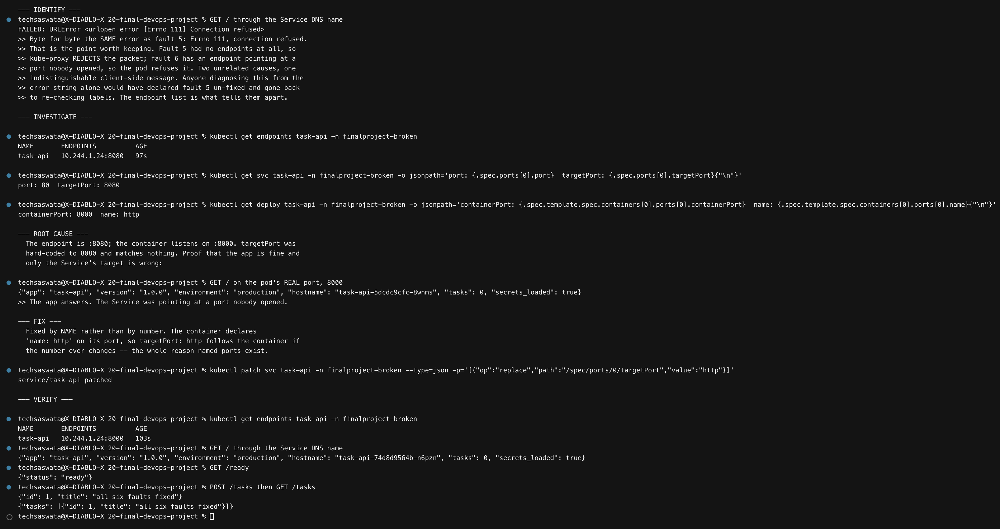

**Identify:** `Errno 111, connection refused` — **byte for byte the same error as
fault 5.**

That identity is the most useful thing in this whole exercise. Fault 5 had no
endpoints, so kube-proxy rejects the packet; fault 6 has an endpoint pointing at
a port nobody opened, so the pod refuses it. Two unrelated causes, one
indistinguishable client-side message. Anyone diagnosing from the error string
alone would conclude the label fix had not worked and go back to re-checking
labels — the classic way to lose an hour.

**Investigate:** the endpoint list now reads `10.244.1.21:8080`, while the
container listens on `8000`.

**Root cause:** `targetPort: 8080`, hard-coded, matching nothing.

**Fix:** `targetPort: http` — by **name**. The container declares `name: http`
on its port, so the Service follows the container if the number ever changes.
That is the entire reason named ports exist.

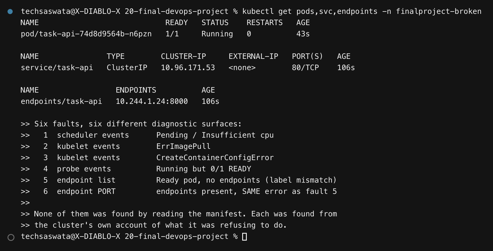

A task is created and listed through the Service DNS name, which exercises every
layer that was broken.

| # | Surface | Symptom |
| --- | --- | --- |
| 1 | scheduler events | `Pending` / Insufficient cpu |
| 2 | kubelet events | `ErrImagePull` |
| 3 | kubelet events | `CreateContainerConfigError` |
| 4 | probe events | `Running` but `0/1 READY` |
| 5 | endpoint list | Ready pod, no endpoints |
| 6 | endpoint **port** | endpoints present, same error as 5 |

Not one of them was found by reading the manifest. Each was found from the
cluster's own account of what it was refusing to do, which is the only technique
that transfers to a system nobody wrote down.

---

## 14. Screenshots

53 screenshots in [screenshots/](screenshots/), each rendered from the capture
beside it in [outputs/](outputs/).

| Prefix | Source | Covers |
| --- | --- | --- |
| `d1`–`d12` | `01-deploy.txt` | tests → image → cluster → app → ingress |
| `h1`–`h11` | `02-helm.txt` | chart lifecycle |
| `m1`–`m9` | `03-monitoring-gitops.txt` | Prometheus and Argo CD |
| `t1`–`t9` | `04-troubleshooting.txt` | the six faults |
| `tf1`–`tf12` | `05-terraform.txt` | AWS apply, drift, destroy, sweep |

---

## 15. Lessons learned

**A command exiting 0 is not evidence.** The image-load step printed `imported`
for three nodes while the image was on none of them, because nothing checked.
Every verification in this project now reads the state back from the system that
owns it — `crictl images` on the node, the Prometheus API, the AWS API, the
endpoint list — rather than trusting the writer's own exit code.

**Non-empty is not success.** Polling an HTTP route until it returned *anything*
passed instantly on nginx's own 503 page, and the narration underneath claimed
success over an error. Status codes exist for this.

**A failure can be invisible.** The gitleaks step died in 0.36 seconds having
printed nothing. Nothing to grep for, no stack trace — just a red cross. Finding
it meant reading the timestamps and realising the step was far too *fast* to
have downloaded anything.

**Floating versions are a reliability bug, and in a security gate they are worse
than that.** Pinning `gitleaks` to 8.30.1 would have prevented both halves of
that failure. A gate whose behaviour is chosen by whatever upstream published
most recently can change what it finds without anyone committing anything.

**A safety feature can be the vulnerability.** My own `--redact` printed the
value and hid the label, because the regex captured the wrong group. It had
looked correct in every passing run — the bug only became visible when something
was actually flagged.

**The shape of a secret is all a scanner can see.** `DB_PASSWORD='…'` was a
placeholder, and gitleaks was still right to flag it. Generating the value
instead of writing one was better than arguing with the tool.

**Design the impossible combination out.** A chart that allows a ReadWriteOnce
volume with an HPA will eventually be deployed that way, and will fail under
load rather than at install. Twelve lines of `_validate.tpl` turn an incident
into an error message.

**Rollback restores the declaration, not the data.** `helm rollback` brought the
PVC back empty and reported complete success, because from Helm's point of view
it was.

**Identical symptoms, unrelated causes.** Faults 5 and 6 produced the same
`Errno 111`. The error message could not tell them apart; the endpoint list
could. Diagnose from state, not from the error string.

**Pipes can truncate a destroy.** Piping `terraform destroy` into `head` sent
SIGPIPE mid-run and left a real bucket behind under a log claiming success. The
teardown here runs from a `trap`, pipes into nothing, and is verified afterwards
against AWS.

**An index is not an inventory.** The AWS tagging API still listed an instance
that no longer existed. Resolve every identifier against the service that owns
it before believing either a leftover or a clean sweep.

**Finally: `kubectl` stops working once GitOps owns a workload.** Not
discouraged — ineffective. A manual scale was reverted in two seconds. The only
durable change is a commit, and that is the point rather than a side effect.
