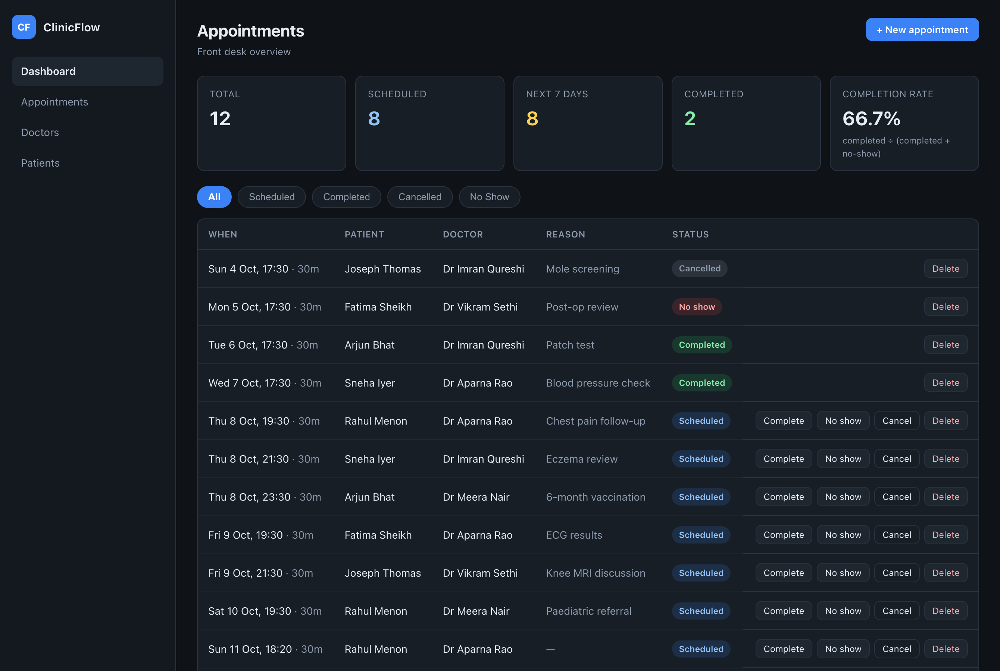
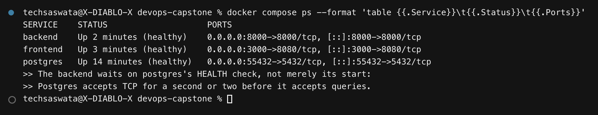
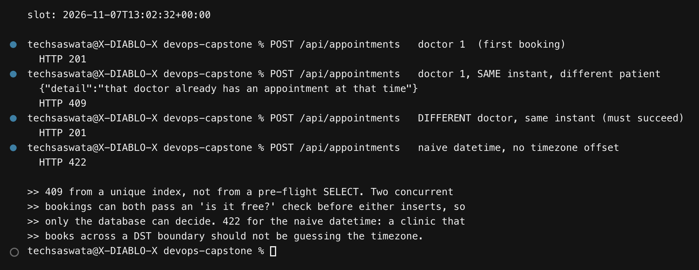
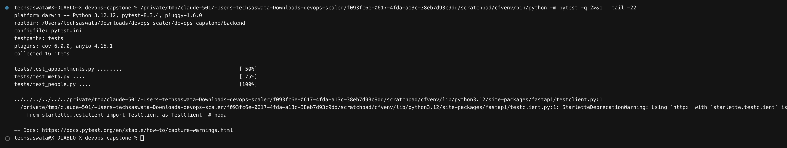
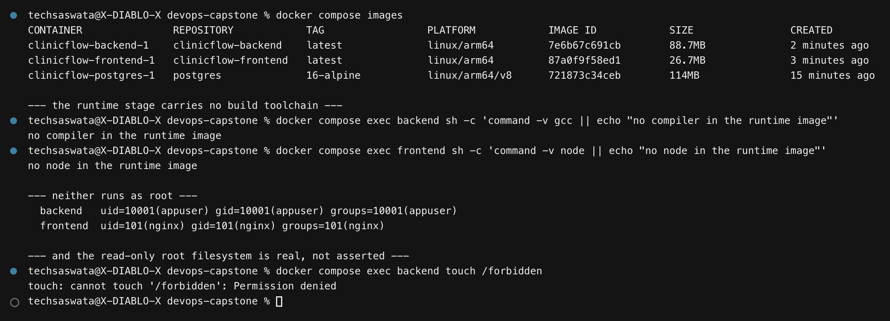

# ClinicFlow — DevOps Final Capstone

Appointment management for a small clinic, carried end to end: written, tested,
containerised, scanned, published, provisioned onto real AWS infrastructure,
deployed with Helm, monitored, and then deliberately broken four ways and
repaired.

> **Domain note.** The capstone brief ships a reference project called
> TaskBoard and requires that *"the application domain must be your own"*.
> ClinicFlow is a different domain with a different data model — doctors,
> patients and time-slotted appointments, where the central constraint is that
> **one doctor cannot be in two places at one moment**. That constraint is not
> decoration: it is a race condition, and the way it is solved is the most
> interesting thing in the backend. The DevOps layer follows the architecture
> the brief lays out, which the brief explicitly permits.

Everything below was executed. The `.txt` files in [outputs/](outputs/) are raw
terminal captures and every screenshot is rendered from the capture beside it,
so each claim here can be checked against the evidence that produced it. Where
something failed — and several things did — the failure is in the log and
explained in the text rather than quietly re-run.

---

## Contents

| | |
|---|---|
| 1 | [What it does](#1-what-it-does) |
| 2 | [Architecture](#2-architecture) |
| 3 | [Run it locally](#3-run-it-locally) |
| 4 | [The application](#4-the-application) |
| 5 | [Tests](#5-tests) |
| 6 | [Docker](#6-docker) |
| 7 | [CI/CD](#7-cicd) |
| 8 | [DevSecOps — Trivy](#8-devsecops--trivy) |
| 9 | [Terraform — VPC and EKS](#9-terraform--vpc-and-eks) |
| 10 | [Kubernetes and Helm](#10-kubernetes-and-helm) |
| 11 | [Observability](#11-observability) |
| 12 | [Troubleshooting lab](#12-troubleshooting-lab) |
| 13 | [Tearing it down](#13-tearing-it-down) |
| 14 | [What went wrong](#14-what-went-wrong) |

---

## 1. What it does

A clinic's front desk books patients with doctors. The dashboard shows what is
coming up, what was completed, and what was missed.



| Endpoint | |
| --- | --- |
| `GET /` | identity and environment |
| `GET /health` | **liveness** — no I/O |
| `GET /ready` | **readiness** — queries Postgres |
| `GET /metrics` | Prometheus exposition |
| `GET /docs` | Swagger UI |
| `GET /api/doctors`, `POST /api/doctors`, `GET /api/doctors/{id}` | |
| `GET /api/patients`, `POST /api/patients`, `GET /api/patients/{id}` | |
| `GET /api/appointments` | list, filterable by status and doctor |
| `GET /api/appointments/{id}` | |
| `POST /api/appointments` | book — **409** on a clash |
| `PUT /api/appointments/{id}` | reschedule or change status |
| `DELETE /api/appointments/{id}` | |
| `GET /api/appointments/stats` | the dashboard's KPIs |

Fifteen endpoints; the brief asks for four.

### The difference between `/health` and `/ready`

This is the one design decision worth reading twice, because getting it wrong
turns a brief database blip into a full outage.

**Liveness** asks *is this process alive?* Its remedy is a **kill**. So it must
not fail for reasons a restart cannot fix. `/health` therefore does no I/O at
all. If it queried Postgres, then a thirty-second database hiccup would fail the
liveness probe on **every** replica at once, Kubernetes would restart all of
them, and the restarts would achieve nothing — the database would still be down,
and now the application would be cold as well.

**Readiness** asks *can this process serve traffic right now?* Its remedy is
**removal from the Service endpoints**, which is reversible and cheap. `/ready`
therefore *does* query Postgres, because an API that cannot reach its database
genuinely cannot answer.

---

## 2. Architecture

```
  developer
     │ git push
     ▼
┌──────────────────────── GitHub Actions ────────────────────────┐
│                                                                │
│  pytest ─┐                                                     │
│          ├─► image build ─► TRIVY ─► push to GHCR (sha-<commit>)│
│  vite ───┘                    │                                │
│                         fails on HIGH/CRITICAL                 │
└────────────────────────────────┬───────────────────────────────┘
                                 │ helm upgrade --install
                                 ▼
┌───────────────────── AWS (Terraform) ──────────────────────────┐
│  VPC 10.40.0.0/16                                              │
│   ├── 2 public subnets   ─ NLB (ingress-nginx)                  │
│   └── 2 private subnets  ─ EKS managed nodes                    │
│                                                                │
│   ┌──────────────── EKS cluster ────────────────┐              │
│   │                                             │              │
│   │  Ingress ──/api──► backend Svc ──► FastAPI ×2              │
│   │     │                                 │     │              │
│   │     └────/─────► frontend Svc ──► nginx ×2  │              │
│   │                                       │     │              │
│   │                              Postgres (StatefulSet + PVC)  │
│   │                                       ▲                    │
│   │                         Alembic Job ──┘ (pre-upgrade hook)  │
│   │                                                            │
│   │  Prometheus ◄── ServiceMonitor ◄── /metrics                │
│   │       └──► Grafana                                         │
│   └─────────────────────────────────────────────┘              │
└────────────────────────────────────────────────────────────────┘
```

Three decisions in that picture are deliberate:

**The browser never learns a backend hostname.** Every call is same-origin
`/api`, forwarded by nginx inside the container and by the Ingress in the
cluster. The built bundle is byte-identical in compose and on EKS, so the image
promoted to production is the one that was tested.

**Migrations run in a Job, not in the app containers.** With two backend
replicas, running Alembic at container start means two pods racing to migrate
the same database on every rollout.

**CI holds no cluster credentials by default.** The deploy job is
`workflow_dispatch`-only because the cluster is created and destroyed around a
demo, so an automatic deploy would spend most of its life failing to reach
something that is not there.

---

## 3. Run it locally

```bash
cd devops-capstone
docker compose up --build        # frontend :3000, backend :8000, postgres :55432
./scripts/seed.sh                # believable data, through the public API
open http://localhost:3000
```



Three services, and the ordering between them is enforced rather than hoped for:

```yaml
depends_on:
  postgres:
    condition: service_healthy
```

`depends_on` alone waits only for the container to **start**, and Postgres
accepts TCP connections for a second or two before it will accept queries.
Without `condition: service_healthy` the first migration races the database and
the backend crash-loops on a cold start.

> **The host port is 55432, not 5432.** A natively installed Postgres already
> listens on `127.0.0.1:5432` on the machine this was built on, and a specific
> loopback bind beats Docker's wildcard. The first migration attempt silently
> reached *that* server and failed with `role "clinic" does not exist`. Moving
> the host port removes the ambiguity instead of relying on bind precedence.

---

## 4. The application

FastAPI, SQLAlchemy 2.0, Alembic, PostgreSQL 16. No ORM-free shortcuts and no
raw SQL in the handlers.

### The booking conflict is a race, so the database settles it

The obvious implementation checks whether a slot is free and then inserts. It is
wrong, and it is wrong in a way that testing rarely catches: two concurrent
requests can **both** pass the check before either inserts.

So the rule lives in Postgres as a partial unique index:

```python
Index(
    "uq_doctor_slot_live",
    "doctor_id", "scheduled_at",
    unique=True,
    postgresql_where=text("status IN ('scheduled', 'completed')"),
    sqlite_where=text("status IN ('scheduled', 'completed')"),
)
```

and the handler turns the resulting `IntegrityError` into a `409 Conflict`.

The `WHERE` clause is the subtle part. Excluding cancelled and no-show rows means
**cancelling frees the slot without deleting the record of who held it** — a
clinic needs that history. A plain unique index would have forced a choice
between the two.



As stored by Postgres:

```
"uq_doctor_slot_live" UNIQUE, btree (doctor_id, scheduled_at)
    WHERE status = ANY (ARRAY['scheduled'::appointment_status, 'completed'::appointment_status])
```

### Timezones are rejected, not guessed

`scheduled_at` must carry an offset. A naive datetime is ambiguous the moment two
timezones are involved, and a clinic booking across a DST boundary finds out the
hard way — so the API returns **422** rather than assuming UTC.

### Migrations

One Alembic revision creates the three tables, the enum type and the indexes.
It was **autogenerated against real Postgres**, not hand-written, and the partial
`WHERE` clause survived into it — which is worth checking, because autogenerate
often drops dialect-specific index predicates.

---

## 5. Tests

16 tests, all passing, covering the probes, doctors, patients, and the full
appointment lifecycle.



They run against a **throwaway SQLite file**, never the Postgres the application
uses. That is the rubric's requirement, and it is also what lets the suite run in
a CI job with no database service.

The trade is real and worth stating plainly: SQLite is not Postgres, so anything
depending on Postgres-specific behaviour would pass here and fail in production.
Exactly one thing in this schema does — the partial unique index — so the model
declares **both** `postgresql_where` and `sqlite_where`, and
`test_double_booking_a_doctor_is_409` genuinely exercises it on either engine
rather than silently passing where it is cheap.

`conftest.py` also turns on `PRAGMA foreign_keys=ON`, because SQLite ignores
foreign keys unless asked, which would let the tests accept data Postgres
rejects.

---

## 6. Docker

| Image | Base | Size | Runs as |
| --- | --- | --- | --- |
| backend | `python:3.12-slim` | **88.7 MB** | `uid 10001 (appuser)` |
| frontend | `nginx-unprivileged:1.31.6-alpine` | **26.7 MB** | `uid 101 (nginx)` |

Both are multi-stage, and the proof is that the runtime stages contain neither
toolchain:



```
$ docker compose exec backend  sh -c 'command -v gcc  || echo "no compiler in the runtime image"'
no compiler in the runtime image
$ docker compose exec frontend sh -c 'command -v node || echo "no node in the runtime image"'
no node in the runtime image
```

`nginx-unprivileged`, not stock `nginx`: the stock image starts its master
process as root and only drops privileges for workers. This one runs entirely as
uid 101 and listens on 8080, which is also why the compose mapping is
`3000:8080` — an unprivileged process cannot bind port 80.

The read-only root filesystem is verified rather than asserted:

```
$ docker compose exec backend touch /forbidden
touch: cannot touch '/forbidden': Permission denied
```

---

## 7. CI/CD

[`.github/workflows/clinicflow.yml`](.github/workflows/clinicflow.yml) — live and
green. GitHub only reads workflows from the repository root, so the executing
copy lives at `/.github/workflows/clinicflow.yml`; this one is the deliverable
kept beside the project it builds.

```
pytest ─┐
        ├─► images (matrix: backend, frontend)
vite ───┘        build ──► TRIVY SCAN ──► push to GHCR
                               │
                      fails on HIGH/CRITICAL
```

| Job | What it does |
| --- | --- |
| `test` | pytest + coverage, uploaded as an artifact |
| `frontend-build` | `npm ci && npm run build`, bundle size in the run summary |
| `images` | matrix over backend/frontend: build → scan → push |
| `deploy` | `workflow_dispatch` only — `helm upgrade --install` against EKS |

Images are tagged `sha-<full commit>`. **`latest` is not a version**: it cannot
be rolled back to and it tells you nothing about what is running. The published
images are public and multi-arch (`linux/amd64` + `linux/arm64`):

```
ghcr.io/techsaswata/devops-scaler/clinicflow-backend:sha-<commit>
ghcr.io/techsaswata/devops-scaler/clinicflow-frontend:sha-<commit>
```

---

## 8. DevSecOps — Trivy

The scan sits **between the build and the push**, not after it. An image that
fails is never published, so a vulnerable tag cannot sit in the registry waiting
to be pulled by accident.

`ignore-unfixed: true` is a deliberate choice: a vulnerability with no patch
available cannot be acted on by this pipeline, and failing the build on it would
train everyone to click through a red gate. Fixable findings block.

### It failed on the first run, which is the point

Both images were rejected, and neither was published.

**Frontend — 42 findings, 40 HIGH and 2 CRITICAL.** The base image was
`nginx-unprivileged:1.27-alpine`, and the findings were all in its Alpine
packages — `openssl`, `expat`, `c-ares`, `libpng`. The worst was
**CVE-2026-31789**, a heap buffer overflow in OpenSSL (`libcrypto3` 3.3.3-r0,
fixed in 3.3.7-r0).

Nothing was wrong with nginx. The tag simply had not been rebuilt, and its
packages were months stale. **Pinning a base image pins its CVEs too** — a pin is
a maintenance commitment, not a one-time decision. Fixed twice over: the pin
moved to `1.31.6-alpine`, *and* the image now runs `apk upgrade` so it is not
hostage to upstream's rebuild schedule.

**Backend — 3 HIGH, all `starlette` 0.41.3** (CVE-2025-62727, denial of service
via Range header merging). That one unravelled: FastAPI 0.115.6 capped starlette
*below* the patched release, so fixing the CVE meant moving FastAPI — and FastAPI
0.143 then broke `prometheus-fastapi-instrumentator` 7.0.2, which assumes every
entry in `app.routes` has a `.path` attribute and raised
`AttributeError: '_IncludedRouter' object has no attribute 'path'` on every
single request. Three pins had to move together, and starlette is now pinned
**explicitly** so a transitive bump cannot quietly reintroduce the CVE.

Both images pass cleanly now, and the full report is attached to every run as an
artifact and printed into the job summary.

---

## 9. Terraform — VPC and EKS

[`terraform/`](terraform/) provisions the cluster from nothing:

| | |
| --- | --- |
| VPC | `10.40.0.0/16` |
| Public subnets | 2, across 2 AZs — tagged for internet-facing load balancers |
| Private subnets | 2 — where the worker nodes live |
| NAT gateway | 1 (configurable to one-per-AZ) |
| EKS control plane | v1.31, API + ConfigMap auth |
| Managed node group | 2 × `t3.medium`, min 2 / max 4 |
| Addons | VPC CNI, CoreDNS, kube-proxy, **EBS CSI**, Pod Identity |

### Three details that are easy to get wrong

**Subnet tags are load-bearing.** Without `kubernetes.io/role/elb` on the public
subnets, an internet-facing `LoadBalancer` Service never receives an address and
sits `<pending>` forever with nothing explaining why.

**The EBS CSI driver is not installed by default** on EKS 1.23+. Without it a
`PersistentVolumeClaim` is accepted by the API server and then stays `Pending`
indefinitely, because nothing is listening to provision it. Postgres in this
chart uses a PVC, so the cluster is useless without the addon.

**`t3.medium`, not `t3.small`.** The per-node pod limit on EKS comes from ENI
capacity, not from CPU. A `t3.small` allows **11 pods**, and CoreDNS, kube-proxy,
the VPC CNI, the ingress controller and Prometheus consume nearly all of them
before the application is scheduled.

The CloudWatch log group is also declared explicitly rather than left for EKS to
create, so that `terraform destroy` removes it — otherwise it survives the
teardown and quietly accrues storage charges.

`terraform.tfvars.example` is committed; `*.tfvars` is gitignored. **No AWS
credential appears anywhere in this repository**, and `alembic.ini` deliberately
omits `sqlalchemy.url` for the same reason — the URL is read from the environment.

---

## 10. Kubernetes and Helm

One chart, [`helm/clinicflow/`](helm/clinicflow/), rendering 13 resources.

| Resource | Notes |
| --- | --- |
| Deployment × 2 | backend and frontend, **2 replicas each** |
| Service × 3 | backend, frontend (ClusterIP), postgres (headless) |
| StatefulSet | Postgres, with a PVC |
| Ingress | `/api` → FastAPI, `/` → the SPA |
| HPA × 2 | backend 2–6, frontend 2–4 |
| Job | Alembic, as a `pre-upgrade` hook |
| ConfigMap, Secret | configuration and the generated DB password |
| ServiceMonitor | so Prometheus finds the backend |

### The Secret is generated, kept, and never written down

```yaml
{{- $existing := lookup "v1" "Secret" .Release.Namespace (include "clinicflow.secretName" .) }}
{{- if $existing }}
POSTGRES_PASSWORD: {{ index $existing.data "POSTGRES_PASSWORD" }}
{{- else }}
POSTGRES_PASSWORD: {{ randAlphaNum 32 | b64enc | quote }}
{{- end }}
```

Without the `lookup`, every `helm upgrade` would mint a **new** random password
while the running Postgres kept the old one, and the backend would start failing
to authenticate against a database that had not changed. `helm.sh/resource-policy:
keep` stops an uninstall taking the password with it.

`DATABASE_URL` is assembled **inside the pod** from the ConfigMap and the Secret,
so the password never appears in a values file, a ConfigMap, or this chart.

### Migrations are a Job, and the Job name carries the revision

```yaml
name: {{ include "clinicflow.fullname" . }}-migrate-{{ .Release.Revision }}
annotations:
  "helm.sh/hook": pre-install,pre-upgrade
```

A Helm hook Job is immutable, so reusing one name makes the *second* upgrade fail
with `field is immutable`. Helm waits for the Job to succeed before touching the
Deployments, so new code never starts against an un-migrated schema. An init
container polls `pg_isready` first, because Alembic fails immediately rather than
retrying.

### Ingress path order

`/api`, `/docs`, `/openapi.json` and `/metrics` are declared before `/`. If `/`
matched first and greedily, every API call would be served the `index.html` shell
and the dashboard would silently render nothing — a failure with no error message
anywhere.

### Pod Security Admission

The namespace enforces `restricted`. Every workload here already satisfies it —
non-root, no privilege escalation, all capabilities dropped, `RuntimeDefault`
seccomp — so enforcing it means a *future* manifest that does not is rejected by
the API server rather than quietly running with more privilege than it needs.
